## {#survey-generations .bleed-slide background-image="PhD/1_intro/surveys/stage2_4_abell2390_bg.jpg" background-size="cover" background-color="#08080a"}

::: {.bleed-tag .bleed-left}
{.bleed-scope}

:::: {.solutionbox}
::: {.solutionbox-body}
[Stage 2]{.kw2} · SDSS, 2.5 m ground, 1.4″ seeing
:::
::::
:::

::: {.bleed-tag .bleed-right}
:::: {.solutionbox}
::: {.solutionbox-body}
[Stage 4]{.kw2} · Euclid, 1.2 m space, 0.18″
:::
::::

{.bleed-scope}
:::

[Abell 2390 · Credit: SDSS DR18 (left); ESA / Euclid / Euclid Consortium / NASA, J.-C. Cuillandre & G. Anselmi (right)]{.bleed-credit}

# Some of the Stage IV Cosmological Surveys {#telescopes .stack-top visibility="uncounted"}

::::: {.bare style="position: relative; display: grid; grid-template-columns: 2.2em 1fr 1fr; grid-template-rows: auto 1fr 1fr; column-gap: 2.2em; row-gap: 1.2em; width: 74%; height: 545px; margin: 0.9em 0 0 1em;"}
<!-- one wavelength axis over both columns, drawn like the HOT -> COLD arrow of the ΛCDM figure -->
:::: {.row .flat .bare style="grid-column: 2 / 4; grid-row: 1; --gap: 0.6em; --align: center; font-size: 0.72em; line-height: 1.15;"}
::: {style="flex: none; text-align: right;"}
[Microwave]{style="font-weight: 700; color: #8f1206;"}\
[λ ≈ 1–10 mm]{style="font-size: 0.8em; color: #6E6E6E;"}
:::

::: {style="flex: 1; position: relative; text-align: center;"}
{style="display: block; width: 100%; margin: 0;"}

[wavelength]{style="position: absolute; left: 50%; top: -1.25em; transform: translateX(-50%); font-size: 0.85em; color: #6E6E6E;"}
:::

::: {style="flex: none; text-align: left;"}
[Optical / near-infrared]{style="font-weight: 700; color: #0e3a86;"}\
[λ ≈ 0.3–2 µm]{style="font-size: 0.8em; color: #6E6E6E;"}
:::
::::

::: {.vlabel style="grid-column: 1; grid-row: 2; align-self: center; justify-self: center; font-size: 0.85em; color: #2E2E2E;"}
Space based
:::

::: {.vlabel style="grid-column: 1; grid-row: 3; align-self: center; justify-self: center; font-size: 0.85em; color: #2E2E2E;"}
Ground based
:::

::: {style="position: absolute; left: calc(2.2em + 1.1em + (100% - 2.2em - 4.4em) / 2 + 1.1em); top: 1.8em; bottom: 0; width: 5px; background: #d9d4c9; border-radius: 3px;"}
:::

::: {style="position: absolute; left: 2.6em; right: 0; top: calc(1.8em + (100% - 1.8em) / 2 - 2px); height: 5px; background: #d9d4c9; border-radius: 3px;"}
:::

:::: {.figcadre .fragment fragment-index=1 style="display: flex; flex-direction: column; min-height: 0; font-size: 0.8em; grid-column: 2; grid-row: 2;"}
::: {.figcadre-header}
LiteBIRD
:::

::: {.figcadre-body style="flex: 1 1 auto; min-height: 0; display: flex; align-items: center; justify-content: center; gap: 0; border-radius: 0 0 8px 8px;"}
:::: {.row .flat .bare style="--gap: 0.9em; --justify: center;"}
{style="max-height: 150px; max-width: 50%; margin: 0;"}

::: {style="font-size: 0.82em; line-height: 1.45; white-space: nowrap; text-align: left; color: #2E2E2E;"}
full sky, from space\
12 bands, 40–402 GHz\
:::
::::
:::
::::

:::: {.figcadre .fragment fragment-index=2 style="display: flex; flex-direction: column; min-height: 0; font-size: 0.8em; grid-column: 3; grid-row: 2;"}
::: {.figcadre-header}
Euclid
:::

::: {.figcadre-body style="flex: 1 1 auto; min-height: 0; display: flex; align-items: center; justify-content: center; gap: 0; border-radius: 0 0 8px 8px;"}
:::: {.row .flat .bare style="--gap: 0.9em; --justify: center;"}
{style="max-height: 150px; max-width: 50%; margin: 0;"}

::: {style="font-size: 0.82em; line-height: 1.45; white-space: nowrap; text-align: left; color: #2E2E2E;"}
14 000 deg²\
30 gal arcmin⁻²\
From Space \
~1.5 billion galaxies
:::
::::
:::
::::

:::: {.figcadre .fragment fragment-index=1 style="display: flex; flex-direction: column; min-height: 0; font-size: 0.8em; grid-column: 2; grid-row: 3;"}
::: {.figcadre-header}
Simons Observatory
:::

::: {.figcadre-body style="flex: 1 1 auto; min-height: 0; display: flex; align-items: center; justify-content: center; gap: 0; border-radius: 0 0 8px 8px;"}
:::: {.row .flat .bare style="--gap: 0.9em; --justify: center;"}
{style="max-height: 150px; max-width: 50%; margin: 0;"}

::: {style="font-size: 0.82em; line-height: 1.45; white-space: nowrap; text-align: left; color: #2E2E2E;"}
Atacama, Chile\
6 bands, 27–280 GHz\
:::
::::
:::
::::

:::: {.figcadre .fragment fragment-index=2 style="display: flex; flex-direction: column; min-height: 0; font-size: 0.8em; grid-column: 3; grid-row: 3;"}
::: {.figcadre-header}
Vera C. Rubin Observatory (LSST)
:::

::: {.figcadre-body style="flex: 1 1 auto; min-height: 0; display: flex; align-items: center; justify-content: center; gap: 0; border-radius: 0 0 8px 8px;"}
:::: {.row .flat .bare style="--gap: 0.9em; --justify: center;"}
{style="max-height: 150px; max-width: 50%; margin: 0;"}

::: {style="font-size: 0.82em; line-height: 1.45; white-space: nowrap; text-align: left; color: #2E2E2E;"}
18 000 deg²\
30 gal arcmin⁻²\
Cerro Pachón in Chile \
~2 billion galaxies
:::
::::
:::
::::

::: {.fragment fragment-index=3 style="position: absolute; left: calc(100% + 1.4em); bottom: -20px; width: 230px;"}
{.bare style="position: absolute; left: -95px; bottom: 120px; width: 110px; margin: 0;"}

{.photo style="width: 230px;"}
:::
:::::

## Modern observational cosmology {#modern_cosmo visibility="uncounted"}

<!-- the timeline rings who the slide is on: Einstein, then Friedmann and Lemaître with the FLRW
     geometry (click 1), then Hubble with the Hubble block (click 2) -->
::: {.r-stack style="width: 88%; margin: 0 auto;"}
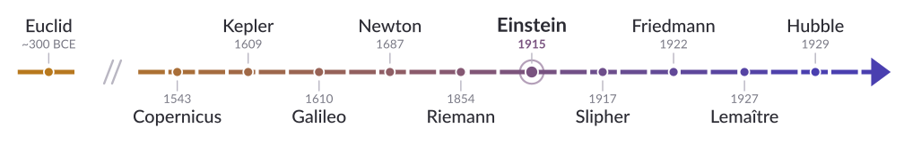{.fragment .fade-out fragment-index=1 style="width: 100%; margin: 0;"}

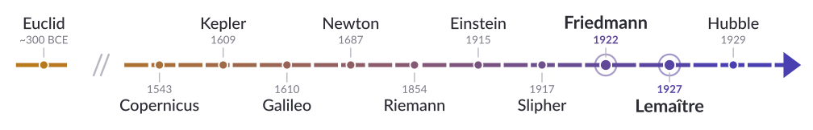{.fragment .fade-in-then-out fragment-index=1 style="width: 100%; margin: 0;"}

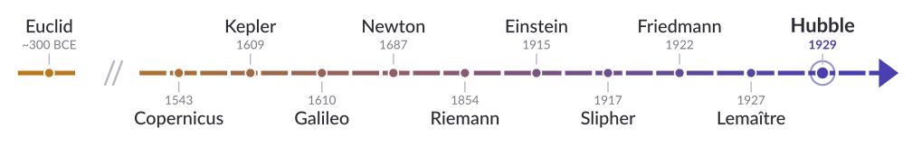{.fragment fragment-index=2 style="width: 100%; margin: 0;"}
:::

::: {.r-stack}
::: {.fragment .fade-in-then-out fragment-index=1}
### The Friedmann–Lemaître–Robertson–Walker metric {style="font-size: 0.95em; margin-bottom: 0; text-align: center;"}

{fig-align="center" width="96%" style="margin: -0.4em 0 0;"}
:::

::: {.fragment .fade-in fragment-index=2}
:::: {.columns}
::: {.column width="40%"}
:::: {.r-stack}
::: {.fragment .fade-out fragment-index=3}
{fig-align="center" height="340px" style="border-radius: 6px;"}
:::

::: {.fragment .fade-in fragment-index=3}
{.screen-only fig-align="center" height="340px"}

{.print-only fig-align="center" height="340px"}
:::
::::
:::

::: {.column width="60%"}
:::: {.r-stack}
::: {.fragment .fade-out fragment-index=4}
{fig-align="center" height="340px"}

[Credit: NASA (photograph); Hubble (1929), PNAS 15, 168, Fig. 1, redrawn]{.credit}
:::

::: {.fragment .fade-in fragment-index=4}
:::: {.solutionbox}
::: {.solutionbox-header}
The Expanding Universe
:::

::: {.solutionbox-body}
[Georges Lemaître]{.kw}: the Universe had a [beginning]{.kw}\
It expanded from an [extremely dense]{.kw} early state
:::
::::
:::
::::
:::
::::
:::
:::

## The Cosmic Microwave Background

<br/>
<br/>

:::: {.columns}
::: {.column width="51%" .fragment fragment-index=1}
{fig-align="center" width="100%" style="margin: 0;"}

[1965, Holmdel: Penzias & Wilson find a 3 K signal from every direction · Credit: NASA (antenna); ESA / Planck Collaboration (map)]{.credit}
:::

::: {.column width="47%"}
:::: {style="font-size: 0.75em;"}
- A hot, dense beginning should leave [relic radiation]{.kw}: predicted by [Gamow, Alpher & Herman]{.kw} in 1948, at a few kelvin

::: {.fragment fragment-index=1 style="display: flex; align-items: center; gap: 0.4em;"}
- Found by accident in 1965 by [Penzias & Wilson]{.kw}: a [3 K signal from every direction]{.kw2}, interpreted by [Dicke & Peebles]{.kw} at Princeton

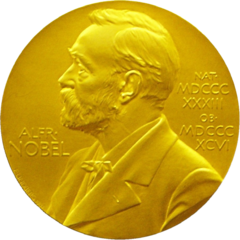{width="150px" style="margin: 0; flex: none;"}
:::

::: {.fragment fragment-index=2}
{fig-align="center" width="92%"}

- The CMB is the [oldest light we can observe]{.kw}
:::
::::
:::
::::

::: {.fragment fragment-index=2}
:::: {.solutionbox}
::: {.solutionbox-body}
The [CMB]{.kw} is one of the essential discoveries that confirm the [hot Big Bang]{.kw}
:::
::::
:::

## Lambda Cold Dark Matter ($\Lambda$CDM) {auto-animate="true"}

{data-id="lcdm-arrow" fig-align="center" style="display: block; width: 100%; max-width: none; max-height: none; margin: 1.2em auto 0;"}

## Lambda Cold Dark Matter ($\Lambda$CDM) {#lambda-cold-dark-matter-pie auto-animate="true"}

<br/>
<br/>

:::: {.columns}
::: {.column width="60%"}
<br/>

{data-id="lcdm-arrow" fig-align="center" style="display: block; width: 100%; max-width: none; max-height: none; margin: 0 auto;"}

:::

::: {.column width="40%"}
<br/><br/>

{.screen-only fig-align="center" width="100%"}

{.print-only fig-align="center" width="100%"}
:::
::::

## The limits of $\Lambda$CDM

::: {.r-stack style="width: 70%; margin: -2.2em auto -0.9em;"}
{style="width: 100%; margin: 0;"}

::: {.fragment .fade-out fragment-index=4 style="width: 100%;"}
{.fragment fragment-index=1 style="width: 100%; margin: 0;"}
:::

{.fragment fragment-index=4 style="width: 100%; margin: 0;"}
:::

:::: {.columns style="font-size: 0.8em;"}
::: {.column width="49%"}
[The early Universe]{.kw .fragment fragment-index=1}

::: {.grid style="--cols: 1.34fr 1.97fr; --gap: 0.8em; --align: start; --cell-margin: 0.1em 0; --img-margin: 0.2em 0 0;"}
:::: {.cell .fragment fragment-index=2}
horizon


[Credit: NASA / WMAP Science Team]{.credit}
::::

:::: {.cell .fragment fragment-index=3}
flatness


\+ origin of inhomogeneities\
\+ magnetic monopole problem
::::
:::
:::

::: {.column style="width: 49%; box-sizing: border-box; border-left: 2px solid #d9d4c9; padding-left: 1.2em; margin-top: -0.5em; padding-top: 0.5em;"}
[The late Universe]{.kw .fragment fragment-index=4}

::: {.grid style="--cols: 1fr 1.15fr; --gap: 0.8em; --align: start; --cell-margin: 0.1em 0; --img-margin: 0.2em 0 0;"}
:::: {.cell .fragment fragment-index=5 style="position: relative;"}
dark energy

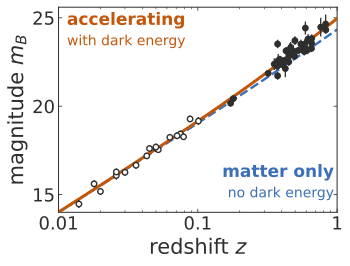

[Data: Perlmutter et al. (1999)]{.credit}

::: {.row .flat .bare style="position: absolute; top: -0.35em; right: -0.9em; --gap: 0.25em; --align: center; line-height: 1;"}
{style="height: 1.7em; width: auto; margin: 0;"}

[Nobel<br/>2011]{style="font-size: 0.55em; color: #6E6E6E; text-align: left;"}
:::
::::

:::: {.cell .fragment fragment-index=6}
dark matter


[Rubin & Ford (1970), Fig. 9 (M31)]{.credit}
::::
:::
:::
::::

# Outline {.big-title .stack-top style="text-align: center;"}

::: {.rail-stack style="width: 106%; margin: 0 -3% 0;"}



:::

# From model to observation: the CMB

::: {.rail-stack}
{.rail-full}

{.rail-focus}


:::

## Inflation

::: {.r-stack}
::: {.fragment .fade-out fragment-index=1 style="width: 70%;"}
[The early Universe]{.kw}

::: {.grid style="--cols: 1.34fr 1.97fr; --gap: 0.8em; --align: start; --cell-margin: 0.1em 0; --img-margin: 0.2em 0 0;"}
:::: {.cell}
horizon


::::

:::: {.cell}
flatness


::::
:::
:::

::: {.fragment .fade-in fragment-index=1}
{fig-align="center" width="78%"}
:::
:::

::: {.fragment fragment-index=1}
- A brief [accelerated expansion]{.kw} solves the horizon and flatness problems
- Its [quantum fluctuations]{.kw} $\delta\phi$ seed the large scale structure we see today
:::

## Primordial gravitational waves

:::: {.columns style="display: flex; align-items: center; min-height: 540px;"}
::: {.column width="44%"}
- Quantum fluctuations perturb the [metric]{.kw} of space-time
- [Scalar]{.kw}: $\Delta_s^2(k) = A_s\,(k/k_*)^{n_s-1}$
- [Tensor]{.kw}: $\Delta_t^2(k) = A_t\,(k/k_*)^{n_t}$, the [gravitational waves]{.kw}

:::: {.fragment}
::: {.eqbox style="--eq-border: #25406b; --eq-size: 1em; --eq-math-margin: 0.3em 0; width: fit-content; margin: 0.4em auto;"}
$$
r \equiv \frac{A_t}{A_s} \;\propto\; E_\mathrm{inf}^4
$$
:::

The tensor-to-scalar ratio determines the [energy scale of inflation]{.kw}

Primordial Gravitational Waves leave a unique imprint in the CMB [polarisation]{.kw}
:::
:::

::: {.column width="54%"}
{.screen-only fig-align="center" width="100%"}

{.print-only fig-align="center" width="100%"}
:::
::::

## Polarisation of the CMB

[The last scattering surface]{.kw}

:::: {.columns style="display: flex; align-items: flex-end;"}
::: {.column width="64%"}
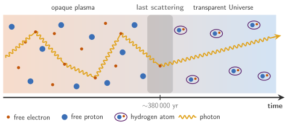{fig-align="center" width="92%" style="margin: 0;"}

[Adapted from: Yacine Ali-Haïmoud (NYU, 2019)]{.credit style="margin-top: -0.9em;"}
:::

::: {.column width="34%" .fragment fragment-index=1}
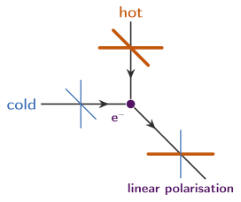{fig-align="center" height="230px" style="margin: 0;"}

[Adapted from: Hu & White (1997)]{.credit style="margin-top: -0.9em;"}
:::
::::

::: {.fragment fragment-index=1}
:::: {style="font-size: 0.85em;"}
- A quadrupole at last scattering + Thomson scattering, $\propto |\hat{\epsilon}\cdot\hat{\epsilon}'|^2$ → [linear polarisation]{.kw}
::::
:::

::: {.fragment fragment-index=2}
[The Stokes parameters]{.kw}

{fig-align="center" width="56%" style="margin: 0;"}

[Adapted from: Emma Alexander, Wikimedia Commons ([Stokes params](https://commons.wikimedia.org/wiki/File:Emmaalexander_Stokes_params.png))]{.credit style="margin-top: -1.1em;"}
:::

## Q and U Stokes parameters {#q-and-u-stokes-parameters}

```{=html}
<div class="bare" style="position: relative; height: 540px; font-size: 1.25em; --tag-bg: rgba(255, 255, 255, 0.88); --tag-border: transparent; --tag-pad: 0.05em 0.45em;">
<svg class="fragment" data-fragment-index="1" style="position: absolute; left: 380px; top: -25px; width: 330px;" viewBox="0 0 300 120"><path d="M20 110 C 30 10, 250 -10, 262 92" fill="none" stroke="#6E6E6E" stroke-width="5"/><path d="M246 84 L263 112 L278 82 Z" fill="#6E6E6E"/></svg>
<div style="position: absolute; left: 150px; width: 195px; height: 195px; display: flex; align-items: center; justify-content: center; top: 20px;">
  <span class="tag" style="position: relative;">\(Q\)</span>
</div>
<div style="position: absolute; left: 150px; width: 195px; height: 195px; display: flex; align-items: center; justify-content: center; top: 305px;">
  <span class="tag" style="position: relative;">\(U\)</span>
</div>
<div class="fragment move" data-fragment-index="1" style="position: absolute; left: 150px; width: 195px; height: 195px; display: flex; align-items: center; justify-content: center; top: 20px; --move: translateX(560px) rotate(45deg); --counter: rotate(-45deg);">
  
  <span class="tag counter" style="position: relative;"><span class="fragment fade-out" data-fragment-index="2">\(Q\)</span><span class="fragment" data-fragment-index="2" style="position: absolute; left: 50%; top: 50%; transform: translate(-50%, -50%); white-space: nowrap;">\(U\)</span></span>
</div>
<div class="fragment move" data-fragment-index="1" style="position: absolute; left: 150px; width: 195px; height: 195px; display: flex; align-items: center; justify-content: center; top: 305px; --move: translateX(560px) rotate(45deg); --counter: rotate(-45deg);">
  
  <span class="tag counter" style="position: relative;"><span class="fragment fade-out" data-fragment-index="2">\(U\)</span><span class="fragment" data-fragment-index="2" style="position: absolute; left: 50%; top: 50%; transform: translate(-50%, -50%); white-space: nowrap;">\(-Q\)</span></span>
</div>
</div>
```

::: {.fragment fragment-index=2}
:::: {.solutionbox}
::: {.solutionbox-body}
[$Q$]{.kw2} and [$U$]{.kw2} depend on the [reference frame]{.kw}: turning it by $45^\circ$ swaps them, [$Q'$]{.kw2} $=$ [$U$]{.kw2} and [$U'$]{.kw2} $= -$[$Q$]{.kw2}
:::
::::
:::

## $E$ and $B$ modes


<br/>
<br/>

:::: {.columns style="display: flex; align-items: center;"}
::: {.column width="50%"}

{fig-align="center" width="100%"}

[Planck 2018 SMICA: temperature (colour), polarisation (sticks)]{.credit style="margin-top: -0.4em;"}

:::

::: {.column width="48%"}

:::: {.row style="--justify: space-around; --cell-margin: 0; --img-w: auto; --img-h: 130px; --img-radius: 8px;"}
::: {.cell .fragment fragment-index=1}
{.screen-only}

{.print-only}
:::

::: {.cell .fragment fragment-index=2}
{.screen-only}

{.print-only}
:::
::::

::: {.r-stack style="width: 88%; margin: 0.3em auto 0;"}
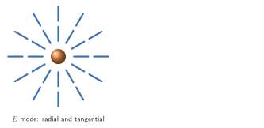{.fragment fragment-index=1 style="width: 100%; margin: 0;"}

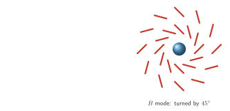{.fragment fragment-index=2 style="width: 100%; margin: 0;"}
:::

:::
::::

::: {.fragment fragment-index=2}
:::: {.solutionbox}
::: {.solutionbox-body}
- Density (scalar) perturbations make only [$E$ modes]{.kw}
- At linear order, [$B$ modes]{.kw} are only produced by [tensor perturbations]{.kw}
:::
::::
:::

## Two-point statistics

::: {.bare style="position: relative; width: 100%; aspect-ratio: 16 / 9; max-height: 560px; margin: 0 auto;"}
{style="position: absolute; left: 3.24%; top: 27.5%; width: 45%; height: 40%;"}

{.screen-only style="position: absolute; inset: 0; width: 100%; height: 100%;"}

{.print-only style="position: absolute; inset: 0; width: 100%; height: 100%;"}
:::

$C(\theta) = \langle \Delta T(\hat n_1)\,\Delta T(\hat n_2)\rangle$ over all pairs at separation $\theta$: its expansion in Legendre polynomials gives the [$C_\ell$]{.kw}

[Planck 2018 SMICA temperature map · smoothed to 1° FWHM]{.credit}

## Predicted CMB power spectra

::: {.r-stack}
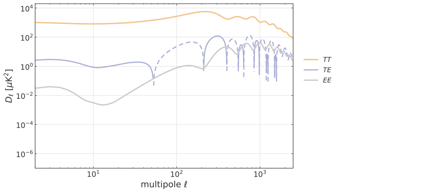{.fragment .fade-out fragment-index=1 width="92%"}

{.fragment .fade-in-then-out fragment-index=1 width="92%"}

{.fragment fragment-index=2 width="92%"}
:::

::: {.fragment fragment-index=3}
:::: {.solutionbox}
::: {.solutionbox-body}
- [The primordial tensor perturbations]{.kw} are very faint (below than lensing B modes) 
- Measurement of [$r$]{.kw2} requires isolating the primordial B modes from all other contaminants.
:::
::::
:::

## Current constraints on $r$

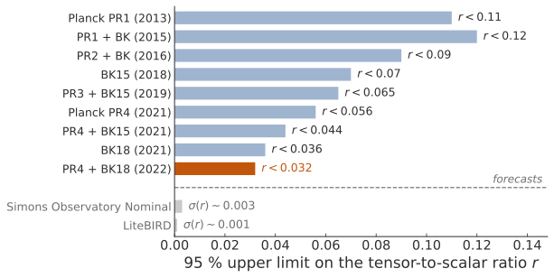{fig-align="center" width="90%"}

[Tristram et al. (2022); Simons Observatory (Ade et al. 2019); LiteBIRD Collaboration (2023)]{.credit}

## The CMB data-analysis pipeline

{style="position: absolute; top: -20px; right: 0; height: 120px; margin: 0;"}

::::: {.hl-host .bare style="margin-top: 0.2em;"}
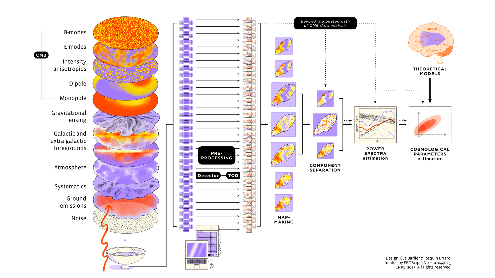{style="display: block; width: 990px;"}

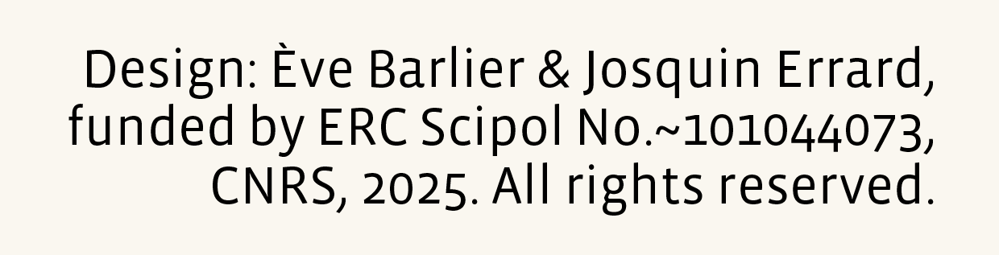{style="position: absolute; right: 0.5%; bottom: 0.3%; width: 31%; margin: 0;"}

<!-- one highlight box in three places: the sky stack, then detectors to map-making,
     then component separation to parameters (two boxes cross-fading at the middle spot) -->
:::: {.fragment fragment-index=1}
::: {.fragment .fade-out fragment-index=3}
::: {.hlbox .fragment .custom .hlbox-move fragment-index=2 style="--x: 0.3%; --y: 2.5%; --w: 33.7%; --h: 95%; --x2: 34.6%; --y2: 2.5%; --w2: 27%; --h2: 95%;"}
:::
:::
::::

::: {.fragment fragment-index=3}
::: {.hlbox .fragment .custom .hlbox-move fragment-index=3 style="--x: 34.6%; --y: 2.5%; --w: 27%; --h: 95%; --x2: 61.8%; --y2: 30.2%; --w2: 30.6%; --h2: 33%;"}
:::
:::
:::::

# From model to observation: weak gravitational lensing

::: {.rail-stack}
{.rail-full}

{.rail-focus}


:::

## {#lss-opener visibility="uncounted"}

<br/>

::: {.r-stack}
{.fragment .fade-out fragment-index=1 width="82%"}

{.fragment .fade-in-then-out fragment-index=1 width="82%"}

{.fragment .fade-in-then-out fragment-index=1 width="82%"}

{.fragment fragment-index=2 width="82%"}
:::

## The history of the expanding Universe

<br/>
<br/>

::: {style="width: 84%; margin: 0.6em auto 0;"}
{style="display: block; width: 100%; height: 540px; object-fit: contain; max-width: none; max-height: none; margin: 0.4em auto 0;"}
:::

## The expanding Universe and dark energy

<br/>
<br/>

:::: {.columns style="display: flex; align-items: center; min-height: 500px;"}
::: {.column width="52%"}
{.screen-only  width="100%"}

{.print-only width="100%"}
:::

::: {.column width="46%"}
::: {.grid style="--cols: 1fr; --row-gap: 1.1em;"}

::: {.eqbox style="--eq-border: #2aa198; --eq-size: 0.8em; --eq-math-margin: 0.2em 0; --eq-pad: 0.2em 1.2em; text-align: center;"}
[redshift]{.kw style="display: block;"} $1 + z = \dfrac{\lambda_\mathrm{obs}}{\lambda_\mathrm{emit}} = \dfrac{1}{a}$
:::

::: {.eqbox .fragment fragment-index=1 style="--eq-border: #2aa198; --eq-size: 0.8em; --eq-math-margin: 0.2em 0; --eq-pad: 0.2em 1.2em; text-align: center;"}
[scale factor]{.kw style="display: block;"} $a(t),\qquad a_0 = 1,\qquad H = \dot a / a$
:::


::: {.eqbox .fragment fragment-index=2 style="--eq-border: #2aa198; --eq-size: 0.8em; --eq-math-margin: 0.2em 0; --eq-pad: 0.2em 1.2em; text-align: center;"}
[comoving distance]{.kw style="display: block;"} $\chi(z) = \displaystyle\int_0^z \frac{c\,dz'}{H(z')}$
:::

::: {.eqbox .fragment fragment-index=3 style="--eq-border: #2aa198; --eq-size: 0.8em; --eq-math-margin: 0.2em 0; --eq-pad: 0.2em 1.2em; text-align: center;"}
[expansion rate]{.kw style="display: block;"} $H(z) = H_0\sqrt{\Omega_r(1+z)^4 + \Omega_m(1+z)^3 + \Omega_\Lambda}$
:::
:::
:::
::::

## Mapping dark matter through weak gravitational lensing {#weak-gravitational-lensing}

<br/>

{fig-align="center" width="86%"}

Matter along the line of sight bends light: [every background galaxy is slightly distorted]{.kw}

## Convergence and shear

{.screen-only fig-align="center" width="70%" style="margin: 1.2em auto -0.9em;"}

{.print-only fig-align="center" width="70%" style="margin: 1.2em auto -0.9em;"}

::: {.grid style="--cols: 1fr 1fr 1fr; width: 70%; margin: 0 auto; text-align: center; font-size: 0.8em;"}
[galaxy]{}

[convergence [$\kappa$]{.kw} (spin 0)]{}

[shear [$\gamma_1, \gamma_2$]{.kw} (spin 2)]{}
:::

[M101: NASA / ESA / Hubble (STScI-PRC2006-10a)]{.credit style="margin-top: -0.3em;"}

::: {.eqbox style="--eq-border: #2aa198; width: fit-content; margin: 0.3em auto 0; --eq-size: 1em; --eq-math-margin: 0.3em 0;"}
$$
\mathbf{A} = \begin{pmatrix} 1-\kappa-\gamma_1 & -\gamma_2 \\ -\gamma_2 & 1-\kappa+\gamma_1 \end{pmatrix}
$$
:::

:::: {.solutionbox}
::: {.solutionbox-body style="font-size: 0.95em;"}
Matter deforms galaxies through [weak lensing]{.kw}, by a [spin-0]{.kw2} field, the [convergence $\kappa$]{.kw}, and a [spin-2]{.kw2} field, the two components of the [shear $\gamma$]{.kw}

:::
::::

<!-- closing overlay: the same distortion over a whole field, after Mandelbaum (2018) Fig. 1 -->
::::: {.fragment .bare fragment-index=1 style="position: absolute; top: 72px; left: 0; width: 1050px; height: 600px; box-sizing: border-box; z-index: 20; background: rgba(250, 247, 240, 0.96); display: flex; flex-direction: column; align-items: center; justify-content: flex-start;"}
:::: {.figcadre style="width: fit-content; margin: 0;"}
::: {.figcadre-header}
Distant galaxies lensed by the cosmic web
:::

::: {.figcadre-body style="text-align: center;"}
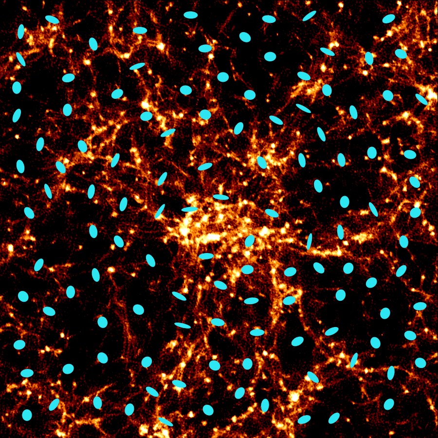{style="height: 455px; margin: 0; border-radius: 4px;"}
:::
::::

[After Mandelbaum (2018), arXiv:1710.03235, Fig. 1 (image: CFHT) · shell of this work's 3072³ run, z = 0.36]{.credit style="margin-top: 0.4em;"}
:::::


## Dark Energy Survey Y3 redshift distribution

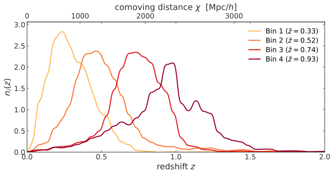{fig-align="center" style="width: 940px; margin: 0.6em auto 0;"}

## Tomographic projection to convergence maps

:::: {.grid .bare style="--cols: 700px 1fr; --gap: 10px; --align: center; margin-top: 0.4em;"}
::: {.r-stack}
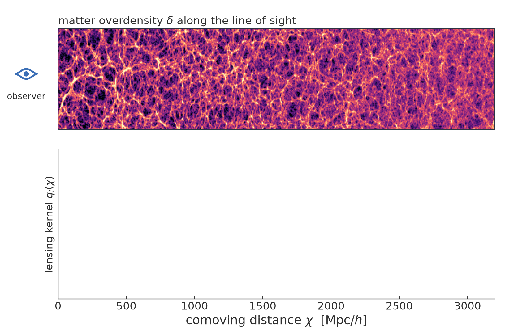{.fragment .fade-out fragment-index=1 width="700px"}

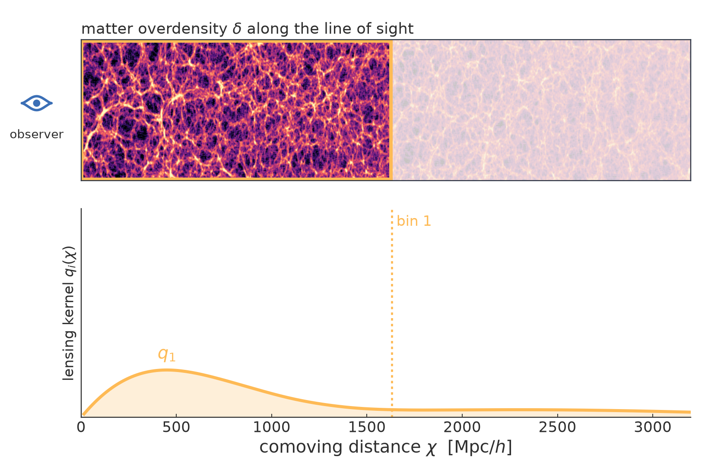{.fragment .fade-in-then-out fragment-index=1 width="700px"}

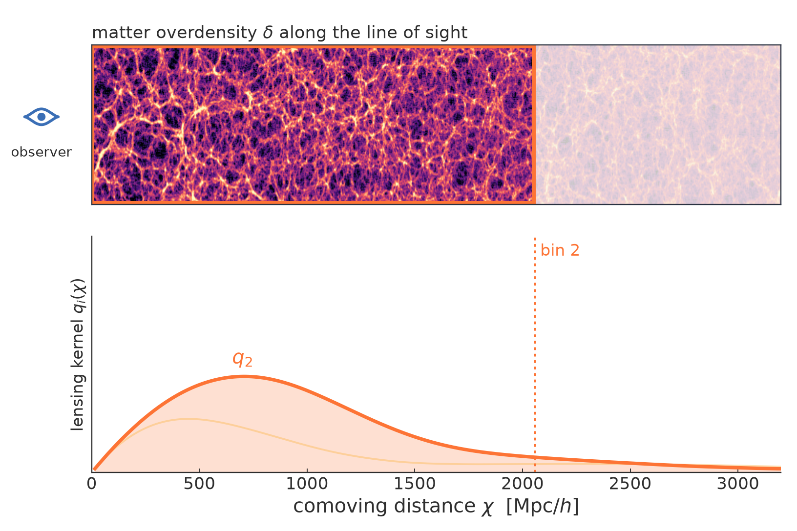{.fragment .fade-in-then-out fragment-index=2 width="700px"}

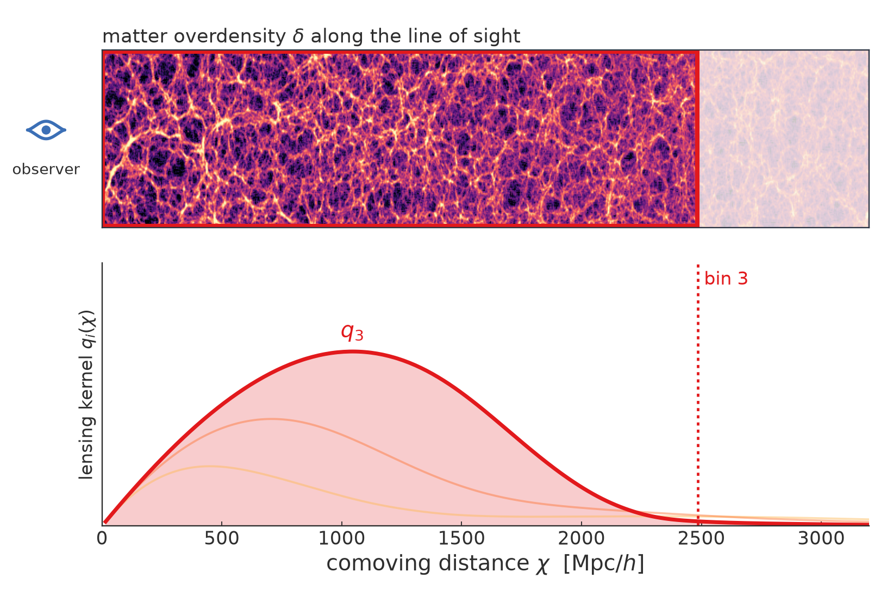{.fragment .fade-in-then-out fragment-index=3 width="700px"}

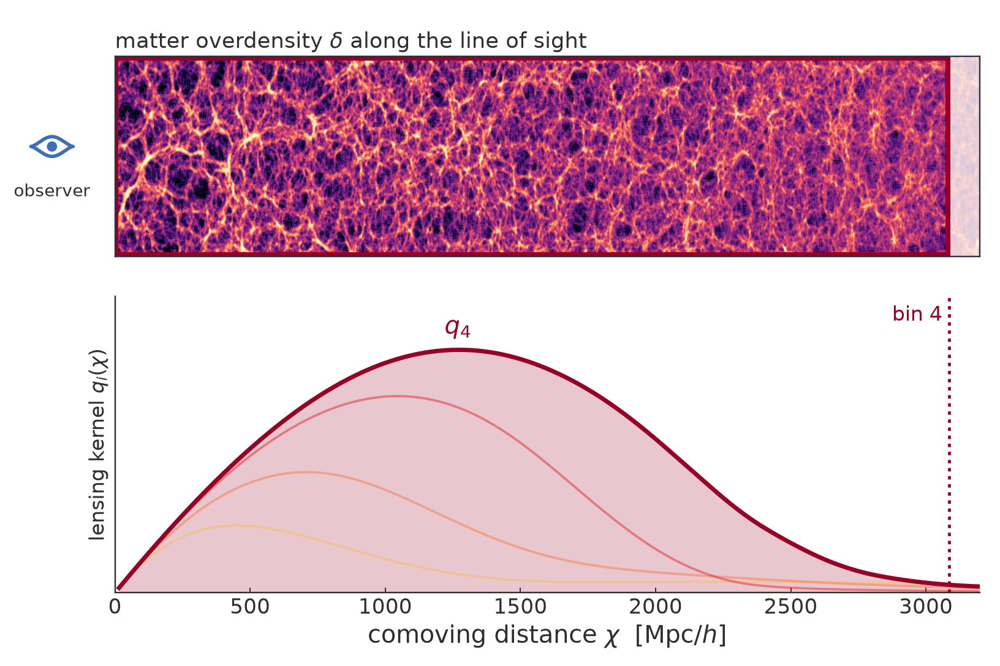{.fragment fragment-index=4 width="700px"}
:::

::: {.r-stack}
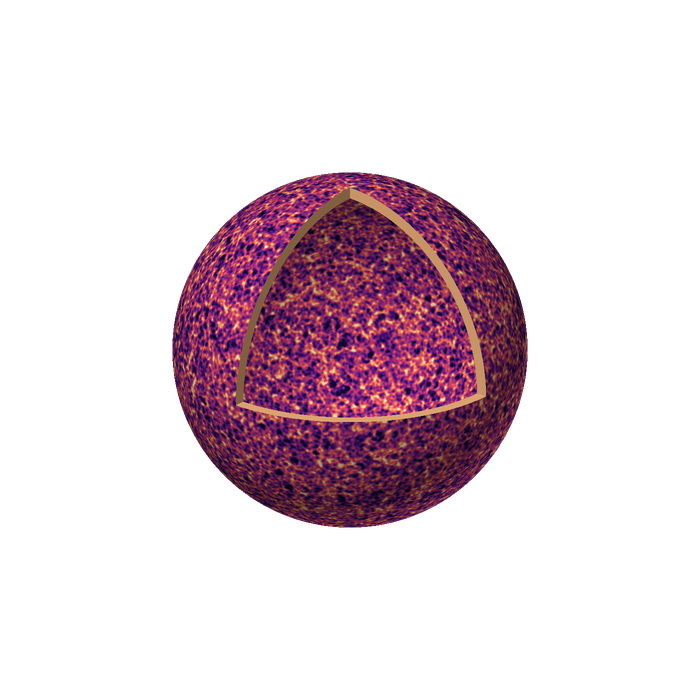{.fragment .fade-in-then-out fragment-index=1 width="340px"}

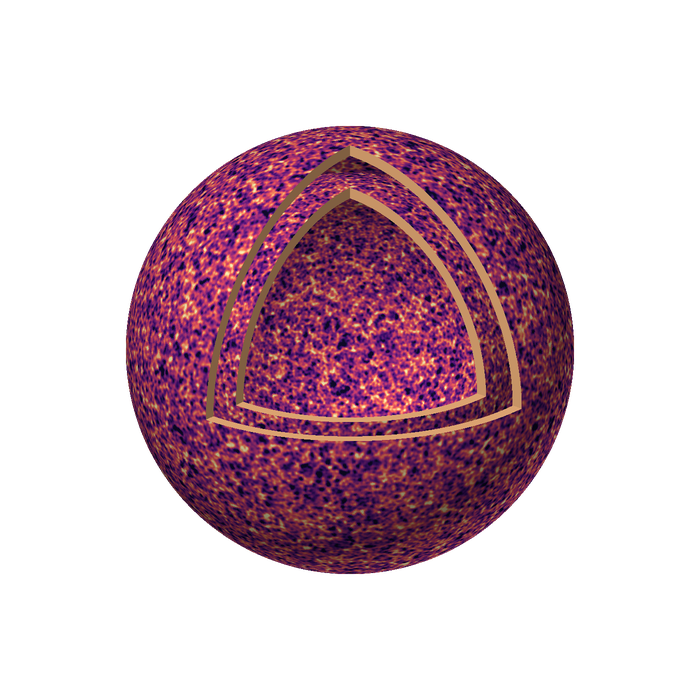{.fragment .fade-in-then-out fragment-index=2 width="340px"}

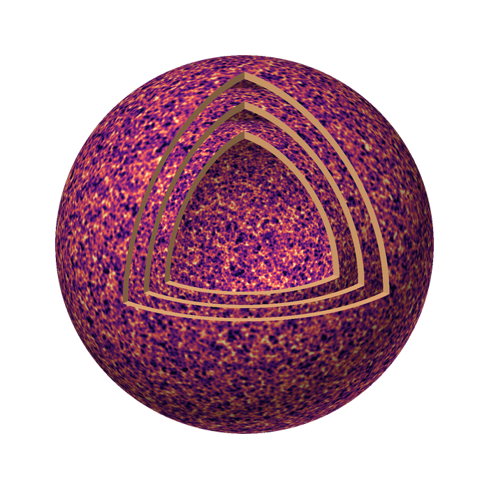{.fragment .fade-in-then-out fragment-index=3 width="340px"}

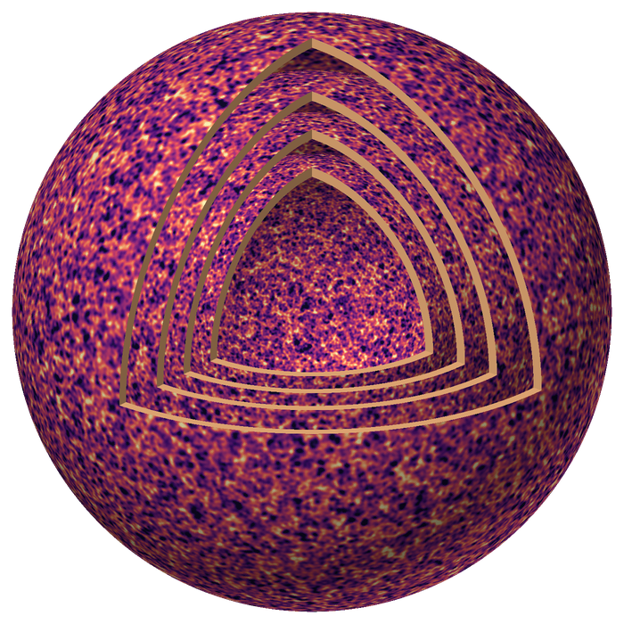{.fragment fragment-index=4 width="340px"}
:::
::::

::: {.eqbox style="--eq-border: #2aa198; width: fit-content; margin: 0.2em auto 0; --eq-size: 1em; --eq-math-margin: 0.2em 0;"}
$$\kappa_i(\hat{\mathbf n}) = \int_0^{\chi_H} q_i(\chi)\,\delta(\chi\hat{\mathbf n},\chi)\,\mathrm{d}\chi$$
:::

[Shell rendering inspired by GLASS (Tessore et al. 2023)]{.credit}

## From shear to cosmology

:::::: {.grid .bare style="--cols: 62px 125px 50px 176px 70px 150px 50px 140px 150px; grid-template-rows: 300px 50px 190px; justify-content: start; --gap: 2px; --row-gap: 0; margin-top: 0.2em;"}
::: {style="font-size: 0.6em; font-weight: 700; letter-spacing: 0.05em; color: #C2560A;"}
DATA
:::

::: {.cell}
{style="width: 82px;"}

[galaxy\
shapes]{.caption style="--cap-size: 0.62em; --cap-lh: 1.2; margin-top: 0.15em;"}
:::

::: {style="text-align: center; line-height: 0;"}
[]{.arrow style="--len: 50px; --w: 4px; --head: 18px;"}
:::

::: {.cell}
{.screen-only style="width: 150px;"}
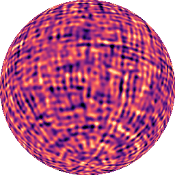{.print-only style="width: 150px;"}

[shear $\gamma_1, \gamma_2$]{.caption style="--cap-size: 0.62em; --cap-lh: 1.2; margin-top: 0.15em;"}
:::

::: {style="text-align: center;"}
[Inverse Kaiser–Squires]{style="display: block; font-size: 0.55em; color: #6E6E6E; line-height: 1.15; margin-bottom: 3px;"}

[]{.arrow style="--len: 64px; --w: 4px; --head: 18px;"}
:::

::: {.cell}
{.screen-only style="width: 140px;"}
{.print-only style="width: 140px;"}

[convergence $\kappa$ per bin]{.caption style="--cap-size: 0.62em; --cap-lh: 1.2; margin-top: 0.15em;"}
:::

::: {style="text-align: center; line-height: 0;"}
[]{.arrow style="--len: 50px; --w: 4px; --head: 18px;"}
:::

::: {style="border: 2px solid #C2560A; border-radius: 10px; padding: 0.4em 0.45em; font-size: 0.72em; line-height: 1.35; background: #FFFFFF; text-align: center;"}
measured\
$\hat C_\ell^{\,ij}$
:::

::: {style="grid-column: 1 / 9; height: 1px;"}
:::

::: {.fragment fragment-index=1 style="font-size: 0.6em; font-weight: 700; letter-spacing: 0.05em; color: #521463; text-align: center;"}
THEORY
:::

::: {.fragment fragment-index=1 style="border: 2px solid #521463; border-radius: 10px; padding: 0.4em 0.45em; font-size: 0.72em; line-height: 1.35; background: #FFFFFF; text-align: center; white-space: nowrap;"}
$\theta = (\Omega_\mathrm{m}, \dots)$
:::

::: {.fragment fragment-index=1 style="text-align: center; line-height: 0;"}
[]{.arrow style="--len: 50px; --w: 4px; --head: 18px;"}
:::

::: {.cell .fragment fragment-index=1}
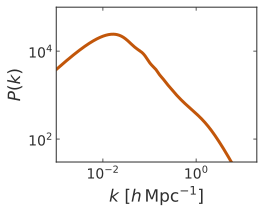{style="width: 172px;"}

[matter spectrum $P(k, z)$]{.caption style="--cap-size: 0.62em; --cap-lh: 1.2; margin-top: 0.15em;"}
:::

::: {.fragment fragment-index=1 style="text-align: center; grid-column: span 3;"}
[Limber, with the lensing kernels $q_i(\chi)$]{style="display: block; font-size: 0.55em; color: #6E6E6E; line-height: 1.15; margin-bottom: 3px;"}

[]{.arrow style="--len: 250px; --w: 4px; --head: 18px;"}
:::

::: {.fragment fragment-index=1 style="border: 2px solid #521463; border-radius: 10px; padding: 0.4em 0.45em; font-size: 0.72em; line-height: 1.35; background: #FFFFFF; text-align: center;"}
predicted\
$C_\ell^{\,ij}(\theta)$
:::

:::: {.row .flat .fragment fragment-index=2 style="grid-column: 9; grid-row: 1 / 4; align-self: start; margin-top: 150px; height: 295px; --gap: 0;"}
{style="width: 30px; height: 295px; flex: none;"}

::: {style="border: 2px solid #2E2E2E; border-radius: 10px; padding: 0.5em 0.6em; font-size: 0.75em; line-height: 1.35; background: #FFFFFF; text-align: center; margin-left: 6px;"}
compare\
↓\
[infer $\theta$]{style="color: #C2560A; font-weight: 700;"}
:::
::::
::::::

::: {.fragment fragment-index=2}
:::: {.solutionbox}
::: {.solutionbox-body style="font-size: 0.8em;"}
- In traditional anaysis we compress the maps into [angular power spectra $C_\ell$]{.kw}.
- This is called a [two-point correlation function (2PCF)]{.kw}
:::
::::
:::

## The target of 2PCF analysis

<br/>
<br/>
<br/>

::::: {.columns style="display: flex; align-items: Left;"}
::: {.column width="60%"}
{fig-align="center" style="height: 470px; width: auto; max-width: none; margin: 0;"}
:::

::: {.column style="width: 38%; padding-left: 1.2em; box-sizing: border-box;"}

<br/>
<br/>

:::: {.solutionbox style="margin-top: 0.8em;"}
::: {.solutionbox-body style="font-size: 0.95em;"}
- [$\Omega_\mathrm{m}$]{.kw}: how much matter
- [$\sigma_8$]{.kw}: how clumpy it is on $8\,h^{-1}\mathrm{Mpc}$ scales
- Weak lensing analysis targets the combination [$S_8 = \sigma_8\sqrt{\Omega_\mathrm{m}/0.3}$]{.kw2}
:::
::::

:::
:::::

## Current constraints on $S_8$

{fig-align="center" width="90%"}

[Asgari+21, Secco/Amon+22, Dalal+23, DES & KiDS 2023, Wright+25, DES Y6 2026, Planck 2018 VI]{.credit}

## Limitation of the two-point analysis


::: {.r-stack}
:::: {.columns style="width: 100%;"}
::: {.column style="width: 50%; text-align: center;"}
{.screen-only width="265px" style="margin: 0.4em 0 0;"}
{.print-only width="265px" style="margin: 0.4em 0 0;"}

[the cosmic web, [non-Gaussian]{.kw}]{style="font-size: 0.75em;"}
:::

::: {.column style="width: 50%; text-align: center;"}
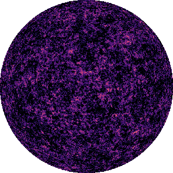{.screen-only width="265px" style="margin: 0.4em 0 0;"}
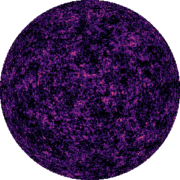{.print-only width="265px" style="margin: 0.4em 0 0;"}

[a [Gaussian]{.kw} field]{style="font-size: 0.75em;"}
:::
::::

:::: {.figcadre .fragment fragment-index=1 style="width: 40%; margin-top: 11.5em;"}
::: {.figcadre-body}
{width="100%" style="margin: 0.4em 0 0;"}
:::
::::
:::

::: {.fragment fragment-index=2}
:::: {.solutionbox}
::: {.solutionbox-body style="font-size: 0.85em;"}
- The 2PCF captures only the [Gaussian features]{.kw} of a field
:::
::::
:::

## Limitation of the two-point analysis {#two-point-degeneracy visibility="uncounted"}

::::: {.figcadre style="width: fit-content; margin: 0.2em auto 0;"}
::: {.figcadre-header}
DES Y6 cosmic shear (2026)
:::

::: {.figcadre-body style="text-align: center;"}
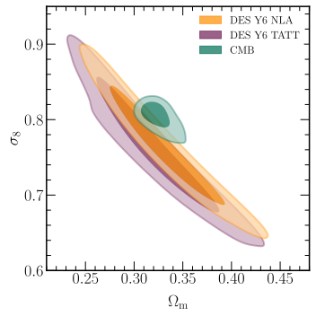{height="410px" style="margin: 0;"}
:::
:::::

[DES Y6 cosmic shear, DES Collaboration (2026), arXiv:2602.10065, Fig. 3 · CMB: *Planck* 2018, ACT DR6 and SPT-3G, TT+TE+EE+lowE, no lensing]{.credit}

::: {.fragment}
:::: {.solutionbox}
::: {.solutionbox-body style="font-size: 0.85em;"}
- We need to go beyond the 2PCF to extract more physical information: [Contribution 2]{.kw2}
:::
::::
:::

# Statistical inference for cosmology

::: {.rail-stack}
{.rail-full}

{.rail-focus}


:::

## Inverse problems in cosmology

{fig-align="center" width="80%"}


## Solving Inverse Problems : Analytical likelihood

<br/>

[Analytical inversion]{.kw} [(Stompor et al. 2009)]{style="font-size: 0.7em; color: #6E6E6E;"}

::: {.grid style="--cols: auto 1fr; --gap: 1.2em; --row-gap: 1.05em; --align: center; margin-top: 0.8em; font-size: 0.9em;"}
::: {.eqbox style="--eq-size: 1.3em; --eq-math-margin: 0.3em 0; --eq-pad: 0.15em 1em; justify-self: stretch; text-align: center;"}
$$\mathbf{d} = \mathbf{A}(\boldsymbol\theta)\,\mathbf{s} + \mathbf{n}$$
:::

the data are linear in the signal $\mathbf{s}$, and the mixing $\mathbf{A}$ depends on a few parameters $\boldsymbol\theta$

::: {.eqbox .fragment fragment-index=1 style="--eq-size: 1.3em; --eq-math-margin: 0.3em 0; --eq-pad: 0.15em 1em; justify-self: stretch; text-align: center;"}
$$-2\ln\mathcal{L}(\boldsymbol\theta,\mathbf{s}) = \big(\mathbf{d}-\mathbf{A}\mathbf{s}\big)^{\top}\mathbf{N}^{-1}\big(\mathbf{d}-\mathbf{A}\mathbf{s}\big)$$
:::

[for Gaussian noise of covariance $\mathbf{N}$]{.fragment fragment-index=1}

::: {.eqbox .fragment fragment-index=2 style="--eq-size: 1.3em; --eq-math-margin: 0.3em 0; --eq-pad: 0.15em 1em; justify-self: stretch; text-align: center;"}
$$\hat{\mathbf{s}}(\boldsymbol\theta) = \left(\mathbf{A}^{\top}\mathbf{N}^{-1}\mathbf{A}\right)^{-1}\mathbf{A}^{\top}\mathbf{N}^{-1}\mathbf{d}$$
:::

[setting the derivative with respect to $\mathbf{s}$ to zero]{.fragment fragment-index=2}

::: {.eqbox .fragment fragment-index=3 style="--eq-size: 1.3em; --eq-math-margin: 0.3em 0; --eq-pad: 0.15em 1em; justify-self: stretch; text-align: center;"}
$$-2\ln\mathcal{L}(\boldsymbol\theta) = -\left(\mathbf{A}^{\top}\mathbf{N}^{-1}\mathbf{d}\right)^{\top}\left(\mathbf{A}^{\top}\mathbf{N}^{-1}\mathbf{A}\right)^{-1}\left(\mathbf{A}^{\top}\mathbf{N}^{-1}\mathbf{d}\right)$$
:::

[substituting $\hat{\mathbf{s}}$ back, up to a constant, leaves a likelihood of $\boldsymbol\theta$ alone]{.fragment fragment-index=3}
:::

::: {.fragment fragment-index=4}
:::: {.solutionbox style="margin-top: 1.2em;"}
::: {.solutionbox-body style="font-size: 0.85em;"}
Analytical inversion requires a model [linear]{.kw} in [$\mathbf{s}$]{.kw2} with [Gaussian]{.kw} noise
:::
::::
:::

## Solving Inverse Problems : Forward Modelling {visibility="uncounted"}

[Forward modelling]{.kw}

::: {.grid style="--cols: auto auto; --gap: 2em; --align: center; justify-content: center; margin: 0.2em 0 0.3em;"}
::: {.eqbox style="--eq-size: 0.85em; --eq-math-margin: 0.1em 0; --eq-pad: 0.2em 1em; margin: 0; text-align: center;"}
$$\hat{\mathbf{d}} = \mathcal{A}(\mathbf{s},\boldsymbol\theta)$$
:::

::: {.eqbox style="--eq-size: 0.85em; --eq-math-margin: 0.1em 0; --eq-pad: 0.2em 1em; margin: 0; text-align: center;"}
$$-\ln\mathcal{L}(\boldsymbol\theta,\mathbf{s}) \;\propto\; \frac{\lVert \hat{\mathbf{d}} - \mathbf{d} \rVert_2^2}{\sigma^2}$$
:::
:::

::: {.grid style="--cols: 1fr 1fr 1.25fr; --gap: 1.2em; --align: center;"}
::: {.fragment fragment-index=1 style="text-align: center;"}
[Implicit inference]{.kw2}

{height="400px" style="margin: 0.1em auto 0;"}
:::

::: {.fragment fragment-index=2 style="text-align: center;"}
[Explicit inference]{.kw}

{height="400px" style="margin: 0.1em auto 0;"}
:::

::: {}
::: {.fragment fragment-index=3}
:::: {.solutionbox style="margin: 0;"}
::: {.solutionbox-body style="font-size: 0.8em;"}
- Explicit inference is more [interpretable]{.kw} than its implicit counterpart
- But it comes at a [higher computational cost]{.kw}
- Implementing a survey-level explicit forward model is subject to : [contribution 2]{.kw2}
:::
::::
:::
:::
:::

## Bayesian inference in cosmology

:::: {.columns}
::: {.column style="width: 60%;"}
[Bayes' theorem]{.kw}

::: {.eqbox style="--eq-math-margin: 0.25em 0; --eq-pad: 0.15em 1.1em; width: fit-content; margin: 0; --eq-size: 1.4em; margin-top: 0.3em;"}
$$\underbrace{p(\boldsymbol\theta\mid\mathbf{d})}_{\text{posterior}} \;=\; \frac{\overbrace{p(\mathbf{d}\mid\boldsymbol\theta)}^{\text{likelihood}}\;\overbrace{p(\boldsymbol\theta)}^{\text{prior}}}{\underbrace{p(\mathbf{d})}_{\text{evidence}}}$$
:::

::: {.eqbox .fragment fragment-index=1 style="--eq-math-margin: 0.25em 0; --eq-pad: 0.15em 1.1em; width: fit-content; margin: 0; --eq-size: 1.35em; margin-top: 0.8em;"}
$$p(\boldsymbol\theta\mid\mathbf{d}) \;\propto\; p(\mathbf{d}\mid\boldsymbol\theta)\;p(\boldsymbol\theta)$$
:::

::: {.fragment fragment-index=2 style="margin-top: 1.4em;"}
[Joint probabilistic modelling]{.kw2}

::: {.eqbox style="--eq-math-margin: 0.25em 0; --eq-pad: 0.15em 1.1em; width: fit-content; margin: 0; --eq-size: 1.3em; --eq-border: #521463; margin-top: 0.3em;"}
$$p(\boldsymbol\theta,\mathbf{s}\mid\mathbf{d}) \;\propto\; \underbrace{p(\mathbf{d}\mid\mathbf{s},\boldsymbol\theta)}_{\text{likelihood}}\;\underbrace{p(\mathbf{s}\mid\boldsymbol\theta)}_{\text{latent prior}}\;\underbrace{p(\boldsymbol\theta)}_{\text{prior}}$$
:::
:::
:::

::: {.column style="width: 40%;"}
{width="100%" style="margin: 0;"}

::: {.fragment fragment-index=2}
{height="115px" style="display: block; margin: 3.2em auto 0;"}
:::
:::
::::

## Exploring the posterior

::: {.r-stack}
::: {.fragment .fade-out fragment-index=3 style="width: 100%;"}
:::: {.columns}
::: {.column style="width: 50%; text-align: center;"}
[Finding the maximum a posteriori (MAP)]{.kw}

{.screen-only height="360px" style="margin: 0.2em 0 0;"}
{.print-only height="360px" style="margin: 0.2em 0 0;"}
:::

::: {.column .fragment fragment-index=1 style="width: 50%; text-align: center;"}
[Sampling the full posterior]{.kw}

{.screen-only height="360px" style="margin: 0.2em 0 0;"}
{.print-only height="360px" style="margin: 0.2em 0 0;"}
:::
::::
:::

::: {.fragment fragment-index=3 style="width: 100%; text-align: center;"}
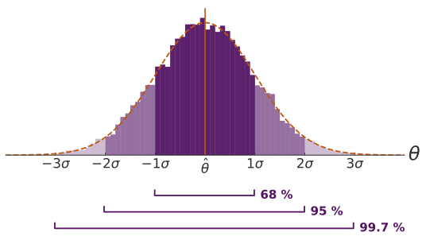{height="380px" style="margin: 1.2em auto 0;"}
:::
:::

::: {.fragment fragment-index=2}
:::: {.solutionbox}
::: {.solutionbox-body style="text-align: center; font-size: 1.05em;"}
How do we measure how much we [trust the result]{.kw}?
:::
::::
:::

## Differentiable methods for high-dimensional inference

[Both methods become more efficient with a [differentiable likelihood]{.kw}]{style="display: block; text-align: center; margin-top: 0.2em;"}

::: {.r-stack}
:::: {.fragment .fade-out fragment-index=1 style="width: 100%;"}
::: {.row .flat .bare style="--gap: 40px; --justify: center; --align: center;"}
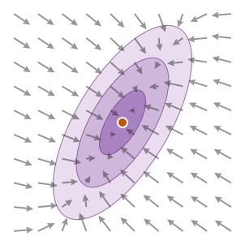{style="height: 400px; flex: none;"}

:::: {style="flex: none; width: 420px; text-align: center;"}
[Optimisation: the gradient points to the MAP]{.kw style="display: block; margin-bottom: 0.4em;"}

::: {.eqbox style="--eq-size: 1.05em; --eq-math-margin: 0.2em 0; --eq-pad: 0.1em 1em; width: fit-content; margin: 0 auto;"}
$$\boldsymbol\theta_{k+1} = \boldsymbol\theta_k + \eta\,\nabla_{\boldsymbol\theta}\ln p(\boldsymbol\theta\mid\mathbf{d})$$
:::
::::
:::
::::

:::: {.fragment fragment-index=1 style="width: 100%;"}
::: {.row .flat .bare style="--gap: 40px; --justify: center; --align: center;"}
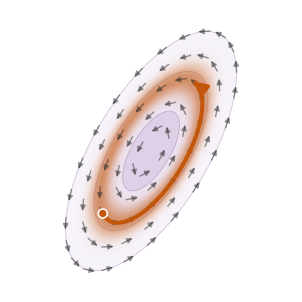{style="height: 400px; flex: none;"}

:::: {style="flex: none; width: 420px; text-align: center;"}
[Sampling: Hamiltonian Monte Carlo]{.kw style="display: block; margin-bottom: 0.4em;"}

::: {.eqbox style="--eq-size: 1.05em; --eq-math-margin: 0.2em 0; --eq-pad: 0.1em 1em; width: fit-content; margin: 0 auto;"}
$$\dot{\boldsymbol\theta} = \mathbf{p}, \qquad \dot{\mathbf{p}} = \nabla_{\boldsymbol\theta}\ln p(\boldsymbol\theta\mid\mathbf{d})$$
:::

[Adapted from Betancourt (2017), arXiv:1701.02434]{.credit style="margin-top: 0.6em;"}
::::
:::
::::
:::

::: {.fragment fragment-index=2}
:::: {.solutionbox}
::: {.solutionbox-body}
For high-dimensional problems, [differentiable likelihoods]{.kw} are required

Likelihood evaluation per independent sample: random walk $\sim$ [$d$]{.kw2}, HMC $\sim$ [$d^{1/4}$]{.kw2}

[Neal (2011); Beskos et al. (2013)]{.credit style="text-align: right;"}
:::
::::
:::

## Differentiable programming

<br/>
<br/>

:::: {.columns}
::: {.column style="width: 38%; text-align: center;"}
{style="display: block; height: 95px; margin: 0 auto 22px;"}
{style="display: block; height: 95px; margin: 0 auto 22px;"}
{style="display: block; height: 95px; margin: 0 auto 22px;"}
{style="display: block; height: 95px; margin: 0 auto;"}
:::

::: {.column width="62%"}
:::: {.solutionbox style="margin-top: 0.6em;"}
::: {.solutionbox-body style="font-size: 1.2em;"}
- [JAX]{.kw} computes exact gradients of numerical code by automatic differentiation
- The same code runs on CPUs, GPUs and multi-GPU clusters
- I used [Optax]{.kw2} for optimisation
- [BlackJAX]{.kw2} and [NumPyro]{.kw2} for sampling
:::
::::
:::
::::

::: {.fragment}
:::: {.solutionbox}
::: {.solutionbox-body style="text-align: center;"}
Can better numerical methods improve [cosmological pipelines]{.kw}?
:::
::::
:::

# Contribution 1: spatially varying map-based component separation

::: {.rail-stack style="width: 70%; margin-top: 0;"}
{.rail-full}

{.rail-focus}


:::

::: {style="display: flex; justify-content: center; align-items: center; gap: 36px; margin-top: 0.3em;"}
{style="height: 70px;"}
[](https://github.com/CMBSciPol/furax-cs)
[](https://github.com/CMBSciPol/furax)
:::

## From sky data to clean CMB maps

:::: {.row .flat .bare style="--align: flex-start; --gap: 0; height: 405px; margin-top: 0.2em;"}
::: {.r-stack style="width: 520px; height: 405px; flex: none;"}
{.fragment .fade-out fragment-index=1 style="height: 405px;"}

{.fragment fragment-index=1 style="height: 405px;"}
:::

{.fragment fragment-index=2 style="width: 90px; height: 405px; flex: none; margin-left: -15px;"}

{.fragment fragment-index=2 style="width: 440px; flex: none; margin: 35px 0 0 -5px;"}
::::

::::: {.fragment fragment-index=3 style="margin-top: 38px;"}
:::: {.solutionbox}
::: {.solutionbox-header}
CMB component separation
:::

::: {.solutionbox-body .row .flat style="font-size: 0.9em; --gap: 24px;"}
::: {style="flex: 1;"}
- To estimate [$r$]{.kw}, the CMB must be separated from the [foregrounds]{.kw} that contaminate it
- LiteBIRD observes the sky in [12 frequency bands]{.kw}, from 40 to 402 GHz
:::

{style="height: 80px; margin: 0;"}
:::
::::
:::::

## Foreground spectral energy distributions

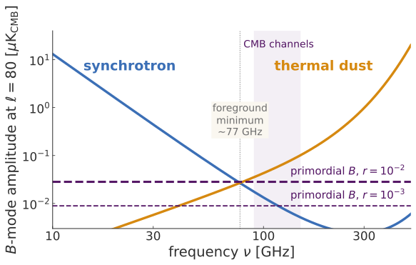{fig-align="center" height="440px" style="margin: 0.3em auto 0;"}

:::: {.solutionbox}
::: {.solutionbox-body style="font-size: 0.85em;"}
- Each component has its own SED: [synchrotron]{.kw} dominates at low frequencies, [dust]{.kw} at high frequencies
- The primordial $B$ modes are best seen near the [foreground minimum]{.kw}, around [80 GHz]{.kw2}
:::
::::

## Parametric component separation: the spectral model

### [Synchrotron and dust (Galactic foregrounds)]{.kw}

:::: {.columns style="text-align: center;"}
::: {.column width="50%"}
::: {.eqbox style="--eq-border: #3b6fb6; --eq-size: 1.05em; --eq-math-margin: 0.1em 0 0.2em; --eq-pad: 0.25em 0.9em 0.05em; width: fit-content; margin: 0.2em auto 0.3em;"}
[[Synchrotron]{style="color: #3b6fb6; font-weight: 700;"}: power law]{style="font-size: 0.75em;"}

$$A^{\mathrm{sync}}_\nu({\color{#3b6fb6}\beta_s}) \;\propto\; \left(\frac{\nu}{\nu_0}\right)^{\color{#3b6fb6}\beta_s}$$
:::

{height="165px" style="margin: 0;"}

[Planck: synchrotron]{style="font-size: 0.6em; color: #6E6E6E; display: block; margin-top: -0.9em;"}
:::

::: {.column width="50%"}
::: {.eqbox style="--eq-border: #d68910; --eq-size: 1.05em; --eq-math-margin: 0.1em 0 0.2em; --eq-pad: 0.25em 0.9em 0.05em; width: fit-content; margin: 0.2em auto 0.3em;"}
[[Dust]{style="color: #d68910; font-weight: 700;"}: modified black body]{style="font-size: 0.75em;"}

$$A^{\mathrm{dust}}_\nu({\color{#d68910}\beta_d}, {\color{#d68910}T_d}) \;\propto\; \left(\frac{\nu}{\nu_0}\right)^{{\color{#d68910}\beta_d}+1}\frac{e^{h\nu_0/k{\color{#d68910}T_d}}-1}{e^{h\nu/k{\color{#d68910}T_d}}-1}$$
:::

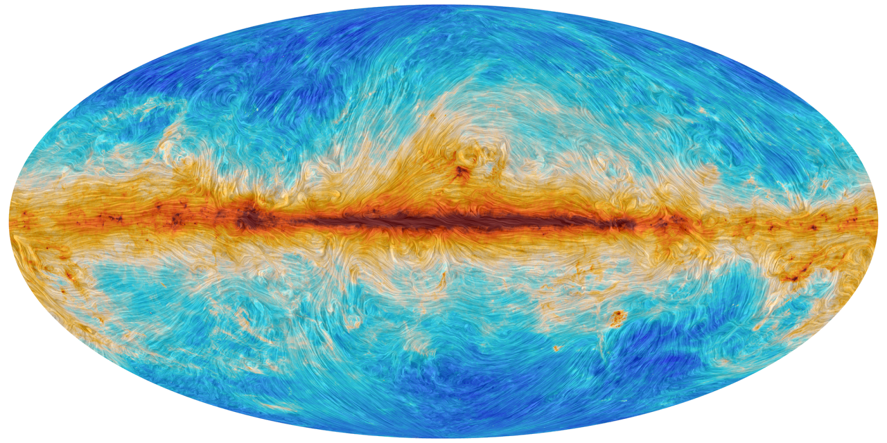{height="165px" style="margin: 0;"}

[Planck: thermal dust]{style="font-size: 0.6em; color: #6E6E6E; display: block; margin-top: -0.9em;"}
:::
::::


<!-- the data model and the components that maximise the likelihood at fixed beta -->
:::: {.row .bare style="--gap: 18px; --justify: center; --align: center; margin-top: 0.3em;"}
::: {.eqbox style="--eq-border: #521463; --eq-size: 0.92em; --eq-math-margin: 0.2em 0; width: fit-content; margin: 0; text-align: center;"}
$$\mathbf{d}_\nu = A^{\mathrm{cmb}}_\nu\,\mathbf{s}_{\mathrm{cmb}} + A^{\mathrm{dust}}_\nu({\color{#d68910}\beta_d},{\color{#d68910}T_d})\,\mathbf{s}_{\mathrm{dust}} + A^{\mathrm{sync}}_\nu({\color{#3b6fb6}\beta_s})\,\mathbf{s}_{\mathrm{sync}} + \mathbf{n}_\nu$$
:::

::: {.eqbox style="--eq-border: #521463; --eq-size: 0.92em; --eq-math-margin: 0.2em 0; width: fit-content; margin: 0; text-align: center;"}
$$\hat{\mathbf{s}}(\boldsymbol\beta) = \left(\mathbf{A}^{\top}\mathbf{N}^{-1}\mathbf{A}\right)^{-1}\mathbf{A}^{\top}\mathbf{N}^{-1}\mathbf{d}$$
:::
::::

::: {style="display: flex; justify-content: center; align-items: center; gap: 12px; margin-top: 0.3em;"}
[](https://fgbuster.github.io/fgbuster/)

[Rizzieri et al. (2025), [arXiv:2510.08534](https://arxiv.org/abs/2510.08534)]{.credit style="margin: 0;"}
:::

::: {.fragment fragment-index=1}
### [The spectral likelihood]{.kw}

::: {.eqbox style="--eq-border: #521463; --eq-size: 1.1em; --eq-math-margin: 0.2em 0; width: fit-content; margin: 0.45em auto 0; text-align: center;"}
$$-2\ln\mathcal{L}(\boldsymbol\beta) = -\left(\mathbf{A}^{\top}\mathbf{N}^{-1}\mathbf{d}\right)^{\top}\left(\mathbf{A}^{\top}\mathbf{N}^{-1}\mathbf{A}\right)^{-1}\left(\mathbf{A}^{\top}\mathbf{N}^{-1}\mathbf{d}\right), \qquad \boldsymbol\beta = ({\color{#d68910}\beta_d}, {\color{#d68910}T_d}, {\color{#3b6fb6}\beta_s})$$
:::
:::

## Estimating $r$ from a clean CMB map

:::: {.columns style="display: flex; align-items: center; min-height: 540px;"}
::: {.column width="40%"}
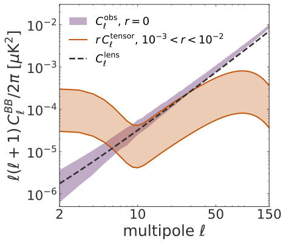{style="width: 118%; max-width: none; margin: 0 0 0 -14%;"}
:::

::: {.column width="60%"}
::: {.eqbox style="--eq-border: #521463; --eq-size: 0.8em; --eq-math-margin: 0.15em 0; width: fit-content; margin: 0 auto; text-align: center;"}
$$C_\ell^{BB,\mathrm{model}}(r) = {\color{#C2560A} r}\,C_\ell^{\mathrm{tensor}} + C_\ell^{\mathrm{lens}} + C_\ell^{\mathrm{stat}}$$
:::

::: {.eqbox style="--eq-border: #521463; --eq-size: 0.8em; --eq-math-margin: 0.15em 0; width: fit-content; margin: 0.6em auto 0; text-align: center;"}
$$\text{with}\quad C_\ell^{\mathrm{stat}} = \big\langle C_\ell^{BB,\mathrm{noise}} \big\rangle_n$$
:::

::: {.eqbox style="--eq-border: #521463; --eq-size: 0.8em; --eq-math-margin: 0.15em 0; width: fit-content; margin: 0.6em auto 0; text-align: center;"}
$$C_\ell^{BB,\mathrm{obs}} = C_\ell^{BB,\mathrm{CMB}} + C_\ell^{\mathrm{lens}} + C_\ell^{\mathrm{stat}}$$
:::

::: {.fragment}
::: {.eqbox style="--eq-border: #521463; --eq-size: 0.8em; --eq-math-margin: 0.15em 0; width: fit-content; margin: 0.8em auto 0; text-align: center;"}
$$-2\ln\mathcal{L}_\mathrm{cosmo}(r) = f_\mathrm{sky}\sum_{\ell}(2\ell+1)\left[\frac{C_\ell^{BB,\mathrm{obs}}}{C_\ell^{BB,\mathrm{model}}(r)} + \ln C_\ell^{BB,\mathrm{model}}(r)\right]$$
:::
:::
:::
::::

## Spatially varying foregrounds

<br/>

::: {}
### [c1d0s0]{.kw} [one spectrum for the whole sky]{style="font-size: 0.6em; font-weight: 400; color: #6E6E6E;"} {style="margin: 0 0 0.1em;"}

::: {.grid .bare style="--cols: 1fr 1fr 1fr 1.3fr; --gap: 0.6em; --row-gap: 0.2em; --align: center; text-align: center;"}
[synchrotron index $\beta_s$]{style="font-size: 0.6em;"}

[dust index $\beta_d$]{style="font-size: 0.6em;"}

[dust temperature $T_d$]{style="font-size: 0.6em;"}

[SEDs of 300 pixels]{style="font-size: 0.6em;"}

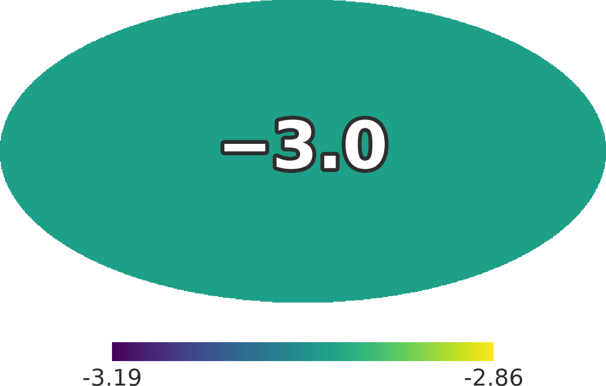{height="128px" style="margin: 0;"}

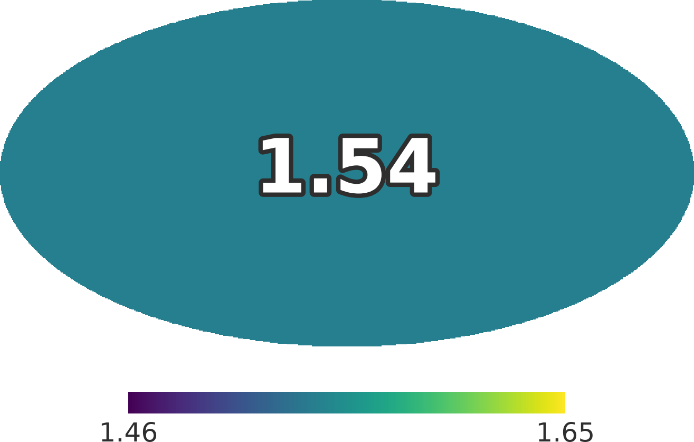{height="128px" style="margin: 0;"}

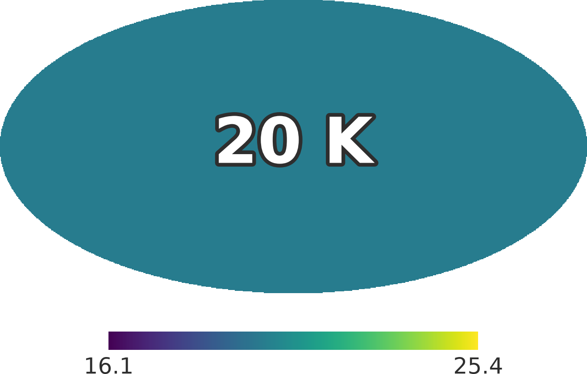{height="128px" style="margin: 0;"}

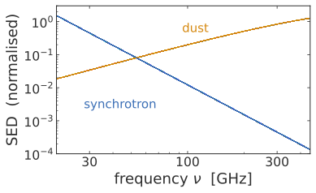{height="145px" style="margin: 0;"}
:::
:::

::: {.fragment fragment-index=1}
### [c1d1s1]{.kw} [one spectrum per pixel]{style="font-size: 0.6em; font-weight: 400; color: #6E6E6E;"} {style="margin: 0.3em 0 0.1em;"}

::: {.grid .bare style="--cols: 1fr 1fr 1fr 1.3fr; --gap: 0.6em; --align: center; text-align: center;"}
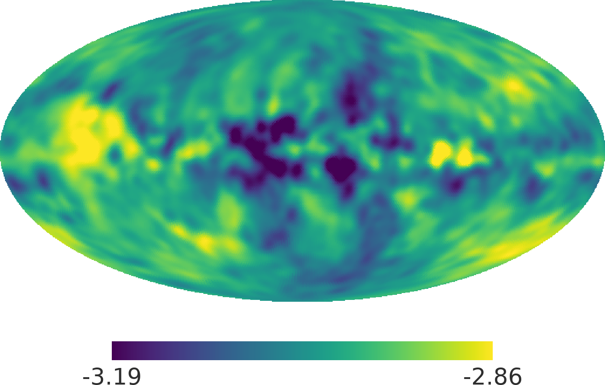{height="128px" style="margin: 0;"}

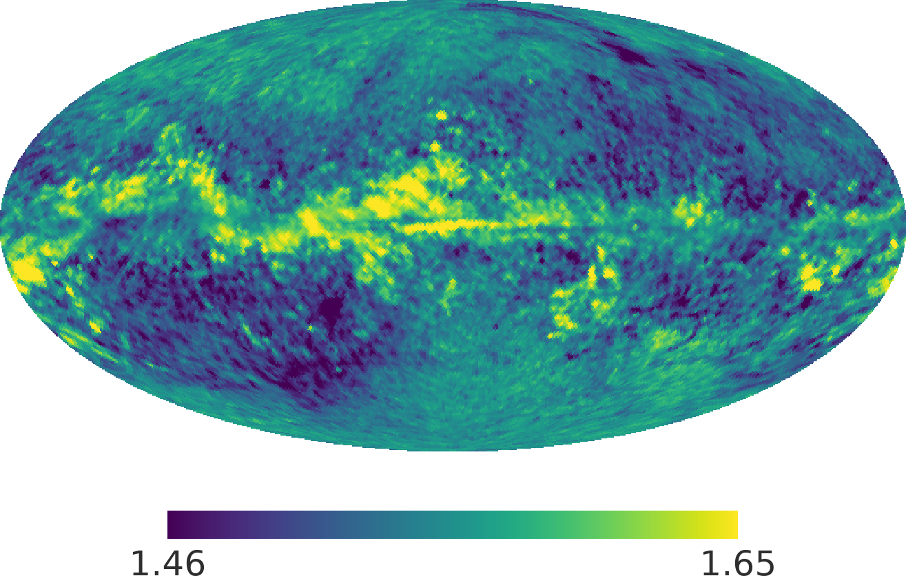{height="128px" style="margin: 0;"}

{height="128px" style="margin: 0;"}

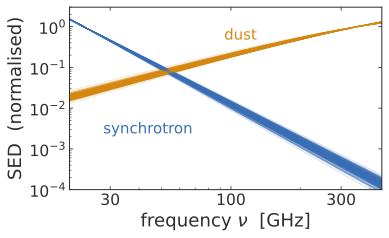{height="145px" style="margin: 0;"}
:::
:::

[Sky models: PySM (Thorne et al. 2017; Zonca et al. 2021; Pan-Experiment Galactic Science Group 2025)]{.credit}

::: {.fragment fragment-index=2}
:::: {.solutionbox style="margin-top: 0.4em;"}
::: {.solutionbox-body style="font-size: 0.85em;"}
- In [c1d1s1]{.kw2} each pixel has its own spectrum. The likelihood must model this [spatial variability]{.kw}
- Both skies have [$r = 0$]{.kw2} and serve for validation
:::
::::
:::

## How do we represent sky data numerically? {#healpix}

<br/>

#### [Hierarchical Equal Area iso-latitude Pixellation]{.kw} (of the sphere)

:::: {.row style="margin-top: -0.3em;"}
::: {.cell style="flex: 0 0 17%; --cell-margin: 0.15em 0; --img-w: 90%;"}
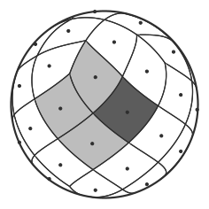


[HEALPix]{style="display: block; font-weight: 700; font-size: 1.05em; color: #2E2E2E;"}

{style="width: 48%;"}
:::

::: {.bare style="flex: 1 1 auto; text-align: center;"}
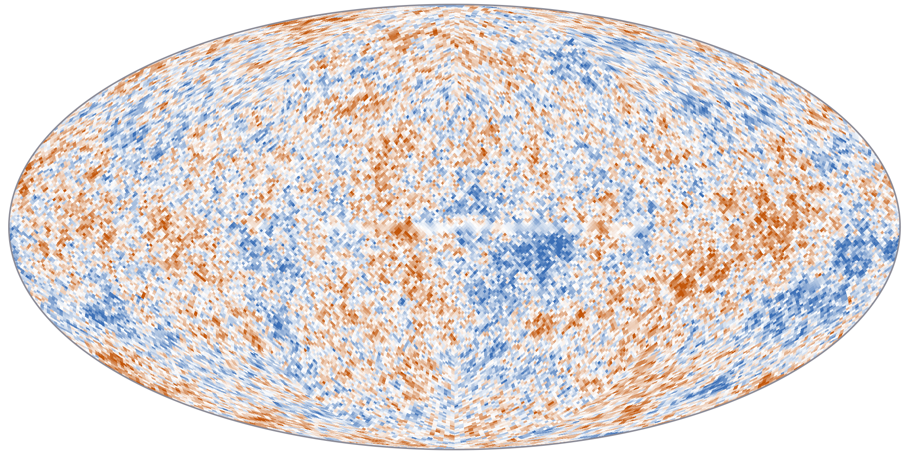{style="width: 100%;"}

[$N_\mathrm{side}$]{.kw} $= 64$
:::

::::

## Defining parameter patches on the sphere

### [Multi-resolution (HEALPix)]{.kw} [LiteBIRD Collaboration (2023)]{style="font-size: 0.55em; font-weight: 400; color: #6E6E6E;"}

:::::: {.grid .bare style="--cols: 470px 470px; --gap: 60px; --row-gap: 18px; --align: start; --img-w: 450px; --cap-size: 0.72em; --cell-margin: 0.3em 0 0; margin-top: 0.2em;"}
::::: {.r-stack}
::: {.cell .fragment .fade-out fragment-index=1}
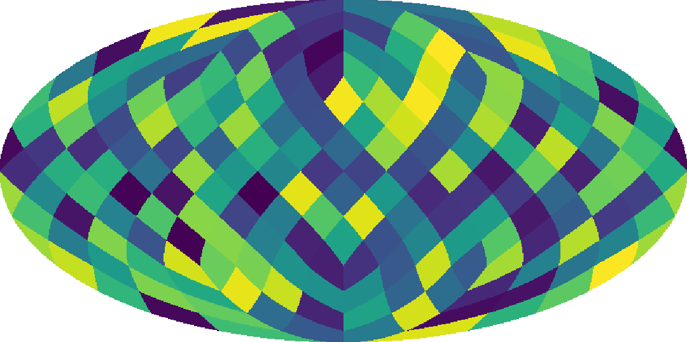

[$N_{\rm side} = 4$ · 192 patches]{.caption}
:::

::: {.cell .fragment .fade-in-then-out fragment-index=1}
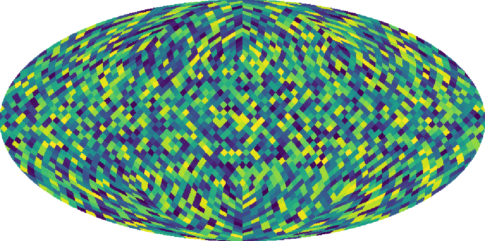

[$N_{\rm side} = 16$ · 3072 patches]{.caption}
:::

::: {.cell .fragment .fade-in-then-out fragment-index=2}


[$N_{\rm side} = 32$ · 12288 patches]{.caption}
:::

::: {.cell .fragment fragment-index=3}
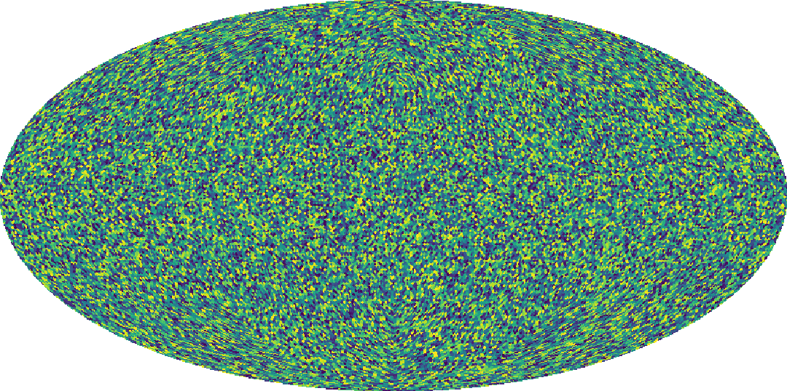

[$N_{\rm side} = 64$ · 49152 patches]{.caption}
:::
:::::

::: {.cell .fragment fragment-index=4}


[[low]{.kw} · [mid]{.kw2} · [high]{style="color: #3B6FB6; font-weight: 700;"} Galactic latitude, 20 % of the sky each]{.caption}

[Planck Galactic masks: Planck Collaboration (2020), A&A 641, A4]{.credit style="margin-top: 0.1em;"}
:::

::: {.fragment .table-full fragment-index=5 style="padding: 0 20px 0 30px; font-size: 0.95em;"}

<br/>
<br/>
<br/>

[$N_{\rm side}$ per parameter in the LiteBIRD analysis]{.kw style="display: block; font-size: 0.85em; margin-bottom: 0.3em; text-align: center;"}

|           | low      | mid      | high     |
|:----------|:--------:|:--------:|:--------:|
| $\beta_d$ | 64       | 64       | 64       |
| $T_d$     | [8]{.kw} | [4]{.kw} | [0]{.kw} |
| $\beta_s$ | 4        | 2        | 2        |

[per Galactic region (0: one patch)]{style="display: block; font-size: 0.8em; color: #6E6E6E; margin-top: 0.4em; text-align: center;"}
:::

::: {.cell .fragment fragment-index=6 style="--img-w: 420px;"}
[Example: the $T_d$ partition]{.kw style="display: block; font-size: 0.85em; margin-bottom: 0.3em;"}


[$T_d$ at $N_{\rm side}$ 8 / 4 / 0 · 344 patches]{.caption}
:::
::::::

## Defining parameter patches on the sphere {visibility="uncounted"}

### [Equal-area patches on the sphere]{.kw} {style="margin-bottom: 0.1em;"}

:::: {.columns}
::: {.column style="width: 50%; text-align: center;"}
#### [Spherical $K$-means]{.kw} {style="margin: 0 0 0.2em;"}

::: {style="display: flex; justify-content: center; align-items: center; gap: 14px; margin-bottom: 0.2em;"}
[](https://github.com/CMBSciPol/jax-healpy)
{style="height: 34px; margin: 0;"}
:::

{.screen-only width="380px" style="margin: 0;"}
{.print-only width="380px" style="margin: 0;"}
:::

::: {.column .fragment fragment-index=1 style="width: 50%; text-align: center;"}
#### [The bias–variance trade-off]{.kw} {style="margin: 0 0 0.3em;"}

{width="84%" style="margin: 0;"}
:::
::::

::: {.fragment fragment-index=2}
:::: {.solutionbox}
::: {.solutionbox-header}
Obstacle for full-sky CMB surveys: LiteBIRD
:::

::: {.solutionbox-body style="font-size: 0.76em;"}
- The number of patches must be tuned to meet the requirements of future surveys
- We want to test many configurations and keep the best one
- This needs a [fast]{.kw} optimisation method and a [selection criterion]{.kw} for patch configurations
:::
::::
:::

## Fast and robust minimisation

::::::: {.columns style="display: flex; gap: 12px; margin-top: 0.1em;"}
:::::: {.column style="width: 480px;"}
::::: {.r-stack .bare}
:::: {.fragment .fade-out fragment-index=2 style="margin: 40px 0 0 20px; align-self: start; justify-self: start;"}
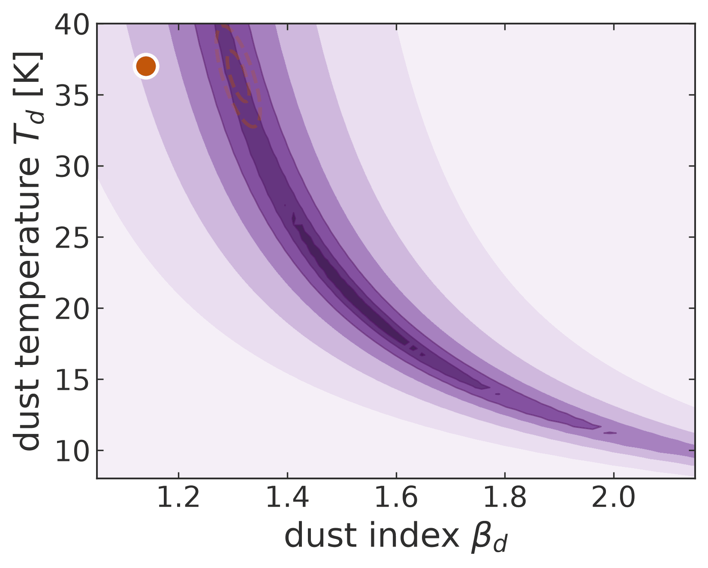{.screen-only style="width: 450px;"}
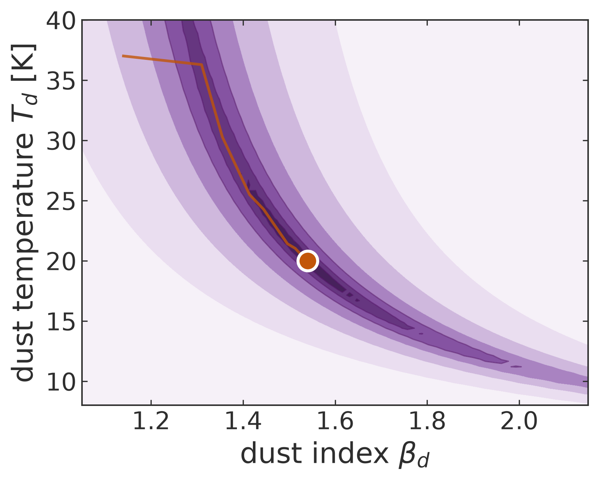{.print-only style="width: 450px;"}
::::

:::: {.fragment fragment-index=2 style="margin: 0 0 0 40px; align-self: start; justify-self: start;"}
{.screen-only style="width: 430px;"}
{.print-only style="width: 430px;"}
::::
:::::
::::::

:::::: {.column style="width: 500px;"}
### How do we minimise? {style="margin: 0 0 0.3em;"}

::::: {.r-stack .bare style="height: 300px;"}
:::: {.fragment .fade-out fragment-index=1 style="width: 100%;"}
::: {.eqbox style="--eq-size: 1.25em; --eq-math-margin: 0.25em 0; --eq-pad: 0.3em 0.9em; width: fit-content; margin: 0.4em auto 0; text-align: center;"}
[The Newton method]{style="display: block; margin: 0.1em 0 0; font-size: 0.8em; font-weight: 700; color: #C2560A;"}

$$\boldsymbol\beta_{k+1} = \boldsymbol\beta_k - \mathbf{H}_k^{-1}\,\mathbf{g}_k$$
$$\mathbf{g} = \nabla_{\boldsymbol\beta}\left(-\ln\mathcal{L}\right), \qquad \mathbf{H} = \nabla^2_{\boldsymbol\beta}\left(-\ln\mathcal{L}\right)$$
:::
::::

:::: {.fragment fragment-index=1 style="width: 100%; text-align: center;"}
{style="width: 440px; margin: 0.2em 0 0;"}

[140 GHz, LiteBIRD depth]{style="display: block; font-size: 0.6em; color: #6E6E6E; margin: 0.1em 0 0;"}
::::
:::::

::::: {.fragment fragment-index=3 style="margin-top: 0.7em;"}
:::: {.solutionbox}
::: {.solutionbox-body style="font-size: 0.85em;"}
- Noisy sky data make the Hessian [poorly conditioned]{.kw} and hard to invert
- [Quasi-Newton]{.kw} methods suffer the most since they approximate the inverse Hessian.
:::
::::
:::::
::::::
:::::::

## Adaptive moment-based methods

::: {style="display: flex; align-items: center; gap: 18px; margin-top: -0.2em;"}
{style="height: 40px; margin: 0;"}
[](https://github.com/CMBSciPol/CADRE)
:::

:::: {.columns style="display: flex; align-items: center;"}
::: {.column style="width: 54%;"}
::: {.r-stack}
::: {.fragment .fade-out fragment-index=1}
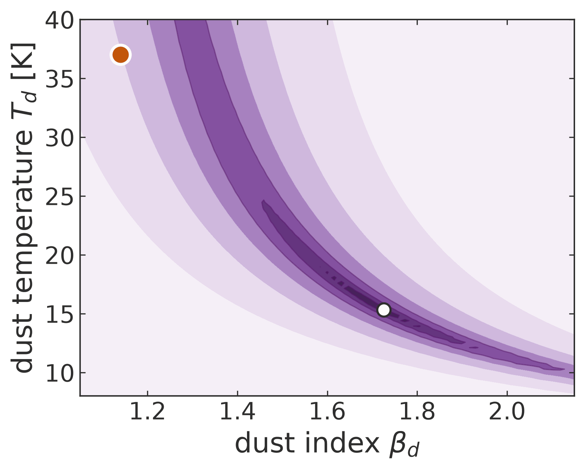{.screen-only width="80%" style="margin: 0 auto; display: block;"}
{.print-only width="80%" style="margin: 0 auto; display: block;"}
:::

{.fragment fragment-index=1 width="80%" style="margin: 0 auto; display: block;"}
:::
:::

::: {.column style="width: 46%; font-size: 1em;"}
[Adam]{.kw2} is the standard optimiser of machine learning, built for very many parameters and very noisy gradients

::: {.eqbox style="--eq-size: 0.95em; --eq-math-margin: 0.2em 0; --eq-pad: 0.15em 0.8em; width: fit-content; margin: 0.4em auto;"}
$$\boldsymbol\beta_{t+1} = \boldsymbol\beta_t - \eta\,\frac{\hat m_t}{\sqrt{\hat v_t}+\epsilon}$$
:::

[$m_t$, $v_t$: running means of $\mathbf{g}$ and $\mathbf{g}^2$]{style="font-size: 0.85em; color: #6E6E6E;"}

::: {.fragment fragment-index=1}
[AdaBelief]{.kw2} scales the step by the spread of the gradient instead

::: {.eqbox style="--eq-size: 0.95em; --eq-math-margin: 0.2em 0; --eq-pad: 0.15em 0.8em; width: fit-content; margin: 0.4em auto;"}
$$v_t \;\longrightarrow\; s_t:\ \text{running mean of }(\mathbf{g} - m_t)^2$$
:::

A noisy direction gets a [smaller step]{.kw}
:::
:::
::::

::: {.fragment fragment-index=2}
:::: {.solutionbox}
::: {.solutionbox-body style="font-size: 0.9em;"}
[AdaTopK]{.kw} builds on AdaBelief for physical parameters, with a robust handling of parameter bounds
:::
::::
:::


## Scaling of AdaTopK

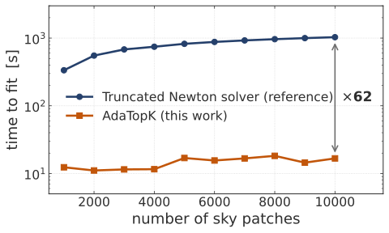{fig-align="center" width="62%" style="margin-bottom: 0.2em;"}

:::: {.solutionbox}
::: {.solutionbox-header}
Scaling
:::

::: {.solutionbox-body style="font-size: 0.85em;"}
- AdaTopK runs on GPUs with first-order gradients only.
- It scales well as number of patches grows.
:::
::::

## Selection criteria for optimal patches

{style="position: absolute; top: -20px; right: 0; height: 110px; margin: 0; border-radius: 10px;"}

{style="position: absolute; top: -12px; right: 125px; height: 95px; margin: 0;"}

::: {style="display: flex; align-items: center; gap: 18px; margin-top: -0.2em;"}
{style="height: 40px; margin: 0;"}
[](https://github.com/CMBSciPol/furax)
[](https://github.com/CMBSciPol/furax-cs)
:::

<!-- one box from entry to end: the video's poster is its frame 0 and the click (a custom fragment,
never hidden) only starts it; it stops on the largest partition, and the next click lays the ringed
optimum exactly over it -->
```{=html}
<div style="position: relative; width: 80%; margin: 0.2em auto 0;">
<video src="PhD/5_contribution/compsep/12_selection/selection.mp4" poster="PhD/5_contribution/compsep/12_selection/selection_first.png" class="fragment custom screen-only" data-fragment-index="1" muted playsinline preload="auto" style="display: block; width: 100%; margin: 0;"></video>

</div>
```

{.print-only fig-align="center" width="80%"}

[Chanial, Biquard, Kabalan et al. (2026), FURAX, [arXiv:2603.19600](https://arxiv.org/abs/2603.19600), submitted to JOSS<br/>Kabalan et al. (2026), [arXiv:2604.08463](https://arxiv.org/abs/2604.08463), submitted to RASTI]{.selfcredit style="margin-top: 0.4em;"}

## Selection criteria for optimal patches {visibility="uncounted"}

::: {.absolute .bare top=-12 right=0 style="display: flex; align-items: center; gap: 10px;"}
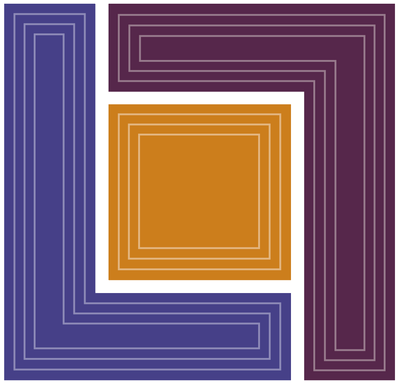{height="58px"}

[Jean Zay, IDRIS<br/>NVIDIA H100 GPUs]{style="font-size: 0.55em; line-height: 1.25; color: #2E2E2E;"}
:::

[We do this for each region]{.kw}

:::: {.grid .bare style="--cols: 300px 295px 1fr; grid-template-rows: repeat(3, 172px); --gap: 12px; --row-gap: 2px; --img-w: 290px; --cap-size: 0.55em; --cell-margin: 0; margin-top: 0.2em;"}
::: {.cell .fragment fragment-index=1}
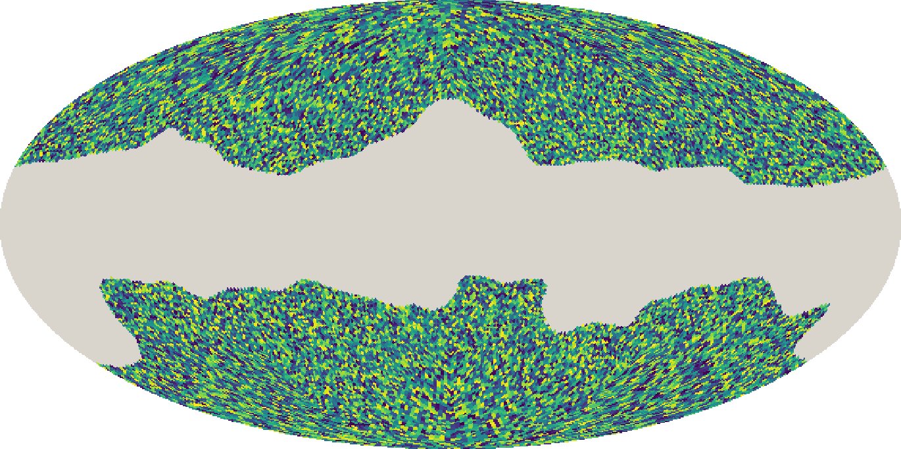

[$\beta_d$ patches]{.caption}
:::

::: {.fragment fragment-index=1}
{width="285px"}
:::

::: {.cell .fragment fragment-index=2}
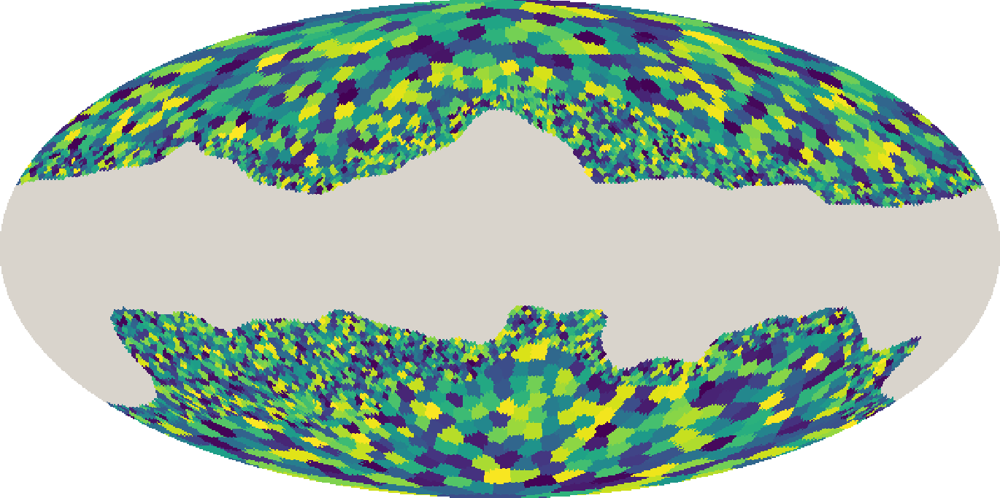

[$T_d$ patches]{.caption}
:::

::: {.fragment fragment-index=2}
{width="285px"}
:::

::: {.cell .fragment fragment-index=3}
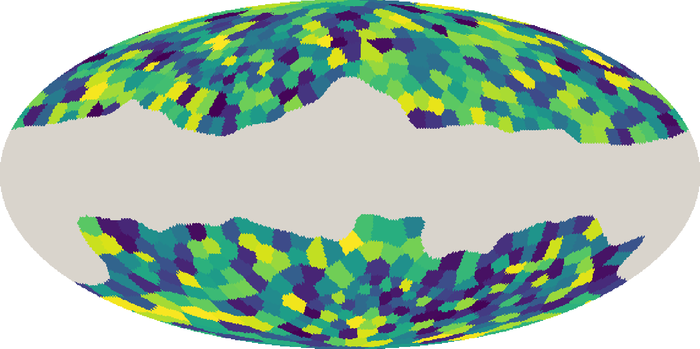

[$\beta_s$ patches]{.caption}
:::

::: {.fragment fragment-index=3}
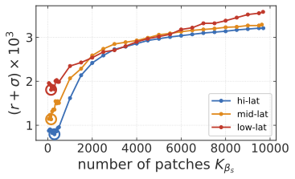{width="285px"}
:::

::: {.r-stack style="grid-column: 3; grid-row: 1 / 3;"}
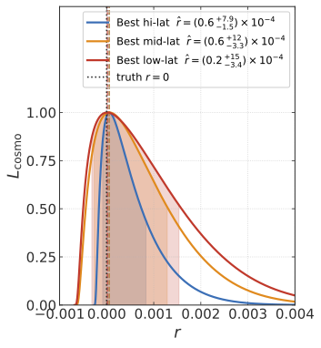{.fragment .fade-in-then-out fragment-index=4 width="380px"}

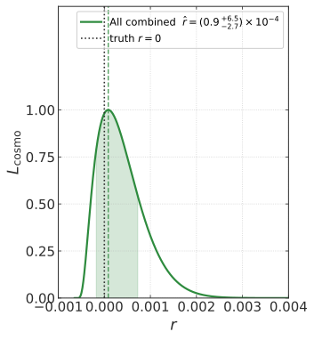{.fragment fragment-index=5 width="380px"}
:::

::: {.fragment fragment-index=5 style="grid-column: 3; grid-row: 3; align-self: end;"}
:::: {.solutionbox}
::: {.solutionbox-header style="font-size: 0.75em;"}
Run details
:::

::: {.solutionbox-body style="font-size: 0.72em;"}
Over [10 000]{.kw2} component separation runs on [64 NVIDIA H100 GPUs]{.kw}

Finishing in [10 hours]{.kw2}
:::
::::
:::
::::

## Results: comparison with multi-resolution

:::: {.columns style="display: flex; align-items: center;"}
::: {.column style="width: 46%;"}
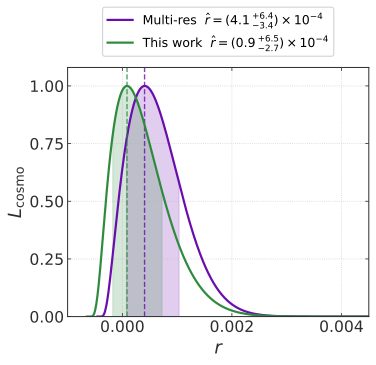{width="100%" style="margin: 0;"}
:::

::: {.column style="width: 54%;"}
::: {.bare style="margin: 0.5em 0 0.2em; font-size: 0.9em;"}
[multi-resolution]{.kw2} (LiteBIRD PTEP)
:::

:::: {.grid .bare style="--cols: 1fr 1fr 1fr; --gap: 8px; --row-gap: 8px; --cap-size: 0.62em; --cell-margin: 0;"}
::: {.cell}


[$\beta_d$]{.caption}
:::

::: {.cell}


[$T_d$]{.caption}
:::

::: {.cell}
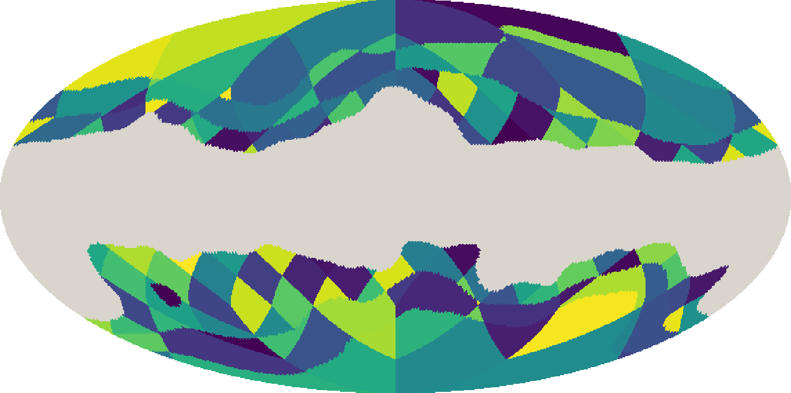

[$\beta_s$]{.caption}
:::
::::

::: {.bare style="margin: 0.5em 0 0.2em; font-size: 0.9em;"}
[spherical $K$-means]{.kw} (this work)
:::

:::: {.grid .bare style="--cols: 1fr 1fr 1fr; --gap: 8px; --row-gap: 8px; --cap-size: 0.62em; --cell-margin: 0;"}
::: {.cell}


[$\beta_d$]{.caption}
:::

::: {.cell}
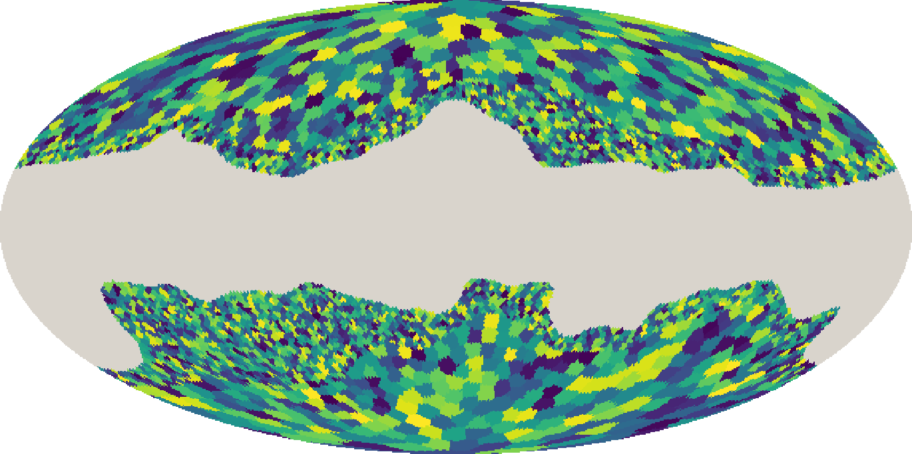

[$T_d$]{.caption}
:::

::: {.cell}
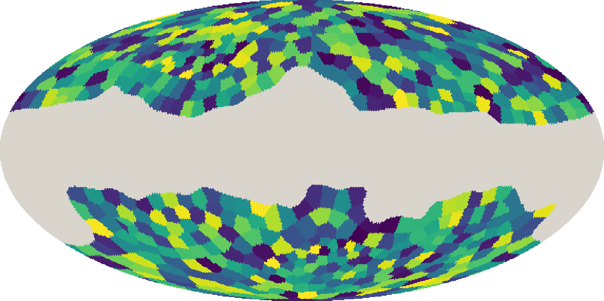

[$\beta_s$]{.caption}
:::
::::
:::
::::

:::: {.solutionbox}
::: {.solutionbox-body}
[30 % lower 68 % upper limit on $r$]{.kw}, with the same instrument, sky and noise: only the partition changes
:::
::::


## Contribution 1: conclusion {.frosted background-image="PhD/0_cover/bg_cmb.jpg" background-size="cover" background-opacity="0.15" hide-chrome="true"}

:::: {.solutionbox style="margin-top: 1.4em;"}
::: {.solutionbox-body}
- A [data-driven]{.kw} method to select the [optimal patch configuration]{.kw}, essential for [Stage IV full-sky surveys]{.kw2} like [LiteBIRD]{.kw}
- A [faster]{.kw}, more [robust]{.kw} parametric map-based component-separation code
- Contributed to the CMB data-analysis package [FURAX]{.kw} and its component-separation sub-package [furax-cs]{.kw}
:::
::::

[Kabalan et al. (2026), JAX-accelerated parametric CMB component separation, submitted to RASTI]{.selfcredit}

::::: {.fragment .frosted-panel style="margin-top: 1.4em; --panel-pad: 20px 30px;"}
:::: {.row .bare style="--gap: 32px; --align: center;"}
::: {style="flex: 1; font-size: 0.95em;"}
[Now part of the [Megatop]{.kw2} pipeline for the Simons Observatory]{style="display: block; margin-bottom: 0.6em;"}

[Perspectives]{.kw2 style="font-weight: 700;"}

- preparing its integration into the [LiteBIRD]{.kw} component-separation pipeline
- adding instrument systematics in [FURAX]{.kw}
:::

::: {style="flex: none; display: flex; flex-direction: column; align-items: center; gap: 18px;"}
{style="height: 54px; margin: 0;"}
{style="height: 84px; margin: 0;"}
{style="height: 76px; margin: 0;"}
:::
::::
:::::

# Contribution 2: field-level inference for weak lensing surveys

::: {.rail-stack style="width: 70%; margin-top: 0;"}
{.rail-full}

{.rail-focus}


:::

::: {style="display: flex; justify-content: center; align-items: center; gap: 36px; margin-top: 0.3em;"}
{style="height: 70px;"}
[](https://github.com/ASKabalan/jax-fli)
[](https://jax-fli.readthedocs.io/)
:::

## A weak-lensing forward model, end to end

{fig-align="center" width="74%"}

From a cosmology and an initial density field to [convergence and shear on the curved sky]{.kw}

## Building a survey-level differentiable forward model

:::: {.hl-host .bare style="margin-top: 0.1em;"}
{width="800px" style="display: block;"}

::: {.hlbox style="--x: 22%; --y: 5%; --w: 42%; --h: 42%;"}
:::
::::

::: {.fragment}
:::: {.solutionbox}
::: {.solutionbox-body}
A [fast]{.kw} and [differentiable]{.kw} gravity solver that can simulate [Stage IV survey volumes]{.kw}
:::
::::
:::

## The gravity solver: Lagrangian perturbation theory

<br/>
<br/>

::::: {.columns style="display: flex; align-items: flex-start; margin-top: 1.2em;"}
:::: {.column style="width: 42%;"}
[Each particle moves from its initial grid position $\mathbf{q}$]{style="font-size: 0.85em;"}

::: {.eqbox style="--eq-size: 0.72em; --eq-math-margin: 0.3em 0; --eq-pad: 0.2em 0.6em; width: fit-content; max-width: 100%; box-sizing: border-box; margin: 0.4em 0;"}
$$\mathbf{x}(\mathbf{q}, a) = \mathbf{q} + D_1(a)\,\mathbf{\Psi}^{(1)}(\mathbf{q}) + D_2(a)\,\mathbf{\Psi}^{(2)}(\mathbf{q}) + \dots$$
$$\nabla \cdot \mathbf{\Psi}^{(1)} = -\delta_\mathrm{ini}$$
:::

[First order: the Zel'dovich approximation.]{style="font-size: 0.8em; color: #6E6E6E;"}

::: {.fragment fragment-index=2}
:::: {.solutionbox style="margin-top: 0.9em;"}
::: {.solutionbox-body style="font-size: 0.8em;"}
- Perturbation theory does not capture the [non-linear]{.kw style="white-space: nowrap;"} growth of structure
- We need a [fast]{.kw} and [differentiable]{.kw} gravity solver that can model the [non-linear]{.kw style="white-space: nowrap;"} growth of structure
:::
::::
:::
::::

:::: {.column .fragment fragment-index=1 style="width: 58%;"}
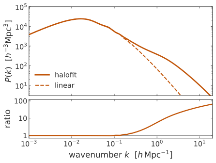{width="100%" style="margin: 0;"}

[Matter power spectrum at $z=0$, linear theory against halofit]{style="font-size: 0.6em; color: #6E6E6E;"}
::::
:::::

## The gravity solver: particle mesh

::: {style="display: flex; align-items: center; gap: 18px; margin-top: -0.2em;"}
{style="height: 40px; margin: 0;"}
[](https://github.com/DifferentiableUniverseInitiative/JaxPM)
:::

::: {.r-stack .bare style="margin-top: 0.3em;"}
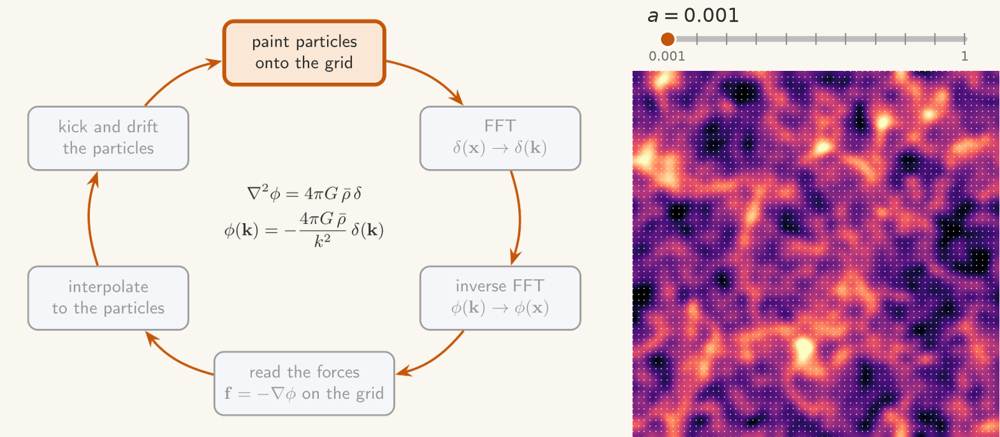{.fragment .fade-out fragment-index=1 style="width: 1000px;"}

{.fragment .fade-in-then-out fragment-index=1 style="width: 1000px;"}

{.fragment .fade-in-then-out fragment-index=2 style="width: 1000px;"}

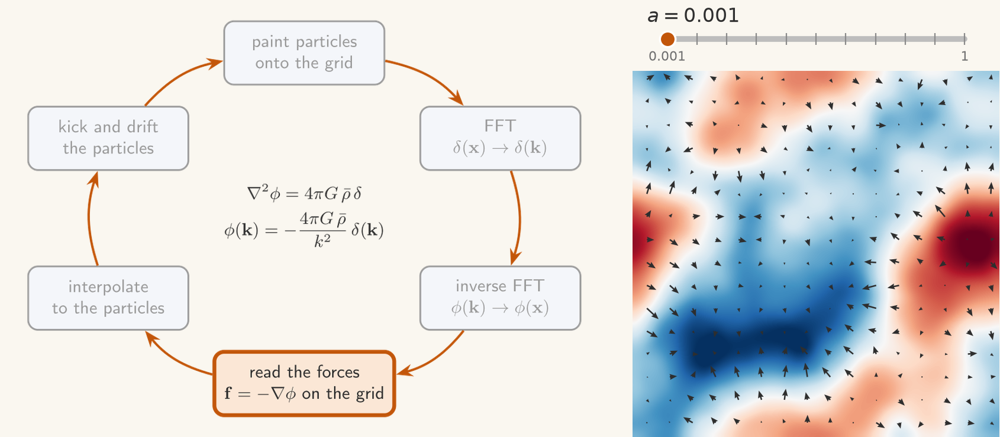{.fragment .fade-in-then-out fragment-index=3 style="width: 1000px;"}

{.fragment .fade-in-then-out fragment-index=4 style="width: 1000px;"}

{.fragment fragment-index=5 style="width: 1000px;"}

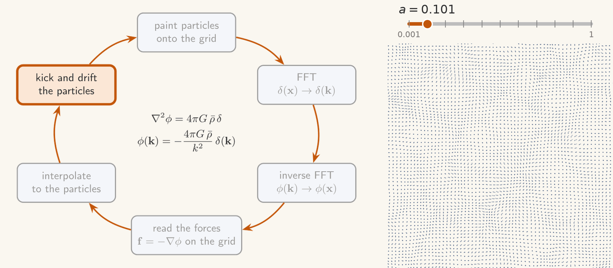{.fragment .screen-only fragment-index=6 style="width: 1000px;"}

{.print-only style="width: 1000px;"}
:::

Gravity through FFTs on a mesh: fast, differentiable, and [limited by the mesh resolution]{.kw}

## Accuracy of the particle mesh

::: {.r-stack}
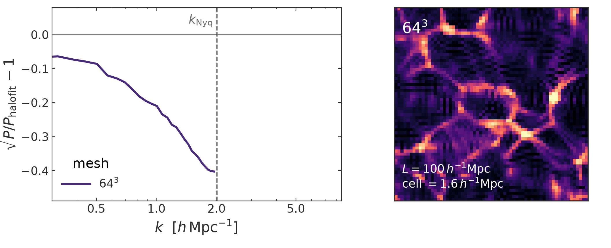{.fragment .fade-out fragment-index=1 width="1000px"}

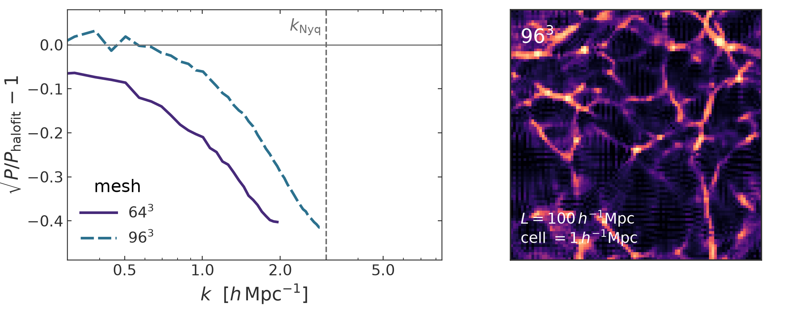{.fragment .fade-in-then-out fragment-index=1 width="1000px"}

{.fragment .fade-in-then-out fragment-index=2 width="1000px"}

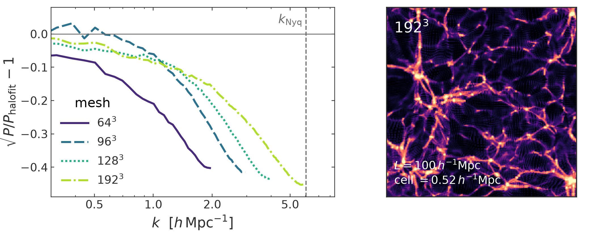{.fragment .fade-in-then-out fragment-index=3 width="1000px"}

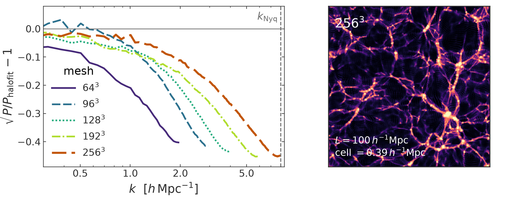{.fragment .fade-in fragment-index=4 width="1000px"}
:::

::: {.fragment}
:::: {.solutionbox}
::: {.solutionbox-body style="font-size: 0.85em;"}
- The accuracy of a particle-mesh simulation is limited by the [resolution of its mesh]{.kw}
- At survey volume, a mesh with that resolution [does not fit on one GPU]{.kw} (For $4096^3$ requires [1.6 TB]{.kw2} of memory).
- We need a [scalable]{.kw} gravity solver
:::
::::
:::

## Distributing the simulation

::: {style="display: flex; align-items: center; gap: 18px; margin-top: -0.2em;"}
{style="height: 40px; margin: 0;"}
[](https://github.com/DifferentiableUniverseInitiative/jaxDecomp)
[](https://jaxdecomp.readthedocs.io/)
:::

:::: {.columns style="display: flex; align-items: center; margin-top: 1em;"}
::: {.column width="44%"}
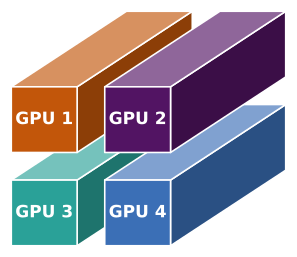{fig-align="center" width="95%" style="margin: 0;"}
:::

::: {.column width="56%"}
:::: {.solutionbox}
::: {.solutionbox-body}
- We split the box into [pencils]{.kw}, one per GPU
- [jaxDecomp]{.kw} implements a [differentiable]{.kw}, [distributed]{.kw} FFT for the particle-mesh solver
:::
::::
:::
::::

[Kabalan et al. (2026b), jaxDecomp: JAX library for 3D domain decomposition and parallel FFTs, accepted to JOSS]{.selfcredit style="--selfcredit-size: 0.9em;"}

## Building the observable

:::: {.hl-host .bare style="margin-top: 0.1em;"}
{width="800px" style="display: block;"}

::: {.hlbox .fragment .custom .hlbox-move fragment-index=1 style="--x: 22%; --y: 5%; --w: 42%; --h: 42%; --x2: 47%; --y2: 5%; --w2: 47%; --h2: 42%;"}
:::
::::

## Building the observable: requirements

::: {.r-stack style="margin-top: 0.1em;"}
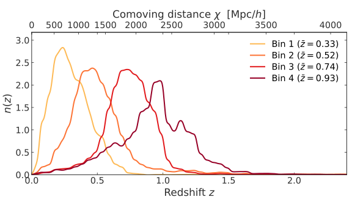{width="860px" style="display: block; margin: 0 auto;"}

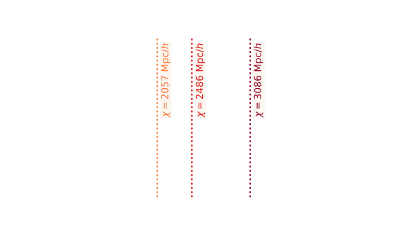{.fragment fragment-index=1 width="860px" style="display: block; margin: 0 auto;"}
:::

::::: {.fragment fragment-index=2}
:::: {.solutionbox style="margin-top: 0.3em;"}
::: {.solutionbox-header style="font-size: 0.8em;"}
Simulation-based inference on real survey data
:::

::: {.solutionbox-body style="font-size: 0.72em;"}
Applied on [DES Y3]{.kw}, Jeffrey et al. (2024): SBI on [real data]{.kw} using [Gower Street Similations]{.kw} and validated on [CosmoGridV1]{.kw}.\
:::
::::
:::::

## Painting on spherical shells {transition="slide-in none-out"}

:::: {.row .bare style="--gap: 1.2em; --justify: center; --align: center; margin-top: 110px;"}
::: {.cell style="width: 380px;"}
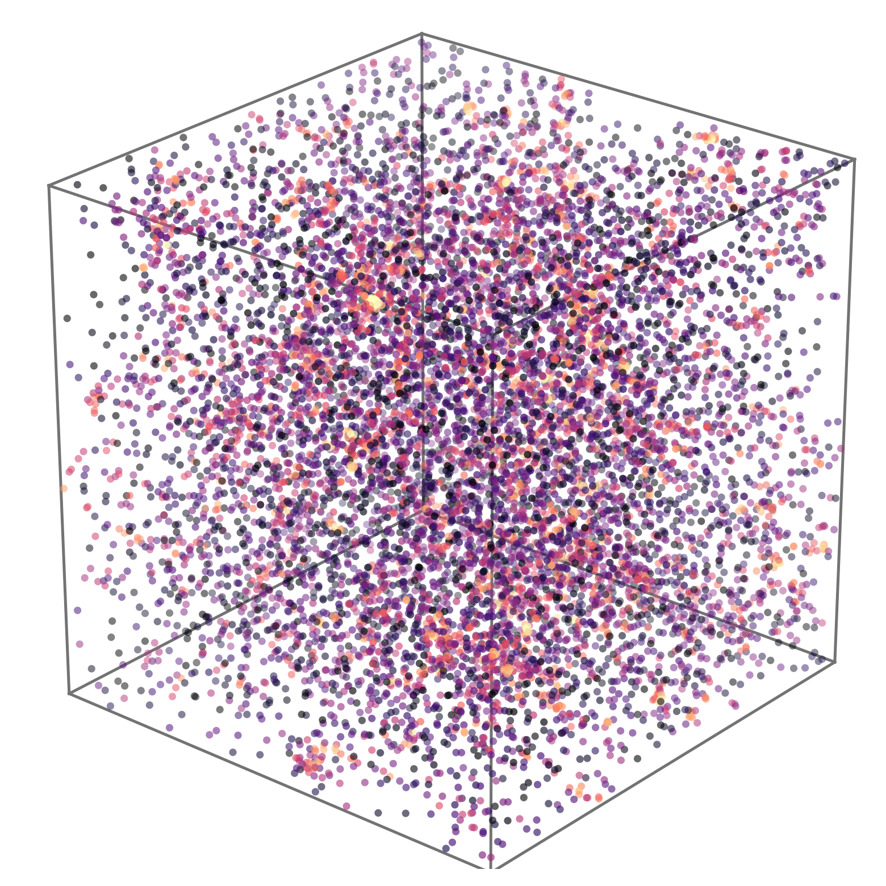

[evolved particles]{.caption style="--cap-size: 0.7em;"}
:::

[⟶]{style="font-size: 3.4em; color: #6E6E6E;"}

::: {.cell style="width: 480px;"}


[one HEALPix shell]{.caption style="--cap-size: 0.7em;"}
:::
::::

## Painting on spherical shells {visibility="uncounted" transition="none-in none-out"}

[](https://github.com/CMBSciPol/jax-healpy)

:::: {.columns}
::: {.column style="width: 50%; text-align: center;"}
#### [Bilinear interpolation]{.kw2} {style="margin: 0.2em 0;"}

<video src="PhD/5_contribution/fli/07_painting/bilinear.mp4" class="screen-only" data-autoplay loop muted playsinline preload="auto" style="width: 82%;"></video>

{.print-only width="82%"}

:::: {.solutionbox style="text-align: left;"}
::: {.solutionbox-body style="font-size: 0.72em;"}
Four pixels, weighted by the position between their centres: `get_interp_weights`, implemented in [jax-healpy]{.kw}
:::
::::
:::

::: {.column .fragment fragment-index=1 style="width: 50%; text-align: center;"}
#### [Radial basis function interpolation]{.kw} {style="margin: 0.2em 0;"}

::: {.r-stack}
<video src="PhD/5_contribution/fli/07_painting/rbf.mp4" class="fragment fade-out screen-only" data-fragment-index="2" loop muted playsinline preload="auto" style="width: 82%;"></video>

<video src="PhD/5_contribution/fli/07_painting/rbf_kernel.mp4" class="fragment screen-only" data-fragment-index="2" loop muted playsinline preload="auto" style="width: 82%;"></video>

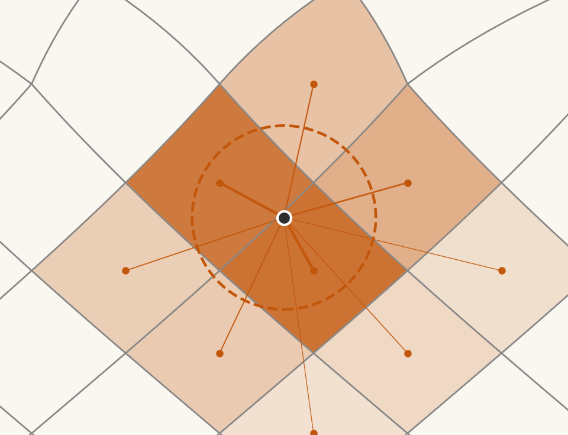{.print-only width="82%"}
:::

:::: {.solutionbox style="text-align: left;"}
::: {.solutionbox-body style="font-size: 0.72em;"}
The pixel and its eight neighbours (`get_all_neighbours`, implemented in [jax-healpy]{.kw}), weighted by a Gaussian kernel of adjustable width
:::
::::
:::
::::

## Creating the lightcone {transition="none-in slide-out"}


::: {style="text-align: center; margin-top: 0.2em;"}
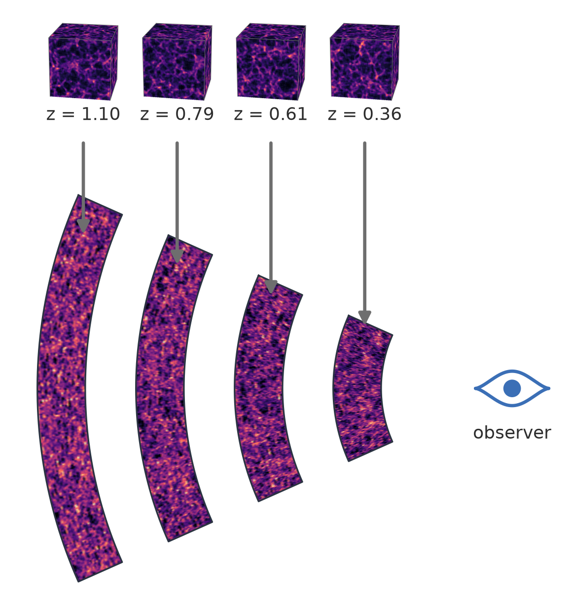{style="height: 530px;"}
:::

## Calibrating the lightcone model

:::: {.solutionbox style="position: relative; width: 82%; margin: 3.6em auto 0;"}
::: {.bare style="position: absolute; top: 0.6em; right: 0.8em;"}
[](https://jax-fli.readthedocs.io/)
:::

::: {.solutionbox-body style="font-size: 1.05em; line-height: 1.9; padding-top: 0.4em;"}
- The [integrator]{.kw} and [step size]{.kw}
- The [mesh resolution]{.kw}
- The [mass assignment]{.kw} and the spherical [painting]{.kw}
- The [number]{.kw} and [spacing]{.kw} of the density shells
- The [interpolation]{.kw} of the particles onto the [lightcone]{.kw}
- The [gradient]{.kw} ([adjoint]{.kw}) of the particle-mesh ODE
- The [performance]{.kw} of the forward model and its gradient
:::
::::

## Building the observable {#building-the-observable-lensing}

:::: {.hl-host .bare style="margin-top: 0.1em;"}
{width="800px" style="display: block;"}

::: {.hlbox .fragment .custom .hlbox-move fragment-index=1 style="--x: 47%; --y: 5%; --w: 47%; --h: 42%; --x2: 21%; --y2: 59%; --w2: 28%; --h2: 40%;"}
:::
::::

## From shells to convergence: the Born approximation


:::: {}
::: {.grid .bare style="--cols: 400px 1fr; --gap: 16px; margin-top: 0.3em;"}
::: {style="text-align: center;"}
[Born approximation: straight lines of sight]{.kw style="display: block; font-size: 0.72em; margin-bottom: 0.4em;"}

::: {.eqbox style="--eq-border: #25406b; --eq-size: 0.72em; --eq-math-margin: 0.3em 0; margin: 0 auto; width: fit-content;"}
$$\kappa(\hat{\mathbf n};\chi_s) = \frac{3}{2}\,\Omega_m\Big(\frac{H_0}{c}\Big)^2 \sum_j W_j(\chi_s)\,\delta_j(\hat{\mathbf n})$$

$$W_j(\chi_s) = \int_{\mathrm{shell}\ j} \mathrm{d}\chi\;\chi\,(1+z)\Big(1-\frac{\chi}{\chi_s}\Big)$$
:::
:::

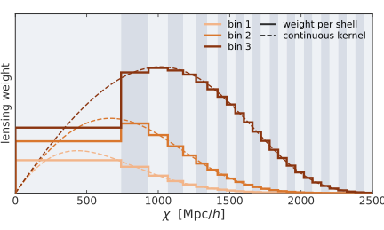{width="560px"}
:::
::::

:::: {.fragment fragment-index=1}
::: {.grid .bare style="--cols: 300px 1fr; --gap: 16px; margin-top: 0.4em;"}
::: {.eqbox style="--eq-border: #25406b; --eq-size: 0.72em; --eq-math-margin: 0.3em 0; margin: 0 auto; width: fit-content;"}
$$\kappa_i(\hat{\mathbf n}) = \int \mathrm{d}z\; n_i(z)\,\kappa\big(\hat{\mathbf n};\chi_s(z)\big)$$
:::

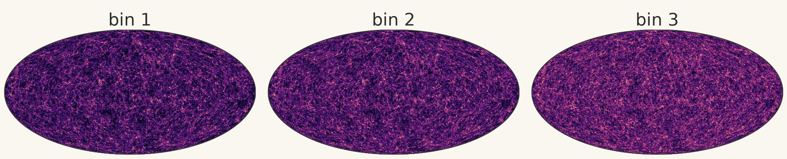{width="745px"}
:::
::::

::: {.fragment fragment-index=2}
:::: {.solutionbox style="margin-top: 0.3em;"}
::: {.solutionbox-body style="font-size: 0.72em;"}
The Born approximation computes the convergence along [undeflected light rays]{.kw}

Post-Born ray tracing computes deflection angle, but its correction to the convergence power spectrum is below the [arcminute]{.kw} scale.
:::
::::
:::

## Valid scales for real survey analysis

::: {.r-stack .bare style="margin-top: -0.2em;"}
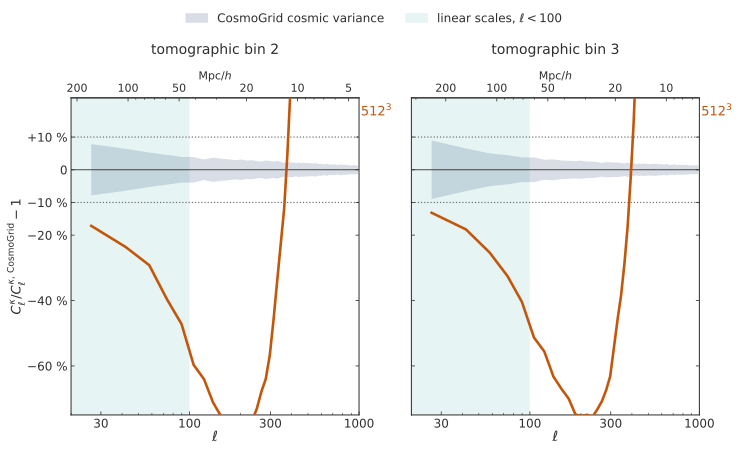{.fragment .fade-out fragment-index=1 width="990px"}

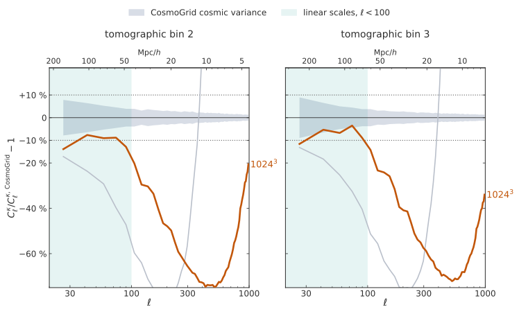{.fragment .fade-in-then-out fragment-index=1 width="990px"}

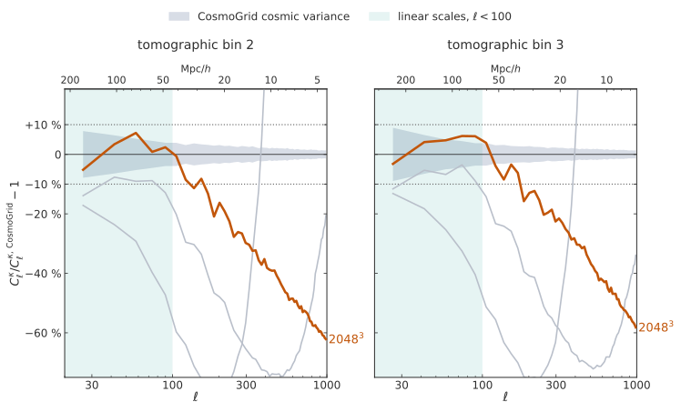{.fragment .fade-in-then-out fragment-index=2 width="990px"}

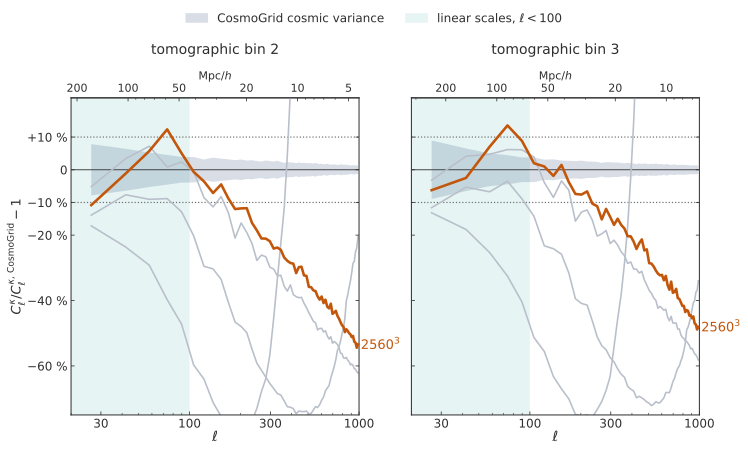{.fragment .fade-in-then-out fragment-index=3 width="990px"}

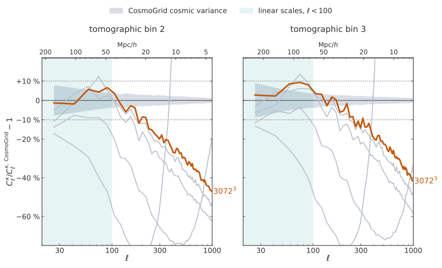{.fragment .fade-in-then-out fragment-index=4 width="990px"}

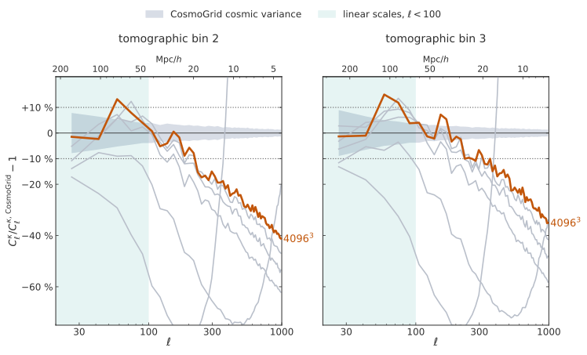{.fragment fragment-index=5 width="990px"}
:::

[Kabalan et al. (2026c), in prep. for JCAP]{.selfcredit style="margin-top: -0.2em;"}

# Using the forward model for field-level inference {.stack-top}

:::: {.hl-host .bare style="margin-top: 0.1em;"}
{width="800px" style="display: block;"}

::: {.hlbox .fragment .custom .hlbox-move fragment-index=1 style="--x: 21%; --y: 59%; --w: 28%; --h: 40%; --x2: 20.5%; --y2: 55%; --w2: 66%; --h2: 44.5%;"}
:::
::::

## Field-level likelihood

::: {style="text-align: center; margin-top: 1.2em;"}
[Gaussian likelihood on the convergence pixels]{.kw style="display: block; margin-bottom: 0.3em;"}

:::: {.eqbox style="--eq-border: #3b6fb6; --eq-size: 1.5em; --eq-math-margin: 0.25em 0; --eq-pad: 0.1em 1.3em; width: fit-content; margin: 0 auto;"}
$$-\ln\mathcal{L}(\boldsymbol\theta,\mathbf{s}) = \sum_i \frac{\lVert \color{#c2560a}{\hat{\mathbf{d}}_i} - \mathbf{d}_i \rVert_2^2}{2\,\color{#3b6fb6}{\sigma_i^2}}$$
::::

[$\color{#c2560a}{\hat{\mathbf{d}}_i} = \kappa_i(\mathbf{s},\boldsymbol\theta)$ the predicted and $\mathbf{d}_i$ the observed convergence map of bin $i$]{.caption style="--cap-size: 0.7em; margin-top: 0.4em;"}
:::

::::: {.row .bare .fragment fragment-index=1 style="--gap: 60px; --align: center; --justify: center; margin-top: 2.4em;"}
:::: {style="flex: none; text-align: center;"}
[Noise per pixel]{.kw style="display: block; margin-bottom: 0.3em;"}

::: {.eqbox style="--eq-border: #3b6fb6; --eq-size: 1.45em; --eq-math-margin: 0.2em 0; --eq-pad: 0.1em 1.1em; width: fit-content; margin: 0 auto;"}
$$\color{#3b6fb6}{\sigma_i} = \frac{\sigma_e}{\sqrt{n_{\mathrm{gal},i}\;\Omega_\mathrm{pix}}}$$
:::
::::

:::: {style="flex: none; width: 600px; text-align: center;"}
::: {.table-full style="font-size: 1.3em;"}
| DES Y3 | bin 1 | [bin 2]{.kw} | [bin 3]{.kw} | bin 4 |
|:--|:-:|:-:|:-:|:-:|
| $n_\mathrm{gal}$ [arcmin$^{-2}$] | 1.476 | 1.479 | 1.484 | 1.461 |
| $\sigma_e$ | 0.26 | 0.26 | 0.26 | 0.26 |
:::

[$\sigma_e$ shape noise per component, $n_{\mathrm{gal},i}$ galaxies per arcmin² in bin $i$,<br/>$\Omega_\mathrm{pix}$ pixel area in arcmin$^2$]{.caption style="--cap-size: 0.7em; margin-top: 0.5em;"}
::::
:::::

## Reconstructing the initial conditions

::: {.absolute top=-16 right=0 style="font-size: 0.55em; text-align: right; line-height: 1.3;"}
[Preliminary]{.kw}<br/>DES Y3 noise, $1200^3$ mesh, 2LPT<br/>$N_\mathrm{side} = 1024$, painted at $512$, $\ell \le 700$
:::

::: {.r-stack .bare style="margin-top: 0.1em;"}
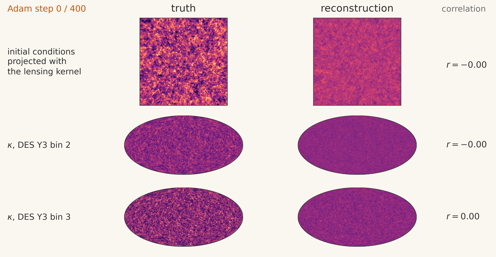{width="1000px"}

::: {.fragment fragment-index=1}
<video src="PhD/5_contribution/fli/11_map/map_run.mp4" class="screen-only" muted playsinline preload="auto" style="width: 1000px;"></video>

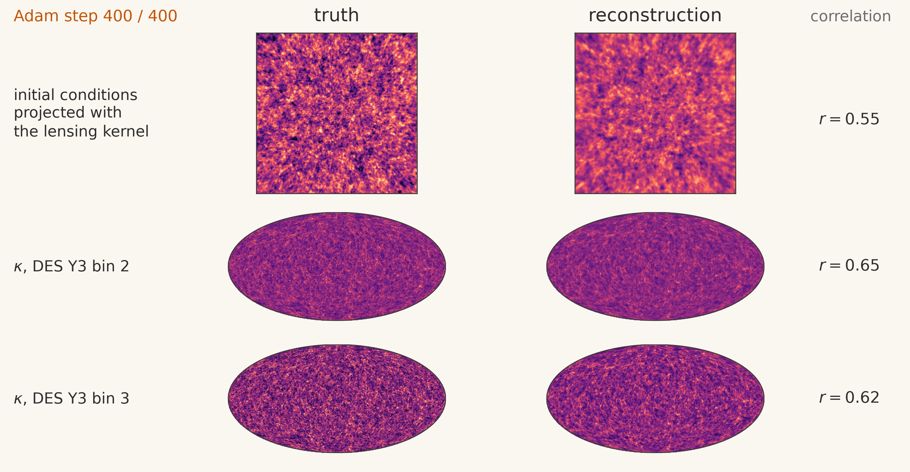{.print-only width="1000px"}
:::
:::


## Contribution 2: conclusion and perspectives {.frosted background-image="PhD/0_cover/bg_cosmic_web.jpg" background-size="cover" background-opacity="0.15" hide-chrome="true"}

:::: {.solutionbox}
::: {.solutionbox-body style="font-size: 0.9em;"}
- The first [fully differentiable]{.kw} forward model for [Stage IV weak-lensing surveys]{.kw2}
- A [massively distributed]{.kw} $N$-body solver, lightcone and lensing model
- One step closer to [field-level inference]{.kw} on [real survey data]{.kw}
:::
::::

[Kabalan et al. (2026b), jaxDecomp, accepted to JOSS · Kabalan et al. (2026c), in prep. for JCAP]{.selfcredit}

::::: {.fragment .frosted-panel style="margin-top: 0.6em; --panel-pad: 14px 22px;"}
:::: {.columns style="display: flex; align-items: center;"}
::: {.column style="width: 50%; font-size: 0.9em;"}
[Perspectives]{.kw2 style="font-weight: 700;"}

- [Jointly infer]{.kw} cosmology and initial conditions from [real survey data]{.kw}
- A better gravity solver: [learned force corrections]{.kw} or a differentiable [moving mesh]{.kw}
- [Intrinsic alignments]{.kw} and [photo-z errors]{.kw} as latent variables
:::

::: {.column style="width: 50%;"}
:::: {.figcadre}
::: {.figcadre-header}
Moving-mesh particle mesh
:::

::: {.figcadre-body style="text-align: center;"}
<video src="PhD/5_contribution/fli/12_conclusion/moving_mesh.mp4" class="screen-only" loop muted playsinline preload="auto" style="width: 100%; margin: 0;"></video>

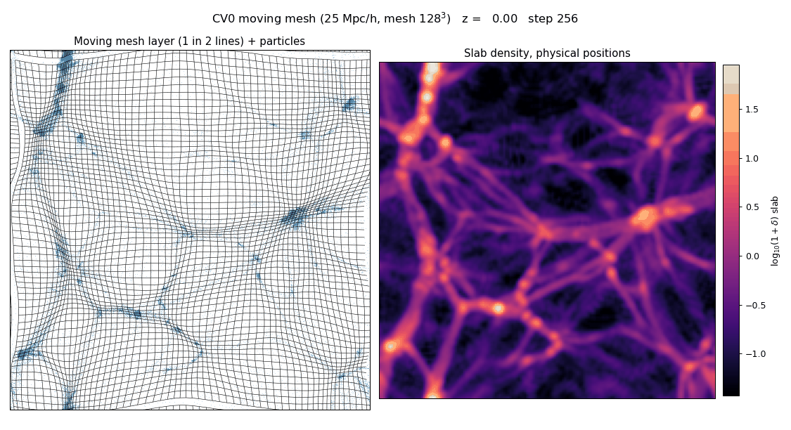{.print-only width="100%"}

[Moving mesh: B. Horowitz (2026), arXiv:2607.10983]{.credit}
:::
::::
:::
::::
:::::

# Conclusion and perspectives

::: {.rail-stack}
{.rail-full}

{.rail-focus}


:::

## The software behind this thesis

{fig-align="center" width="610px" style="margin: -0.3em auto -30px;"}

::: {style="display: flex; justify-content: center; flex-wrap: wrap; gap: 10px; margin-top: 0.1em;"}
[](https://github.com/CMBSciPol/furax-cs)
[](https://github.com/CMBSciPol/furax)
[](https://github.com/CMBSciPol/CADRE)
[](https://github.com/CMBSciPol/jax-healpy)
[](https://github.com/ASKabalan/jax-fli)
[](https://github.com/DifferentiableUniverseInitiative/jaxDecomp)
[](https://github.com/DifferentiableUniverseInitiative/JaxPM)
:::

::::: {.fragment fragment-index=1}
:::: {.solutionbox style="margin-top: 0.3em;"}
::: {.solutionbox-header style="font-size: 0.8em;"}
Reproducible software for research
:::

::: {.solutionbox-body style="font-size: 0.7em;"}
[Where it is used]{.kw2 style="display: block; font-weight: 700; margin-bottom: 0.3em;"}

:::: {.row .flat .bare style="--gap: 24px; --align: center;"}
::: {style="flex: 1;"}
[furax-cs]{.kw} → the Megatop pipeline for the Simons Observatory; LiteBIRD component separation next

[jax-healpy]{.kw} → used within the DESI collaboration

[jaxDecomp]{.kw} → beyond cosmology: fluid dynamics, ocean models, imaging
:::

::: {.row .flat .bare style="--gap: 14px; --align: center; flex: none;"}
{style="height: 26px;"}
{style="height: 40px;"}
{style="height: 36px;"}
:::
::::

[Scientific goal]{.kw2 style="font-weight: 700;"}: applications to [CMB × LSS]{.kw} with CMB lensing
:::
::::
:::::

## Conclusion {hide-chrome="true"}

{fig-align="center" width="52%" style="margin: 0 auto -0.4em;"}

:::: {.solutionbox style="width: 940px; margin: 0 auto;"}
::: {.solutionbox-header style="text-align: center;"}
Removing computational bottlenecks for Stage IV surveys
:::

::: {.solutionbox-body .grid style="--cols: 1fr 1fr; --gap: 1.6em; text-align: center;"}
[Early Universe · inflation]{.kw}<br/>Spatial variability for the CMB

[Late Universe · dark energy]{.kw}<br/>Explicit field-level inference for large-scale structure
:::
::::

<!-- on the click: the people and places of the PhD, over the slide below its title -->
:::::: {.fragment .bare fragment-index=1 style="position: absolute; top: 72px; left: 0; width: 1050px; height: 640px; box-sizing: border-box; z-index: 20; background: #faf7f0; display: flex; align-items: flex-start; justify-content: center;"}
::::: {.figcadre style="width: fit-content; margin: 0;"}
:::: {.figcadre-body .bare style="display: flex; flex-direction: column; align-items: center; gap: 10px; padding: 1em 0.9em 0.7em;"}
::: {.row .flat .bare style="--gap: 10px; --justify: center;"}
{style="height: 200px; width: auto; margin: 0; border-radius: 4px;"}
:::

::: {.row .flat .bare style="--gap: 10px; --justify: center;"}
{style="height: 160px; width: auto; margin: 0; border-radius: 4px;"}

{style="height: 160px; width: auto; margin: 0; border-radius: 4px;"}
:::

::: {.row .flat .bare style="--gap: 10px; --justify: center;"}
{style="height: 204px; width: auto; margin: 0; border-radius: 4px;"}
:::
::::
:::::
::::::

## {#thank-you background-video="PhD/0_cover/cmb_to_cosmicweb.mp4" background-video-loop="true" background-video-muted="true" background-size="cover" hide-chrome="true"}

::: {style="background: rgba(250, 247, 240, 0.86); backdrop-filter: blur(6px); -webkit-backdrop-filter: blur(6px); border-radius: 22px; padding: 30px 36px 34px; margin: 140px auto 0; width: 820px; box-shadow: 0 10px 40px rgba(0, 0, 0, 0.35); text-align: center;"}
[Thank you]{style="display: block; font-size: 2.2em; font-weight: 700; color: #2E2E2E;"}

::: {style="display: flex; justify-content: center; align-items: center; gap: 60px; margin-top: 1em;"}
{style="height: 100px; margin: 0; border-radius: 6px;"}
{style="height: 90px; margin: 0;"}
{style="height: 76px; margin: 0;"}
{style="height: 54px; margin: 0;"}
:::
:::

# Backup {visibility="uncounted" background-image="PhD/7_backup/backpack_dump.svg" background-size="auto 86%" background-position="76% center" background-color="#faf7f0"}

# Backup: General {visibility="uncounted"}

## Why not simply the maximum a posteriori? {visibility="uncounted"}

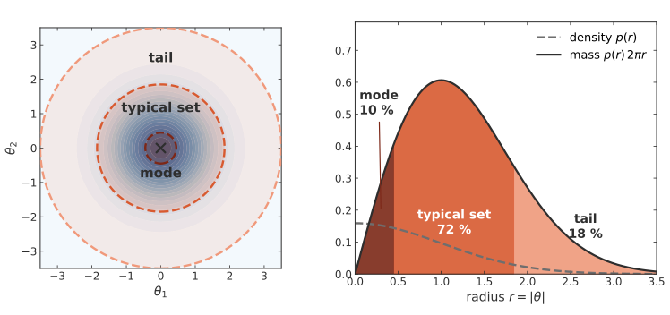{fig-align="center" width="1000px" style="margin-top: 0.4em;"}

# Backup: CMB {visibility="uncounted"}

## Spherical Harmonic Transforms {#sht visibility="uncounted"}


:::: {.grid style="--cols: 1fr 190px 1fr 190px 1fr; --gap: 0; width: 96%; margin: 0 auto; --align: stretch; margin-bottom: 0.2em;"}
::: {.eqbox style="--eq-border: #25406b; --eq-math-margin: 0.35em 0; grid-column: 2;"}
$$
f(\theta,\varphi) = \sum_{\ell=0}^{\infty} \sum_{m=-\ell}^{\ell} a_{\ell m}\, Y_\ell^m(\theta,\varphi)
$$
:::

::: {.eqbox style="--eq-border: #25406b; --eq-math-margin: 0.35em 0; grid-column: 4;"}
$$
C_\ell = \frac{1}{2\ell+1} \sum_{m=-\ell}^{\ell} |a_{\ell m}|^2
$$
:::
::::

:::: {.grid style="--cols: 1fr 190px 1fr 190px 1fr; --gap: 0; width: 96%; margin: 0 auto; --row-gap: 0.2em; --img-w: auto; --img-h: 136px; --img-max-w: 100%; --img-max-h: 95%; --cap-size: 1em; --cap-lh: 1.1;"}
::: {.cell}
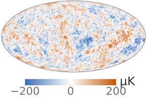
[*I*]{.caption}

:::

::: {.bare style="position: relative;"}
{width="110px" style="display: block; margin: 0 auto;"}

[spin-0]{style="position: absolute; left: 50%; top: 50%; transform: translate(-50%, 85%); font-size: 0.78em; font-weight: 600; color: #6E6E6E; white-space: nowrap;"}
:::

::: {.cell}
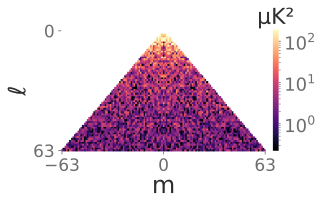
[$|a^T_{\ell m}|^2$]{.caption}

:::

::: {.bare}
{width="110px" style="display: block; margin: 0 auto;"}
:::

::: {.cell}

:::

::: {.cell}

[*Q*]{.caption}

:::

::: {.bare style="grid-column: 2; grid-row: 2 / span 2; display: flex; align-items: center; justify-content: center; position: relative;"}
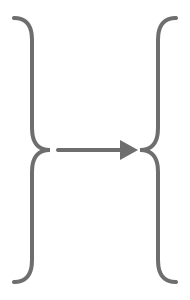{style="display: block; width: 150px; height: 92%; margin: 0;"}

[spin-2]{style="position: absolute; left: 50%; top: 50%; transform: translate(-50%, -120%); font-size: 0.78em; font-weight: 600; color: #6E6E6E; white-space: nowrap;"}
:::

::: {.cell}
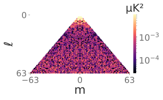
[$|a^E_{\ell m}|^2$]{.caption}

:::

::: {.bare}
{width="110px" style="display: block; margin: 0 auto;"}
:::

::: {.cell}
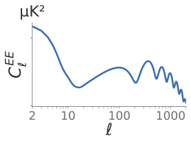
:::

::: {.cell}
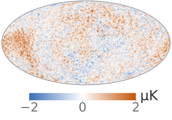
[*U*]{.caption}

:::


::: {.cell}
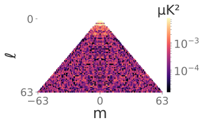
[$|a^B_{\ell m}|^2$]{.caption}

:::

::: {.bare}
{width="110px" style="display: block; margin: 0 auto;"}
:::

::: {.cell}
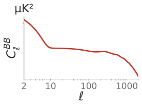
:::
::::

[Credit: ESA / Planck Collaboration · Planck 2018 SMICA maps (inpainted), $I$, $Q$, $U$]{.credit style="margin-top: -0.2em;"}

## AdaTopK: handling parameter bounds {visibility="uncounted"}

<video src="PhD/7_backup/2_cmb/02_adatopk/adatopk.mp4" class="screen-only" data-autoplay muted playsinline preload="auto" style="display: block; width: 1000px; margin: 0.2em auto 0;"></video>

{.print-only fig-align="center" width="1000px"}

## Patch selection on skies with $r \neq 0$ {visibility="uncounted"}

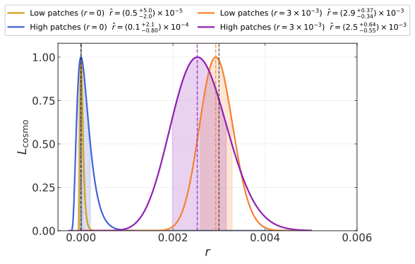{fig-align="center" height="560px"}

# Backup: Weak lensing {visibility="uncounted"}

## From galaxy shapes to shear {visibility="uncounted"}

:::: {.columns style="display: flex; align-items: center; margin-top: 0.6em;"}
::: {.column width="40%"}
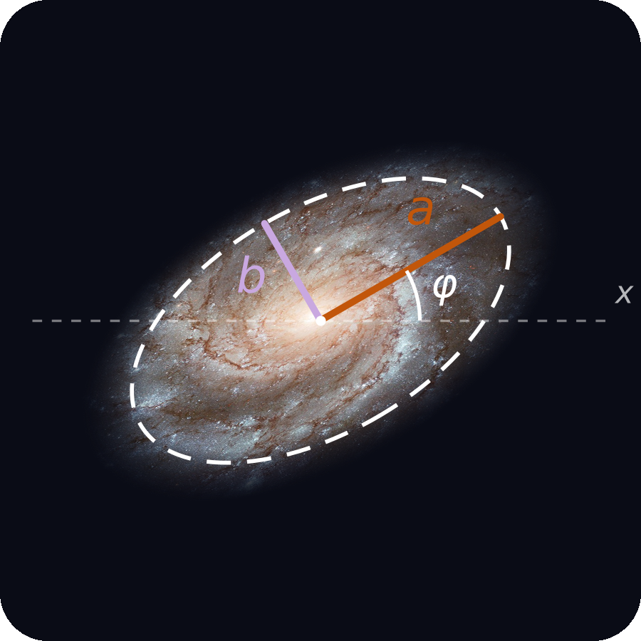{fig-align="center" width="92%" style="margin: 0;"}

[M101: NASA / ESA / Hubble (STScI-PRC2006-10a)]{.credit}
:::

::: {.column width="58%"}
::: {.eqbox style="--eq-border: #2aa198; --eq-size: 1em; --eq-math-margin: 0.2em 0; --eq-pad: 0.15em 1em; width: fit-content; margin: 0 auto; text-align: center;"}
[ellipticity]{.kw style="display: block; font-size: 0.75em;"}
$$e = e_1 + i\,e_2 = \frac{a-b}{a+b}\,e^{2i\varphi}$$
:::

::: {.eqbox style="--eq-border: #2aa198; --eq-size: 1em; --eq-math-margin: 0.2em 0; --eq-pad: 0.15em 1em; width: fit-content; margin: 0.6em auto 0; text-align: center;"}
[shear in a pixel]{.kw style="display: block; font-size: 0.75em;"}
$$\hat\gamma_1 = \frac{\sum_k w_k\,e_{1,k}}{\sum_k w_k}, \qquad \hat\gamma_2 = \frac{\sum_k w_k\,e_{2,k}}{\sum_k w_k}$$
:::
:::
::::

## Kaiser–Squires on the sphere {visibility="uncounted"}

:::: {.columns}
::: {.column style="width: 45%; padding-top: 1em;"}
[From $\kappa$ to $\gamma$]{.kw}

::: {.eqbox style="--eq-border: #2aa198; --eq-size: 0.8em; --eq-math-margin: 0.3em 0;"}
$$
\gamma^E_{\ell m} = -\sqrt{\frac{(\ell+2)(\ell-1)}{\ell(\ell+1)}}\;\kappa_{\ell m}, \qquad \gamma^B_{\ell m} = 0
$$
$$
\gamma_1 + i\gamma_2 = \sum_{\ell m} \gamma^E_{\ell m}\;{}_2Y_{\ell m}
$$
:::

::: {.fragment fragment-index=1}
[From $\gamma$ back to $\kappa$]{.kw}

::: {.eqbox style="--eq-border: #2aa198; --eq-size: 0.8em; --eq-math-margin: 0.3em 0;"}
$$
\kappa_{\ell m} = -\sqrt{\frac{\ell(\ell+1)}{(\ell+2)(\ell-1)}}\;\gamma^E_{\ell m}
$$
:::
:::
:::

::: {.column width="55%"}
:::: {.cell .bare style="--img-w: 200px; --cap-size: 0.6em; --cell-margin: 0.1em 0 0;"}
{.screen-only}
{.print-only}

[convergence κ]{.caption}
::::

::: {style="text-align: center; margin: 0.1em 0; line-height: 0;"}
[]{.arrow .down style="--len: 34px; --head: 20px;"}
:::

:::: {.row .bare style="--gap: 24px; --justify: center; --img-w: 175px; --cap-size: 0.6em; --cell-margin: 0.1em 0 0;"}
::: {.cell}
{.screen-only}
{.print-only}

[shear γ~1~]{.caption}
:::

::: {.cell}
{.screen-only}
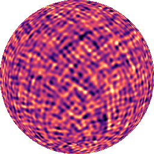{.print-only}

[shear γ~2~]{.caption}
:::
::::
:::
::::

:::: {.solutionbox}
::: {.solutionbox-body style="font-size: 0.75em;"}
- Kaiser–Squires is a [simple per-$\ell$ rescaling]{.kw} between $\kappa$ and the $E$-mode of the shear

:::
::::

## Linear theory against halofit: lensing $C_\ell$ {visibility="uncounted"}

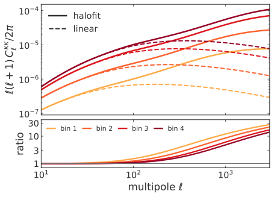{fig-align="center" height="560px" style="margin-top: 0.4em;"}

## A survey mask leaks {visibility="uncounted"}

{fig-align="center" width="900px"}

{fig-align="center" width="760px"}

# Backup: Field level {visibility="uncounted"}

## Integrators and time steps {visibility="uncounted"}

{fig-align="center" width="1000px"}

## Observer positioning {visibility="uncounted"}

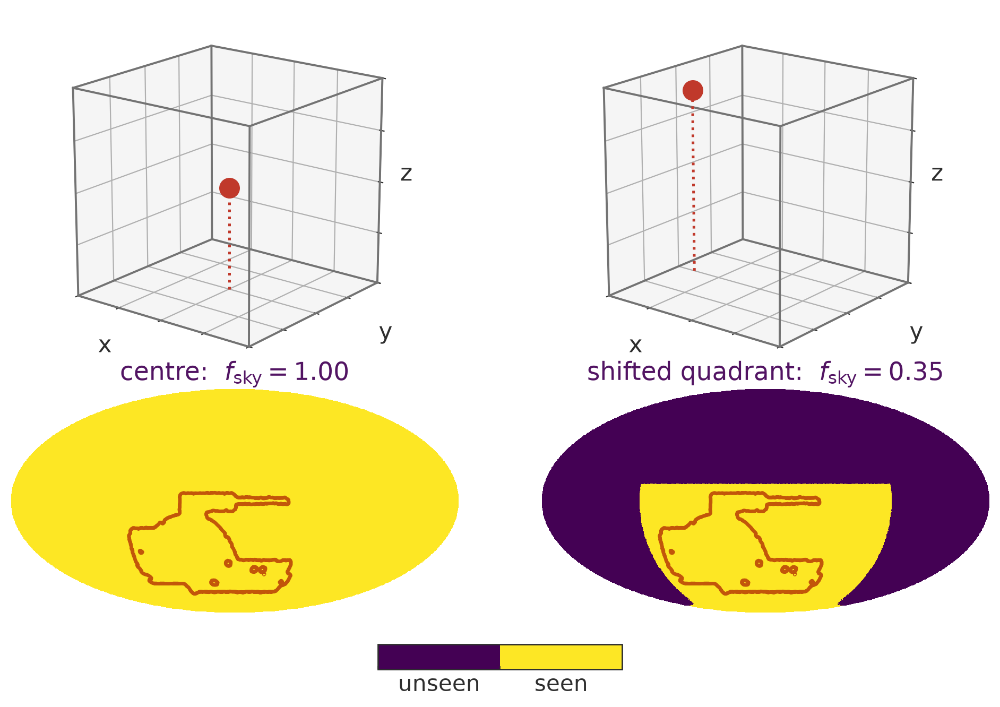{fig-align="center" width="900px" style="margin-top: 0;"}

## Shell spacing and the lightcone {visibility="uncounted"}

{fig-align="center" width="1000px"}

## Shell spacing: convergence against CosmoGrid {visibility="uncounted"}

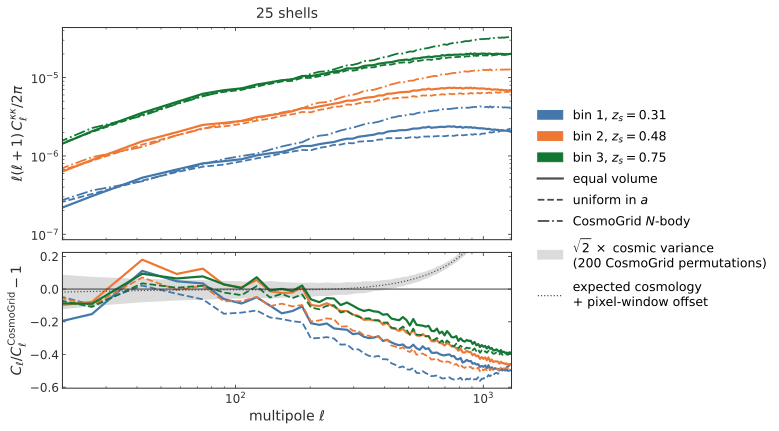{fig-align="center" width="1000px" style="margin-top: 0.4em;"}

## Uniform scale factor against equal volume {visibility="uncounted"}

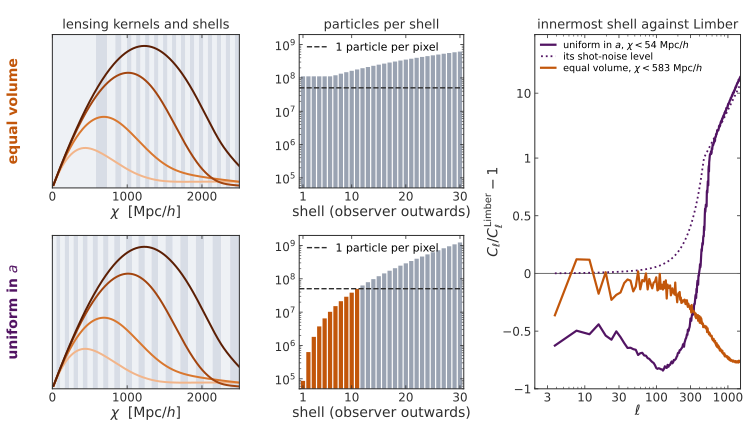{fig-align="center" width="1000px" style="margin-top: 0.2em;"}

## Drift on the lightcone {visibility="uncounted"}

:::: {.row .bare style="--gap: 14px; --justify: center; --align: flex-end; margin-top: 0.3em;"}
::: {style="width: 285px; flex: none; text-align: center;"}
[10 shells, one redshift per shell]{.kw style="display: block; font-size: 0.6em;"}

{width="285px" style="margin: 0;"}
:::

::: {style="width: 285px; flex: none; text-align: center;"}
[10 shells, drifted]{.kw style="display: block; font-size: 0.6em;"}

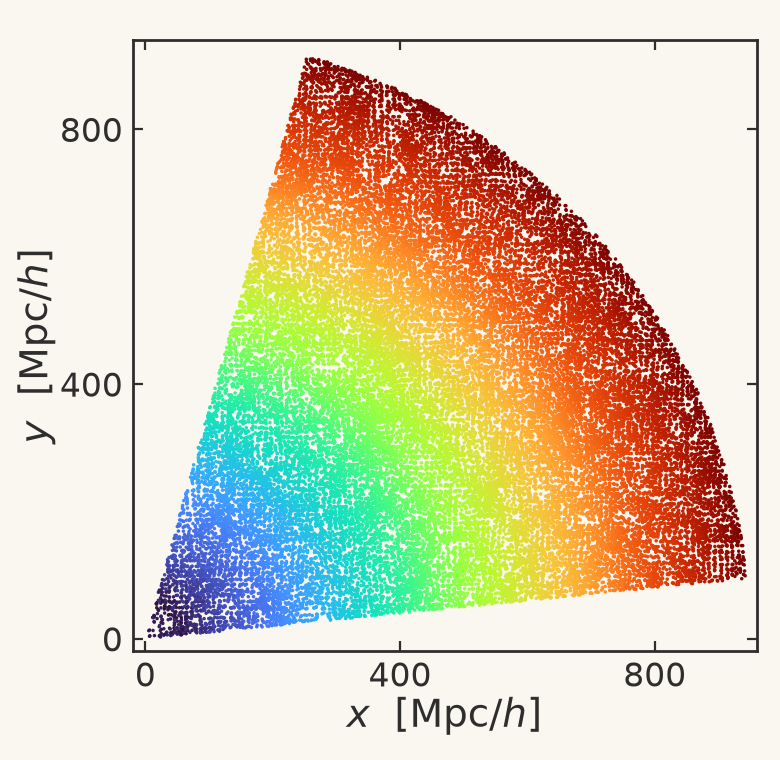{width="285px" style="margin: 0;"}
:::

::: {style="width: 285px; flex: none; text-align: center;"}
[40 shells, one redshift per shell]{.kw style="display: block; font-size: 0.6em;"}

{width="285px" style="margin: 0;"}
:::

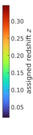{style="height: 260px; flex: none; margin: 0 0 6px;"}
::::

:::: {style="text-align: center; margin-top: 0.3em;"}
::: {.eqbox style="--eq-border: #25406b; --eq-size: 0.9em; --eq-math-margin: 0.2em 0; margin: 0 auto; width: fit-content;"}
$$a_{\mathrm{c}} = a\big(\chi = \lVert \mathbf{x} - \mathbf{x}_{\mathrm{obs}} \rVert\big), \qquad \mathbf{x}(a_{\mathrm{c}}) = \mathbf{x}(a_i) + \boldsymbol{\pi}\,\big[D(a_{\mathrm{c}}) - D(a_i)\big]$$
:::

[$a_i$: scale factor of the shell, $a_{\mathrm{c}}$: scale factor at which the particle crosses the lightcone, $\boldsymbol{\pi} = \mathrm{d}\mathbf{x}/\mathrm{d}D$: BullFrog momentum]{.caption style="--cap-size: 0.6em; margin-top: 0.3em;"}
::::

:::: {.solutionbox style="margin-top: 0.3em;"}
::: {.solutionbox-header style="font-size: 0.8em;"}
Interpolating the particles onto the observer's lightcone
:::

::: {.solutionbox-body style="font-size: 0.8em;"}
Each particle is drifted to the scale factor at which it [crosses the lightcone]{.kw}
:::
::::

## Impact of the drift on the first shell {visibility="uncounted"}

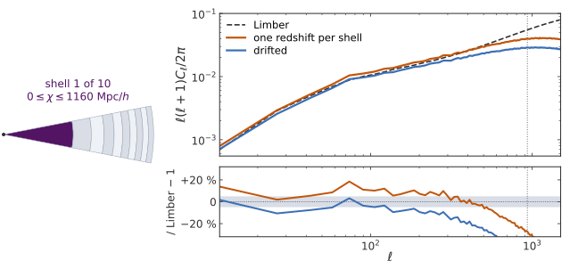{fig-align="center" width="900px" style="margin-top: 0.3em;"}

:::: {.solutionbox style="margin-top: 0.3em;"}
::: {.solutionbox-body style="font-size: 0.85em;"}
Removes the [single-redshift bias]{.kw} of wide shells: [17 %]{.kw2} on the first equal-volume shell
:::
::::

## Painting: RBF against nearest grid point {visibility="uncounted"}

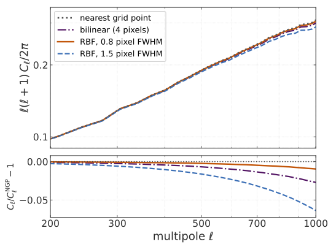{fig-align="center" height="560px" style="margin-top: 0.4em;"}

## Valid scales: finer bandpowers {visibility="uncounted"}

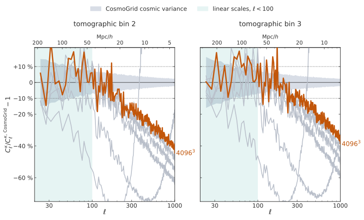{fig-align="center" width="990px" style="margin-top: -0.2em;"}

## Mesh plateau: density shells {visibility="uncounted"}

{fig-align="center" width="1000px" style="margin-top: 0.6em;"}

## Mesh plateau: convergence {visibility="uncounted"}

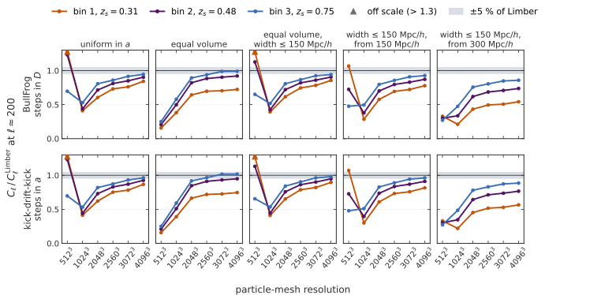{fig-align="center" width="1000px" style="margin-top: 0.6em;"}

## The ghost zone {visibility="uncounted"}

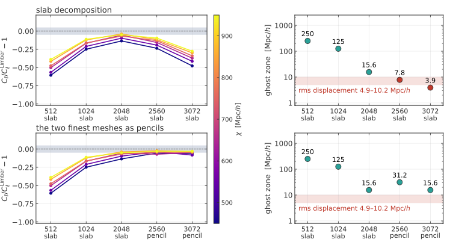{fig-align="center" width="1000px"}

## The two adjoints {visibility="uncounted"}

::: {.row .bare style="--gap: 40px; --justify: center; margin-top: 0.3em;"}
{height="540px"}

{height="500px"}
:::

## Scaling on supercomputers {visibility="uncounted"}

::: {.absolute .bare top=-12 right=0 style="display: flex; align-items: center; gap: 10px;"}
{height="58px"}

[Jean Zay, IDRIS<br/>NVIDIA H100 GPUs]{style="font-size: 0.55em; line-height: 1.25; color: #2E2E2E;"}
:::

::: {.bare style="text-align: center; margin-top: 0.15em;"}
[Performance of the forward model]{.kw style="display: block; font-size: 0.75em; text-align: left;"}

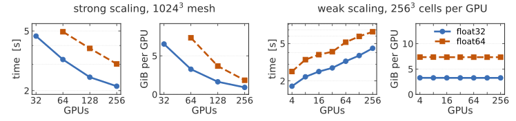{width="1000px"}
:::

::: {.bare style="text-align: center; margin-top: 0.15em;"}
[Performance of the gradient]{.kw style="display: block; font-size: 0.75em; text-align: left;"}

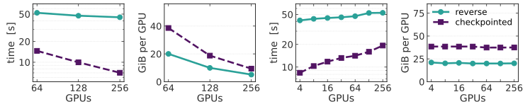{width="1000px"}
:::

## Distributed Fourier transform {visibility="uncounted"}

{fig-align="center" height="540px" style="margin-top: 0.4em;"}

## Distributed transpositions {visibility="uncounted"}

{fig-align="center" height="540px" style="margin-top: 0.4em;"}

## Halo exchange {visibility="uncounted"}

<video src="PhD/7_backup/4_fieldlevel/15_halo_exchange/halo_exchange.mp4" class="screen-only" data-autoplay loop muted playsinline preload="auto" style="display: block; width: 1000px; max-width: none; margin: 4.5em auto 0;"></video>

{.print-only fig-align="center" width="1000px" style="margin-top: 4.5em;"}

## Scale cuts and baryons {visibility="uncounted"}

::: {.grid .bare style="--cols: 230px 62px 180px 62px 180px 62px 230px; --gap: 0; --align: center; margin-top: 0.3em;"}
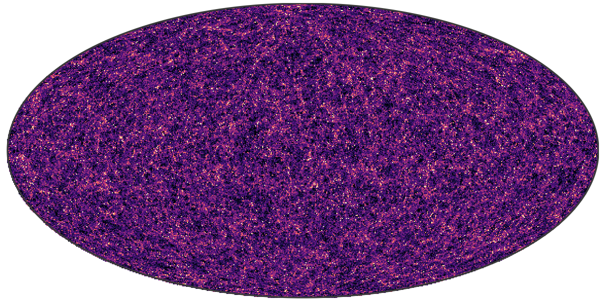{width="230px"}

::: {style="text-align: center;"}
[map2alm]{.kw style="display: block; font-size: 0.75em;"}

{width="64px" style="display: block; margin: 0 auto;"}
:::

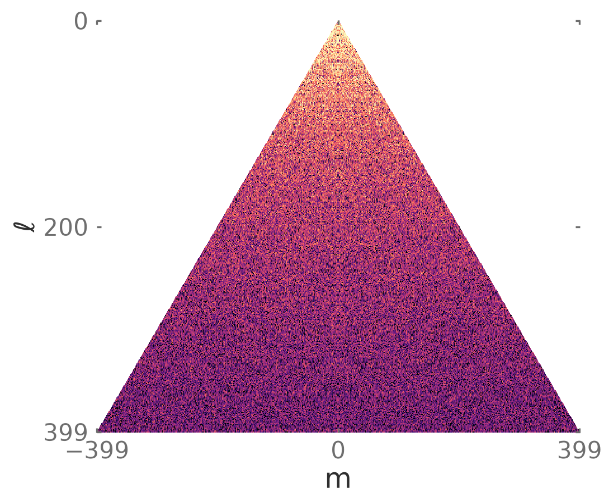{width="180px"}

::: {style="text-align: center;"}
[× $T_\ell$]{.kw style="display: block; font-size: 0.75em;"}

{width="64px" style="display: block; margin: 0 auto;"}
:::

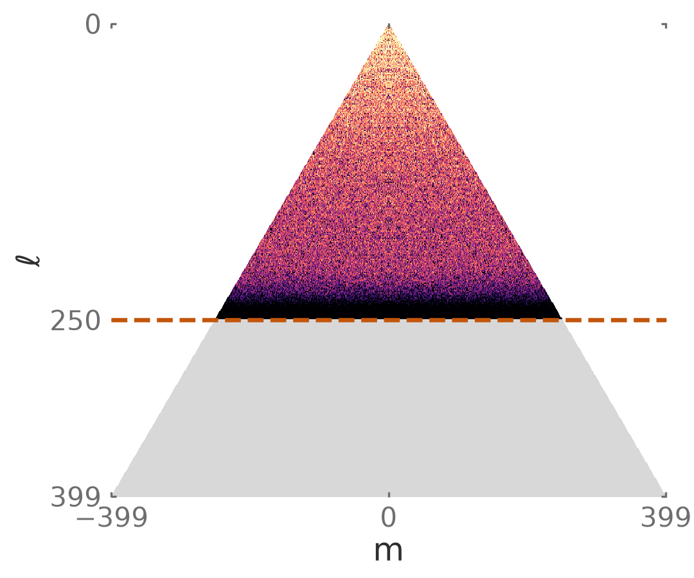{width="180px"}

::: {style="text-align: center;"}
[alm2map]{.kw style="display: block; font-size: 0.75em;"}

{width="64px" style="display: block; margin: 0 auto;"}
:::

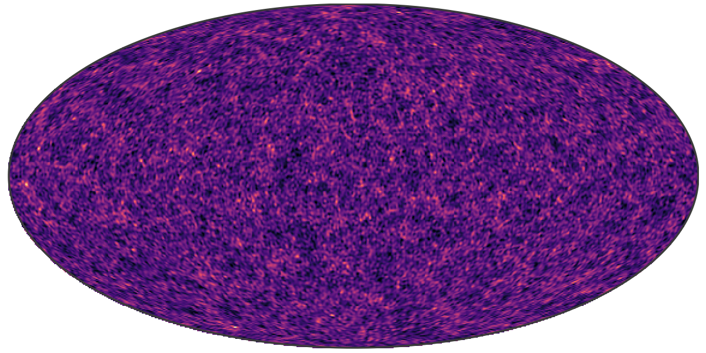{width="230px"}
:::

::: {.grid .bare style="--cols: 430px 1fr; --gap: 20px; --align: center; margin-top: 0.4em;"}
::: {.eqbox style="--eq-border: #25406b; --eq-size: 0.68em; --eq-math-margin: 0.3em 0; margin: 0 auto; width: fit-content;"}
$$T_\ell = \begin{cases} 1, & \ell \le \ell_\mathrm{cut} - \ell_\mathrm{width} \\ \tfrac12\left(1 + \cos \pi x\right), & \ell_\mathrm{cut} - \ell_\mathrm{width} < \ell < \ell_\mathrm{cut} \\ 0, & \ell \ge \ell_\mathrm{cut} \end{cases}$$

$$x = \frac{\ell - (\ell_\mathrm{cut} - \ell_\mathrm{width})}{\ell_\mathrm{width}}$$
:::

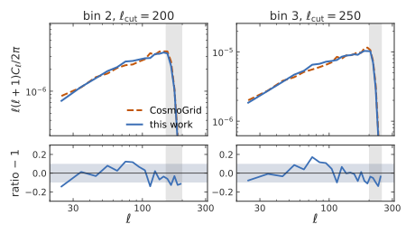{width="560px"}
:::

[Tersenov, Guerrini, Starck & Kilbinger (2026), arXiv:2609.09131]{.credit style="margin-top: 0.6em;"}

## Higher-order statistics: the starlet $\ell_1$ norm {visibility="uncounted"}

::: {.row .flat .bare style="--gap: 24px; --justify: center; --align: center; margin-top: 0.6em;"}
{style="width: 620px; flex: none;"}

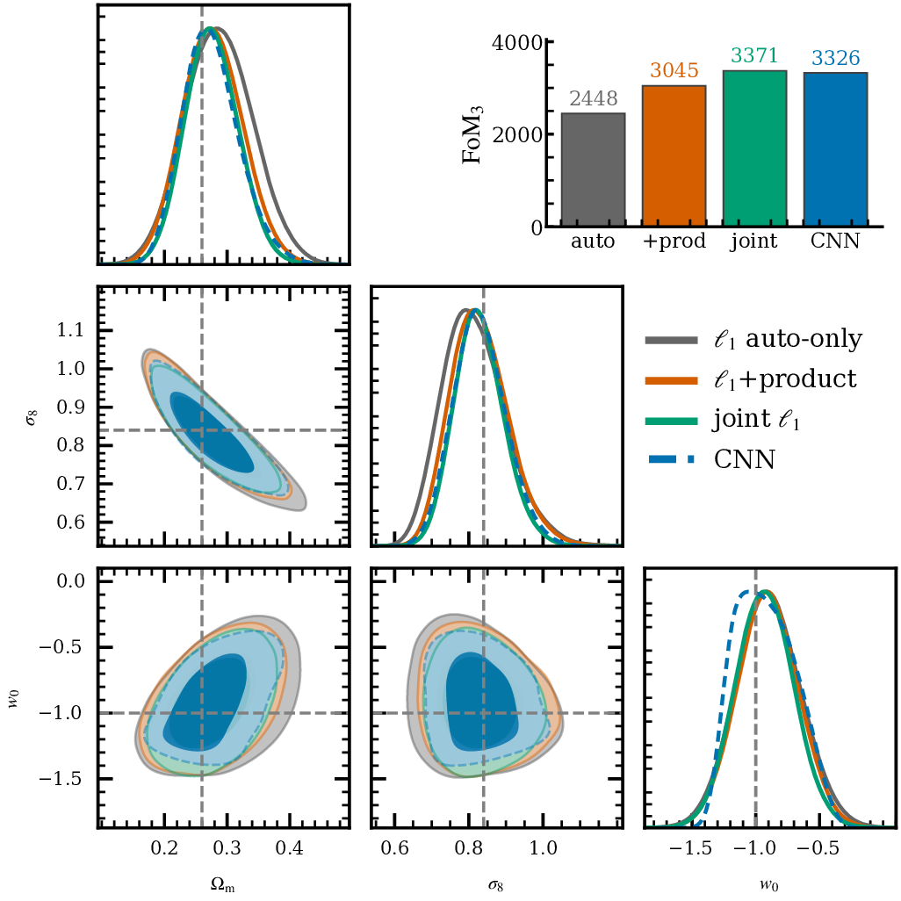{style="width: 400px; flex: none;"}
:::

[Ajani et al. (2021), arXiv:2101.01542; Tersenov et al. (2026), in prep.]{.credit style="margin-top: 0.6em;"}

## Starlet $\ell_1$ norm against CosmoGrid {visibility="uncounted"}

{fig-align="center" width="1000px" style="margin-top: 0.4em;"}

## MAP: power spectra of the reconstruction {visibility="uncounted"}

<video src="PhD/7_backup/4_fieldlevel/18_map_spectra/spectra_run.mp4" class="screen-only" data-autoplay muted playsinline preload="auto" style="display: block; width: 1000px; margin: 0.4em auto 0;"></video>

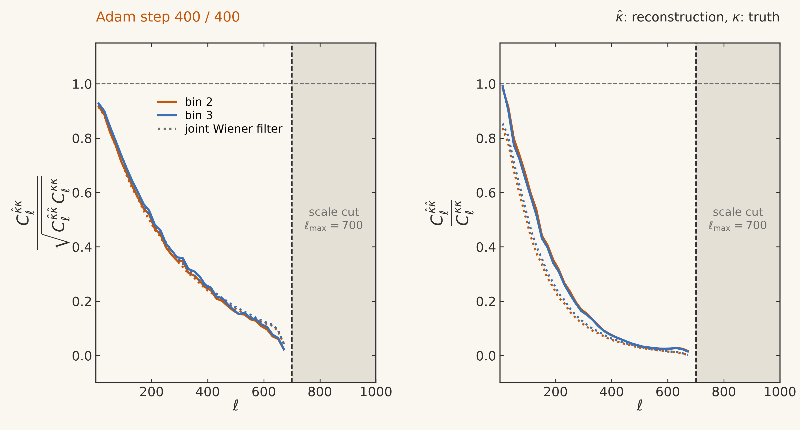{.print-only fig-align="center" width="1000px"}

## MAP: DES Y3 against Euclid, coherence {visibility="uncounted"}

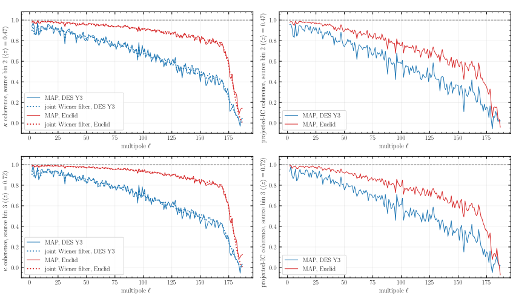{fig-align="center" height="560px"}

## MAP: DES Y3 against Euclid, starlet $\ell_1$ norm {visibility="uncounted"}

{fig-align="center" width="1000px"}

## MAP: starlet $\ell_1$ norm of the reconstruction {visibility="uncounted"}

<video src="PhD/7_backup/4_fieldlevel/19_map_starlet/starlet_run.mp4" class="screen-only" data-autoplay muted playsinline preload="auto" style="display: block; width: 1000px; margin: 0.6em auto 0;"></video>

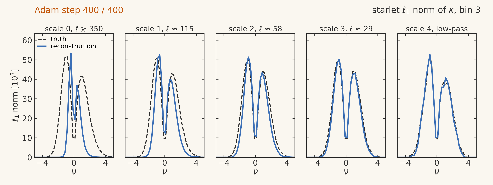{.print-only fig-align="center" width="1000px"}

## Field-level posterior: convergence {visibility="uncounted"}

::: {.grid .flat .bare style="--cols: 60px repeat(4, 1fr); --gap: 8px; --row-gap: 10px; --align: center; margin-top: 0.6em; text-align: center;"}
[]{}

[truth]{.kw style="font-size: 0.6em;"}

[posterior draws]{.kw style="font-size: 0.6em;"}

[standard deviation]{.kw style="font-size: 0.6em;"}

[truth − draw]{.kw style="font-size: 0.6em;"}

[bin 2]{.kw style="font-size: 0.6em; color: #C2560A; text-align: right;"}

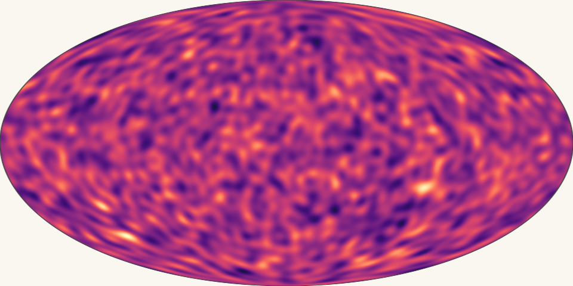{style="width: 100%; margin: 0;"}

::: {}
<video src="PhD/7_backup/4_fieldlevel/21_sampling/kappa_samples_bin2.mp4" class="screen-only" data-autoplay loop muted playsinline preload="auto" style="display: block; width: 100%; margin: 0;"></video>

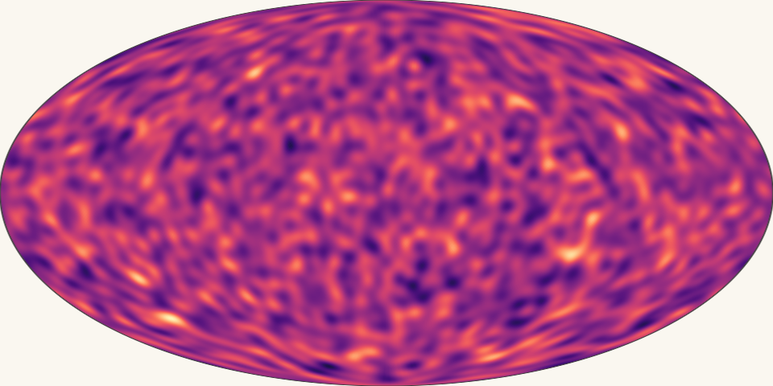{.print-only style="width: 100%; margin: 0;"}
:::

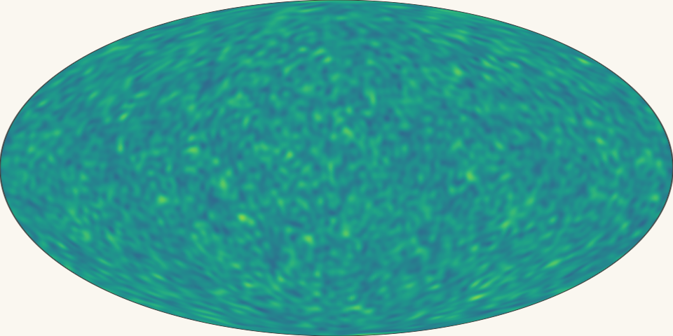{style="width: 100%; margin: 0;"}

::: {}
<video src="PhD/7_backup/4_fieldlevel/21_sampling/kappa_diff_bin2.mp4" class="screen-only" data-autoplay loop muted playsinline preload="auto" style="display: block; width: 100%; margin: 0;"></video>

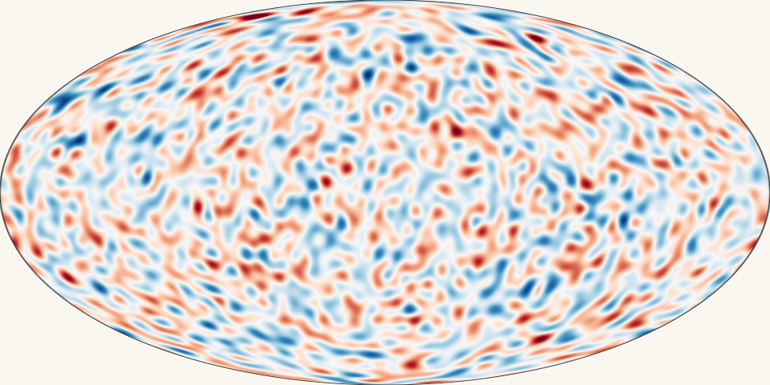{.print-only style="width: 100%; margin: 0;"}
:::

[bin 3]{.kw style="font-size: 0.6em; color: #3B6FB6; text-align: right;"}

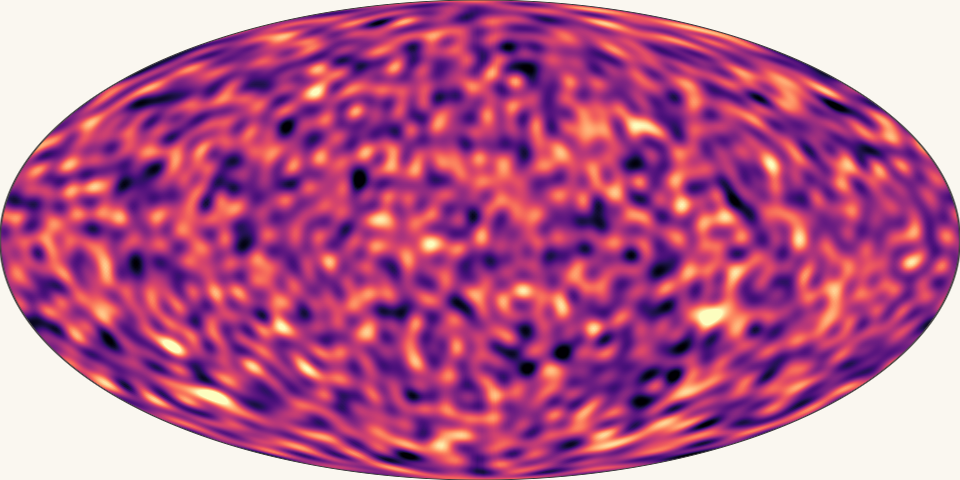{style="width: 100%; margin: 0;"}

::: {}
<video src="PhD/7_backup/4_fieldlevel/21_sampling/kappa_samples_bin3.mp4" class="screen-only" data-autoplay loop muted playsinline preload="auto" style="display: block; width: 100%; margin: 0;"></video>

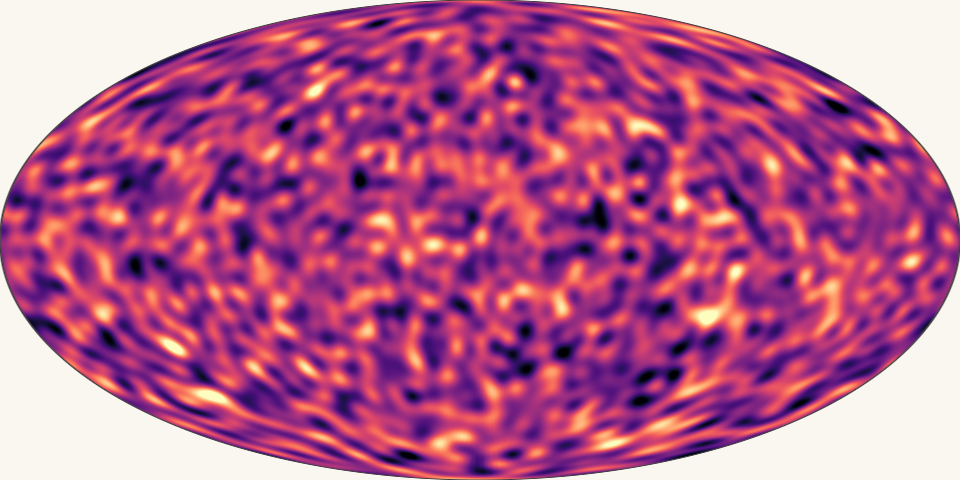{.print-only style="width: 100%; margin: 0;"}
:::

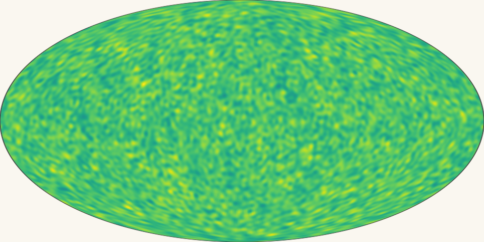{style="width: 100%; margin: 0;"}

::: {}
<video src="PhD/7_backup/4_fieldlevel/21_sampling/kappa_diff_bin3.mp4" class="screen-only" data-autoplay loop muted playsinline preload="auto" style="display: block; width: 100%; margin: 0;"></video>

{.print-only style="width: 100%; margin: 0;"}
:::

[]{}

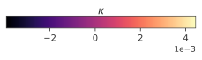{style="grid-column: span 2; width: 230px; margin: 0 auto;"}

{style="width: 200px; margin: 0 auto;"}

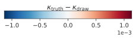{style="width: 200px; margin: 0 auto;"}
:::

::: {.nice-table style="--table-size: 0.72em; margin-top: 0.7em;"}
| MCLMC on one A100: $128^3$ initial conditions and $(\Omega_c, \sigma_8)$ | Wall time |
|:--|--:|
| Compiling the tuning step | 12 min |
| Tuning the step size and momentum decoherence: 300 steps | 1 h 32 min |
| Compiling the sampler | 1.5 min |
| Sampling: 10 batches of 10 draws, one draw every 5 steps | 15.5 min per batch |
| **Total** | **≈ 4 h 20 min** |
:::

## Field-level posterior: starlet $\ell_1$ norm {visibility="uncounted"}

::: {.grid .bare style="--cols: 110px 600px; --gap: 10px; --row-gap: 2px; --align: center; justify-content: center; margin-top: 0.2em;"}
[bin 2<br/>ℓ₁ norm]{.kw style="font-size: 0.6em; color: #C2560A; text-align: right;"}

::: {}
<video src="PhD/7_backup/4_fieldlevel/21_sampling/starlet_l1_bin2.mp4" class="screen-only" data-autoplay loop muted playsinline preload="auto" style="display: block; width: 600px; margin: 0;"></video>

{.print-only style="width: 600px; margin: 0;"}
:::

[bin 2<br/>draw − truth]{.kw style="font-size: 0.6em; color: #C2560A; text-align: right;"}

::: {}
<video src="PhD/7_backup/4_fieldlevel/21_sampling/starlet_resid_bin2.mp4" class="screen-only" data-autoplay loop muted playsinline preload="auto" style="display: block; width: 600px; margin: 0;"></video>

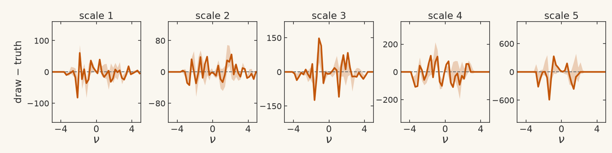{.print-only style="width: 600px; margin: 0;"}
:::

[bin 3<br/>ℓ₁ norm]{.kw style="font-size: 0.6em; color: #3B6FB6; text-align: right;"}

::: {}
<video src="PhD/7_backup/4_fieldlevel/21_sampling/starlet_l1_bin3.mp4" class="screen-only" data-autoplay loop muted playsinline preload="auto" style="display: block; width: 600px; margin: 0;"></video>

{.print-only style="width: 600px; margin: 0;"}
:::

[bin 3<br/>draw − truth]{.kw style="font-size: 0.6em; color: #3B6FB6; text-align: right;"}

::: {}
<video src="PhD/7_backup/4_fieldlevel/21_sampling/starlet_resid_bin3.mp4" class="screen-only" data-autoplay loop muted playsinline preload="auto" style="display: block; width: 600px; margin: 0;"></video>

{.print-only style="width: 600px; margin: 0;"}
:::
:::

## Cosmology-only inference {visibility="uncounted"}

:::: {.row .flat .bare style="--gap: 40px; --justify: center; margin-top: 0.3em;"}
{style="height: 480px; flex: none; margin: 0;"}

::: {.nice-table style="--table-size: 0.8em; flex: none;"}
| NUTS, initial conditions at the truth | |
|:--|--:|
| Warmup | 100 iterations |
| Sampling | 10 batches of 10 draws |
| $\Omega_c$ | $0.2603 \pm 0.0013$ (truth 0.2607) |
| $\sigma_8$ | $0.8102 \pm 0.0025$ (truth 0.8102) |
| **Wall time** | **4 h 56 min** |
:::
::::
