## {#survey-generations .bleed-slide background-image="PhD/1_intro/surveys/stage2_4_abell2390_bg.jpg" background-size="cover" background-color="#08080a"}

::: {.bleed-tag .bleed-left}
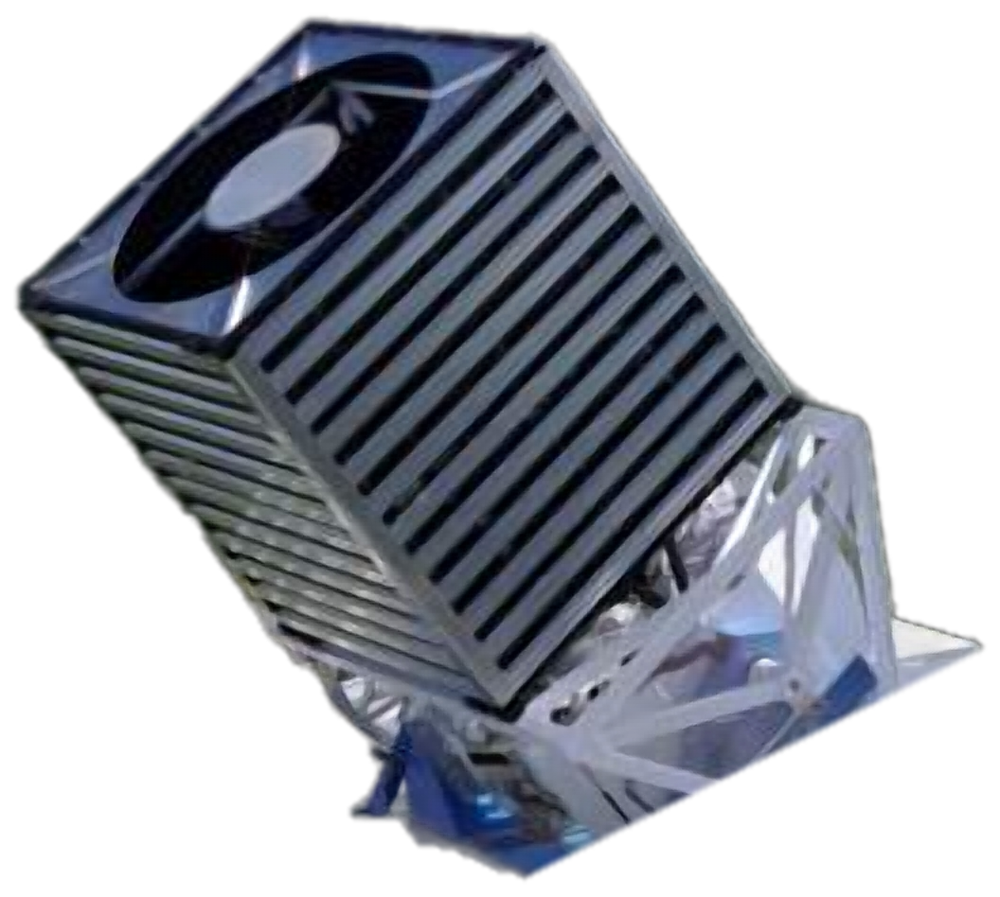{.bleed-scope}

:::: {.solutionbox}
::: {.solutionbox-body}
[Stage 2]{.kw2} · SDSS, 2.5 m ground, 1.4″ seeing
:::
::::
:::

::: {.bleed-tag .bleed-right}
:::: {.solutionbox}
::: {.solutionbox-body}
[Stage 4]{.kw2} · Euclid, 1.2 m space, 0.18″
:::
::::

{.bleed-scope}
:::

[Abell 2390 · Credit: SDSS DR18 (left); ESA / Euclid / Euclid Consortium / NASA, J.-C. Cuillandre & G. Anselmi (right)]{.bleed-credit}

# Modern observational cosmology {#telescopes .stack-top visibility="uncounted" transition="slide-in none-out"}

::::: {.bare style="position: relative; display: grid; grid-template-columns: 2.2em 1fr 1fr; grid-template-rows: auto 1fr 1fr; column-gap: 2.2em; row-gap: 1.6em; width: 74%; height: 560px; margin: 0 0 0 1em;"}
::: {style="grid-column: 2; grid-row: 1; text-align: center; font-size: 0.9em;"}
[Early Universe]{.kw}
:::

::: {style="grid-column: 3; grid-row: 1; text-align: center; font-size: 0.9em;"}
[Late Universe]{.kw}
:::

::: {.vlabel style="grid-column: 1; grid-row: 2; align-self: center; justify-self: center; font-size: 0.85em; color: #2E2E2E;"}
Space based
:::

::: {.vlabel style="grid-column: 1; grid-row: 3; align-self: center; justify-self: center; font-size: 0.85em; color: #2E2E2E;"}
Ground based
:::

::: {style="position: absolute; left: calc(2.2em + 1.1em + (100% - 2.2em - 4.4em) / 2 + 1.1em); top: 1.8em; bottom: 0; width: 5px; background: #d9d4c9; border-radius: 3px;"}
:::

::: {style="position: absolute; left: 2.6em; right: 0; top: calc(1.8em + (100% - 1.8em) / 2 - 2px); height: 5px; background: #d9d4c9; border-radius: 3px;"}
:::

:::: {.figcadre .fragment fragment-index=1 style="display: flex; flex-direction: column; min-height: 0; font-size: 0.8em; grid-column: 2; grid-row: 2;"}
::: {.figcadre-header}
LiteBIRD
:::

::: {.figcadre-body style="flex: 1 1 auto; min-height: 0; display: flex; align-items: center; justify-content: center; gap: 0; border-radius: 0 0 8px 8px;"}
:::: {.row .flat .bare style="--gap: 0.9em; --justify: center;"}
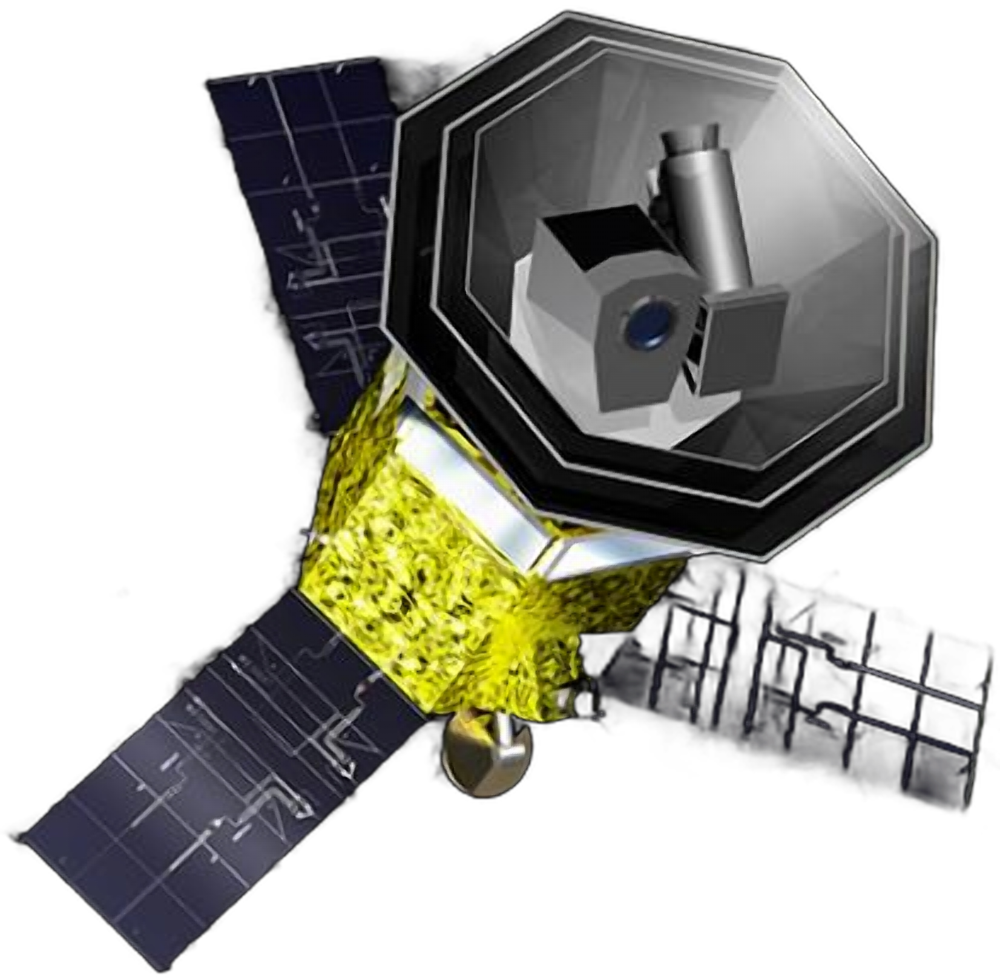{style="max-height: 150px; max-width: 50%; margin: 0;"}

::: {style="font-size: 0.82em; line-height: 1.45; white-space: nowrap; text-align: left; color: #2E2E2E;"}
full sky, from L2\
15 bands, 34–448 GHz\
σ(*r*) < 0.001
:::
::::
:::
::::

:::: {.figcadre .fragment fragment-index=1 style="display: flex; flex-direction: column; min-height: 0; font-size: 0.8em; grid-column: 3; grid-row: 2;"}
::: {.figcadre-header}
Euclid
:::

::: {.figcadre-body style="flex: 1 1 auto; min-height: 0; display: flex; align-items: center; justify-content: center; gap: 0; border-radius: 0 0 8px 8px;"}
:::: {.row .flat .bare style="--gap: 0.9em; --justify: center;"}
{style="max-height: 150px; max-width: 50%; margin: 0;"}

::: {style="font-size: 0.82em; line-height: 1.45; white-space: nowrap; text-align: left; color: #2E2E2E;"}
14 000 deg²\
*z* ~ 0.2–2\
30 gal arcmin⁻²\
~1.5 billion galaxies
:::
::::
:::
::::

:::: {.figcadre .fragment fragment-index=2 style="display: flex; flex-direction: column; min-height: 0; font-size: 0.8em; grid-column: 2; grid-row: 3;"}
::: {.figcadre-header}
Simons Observatory
:::

::: {.figcadre-body style="flex: 1 1 auto; min-height: 0; display: flex; align-items: center; justify-content: center; gap: 0; border-radius: 0 0 8px 8px;"}
:::: {.row .flat .bare style="--gap: 0.9em; --justify: center;"}
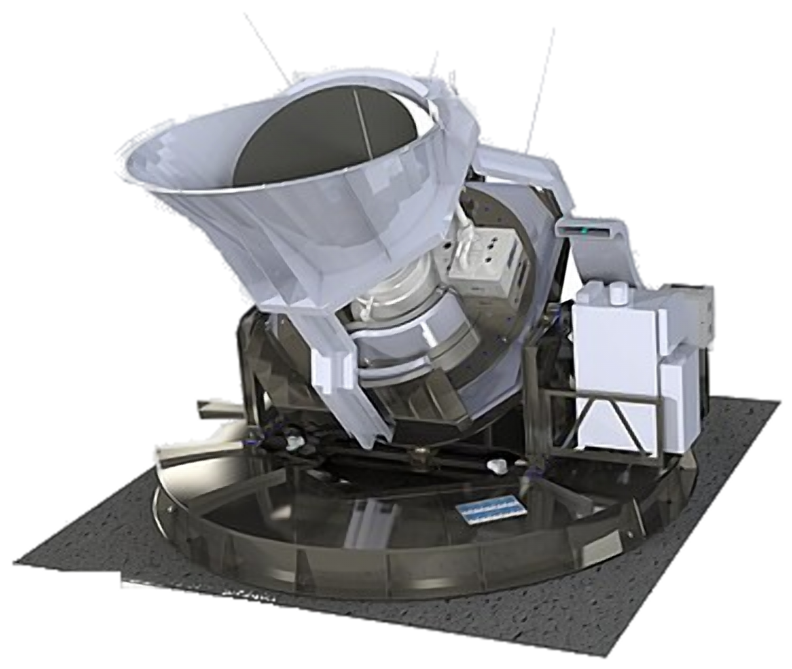{style="max-height: 150px; max-width: 50%; margin: 0;"}

::: {style="font-size: 0.82em; line-height: 1.45; white-space: nowrap; text-align: left; color: #2E2E2E;"}
Atacama, Chile\
6 bands, 27–280 GHz\
σ(*r*) ≈ 0.003
:::
::::
:::
::::

:::: {.figcadre .fragment fragment-index=2 style="display: flex; flex-direction: column; min-height: 0; font-size: 0.8em; grid-column: 3; grid-row: 3;"}
::: {.figcadre-header}
Vera C. Rubin Observatory (LSST)
:::

::: {.figcadre-body style="flex: 1 1 auto; min-height: 0; display: flex; align-items: center; justify-content: center; gap: 0; border-radius: 0 0 8px 8px;"}
:::: {.row .flat .bare style="--gap: 0.9em; --justify: center;"}
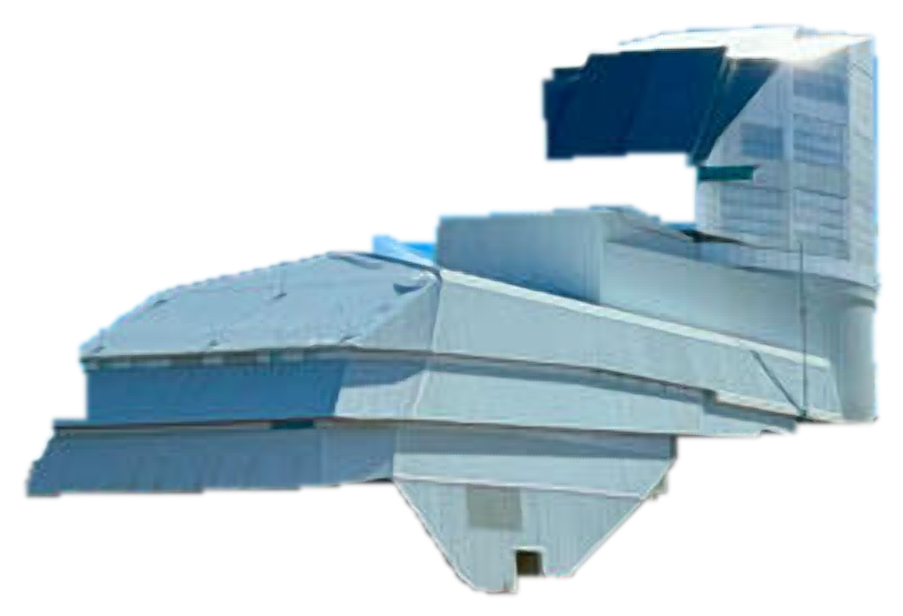{style="max-height: 150px; max-width: 50%; margin: 0;"}

::: {style="font-size: 0.82em; line-height: 1.45; white-space: nowrap; text-align: left; color: #2E2E2E;"}
18 000 deg²\
*z* ~ 0.2–2.5\
30 gal arcmin⁻²\
~2 billion galaxies
:::
::::
:::
::::

::: {.fragment fragment-index=3 style="position: absolute; left: calc(100% + 1.4em); bottom: -20px; width: 230px;"}
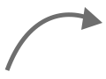{.bare style="position: absolute; left: -95px; bottom: 120px; width: 110px; margin: 0;"}

{.photo style="width: 230px;"}
:::
:::::

## Modern observational cosmology {#modern_cosmo visibility="uncounted" transition="none-in slide-out"}

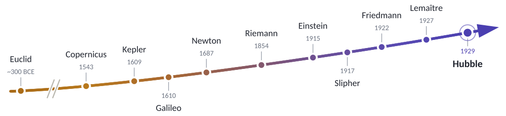{fig-align="center" width="62%"}

::: {.r-stack}
::: {.fragment .fade-in-then-out fragment-index=1}
:::: {.columns}
::: {.column width="38%"}
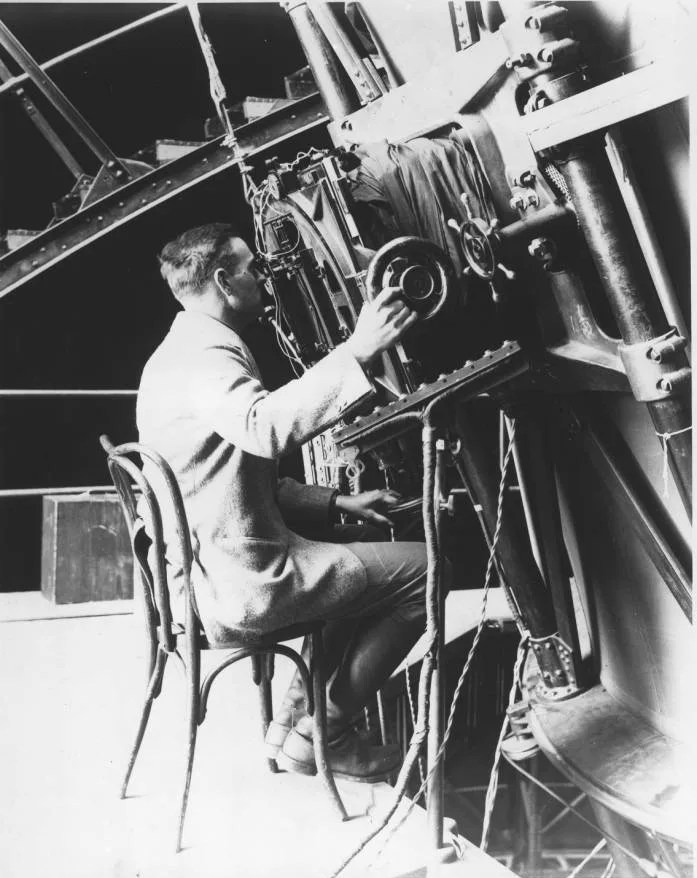{fig-align="center" height="340px" style="border-radius: 6px;"}
:::

::: {.column width="62%"}
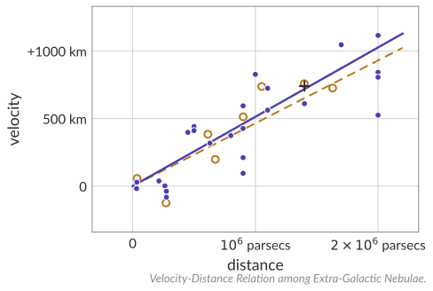{fig-align="center" height="340px"}
:::
::::

[Credit: NASA (photograph); Hubble (1929), PNAS 15, 168, Fig. 1, redrawn]{.credit}
:::

::: {.fragment .fade-in fragment-index=2}
:::: {.columns}
::: {.column width="42%"}
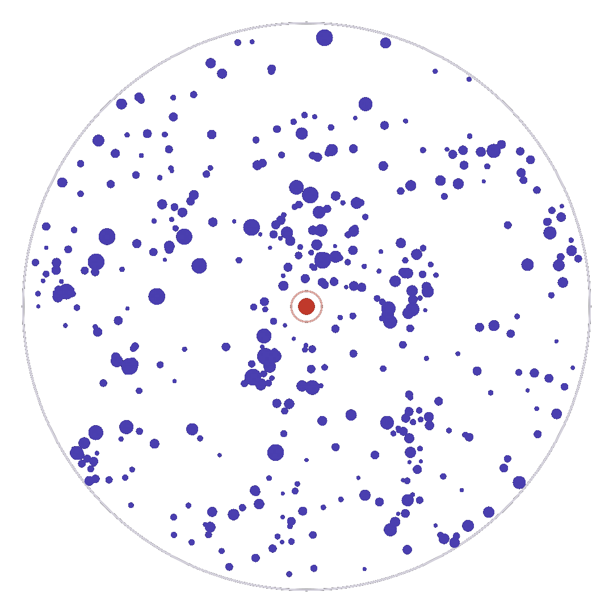{.screen-only fig-align="center" height="350px"}

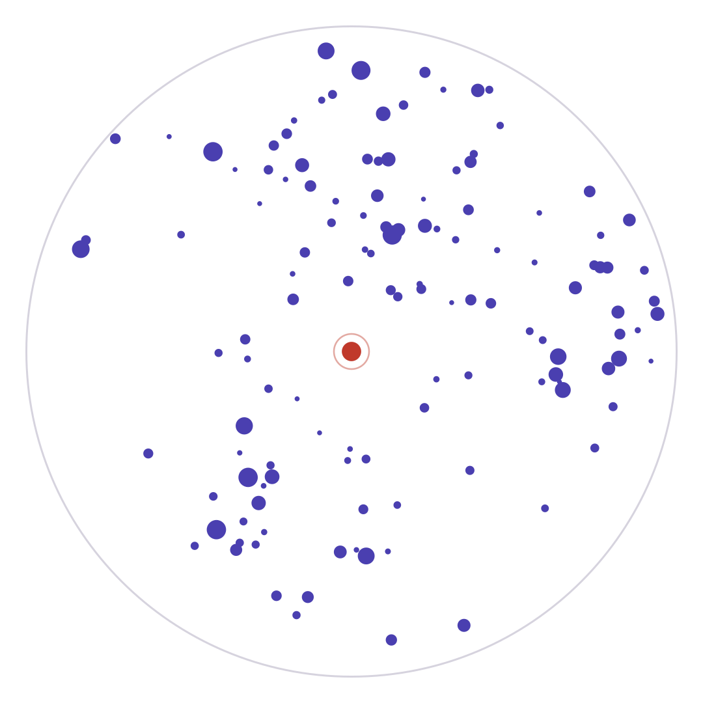{.print-only fig-align="center" height="350px"}
:::

::: {.column width="58%" .fragment fragment-index=3}
### The Friedmann–Lemaître–Robertson–Walker metric {style="font-size: 0.85em; margin-bottom: 0;"}

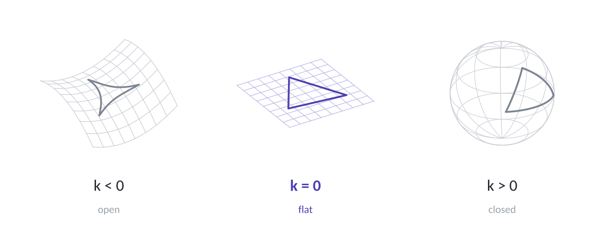{fig-align="center" width="82%" style="margin: 0;"}

::: {.r-stack}
::: {.fragment fragment-index=4}
:::: {.solutionbox}
::: {.solutionbox-header style="font-size: 17px;"}
The Expanding Universe
:::

::: {.solutionbox-body style="font-size: 16px;"}
[Georges Lemaître]{.kw}: predicted the [primeval atom]{.kw} as the origin of the Universe
:::
::::
:::
:::
:::
::::
:::
:::

## The Cosmic Microwave Background

<br/>
<br/>

:::: {.columns}
::: {.column width="51%"}
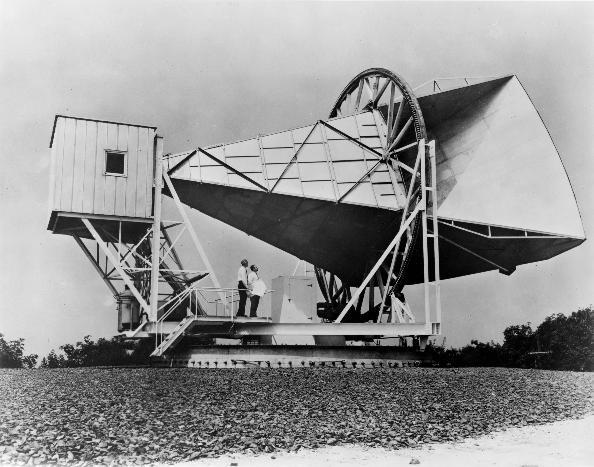{fig-align="center" width="100%" style="margin: 0;"}

[1965, Holmdel: Penzias & Wilson find a 3 K signal from every direction · Credit: NASA (antenna); ESA / Planck Collaboration (map)]{.credit}
:::

::: {.column width="47%"}
:::: {style="font-size: 0.75em;"}
- The [relic light of the hot Big Bang]{.kw}, released 380 000 years after it

::: {.fragment}
- At Princeton, [Dicke, Peebles, Roll & Wilkinson]{.kw} had predicted this relic radiation and were building a radiometer to find it
- The two groups published side by side in 1965: [Penzias & Wilson]{.kw} the measurement, Princeton the interpretation
:::

::: {.fragment}
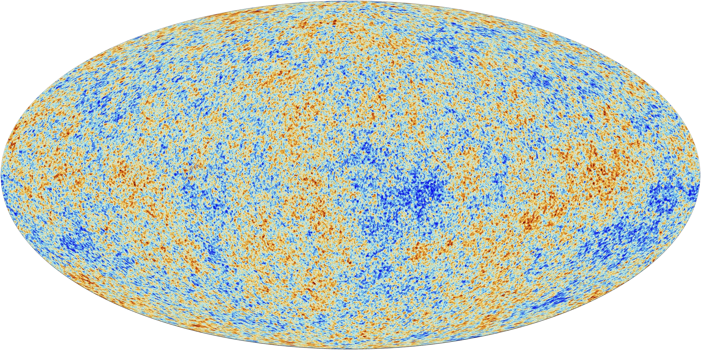{fig-align="center" width="92%"}
:::
::::
:::
::::

::: {.fragment}
:::: {.solutionbox}
::: {.solutionbox-body}
The discovery of the [CMB]{.kw} confirmed the expanding universe
:::
::::
:::

## Lambda Cold Dark Matter ($\Lambda$CDM)


<br/>
<br/>

:::: {.columns}
::: {.column width="60%"}
<br/>

{fig-align="center" width="100%"}

:::

::: {.column width="40%" .fragment}
<br/><br/>

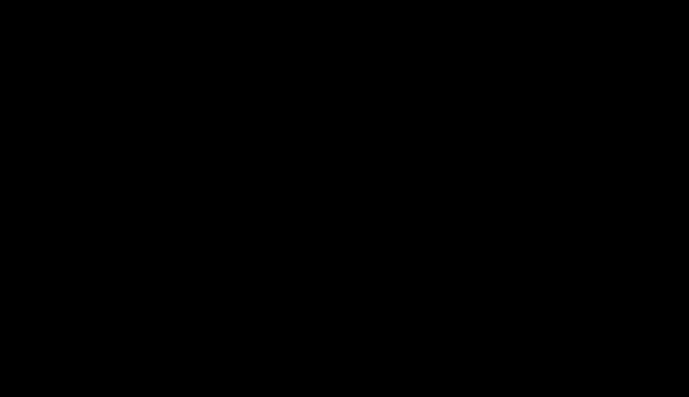{.screen-only fig-align="center" width="100%"}

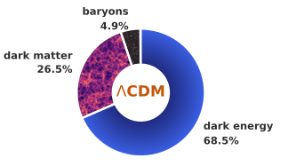{.print-only fig-align="center" width="100%"}
:::
::::

## The limits of $\Lambda$CDM

::: {.r-stack style="width: 46%; margin: -1.8em auto -0.9em;"}
{style="width: 100%; margin: 0;"}

{.fragment .fade-in-then-out fragment-index=1 style="width: 100%; margin: 0;"}

{.fragment fragment-index=2 style="width: 100%; margin: 0;"}
:::

<br/>
<br/>

:::: {.columns style="font-size: 0.8em;"}
::: {.column width="49%"}
[The early Universe]{.kw}

::: {.fragment .grid fragment-index=1 style="--cols: 1.34fr 1.97fr; --gap: 0.8em; --align: start; --cell-margin: 0.1em 0; --img-margin: 0.2em 0 0;"}
:::: {.cell}
horizon

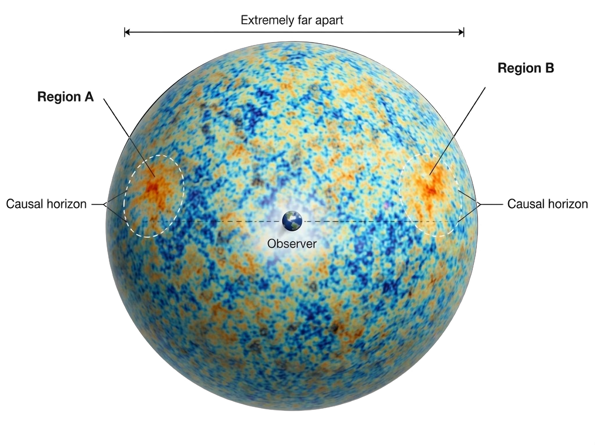

[Credit: NASA / WMAP Science Team]{.credit}
::::

:::: {.cell}
flatness

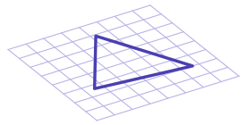

\+ monopole dilution
::::
:::
:::

::: {.column style="width: 49%; box-sizing: border-box; border-left: 2px solid #d9d4c9; padding-left: 1.2em; margin-top: -0.5em; padding-top: 0.5em;"}
[The late Universe]{.kw}

:::: {.cell .fragment fragment-index=2 style="--gap: 0.8em; --align: start; --cell-margin: 0.1em 0; --img-margin: 0.2em 0 0;"}
::: {.grid style="--cols: 1.73fr 1.33fr; --gap: 0.8em; --align: start; --cell-margin: 0.1em 0; --img-margin: 0.2em 0 0;"}
:::: {.cell}
components


::::

:::: {.cell}
History of the expanding Universe

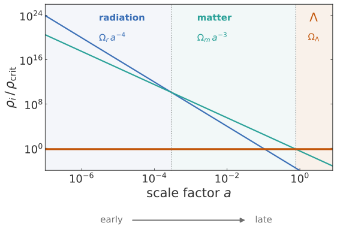
::::
:::
::::
:::
::::

# Outline {.big-title .stack-top style="text-align: center;"}

{fig-align="center" width="86%"}

# From model to observation: the CMB

::: {.rail-stack}
{.rail-full}

{.rail-focus}
:::

## Inflation {corner="PhD/1_intro/lcdm/lcdm_model_cmb.svg"}

{.corner .print-only}

::: {.r-stack}
::: {.fragment .fade-out fragment-index=1 style="width: 70%;"}
[The early Universe]{.kw}

::: {.grid style="--cols: 1.34fr 1.97fr; --gap: 0.8em; --align: start; --cell-margin: 0.1em 0; --img-margin: 0.2em 0 0;"}
:::: {.cell}
horizon


::::

:::: {.cell}
flatness


\+ monopole dilution
::::
:::
:::

::: {.fragment .fade-in fragment-index=1}
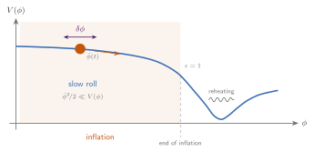{fig-align="center" width="78%"}
:::
:::

::: {.fragment fragment-index=2}
- A brief [accelerated expansion]{.kw} solves the horizon and flatness problems
- Its [quantum fluctuations]{.kw} $\delta\phi$ seed every structure we see today
:::

## Primordial gravitational waves {corner="PhD/1_intro/lcdm/lcdm_model_cmb.svg"}

{.corner .print-only}

:::: {.columns style="display: flex; align-items: center; min-height: 540px;"}
::: {.column width="44%"}
- Quantum fluctuations perturb the [metric]{.kw} of space-time
- [Scalar]{.kw}: $\Delta_s^2(k) = A_s\,(k/k_*)^{n_s-1}$
- [Tensor]{.kw}: $\Delta_t^2(k) = A_t\,(k/k_*)^{n_t}$, the [gravitational waves]{.kw}

:::: {.fragment}
::: {.eqbox style="--eq-border: #25406b; --eq-size: 1em; --eq-math-margin: 0.3em 0; width: fit-content; margin: 0.4em auto;"}
$$
r \equiv \frac{A_t}{A_s} \;\propto\; E_\mathrm{inf}^4
$$
:::

The tensor-to-scalar ratio fixes the [energy scale of inflation]{.kw}
::::

::: {.fragment}
Primordial GWs leave a unique imprint in the CMB [polarisation]{.kw2}
:::
:::

::: {.column width="54%"}
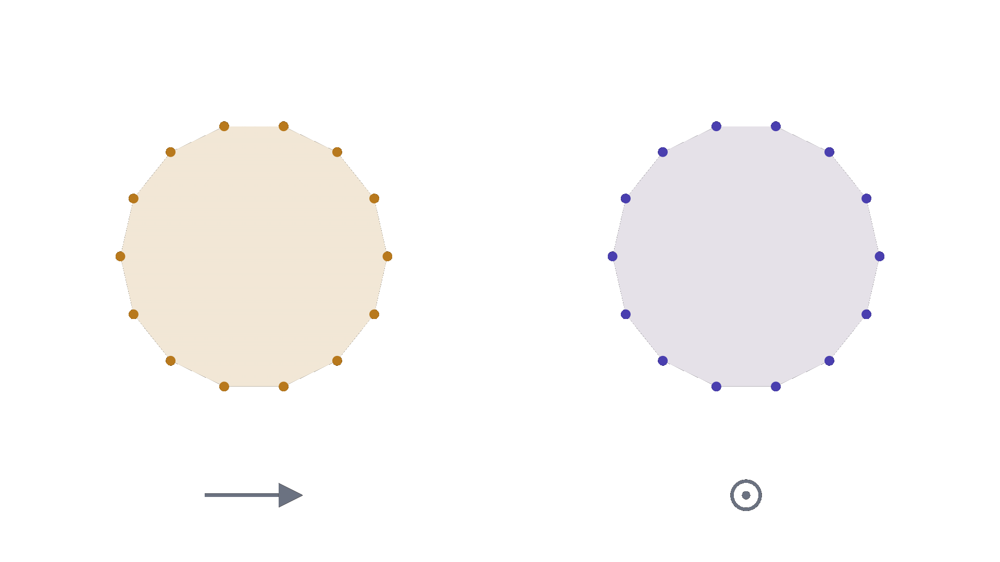{.screen-only fig-align="center" width="100%"}

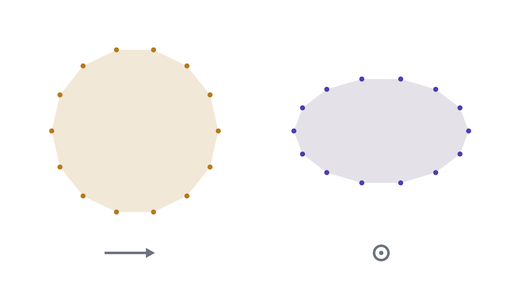{.print-only fig-align="center" width="100%"}
:::
::::

## Polarisation of the CMB {corner="PhD/1_intro/lcdm/lcdm_model_cmb.svg"}

{.corner .print-only}

:::: {.row .bare style="--gap: 0.6em; margin-top: 0.4em;"}
::: {style="display: flex; flex-direction: column; gap: 0.5em; flex: 0 0 auto;"}
[$A_s$]{.tag}

[$A_t$]{.tag}
:::

::: {style="position: relative; flex: 1 1 auto;"}
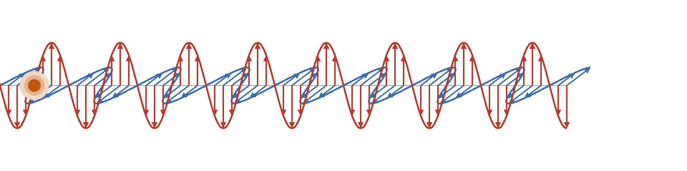{.screen-only style="display: block; width: 100%;"}

{.screen-only style="position: absolute; left: 66.25%; top: 17.5%; width: 32.5%; height: 65%;"}

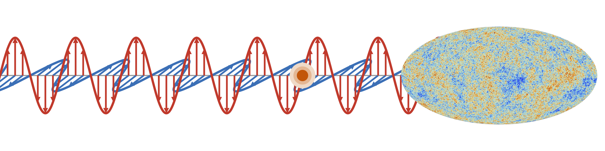{.print-only}
:::
::::

::: {.fragment}
:::: {style="font-size: 0.85em;"}
- A quadrupole at last scattering + Thomson scattering, $\propto |\hat{\epsilon}\cdot\hat{\epsilon}'|^2$ → [linear polarisation]{.kw}
- 3 [Stokes parameters]{.kw} describe linearly polarised light
::::

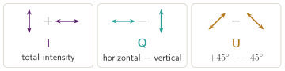{fig-align="center" width="88%"}

[Adapted from: Emma Alexander, Wikimedia Commons ([Stokes params](https://commons.wikimedia.org/wiki/File:Emmaalexander_Stokes_params.png))]{.credit}
:::

## Q and U Stokes parameters {#q-and-u-stokes-parameters corner="PhD/1_intro/lcdm/lcdm_model_cmb.svg"}

{.corner .print-only}

```{=html}
<div class="bare" style="position: relative; height: 540px; font-size: 1.25em; --tag-bg: rgba(255, 255, 255, 0.88); --tag-border: transparent; --tag-pad: 0.05em 0.45em;">
<svg class="fragment" data-fragment-index="1" style="position: absolute; left: 380px; top: -25px; width: 330px;" viewBox="0 0 300 120"><path d="M20 110 C 30 10, 250 -10, 262 92" fill="none" stroke="#6E6E6E" stroke-width="5"/><path d="M246 84 L263 112 L278 82 Z" fill="#6E6E6E"/></svg>
<div style="position: absolute; left: 150px; width: 195px; height: 195px; display: flex; align-items: center; justify-content: center; top: 20px;">
  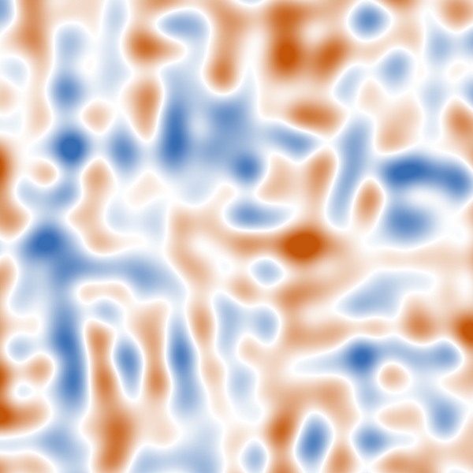<span class="tag" style="position: relative;">\(Q\)</span>
</div>
<div style="position: absolute; left: 150px; width: 195px; height: 195px; display: flex; align-items: center; justify-content: center; top: 305px;">
  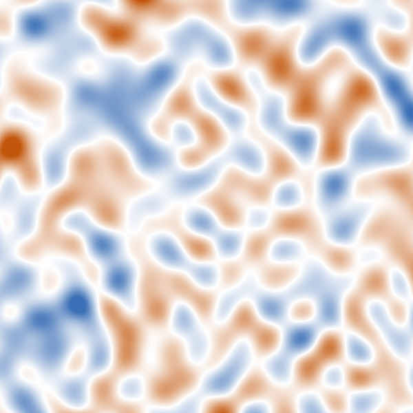<span class="tag" style="position: relative;">\(U\)</span>
</div>
<div class="fragment move" data-fragment-index="1" style="position: absolute; left: 150px; width: 195px; height: 195px; display: flex; align-items: center; justify-content: center; top: 20px; --move: translateX(560px) rotate(45deg); --counter: rotate(-45deg);">
  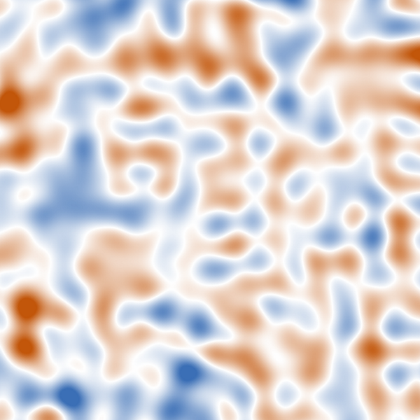
  <span class="tag counter" style="position: relative;"><span class="fragment fade-out" data-fragment-index="2">\(Q\)</span><span class="fragment" data-fragment-index="2" style="position: absolute; left: 50%; top: 50%; transform: translate(-50%, -50%); white-space: nowrap;">\(U\)</span></span>
</div>
<div class="fragment move" data-fragment-index="1" style="position: absolute; left: 150px; width: 195px; height: 195px; display: flex; align-items: center; justify-content: center; top: 305px; --move: translateX(560px) rotate(45deg); --counter: rotate(-45deg);">
  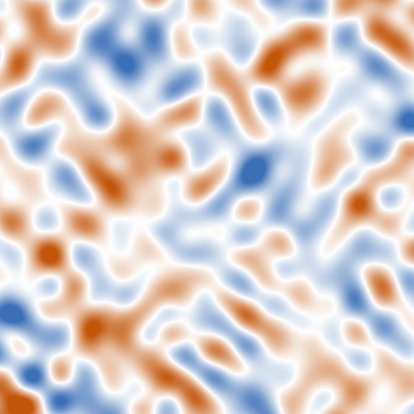
  <span class="tag counter" style="position: relative;"><span class="fragment fade-out" data-fragment-index="2">\(U\)</span><span class="fragment" data-fragment-index="2" style="position: absolute; left: 50%; top: 50%; transform: translate(-50%, -50%); white-space: nowrap;">\(-Q\)</span></span>
</div>
</div>
```

::: {.fragment fragment-index=2}
:::: {.solutionbox}
::: {.solutionbox-body}
$Q$ and $U$ depend on the [reference frame]{.kw}: turning it by $\psi$ mixes them, $\;Q' = Q\cos 2\psi + U\sin 2\psi$
:::
::::
:::

## $E$ and $B$ modes {corner="PhD/1_intro/lcdm/lcdm_model_cmb.svg"}

{.corner .print-only}


<br/>
<br/>

:::: {.columns style="display: flex; align-items: center;"}
::: {.column width="50%"}

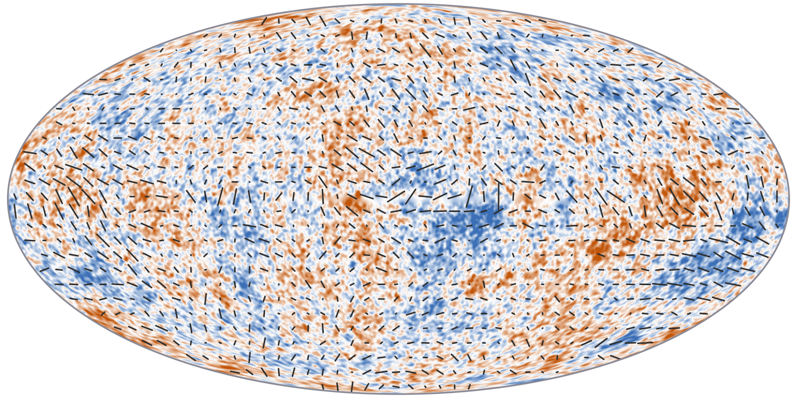{fig-align="center" width="100%"}

:::

::: {.column width="48%"}

:::: {.row .fragment fragment-index=1 style="--justify: space-around; --cell-margin: 0; --img-w: auto; --img-h: 130px; --img-radius: 8px;"}
::: {.cell}
{.screen-only}

{.print-only}
:::

::: {.cell}
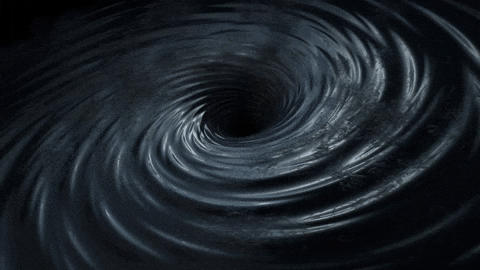{.screen-only}

{.print-only}
:::
::::

::: {.fragment fragment-index=2}
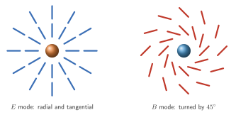{fig-align="center" width="88%" style="margin: 0.3em auto 0;"}
:::

:::
::::

::: {.fragment fragment-index=2}
:::: {.solutionbox}
::: {.solutionbox-body}
- Density (scalar) perturbations make only [$E$ modes]{.kw}
- [$B$ modes]{.kw} are sourced by [tensor perturbations]{.kw}: a direct window onto inflation
:::
::::
:::

## Two-point statistics {corner="PhD/1_intro/lcdm/lcdm_model_cmb.svg"}

{.corner .print-only}

::: {.bare style="position: relative; width: 100%; aspect-ratio: 16 / 9; max-height: 560px; margin: 0 auto;"}
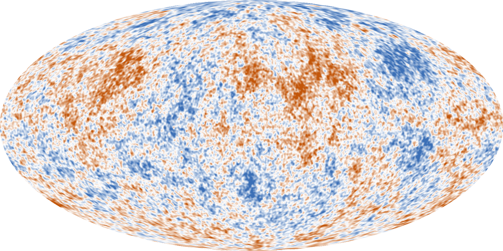{style="position: absolute; left: 3.24%; top: 27.5%; width: 45%; height: 40%;"}

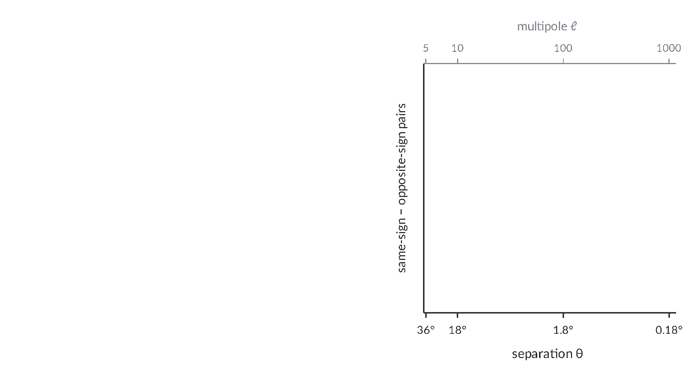{.screen-only style="position: absolute; inset: 0; width: 100%; height: 100%;"}

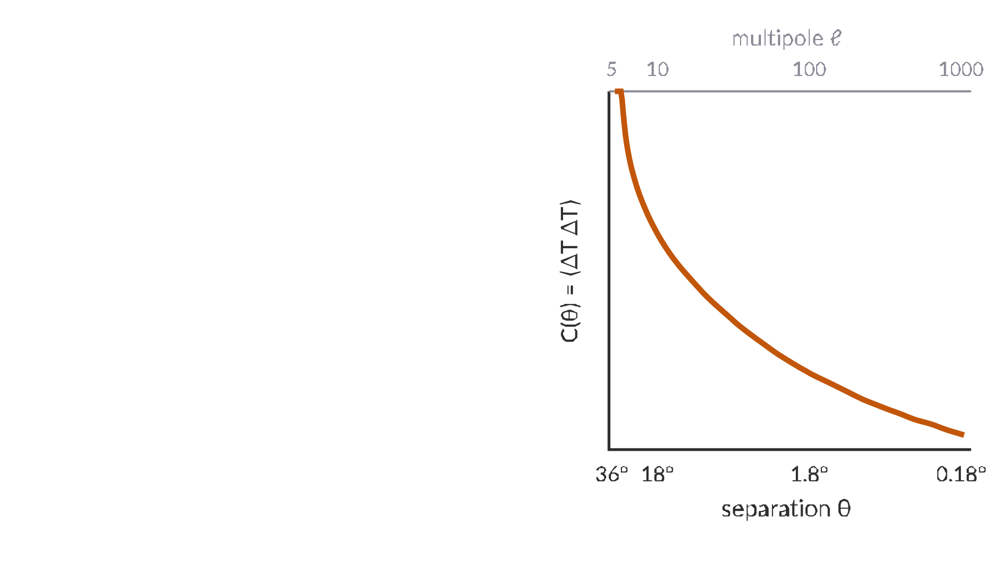{.print-only style="position: absolute; inset: 0; width: 100%; height: 100%;"}
:::

$C(\theta) = \langle \Delta T(\hat n_1)\,\Delta T(\hat n_2)\rangle$ over all pairs at separation $\theta$: its expansion in Legendre polynomials gives the [$C_\ell$]{.kw}

## How do we represent sky data numerically? {#healpix corner="PhD/1_intro/lcdm/lcdm_model_cmb.svg"}

<br/>

{.corner .print-only}

#### [Hierarchical Equal Area iso-latitude Pixellation]{.kw} (of the sphere)

:::: {.row style="margin-top: -0.3em;"}
::: {.cell style="flex: 0 0 17%; --cell-margin: 0.15em 0; --img-w: 90%;"}
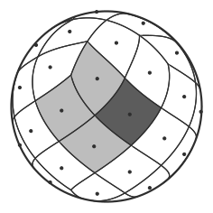


[HEALPix]{style="display: block; font-weight: 700; font-size: 1.05em; color: #2E2E2E;"}

{style="width: 48%;"}
:::

::: {.r-stack .bare style="flex: 1 1 auto;"}
:::: {.fragment .fade-out fragment-index=1}
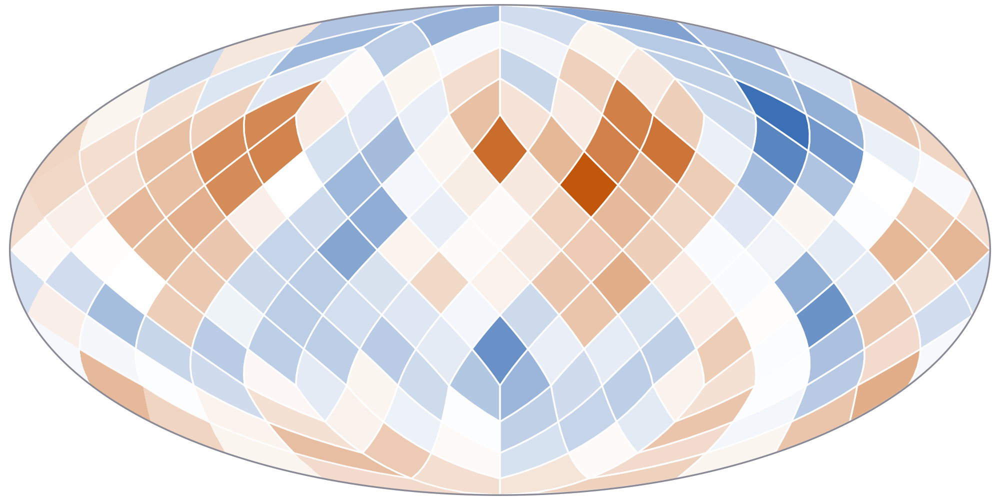{style="width: 100%;"}

[$N_\mathrm{side}$]{.kw} $= 4$
::::

:::: {.fragment .fade-in-then-out fragment-index=1}
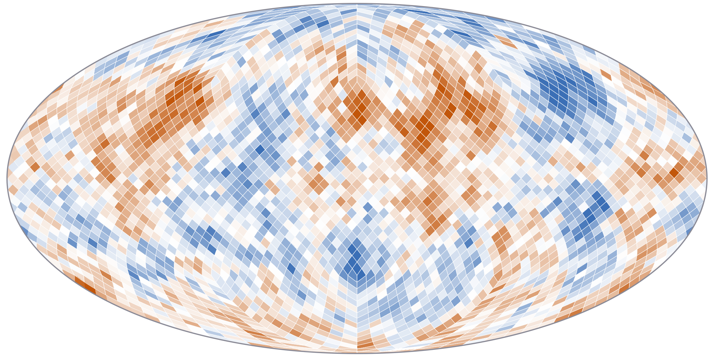{style="width: 100%;"}

[$N_\mathrm{side}$]{.kw} $= 16$
::::

:::: {.fragment .fade-in-then-out fragment-index=2}
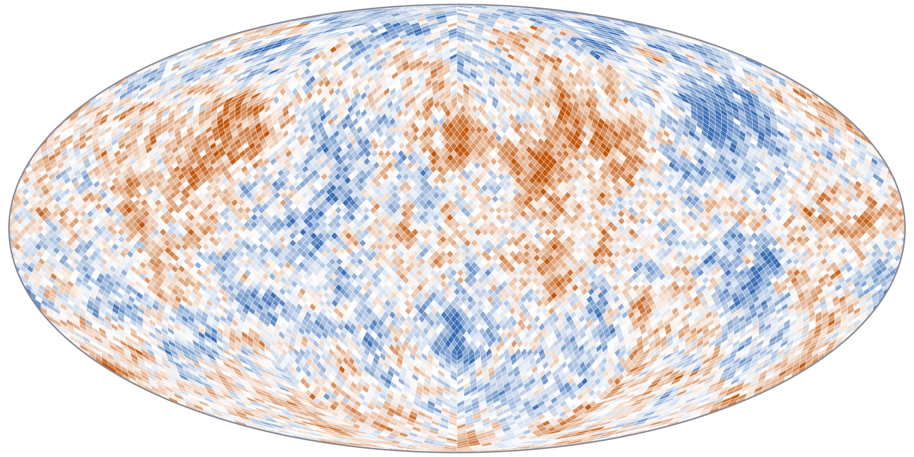{style="width: 100%;"}

[$N_\mathrm{side}$]{.kw} $= 32$
::::

:::: {.fragment fragment-index=3}
{style="width: 100%;"}

[$N_\mathrm{side}$]{.kw} $= 64$
::::

:::

::: {.cell .fragment fragment-index=4 style="flex: 0 0 20%; margin-top: 70px; --cell-margin: 0 0 0.35em; --img-margin: 0; --img-radius: 8px; --img-max-w: 95%;"}
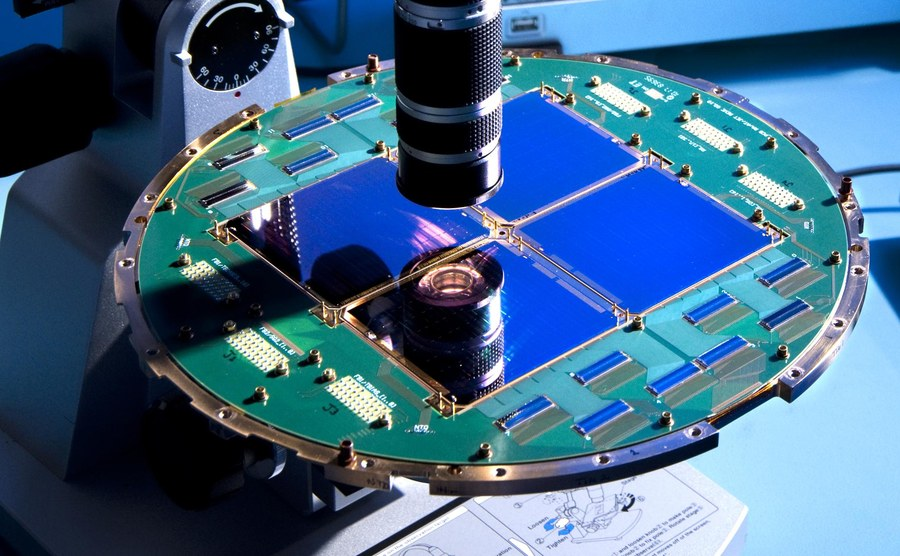

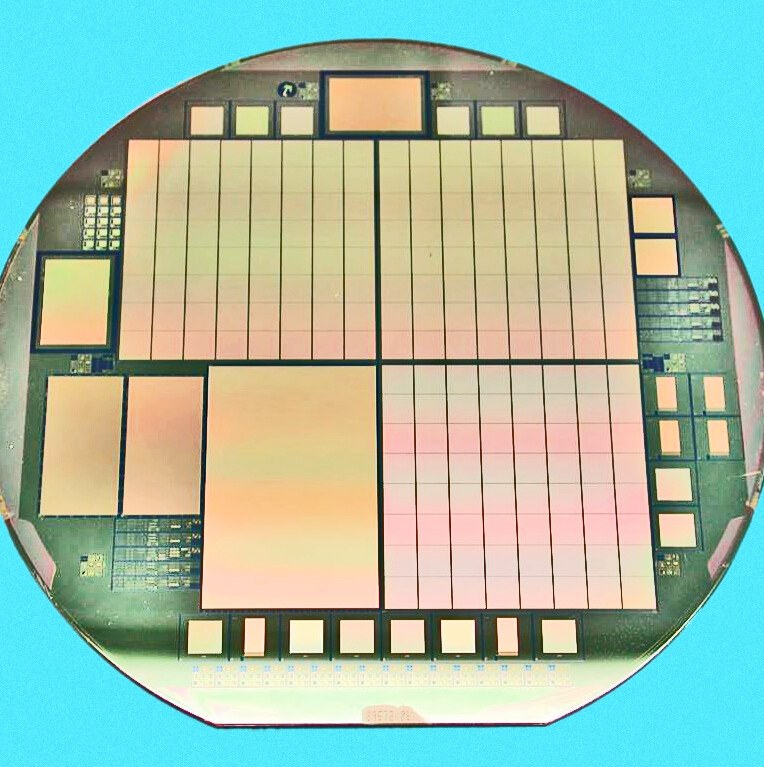

[Pixels on the sky, like pixels on a detector]{.caption style="--cap-size: 0.62em;"}
:::
::::

::: {.fragment fragment-index=4}
:::: {.solutionbox style="margin-top: 0.2em;"}
::: {.solutionbox-body style="font-size: 0.85em;"}
- [Equal area]{.kw}: every pixel weighs the same in a $C_\ell$
- [Hierarchical]{.kw}, $N_\mathrm{side} = 2^k$: 12 pixels to billions; the standard of Planck, SO, LiteBIRD, and in JAX with jax-healpy
:::
::::
:::

## Spherical Harmonic Transforms {#sht corner="PhD/1_intro/lcdm/lcdm_model_cmb.svg"}

{.corner .print-only}

<br/><br/>

:::: {.grid style="--cols: 1fr 190px 1fr 190px 1fr; --gap: 0; width: 96%; margin: 0 auto; --align: stretch; margin-bottom: 0.2em;"}
::: {.eqbox style="--eq-border: #25406b; --eq-math-margin: 0.35em 0; grid-column: 2;"}
$$
f(\theta,\varphi) = \sum_{\ell=0}^{\infty} \sum_{m=-\ell}^{\ell} a_{\ell m}\, Y_\ell^m(\theta,\varphi)
$$
:::

::: {.eqbox .fragment fragment-index=2 style="--eq-border: #25406b; --eq-math-margin: 0.35em 0; grid-column: 4;"}
$$
C_\ell = \frac{1}{2\ell+1} \sum_{m=-\ell}^{\ell} |a_{\ell m}|^2
$$
:::
::::

:::: {.grid style="--cols: 1fr 190px 1fr 190px 1fr; --gap: 0; width: 96%; margin: 0 auto; --row-gap: 0.2em; --img-w: auto; --img-h: 118px; --img-max-w: 100%; --img-max-h: 95%; --cap-size: 0.75em; --cap-lh: 1.1;"}
::: {.cell}
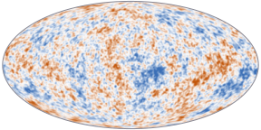
[*I*]{.caption}

:::

::: {.bare .fragment fragment-index=1}
{width="110px" style="display: block; margin: 0 auto;"}
:::

::: {.cell .fragment fragment-index=1}
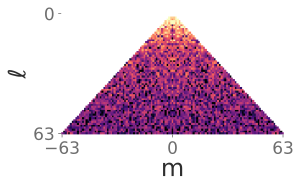
[*a*~ℓm~^T^]{.caption}

:::

::: {.bare .fragment fragment-index=2}
{width="110px" style="display: block; margin: 0 auto;"}
:::

::: {.cell .fragment fragment-index=2}
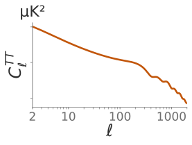
:::

::: {.cell}
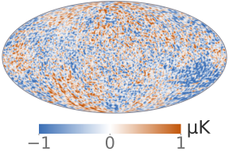
[*Q*]{.caption}

:::

::: {.bare .fragment fragment-index=1}
{width="110px" style="display: block; margin: 0 auto;"}
:::

::: {.cell .fragment fragment-index=1}
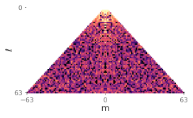
[*a*~ℓm~^E^]{.caption}

:::

::: {.bare .fragment fragment-index=2}
{width="110px" style="display: block; margin: 0 auto;"}
:::

::: {.cell .fragment fragment-index=2}

:::

::: {.cell}

[*U*]{.caption}

:::

::: {.bare .fragment fragment-index=1}
{width="110px" style="display: block; margin: 0 auto;"}
:::

::: {.cell .fragment fragment-index=1}
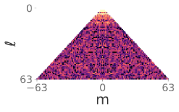
[*a*~ℓm~^B^]{.caption}

:::

::: {.bare .fragment fragment-index=2}
{width="110px" style="display: block; margin: 0 auto;"}
:::

::: {.cell .fragment fragment-index=2}
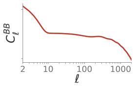
:::
::::


## Predicted CMB power spectra {corner="PhD/1_intro/lcdm/lcdm_model_cmb.svg"}

{.corner .print-only}

::: {.r-stack}
{.fragment .fade-out fragment-index=1 width="92%"}

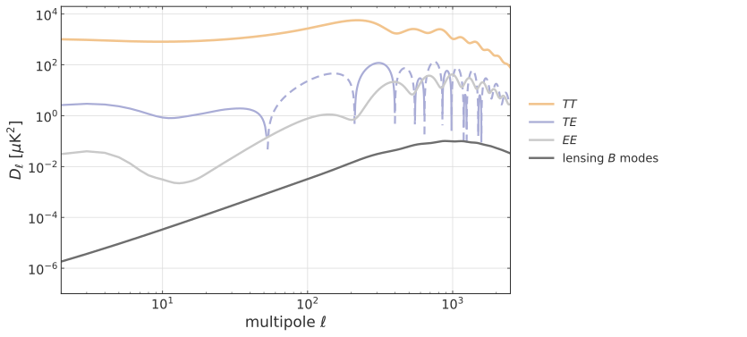{.fragment .fade-in-then-out fragment-index=1 width="92%"}

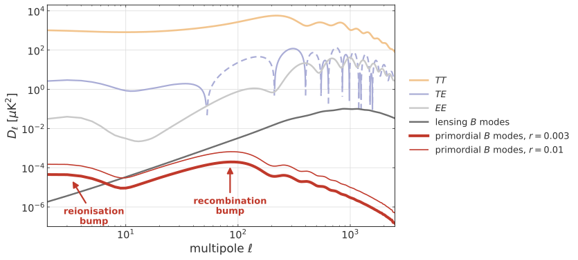{.fragment fragment-index=2 width="92%"}
:::

::: {.fragment fragment-index=3}
:::: {.solutionbox}
::: {.solutionbox-body}
- [The primordial tensor perturbations]{.kw} are a clear probe of [$r$]{.kw} and of the inflation period
- They are measurable through [$C_\ell^{BB}$]{.kw2} of the [CMB]{.kw}
- Current surveys forecast an upper bound of [$r \approx 0.003$]{.kw}
:::
::::
:::

## Current constraints on $r$ {corner="PhD/1_intro/lcdm/lcdm_model_cmb.svg"}

{.corner .print-only}

{fig-align="center" width="74%"}

::: {.fragment}
:::: {.solutionbox}
::: {.solutionbox-body}
- Best limit: [$r < 0.032$]{.kw} (95 %, Planck PR4 + BICEP/Keck 2018)
- The main obstacle is the [Galactic foregrounds]{.kw} that obscure the [CMB]{.kw}: [Contribution 1]{.kw2}
:::
::::
:::

[Tristram et al. (2022); Simons Observatory (Ade et al. 2019); LiteBIRD Collaboration (2023)]{.credit}

## The CMB data-analysis pipeline

::::: {.hl-host .bare style="margin-top: 0.2em;"}
{style="display: block; width: 990px;"}

:::: {.fragment fragment-index=1}
::: {.fragment .fade-out fragment-index=3}
::: {.hlbox .fragment .custom .hlbox-move fragment-index=2 style="--x: 6%; --y: 4.5%; --w: 27.5%; --h: 32.5%; --x2: 9.5%; --y2: 43%; --w2: 23.5%; --h2: 13.5%;"}
:::
:::
::::

::: {.hlbox .fragment fragment-index=3 style="--x: 61.8%; --y: 30.2%; --w: 8.2%; --h: 33%;"}
:::
:::::

# From model to observation: weak gravitational lensing

::: {.rail-stack}
{.rail-full}

{.rail-focus}
:::

## {#lss-opener auto-animate="true" visibility="uncounted"}

<br/>

::: {.r-stack}
{.fragment .fade-out fragment-index=1 width="82%"}

{.fragment .fade-in-then-out fragment-index=1 width="82%"}

{.fragment .fade-in-then-out fragment-index=1 width="82%"}

{.fragment fragment-index=2 width="82%" data-id="lcdm"}
:::

## The Large-Scale Structure of the Universe {auto-animate="true"}

{.corner data-id="lcdm"}

<br/>
<br/>
<br/>
<br/>
<br/>

::: {style="width: 80%; margin: 0 auto;"}
[The late Universe]{.kw}

::: {.grid style="--cols: 1.73fr 1.33fr; --gap: 0.8em; --align: start; --cell-margin: 0.1em 0; --img-margin: 0.2em 0 0;"}
:::: {.cell}
components


::::

:::: {.cell}
History of the expanding Universe


::::
:::
:::

## The expanding Universe and dark energy {corner="PhD/1_intro/lcdm/lcdm_model_lss.svg"}

{.corner .print-only}

<br/>
<br/>

:::: {.columns style="display: flex; align-items: center; min-height: 500px;"}
::: {.column width="52%"}
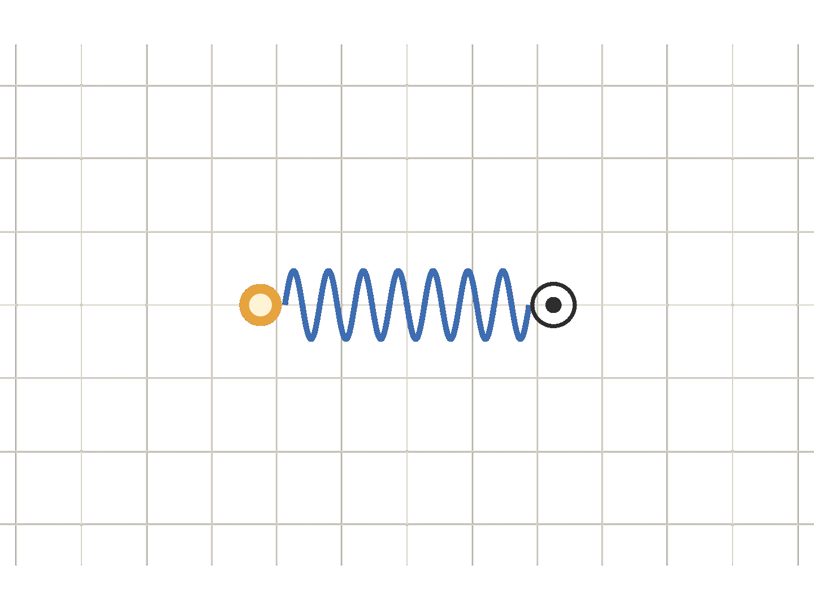{.screen-only .fragment fragment-index=1 width="100%"}

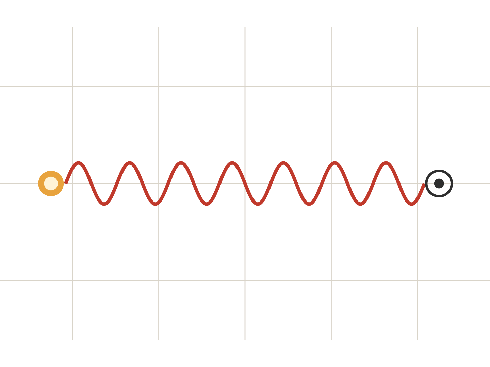{.print-only width="100%"}
:::

::: {.column width="46%"}
::: {.grid style="--cols: 1fr; --row-gap: 1.1em;"}

::: {.eqbox .fragment fragment-index=1 style="--eq-border: #2aa198; --eq-size: 0.8em; --eq-math-margin: 0.2em 0; --eq-pad: 0.2em 1.2em; text-align: center;"}
[redshift]{.kw style="display: block;"} $1 + z = \dfrac{\lambda_\mathrm{obs}}{\lambda_\mathrm{emit}} = \dfrac{1}{a}$
:::

::: {.eqbox .fragment fragment-index=2 style="--eq-border: #2aa198; --eq-size: 0.8em; --eq-math-margin: 0.2em 0; --eq-pad: 0.2em 1.2em; text-align: center;"}
[scale factor]{.kw style="display: block;"} $a(t),\qquad a_0 = 1,\qquad H = \dot a / a$
:::


::: {.eqbox .fragment fragment-index=3 style="--eq-border: #2aa198; --eq-size: 0.8em; --eq-math-margin: 0.2em 0; --eq-pad: 0.2em 1.2em; text-align: center;"}
[comoving distance]{.kw style="display: block;"} $\chi(z) = \displaystyle\int_0^z \frac{c\,dz'}{H(z')}$
:::

::: {.eqbox .fragment fragment-index=4 style="--eq-border: #2aa198; --eq-size: 0.8em; --eq-math-margin: 0.2em 0; --eq-pad: 0.2em 1.2em; text-align: center;"}
[expansion rate]{.kw style="display: block;"} $H(z) = H_0\sqrt{\Omega_m(1+z)^3 + \Omega_\Lambda}$
:::
:::
:::
::::

::: {.fragment fragment-index=5}
Dark energy accelerates the expansion today: it sets [$H(z)$]{.kw}, hence distances and the growth of structure
:::

## Mapping dark matter through weak gravitational lensing {#weak-gravitational-lensing corner="PhD/1_intro/lcdm/lcdm_model_lss.svg"}

{.corner .print-only}

<br/>

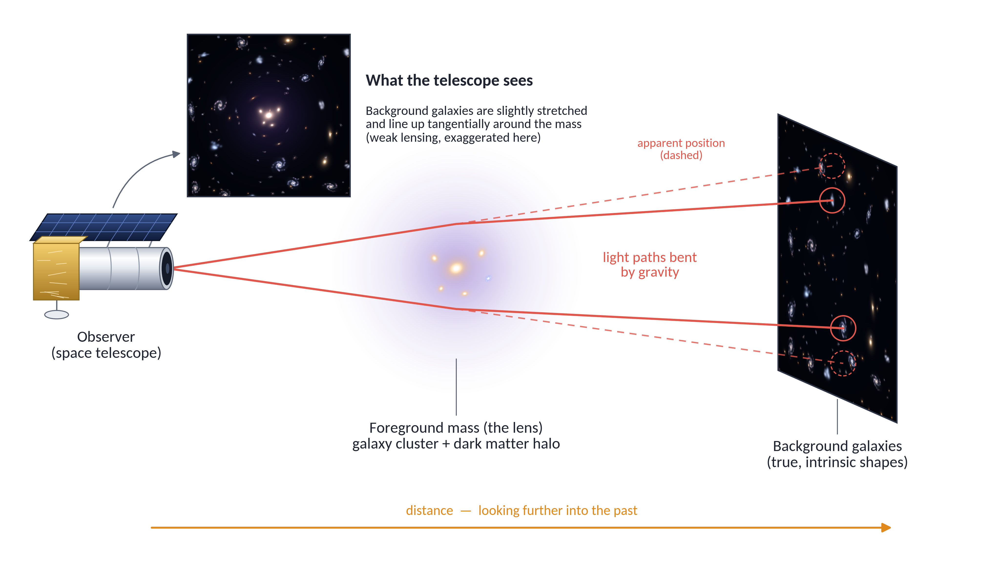{fig-align="center" width="86%"}

Matter along the line of sight bends light: [every background galaxy is slightly distorted]{.kw}

## Convergence and shear {corner="PhD/1_intro/lcdm/lcdm_model_lss.svg"}

{.corner .print-only}

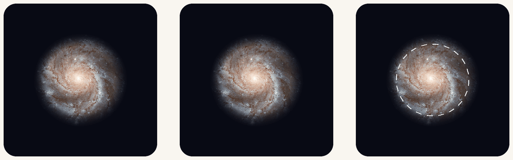{.screen-only fig-align="center" width="70%" style="margin: 1.2em auto -0.9em;"}

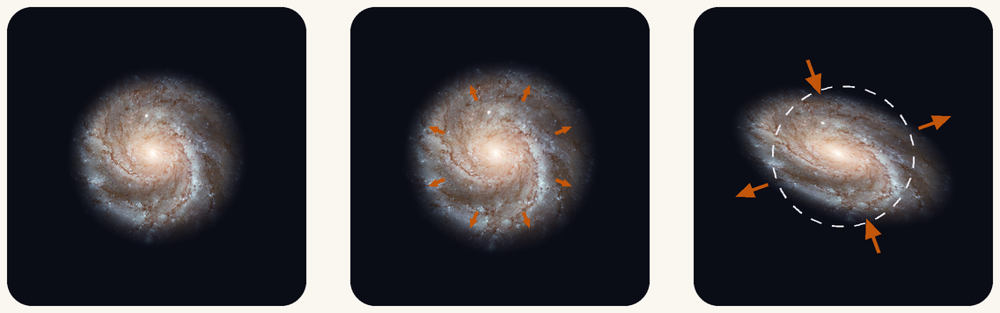{.print-only fig-align="center" width="70%" style="margin: 1.2em auto -0.9em;"}

::: {.grid style="--cols: 1fr 1fr 1fr; width: 70%; margin: 0 auto; text-align: center; font-size: 0.8em;"}
[galaxy]{}

[convergence [$\kappa$]{.kw} (spin 0)]{}

[shear [$\gamma_1, \gamma_2$]{.kw} (spin 2)]{}
:::

::: {.fragment}
::: {.eqbox style="--eq-border: #2aa198; width: fit-content; margin: 0.3em auto 0; --eq-size: 1em; --eq-math-margin: 0.3em 0;"}
$$
\mathbf{A} = \begin{pmatrix} 1-\kappa-\gamma_1 & -\gamma_2 \\ -\gamma_2 & 1-\kappa+\gamma_1 \end{pmatrix}
$$
:::
:::

::: {.fragment}
:::: {.solutionbox}
::: {.solutionbox-body style="font-size: 0.95em;"}
Matter deforms galaxies through [weak lensing]{.kw}, by a [spin-0]{.kw2} field, the [convergence $\kappa$]{.kw}, and a [spin-2]{.kw2} field, the two components of the [shear $\gamma$]{.kw}

::: {.fragment}
[Fun fact]{.kw2}: [$\kappa$, $\gamma$]{.kw2} relate like [$Q$, $U$]{.kw2}: $\gamma_1 + i\gamma_2$ is the same mathematical object as $Q + iU$, and splits into [$E$ and $B$]{.kw2} modes in the same way
:::
:::
::::
:::

## Kaiser–Squires on the sphere {corner="PhD/1_intro/lcdm/lcdm_model_lss.svg"}

{.corner .print-only}

:::: {.columns}
::: {.column style="width: 45%; padding-top: 1em;"}
[From $\kappa$ to $\gamma$]{.kw}

::: {.eqbox style="--eq-border: #2aa198; --eq-size: 0.8em; --eq-math-margin: 0.3em 0;"}
$$
\gamma^E_{\ell m} = -\sqrt{\frac{(\ell+2)(\ell-1)}{\ell(\ell+1)}}\;\kappa_{\ell m}, \qquad \gamma^B_{\ell m} = 0
$$
$$
\gamma_1 + i\gamma_2 = \sum_{\ell m} \gamma^E_{\ell m}\;{}_2Y_{\ell m}
$$
:::

::: {.fragment fragment-index=1}
[From $\gamma$ back to $\kappa$]{.kw}

::: {.eqbox style="--eq-border: #2aa198; --eq-size: 0.8em; --eq-math-margin: 0.3em 0;"}
$$
\kappa_{\ell m} = -\sqrt{\frac{\ell(\ell+1)}{(\ell+2)(\ell-1)}}\;\gamma^E_{\ell m}
$$
:::
:::
:::

::: {.column width="55%"}
:::: {.cell .bare style="--img-w: 200px; --cap-size: 0.6em; --cell-margin: 0.1em 0 0;"}
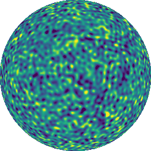{.screen-only}
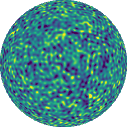{.print-only}

[convergence κ]{.caption}
::::

::: {style="text-align: center; margin: 0.1em 0; line-height: 0;"}
[]{.arrow .down style="--len: 34px; --head: 20px;"}
:::

:::: {.row .bare style="--gap: 24px; --justify: center; --img-w: 175px; --cap-size: 0.6em; --cell-margin: 0.1em 0 0;"}
::: {.cell}
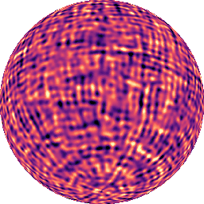{.screen-only}
{.print-only}

[shear γ~1~]{.caption}
:::

::: {.cell}
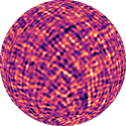{.screen-only}
{.print-only}

[shear γ~2~]{.caption}
:::
::::
:::
::::

::: {.fragment fragment-index=2}
:::: {.solutionbox}
::: {.solutionbox-body style="font-size: 0.75em;"}
- Kaiser–Squires is a [simple per-$\ell$ rescaling]{.kw} between $\kappa$ and the $E$-mode of the shear: one field, two views

:::
::::
:::

## Tomographic reconstruction {corner="PhD/1_intro/lcdm/lcdm_model_lss.svg"}

{.corner .print-only}

```{=html}
<div style="position: relative; height: 495px; margin-top: 0.1em;">
<div class="tomo-diagram">
<div class="fragment fade-out" data-fragment-index="1">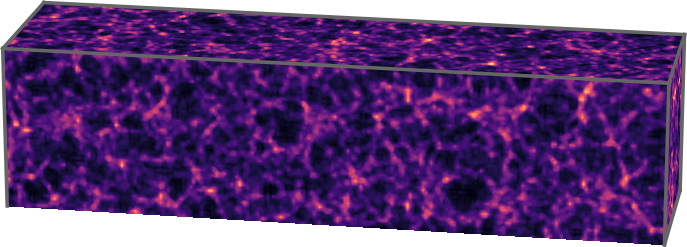<span style="position: absolute; font-size: 0.55em; color: #2E2E2E; text-align: center; left: 20px; width: 600px; top: 222px;">matter density field</span></div>
<div class="fragment" data-fragment-index="1">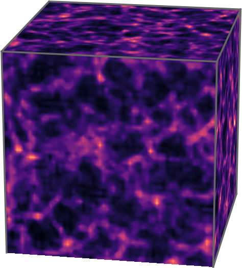<span style="position: absolute; font-size: 0.55em; color: #2E2E2E; text-align: center; left: 20px; width: 135px; top: 163px;">bin 4</span></div>
<div class="fragment" data-fragment-index="1">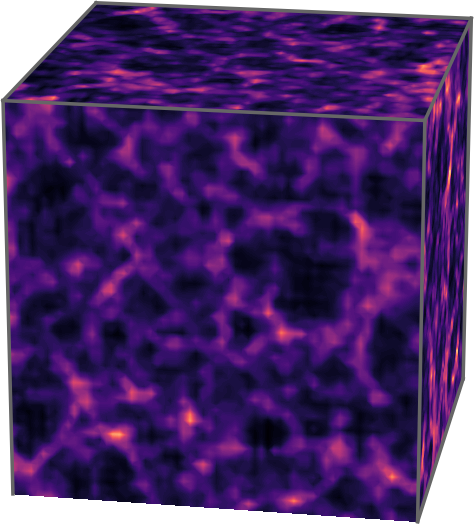<span style="position: absolute; font-size: 0.55em; color: #2E2E2E; text-align: center; left: 175px; width: 135px; top: 163px;">bin 3</span></div>
<div class="fragment" data-fragment-index="1">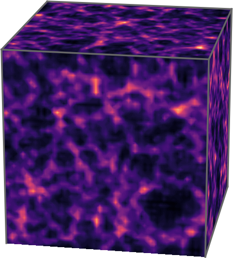<span style="position: absolute; font-size: 0.55em; color: #2E2E2E; text-align: center; left: 330px; width: 135px; top: 163px;">bin 2</span></div>
<div class="fragment" data-fragment-index="1">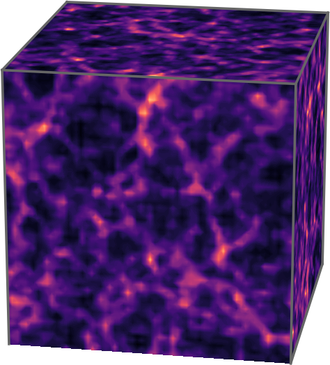<span style="position: absolute; font-size: 0.55em; color: #2E2E2E; text-align: center; left: 485px; width: 135px; top: 163px;">bin 1</span></div>
<div class="fragment" data-fragment-index="2"><svg style="position: absolute; left: 552px; top: 203px; width: 78px; height: 24px;" viewBox="0 0 78 24"><line x1="0" y1="12" x2="60" y2="12" stroke="#6E6E6E" stroke-width="5" stroke-linecap="round"/><polygon points="58,2 78,12 58,22" fill="#6E6E6E"/></svg>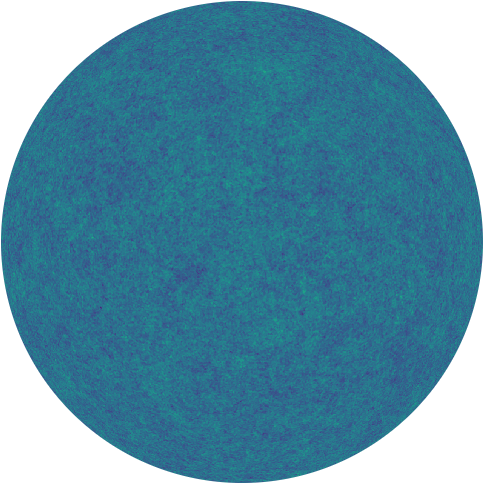<span style="position: absolute; font-size: 0.55em; color: #2E2E2E; text-align: center; left: 739px; top: 204px; text-align: left;">κ bin 1</span></div>
<div class="fragment" data-fragment-index="3"><svg style="position: absolute; left: 397px; top: 299px; width: 233px; height: 24px;" viewBox="0 0 233 24"><line x1="0" y1="12" x2="215" y2="12" stroke="#6E6E6E" stroke-width="5" stroke-linecap="round"/><polygon points="213,2 233,12 213,22" fill="#6E6E6E"/></svg>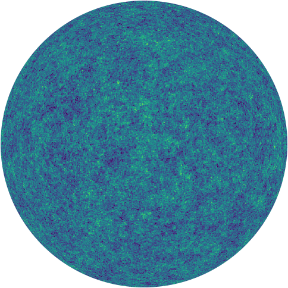<span style="position: absolute; font-size: 0.55em; color: #2E2E2E; text-align: center; left: 739px; top: 300px; text-align: left;">κ bin 2</span></div>
<div class="fragment" data-fragment-index="4"><svg style="position: absolute; left: 242px; top: 395px; width: 388px; height: 24px;" viewBox="0 0 388 24"><line x1="0" y1="12" x2="370" y2="12" stroke="#6E6E6E" stroke-width="5" stroke-linecap="round"/><polygon points="368,2 388,12 368,22" fill="#6E6E6E"/></svg>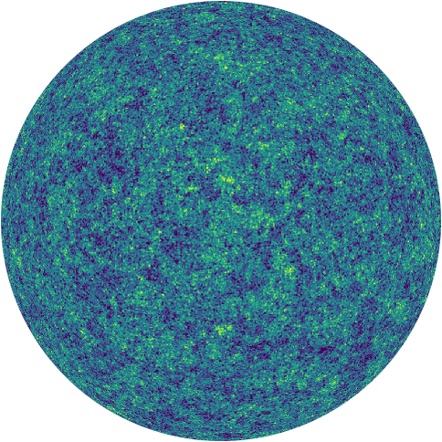<span style="position: absolute; font-size: 0.55em; color: #2E2E2E; text-align: center; left: 739px; top: 396px; text-align: left;">κ bin 3</span></div>
<div class="fragment" data-fragment-index="5"><svg style="position: absolute; left: 87px; top: 491px; width: 543px; height: 24px;" viewBox="0 0 543 24"><line x1="0" y1="12" x2="525" y2="12" stroke="#6E6E6E" stroke-width="5" stroke-linecap="round"/><polygon points="523,2 543,12 523,22" fill="#6E6E6E"/></svg>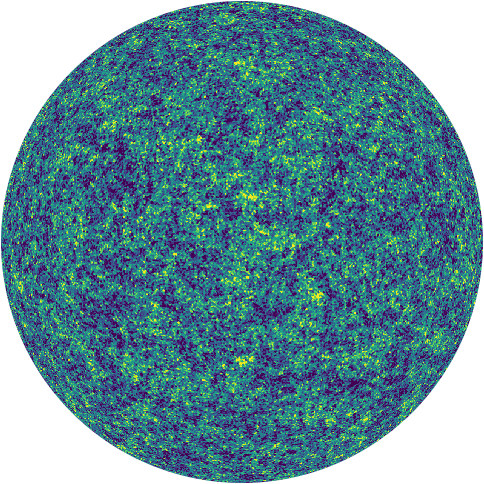<span style="position: absolute; font-size: 0.55em; color: #2E2E2E; text-align: center; left: 739px; top: 492px; text-align: left;">κ bin 4</span></div>
<div class="fragment" data-fragment-index="2"><svg style="position: absolute; left: 845px; top: 335px; width: 100px;" viewBox="0 0 110 60"><path d="M5 30 Q55 -12 105 30 Q55 72 5 30 Z" fill="none" stroke="#3B6FB6" stroke-width="4"/><circle cx="55" cy="30" r="15" fill="none" stroke="#3B6FB6" stroke-width="4"/><circle cx="55" cy="30" r="7" fill="#3B6FB6"/></svg><span style="position: absolute; font-size: 0.55em; color: #2E2E2E; text-align: center; left: 845px; width: 100px; top: 395px;">observer</span></div>
</div>
</div>
```

::: {.fragment fragment-index=6}
:::: {.solutionbox}
::: {.solutionbox-body style="font-size: 0.75em;"}
- Each source bin sees the [integral of all the matter]{.kw} in front of it: $\kappa_i(\hat n) = \int_0^{\chi_i} q_i(\chi)\,\delta(\chi\hat n,\chi)\,\mathrm{d}\chi$
- Farther bins cross more matter and see a stronger $\kappa$; comparing bins follows the [growth of structure]{.kw2} along the line of sight
:::
::::
:::

## Tomographic bins {corner="PhD/1_intro/lcdm/lcdm_model_lss.svg"}

{.corner .print-only}

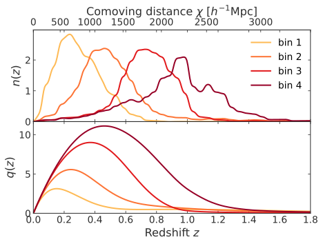{fig-align="center" width="62%"}

Each bin is sensitive to matter [about half-way to its galaxies]{.kw}

[DES Y3 source redshift distributions]{.credit}

## From shear to cosmology {corner="PhD/1_intro/lcdm/lcdm_model_lss.svg"}

{.corner .print-only}

:::::: {.grid .bare style="--cols: 62px 96px 50px 205px 70px 150px 50px 140px 150px; grid-template-rows: 300px 50px 190px; justify-content: start; --gap: 2px; --row-gap: 0; margin-top: 0.2em;"}
::: {style="font-size: 0.6em; font-weight: 700; letter-spacing: 0.05em; color: #C2560A;"}
DATA
:::

::: {.cell}
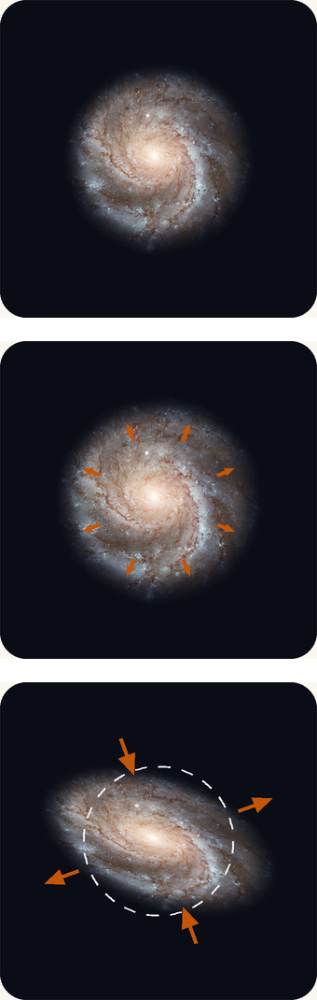{style="width: 82px;"}

[galaxy\
shapes]{.caption style="--cap-size: 0.62em; --cap-lh: 1.2; margin-top: 0.15em;"}
:::

::: {style="text-align: center; line-height: 0;"}
[]{.arrow style="--len: 50px; --w: 4px; --head: 18px;"}
:::

::: {.cell}
{.screen-only style="width: 150px;"}
{.print-only style="width: 150px;"}

[shear $\gamma_1, \gamma_2$]{.caption style="--cap-size: 0.62em; --cap-lh: 1.2; margin-top: 0.15em;"}
:::

::: {style="text-align: center;"}
[Inverse Kaiser–Squires]{style="display: block; font-size: 0.55em; color: #6E6E6E; line-height: 1.15; margin-bottom: 3px;"}

[]{.arrow style="--len: 64px; --w: 4px; --head: 18px;"}
:::

::: {.cell}
{.screen-only style="width: 140px;"}
{.print-only style="width: 140px;"}

[convergence $\kappa$ per bin]{.caption style="--cap-size: 0.62em; --cap-lh: 1.2; margin-top: 0.15em;"}
:::

::: {style="text-align: center; line-height: 0;"}
[]{.arrow style="--len: 50px; --w: 4px; --head: 18px;"}
:::

::: {style="border: 2px solid #C2560A; border-radius: 10px; padding: 0.4em 0.45em; font-size: 0.72em; line-height: 1.35; background: #FFFFFF; text-align: center;"}
measured\
$\hat C_\ell^{\,ij}$
:::

::: {style="grid-column: 1 / 9; height: 1px;"}
:::

::: {.fragment fragment-index=1 style="font-size: 0.6em; font-weight: 700; letter-spacing: 0.05em; color: #521463; text-align: center;"}
THEORY
:::

::: {.fragment fragment-index=1 style="border: 2px solid #521463; border-radius: 10px; padding: 0.4em 0.45em; font-size: 0.72em; line-height: 1.35; background: #FFFFFF; text-align: center;"}
$\Omega_\mathrm{m},$\
$\sigma_8, \dots$
:::

::: {.fragment fragment-index=1 style="text-align: center; line-height: 0;"}
[]{.arrow style="--len: 50px; --w: 4px; --head: 18px;"}
:::

::: {.cell .fragment fragment-index=1}
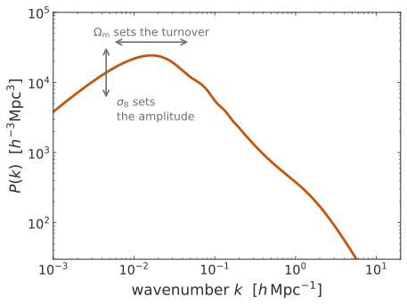{style="width: 200px;"}

[matter spectrum $P(k, z)$]{.caption style="--cap-size: 0.62em; --cap-lh: 1.2; margin-top: 0.15em;"}
:::

::: {.fragment fragment-index=1 style="text-align: center; grid-column: span 3;"}
[Limber, with the lensing kernels $q_i(\chi)$]{style="display: block; font-size: 0.55em; color: #6E6E6E; line-height: 1.15; margin-bottom: 3px;"}

[]{.arrow style="--len: 250px; --w: 4px; --head: 18px;"}
:::

::: {.fragment fragment-index=1 style="border: 2px solid #521463; border-radius: 10px; padding: 0.4em 0.45em; font-size: 0.72em; line-height: 1.35; background: #FFFFFF; text-align: center;"}
predicted\
$C_\ell^{\,ij}(\Omega_\mathrm{m}, \sigma_8)$
:::

:::: {.row .flat .fragment fragment-index=2 style="grid-column: 9; grid-row: 1 / 4; align-self: start; margin-top: 150px; height: 295px; --gap: 0;"}
{style="width: 30px; height: 295px; flex: none;"}

::: {style="border: 2px solid #2E2E2E; border-radius: 10px; padding: 0.5em 0.6em; font-size: 0.75em; line-height: 1.35; background: #FFFFFF; text-align: center; margin-left: 6px;"}
compare\
↓\
[$\Omega_\mathrm{m},\ \sigma_8$]{style="color: #C2560A; font-weight: 700;"}
:::
::::
::::::

::: {.fragment fragment-index=3}
:::: {.solutionbox}
::: {.solutionbox-body style="font-size: 0.8em;"}
- Same recipe as the CMB: compress the maps into [angular power spectra $C_\ell$]{.kw} and compare them with the prediction
- This is called a [two-point correlation analysis (2PCF)]{.kw}
:::
::::
:::

## The two-point analysis {corner="PhD/1_intro/lcdm/lcdm_model_lss.svg"}

<br/>
<br/>

{.corner .print-only}

:::: {.columns}
::: {.column width="50%"}
{fig-align="center" width="100%"}
:::

::: {.column width="50%"}
::: {.eqbox style="--eq-border: #2aa198; --eq-size: 0.8em; --eq-math-margin: 0.2em 0; margin-top: 1.6em;"}
$$
C_\ell^{ij} = \int \mathrm{d}\chi\, \frac{q_i(\chi)\,q_j(\chi)}{\chi^2}\; P\!\left(k=\tfrac{\ell+1/2}{\chi}, z\right)
$$
:::

[Each multipole $\ell$ reads the [matter spectrum]{.kw} at $k = \ell/\chi$, weighted by the [lensing kernels $q_i$]{.kw2} of the tomographic bins]{style="font-size: 0.8em;"}

::: {.fragment fragment-index=1}
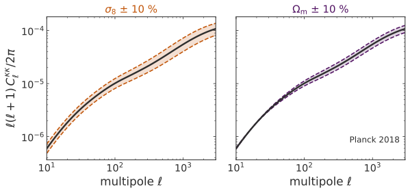{fig-align="center" width="100%" style="margin: 0.2em 0 0;"}
:::
:::
::::

::: {.fragment fragment-index=2}
:::: {.solutionbox}
::: {.solutionbox-body style="font-size: 0.85em;"}
- [$\Omega_\mathrm{m}$]{.kw}: how much matter · [$\sigma_8$]{.kw}: how clumpy it is on $8\,h^{-1}\mathrm{Mpc}$ scales
- Weak lensing probes both parameters, and best the combination [$S_8 = \sigma_8\sqrt{\Omega_\mathrm{m}/0.3}$]{.kw2}
:::
::::
:::

## Current constraints on $S_8$ {corner="PhD/1_intro/lcdm/lcdm_model_lss.svg"}

{.corner .print-only}

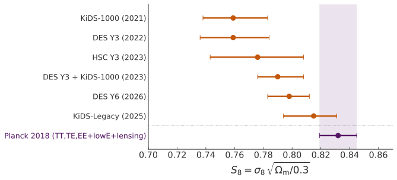{fig-align="center" width="90%"}

::: {.fragment}
:::: {.solutionbox}
::: {.solutionbox-body}
- Lensing has sat below the [CMB]{.kw}: the [$S_8$ tension]{.kw}, now shrinking with better data
:::
::::
:::

## Limitation of the two-point analysis {corner="PhD/1_intro/lcdm/lcdm_model_lss.svg"}

{.corner .print-only}

::: {.r-stack}
:::: {.columns style="width: 100%;"}
::: {.column style="width: 50%; text-align: center;"}
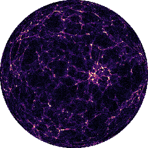{.screen-only width="265px" style="margin: 0.4em 0 0;"}
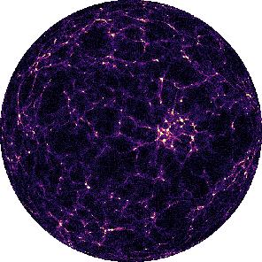{.print-only width="265px" style="margin: 0.4em 0 0;"}

[the cosmic web]{style="font-size: 0.75em;"}
:::

::: {.column style="width: 50%; text-align: center;"}
{.screen-only width="265px" style="margin: 0.4em 0 0;"}
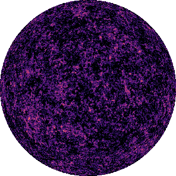{.print-only width="265px" style="margin: 0.4em 0 0;"}

[a Gaussian field with the [same $C_\ell$]{.kw}]{style="font-size: 0.75em;"}
:::
::::

:::: {.figcadre .fragment fragment-index=1 style="width: 40%; margin-top: 11.5em;"}
::: {.figcadre-body}
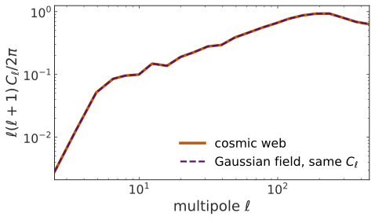{width="100%" style="margin: 0.4em 0 0;"}
:::
::::
:::

::: {.fragment fragment-index=2}
:::: {.solutionbox}
::: {.solutionbox-body style="font-size: 0.85em;"}
- The 2PCF captures only the [Gaussian features]{.kw} of a field
- We need to go beyond the 2PCF to extract more physical information: [Contribution 2]{.kw2}
:::
::::
:::

## The $\Omega_\mathrm{m}$–$\sigma_8$ degeneracy {corner="PhD/1_intro/lcdm/lcdm_model_lss.svg"}

{.corner .print-only}

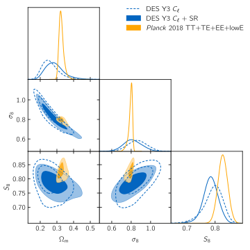{fig-align="center" height="480px" style="margin-top: 0.1em;"}

[DES Y3 cosmic shear $C_\ell$, Doux et al. (2022)]{style="display: block; text-align: center; font-size: 0.55em; color: #6E6E6E; margin-top: -0.4em;"}

::: {.fragment}
:::: {.solutionbox}
::: {.solutionbox-body style="font-size: 0.85em;"}
- The two-point posterior is [degenerate]{.kw}: lensing pins down [$S_8$]{.kw2}, not $\Omega_\mathrm{m}$ and $\sigma_8$ separately
:::
::::
:::

## From model to observation

{fig-align="center" width="42%" style="margin: -0.8em auto -0.6em; position: relative; left: -7%;"}

:::: {.columns style="font-size: 0.8em;"}
::: {.column width="50%"}
[Target]{.kw}: the tensor-to-scalar ratio $r$<br/>[the energy scale of inflation]{style="font-size: 0.8em; color: #6E6E6E;"}

::: {.fragment fragment-index=1}
[Obstacle]{.kw}: Galactic foregrounds hide the primordial $B$-modes
:::

::: {.fragment fragment-index=2}
:::: {.solutionbox}
::: {.solutionbox-body style="text-align: center;"}
[Contribution 1]{.kw2}<br/>Spatially varying component separation for space-based telescopes
:::
::::
:::
:::

::: {.column width="50%"}
[Target]{.kw}: $\Omega_\mathrm{m}$ and $\sigma_8$<br/>[dark matter and the late-time expansion]{style="font-size: 0.8em; color: #6E6E6E;"}

::: {.fragment fragment-index=1}
[Obstacle]{.kw}: the two-point analysis misses the non-Gaussian information
:::

::: {.fragment fragment-index=2}
:::: {.solutionbox}
::: {.solutionbox-body style="text-align: center;"}
[Contribution 2]{.kw2}<br/>Field-level inference for Stage IV weak lensing surveys<br/>using differentiable forward models
:::
::::
:::
:::
::::

::: {.fragment fragment-index=3}
:::: {.solutionbox}
::: {.solutionbox-body style="text-align: center;"}
How do we [infer the cosmological parameters]{.kw} from these two probes?
:::
::::
:::

# Statistical inference for cosmology

::: {.rail-stack}
{.rail-full}

{.rail-focus}
:::

## Inverse problems in cosmology

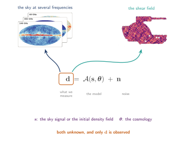{fig-align="center" width="80%"}


## Solving Inverse Problems : Analytical likelihood

<br/>

[Analytical inversion]{.kw} [(Stompor et al. 2009)]{style="font-size: 0.7em; color: #6E6E6E;"}

::: {.grid style="--cols: auto 1fr; --gap: 1.2em; --row-gap: 1.05em; --align: center; margin-top: 0.8em; font-size: 0.9em;"}
::: {.eqbox style="--eq-size: 1.3em; --eq-math-margin: 0.3em 0; --eq-pad: 0.15em 1em; justify-self: stretch; text-align: center;"}
$$\mathbf{d} = \mathbf{A}(\boldsymbol\theta)\,\mathbf{s} + \mathbf{n}$$
:::

the data are linear in the signal $\mathbf{s}$, and the mixing $\mathbf{A}$ depends on a few parameters $\boldsymbol\theta$

::: {.eqbox .fragment fragment-index=1 style="--eq-size: 1.3em; --eq-math-margin: 0.3em 0; --eq-pad: 0.15em 1em; justify-self: stretch; text-align: center;"}
$$-2\ln\mathcal{L}(\boldsymbol\theta,\mathbf{s}) = \big(\mathbf{d}-\mathbf{A}\mathbf{s}\big)^{\top}\mathbf{N}^{-1}\big(\mathbf{d}-\mathbf{A}\mathbf{s}\big)$$
:::

[for Gaussian noise of covariance $\mathbf{N}$]{.fragment fragment-index=1}

::: {.eqbox .fragment fragment-index=2 style="--eq-size: 1.3em; --eq-math-margin: 0.3em 0; --eq-pad: 0.15em 1em; justify-self: stretch; text-align: center;"}
$$\hat{\mathbf{s}}(\boldsymbol\theta) = \left(\mathbf{A}^{\top}\mathbf{N}^{-1}\mathbf{A}\right)^{-1}\mathbf{A}^{\top}\mathbf{N}^{-1}\mathbf{d}$$
:::

[setting the derivative with respect to $\mathbf{s}$ to zero]{.fragment fragment-index=2}

::: {.eqbox .fragment fragment-index=3 style="--eq-size: 1.3em; --eq-math-margin: 0.3em 0; --eq-pad: 0.15em 1em; justify-self: stretch; text-align: center;"}
$$-2\ln\mathcal{L}(\boldsymbol\theta) = -\left(\mathbf{A}^{\top}\mathbf{N}^{-1}\mathbf{d}\right)^{\top}\left(\mathbf{A}^{\top}\mathbf{N}^{-1}\mathbf{A}\right)^{-1}\left(\mathbf{A}^{\top}\mathbf{N}^{-1}\mathbf{d}\right)$$
:::

[substituting $\hat{\mathbf{s}}$ back, up to a constant, leaves a likelihood of $\boldsymbol\theta$ alone]{.fragment fragment-index=3}
:::

::: {.fragment fragment-index=4}
:::: {.solutionbox style="margin-top: 1.2em;"}
::: {.solutionbox-body style="font-size: 0.85em;"}
- The signal $\mathbf{s}$ is removed analytically, so only the few parameters $\boldsymbol\theta$ are searched
- This requires a model [linear in $\mathbf{s}$]{.kw} with Gaussian noise
:::
::::
:::

## Solving Inverse Problems : Forward Modelling {visibility="uncounted"}

<br/>

[Forward modelling]{.kw}


::: {.grid style="--cols: 1fr 1fr 1.15fr; --gap: 1em; --align: start;"}
::: {.fragment fragment-index=1 style="text-align: center;"}
[Implicit inference]{.kw2}

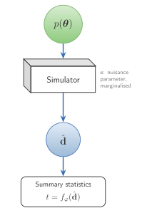{height="500px" style="margin: 0.2em auto 0;"}
:::

::: {.fragment fragment-index=2 style="text-align: center;"}
[Explicit inference]{.kw}

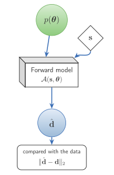{height="500px" style="margin: 0.2em auto 0;"}
:::

::: {style="padding-top: 1.6em;"}
::: {.eqbox style="--eq-size: 0.95em; --eq-math-margin: 0.15em 0; --eq-pad: 0.3em 0.8em; margin: 0 0 0.6em; text-align: center;"}
$$\hat{\mathbf{d}} = \mathcal{A}(\mathbf{s},\boldsymbol\theta)$$
:::

::: {.eqbox style="--eq-size: 0.95em; --eq-math-margin: 0.15em 0; --eq-pad: 0.3em 0.8em; margin: 0 0 1em; text-align: center;"}
$$-\ln\mathcal{L}(\boldsymbol\theta,\mathbf{s}) \;\propto\; \frac{\lVert \hat{\mathbf{d}} - \mathbf{d} \rVert_2^2}{\sigma^2}$$
:::

::: {.fragment fragment-index=3}
:::: {.solutionbox}
::: {.solutionbox-body style="font-size: 0.85em;"}
- Explicit inference is more [interpretable]{.kw} than its implicit counterpart
- It fits the latent field [$\mathbf{s}$]{.kw} together with $\boldsymbol\theta$, instead of marginalising over it
:::
::::
:::

::: {.fragment fragment-index=4}
:::: {.solutionbox style="margin-top: 1em;"}
::: {.solutionbox-body style="font-size: 0.85em;"}
This thesis uses explicit inference for both the [analytical model]{.kw2} and the [forward model]{.kw2}
:::
::::
:::
:::
:::

## Bayesian inference in cosmology

:::: {.columns}
::: {.column style="width: 60%;"}
[Bayes' theorem]{.kw}

::: {.eqbox style="--eq-math-margin: 0.25em 0; --eq-pad: 0.15em 1.1em; width: fit-content; margin: 0; --eq-size: 1.4em; margin-top: 0.3em;"}
$$\underbrace{p(\boldsymbol\theta\mid\mathbf{d})}_{\text{posterior}} \;=\; \frac{\overbrace{p(\mathbf{d}\mid\boldsymbol\theta)}^{\text{likelihood}}\;\overbrace{p(\boldsymbol\theta)}^{\text{prior}}}{\underbrace{p(\mathbf{d})}_{\text{evidence}}}$$
:::

::: {.eqbox .fragment fragment-index=1 style="--eq-math-margin: 0.25em 0; --eq-pad: 0.15em 1.1em; width: fit-content; margin: 0; --eq-size: 1.35em; margin-top: 0.8em;"}
$$p(\boldsymbol\theta\mid\mathbf{d}) \;\propto\; p(\mathbf{d}\mid\boldsymbol\theta)\;p(\boldsymbol\theta)$$
:::

::: {.fragment fragment-index=2 style="margin-top: 1.4em;"}
[Joint probabilistic modelling]{.kw2}

::: {.eqbox style="--eq-math-margin: 0.25em 0; --eq-pad: 0.15em 1.1em; width: fit-content; margin: 0; --eq-size: 1.3em; --eq-border: #521463; margin-top: 0.3em;"}
$$p(\boldsymbol\theta,\mathbf{s}\mid\mathbf{d}) \;\propto\; \underbrace{p(\mathbf{d}\mid\mathbf{s},\boldsymbol\theta)}_{\text{likelihood}}\;\underbrace{p(\mathbf{s}\mid\boldsymbol\theta)}_{\text{latent prior}}\;\underbrace{p(\boldsymbol\theta)}_{\text{prior}}$$
:::
:::
:::

::: {.column style="width: 40%;"}
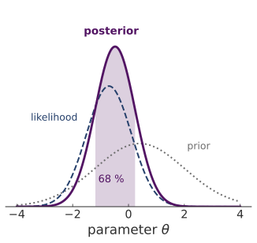{width="100%" style="margin: 0;"}

::: {.fragment fragment-index=2}
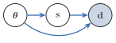{height="115px" style="display: block; margin: 3.2em auto 0;"}
:::
:::
::::

## Optimising the posterior

:::: {.columns}
::: {.column style="width: 50%; text-align: center;"}
[Minimising the negative log-likelihood]{.kw}

::: {.r-stack}
::: {.fragment .fade-out fragment-index=3}
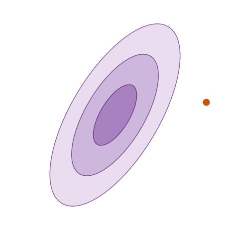{.screen-only height="360px" style="margin: 0.2em 0 0;"}
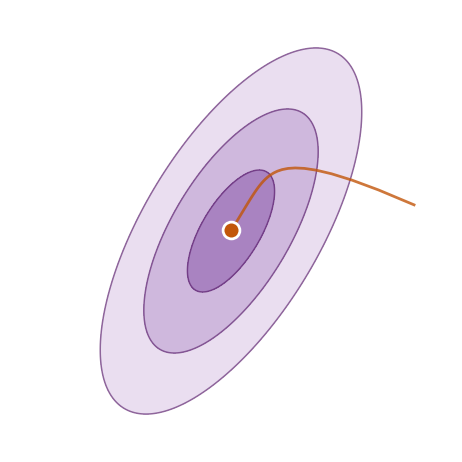{.print-only height="360px" style="margin: 0.2em 0 0;"}
:::

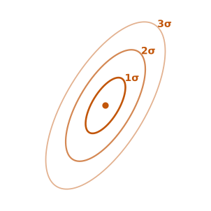{.fragment fragment-index=3 height="360px" style="margin: 0.2em 0 0;"}
:::
:::

::: {.column .fragment fragment-index=1 style="width: 50%; text-align: center;"}
[Sampling the full posterior]{.kw}

::: {.r-stack}
::: {.fragment .fade-out fragment-index=3}
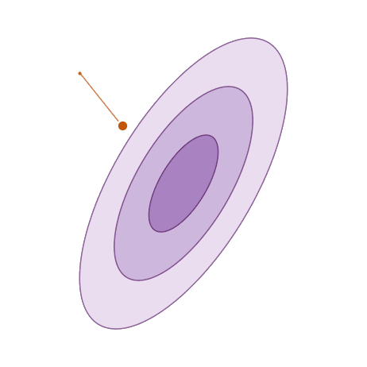{.screen-only height="360px" style="margin: 0.2em 0 0;"}
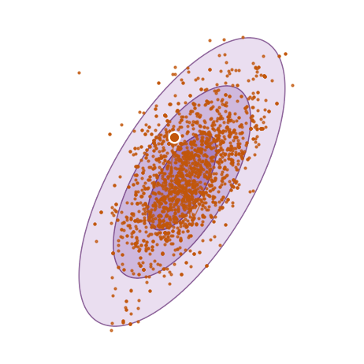{.print-only height="360px" style="margin: 0.2em 0 0;"}
:::

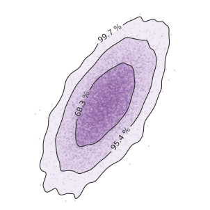{.fragment fragment-index=4 height="360px" style="margin: 0.2em 0 0;"}
:::
:::
::::

::: {.r-stack}
::: {.fragment .fade-in-then-out fragment-index=2 style="width: 100%;"}
:::: {.solutionbox}
::: {.solutionbox-body style="text-align: center; font-size: 1.05em;"}
How do we measure how much we [trust the result]{.kw}?
:::
::::
:::

::: {.grid style="--cols: 1fr 1fr; --gap: 1.2em; --align: stretch; width: 100%;"}
::: {.fragment fragment-index=3}
:::: {.solutionbox style="height: 100%;"}
::: {.solutionbox-body style="font-size: 0.9em;"}
The inverse Hessian of $-\ln\mathcal{L}$ at the minimum gives the covariance, $\mathbf{C} = \mathbf{H}^{-1}$, and with it the [confidence intervals]{.kw}, assuming the posterior is Gaussian
:::
::::
:::

::: {.fragment fragment-index=4}
:::: {.solutionbox style="height: 100%;"}
::: {.solutionbox-body style="font-size: 0.9em;"}
The samples give the [credible regions]{.kw} directly: the smallest regions holding 68, 95 and 99.7 % of them
:::
::::
:::
:::
:::

::: {.fragment fragment-index=5 style="position: absolute; top: 0; left: 0; width: 100%; height: 100%; min-height: 700px; z-index: 20; background: rgba(250, 247, 240, 0.86); display: flex; align-items: center; justify-content: center;"}
:::: {.solutionbox style="width: 88%;"}
::: {.solutionbox-body style="text-align: center; font-size: 1.15em;"}
Both methods become more efficient with a [differentiable likelihood]{.kw}
:::
::::
:::

## Differentiable programming

<br/>
<br/>

:::: {.columns}
::: {.column style="width: 38%; text-align: center;"}
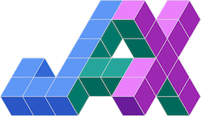{style="display: block; height: 95px; margin: 0 auto 22px;"}
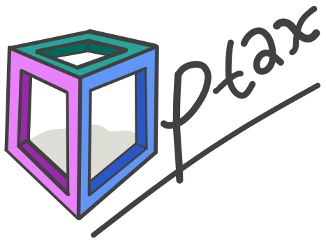{style="display: block; height: 95px; margin: 0 auto 22px;"}
{style="display: block; height: 95px; margin: 0 auto 22px;"}
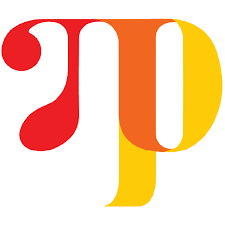{style="display: block; height: 95px; margin: 0 auto;"}
:::

::: {.column width="62%"}
:::: {.solutionbox style="margin-top: 0.6em;"}
::: {.solutionbox-body style="font-size: 1.2em;"}
- [JAX]{.kw} computes exact gradients of numerical code by automatic differentiation
- Custom gradients replace the automatic ones where memory or speed requires it
- The same code runs on CPUs, GPUs and multi-GPU clusters
- I used [Optax]{.kw2} for optimisation
- [BlackJAX]{.kw2} and [NumPyro]{.kw2} for sampling
:::
::::
:::
::::

::: {.fragment}
:::: {.solutionbox}
::: {.solutionbox-body style="text-align: center;"}
Can better numerical methods extract [more cosmology]{.kw} from the same data?
:::
::::
:::

# Contribution 1: spatially varying CMB component separation

::: {.rail-stack}
{.rail-full}

{.rail-focus}
:::

::: {style="display: flex; justify-content: center; align-items: center; gap: 36px; margin-top: 1.2em;"}
{style="height: 70px;"}
[](https://github.com/CMBSciPol/furax-cs)
[](https://github.com/CMBSciPol/furax)
:::

## From sky data to clean CMB maps

:::: {.row .flat .bare style="--align: flex-start; --gap: 0; height: 405px; margin-top: 0.2em;"}
::: {.r-stack style="width: 520px; height: 405px; flex: none;"}
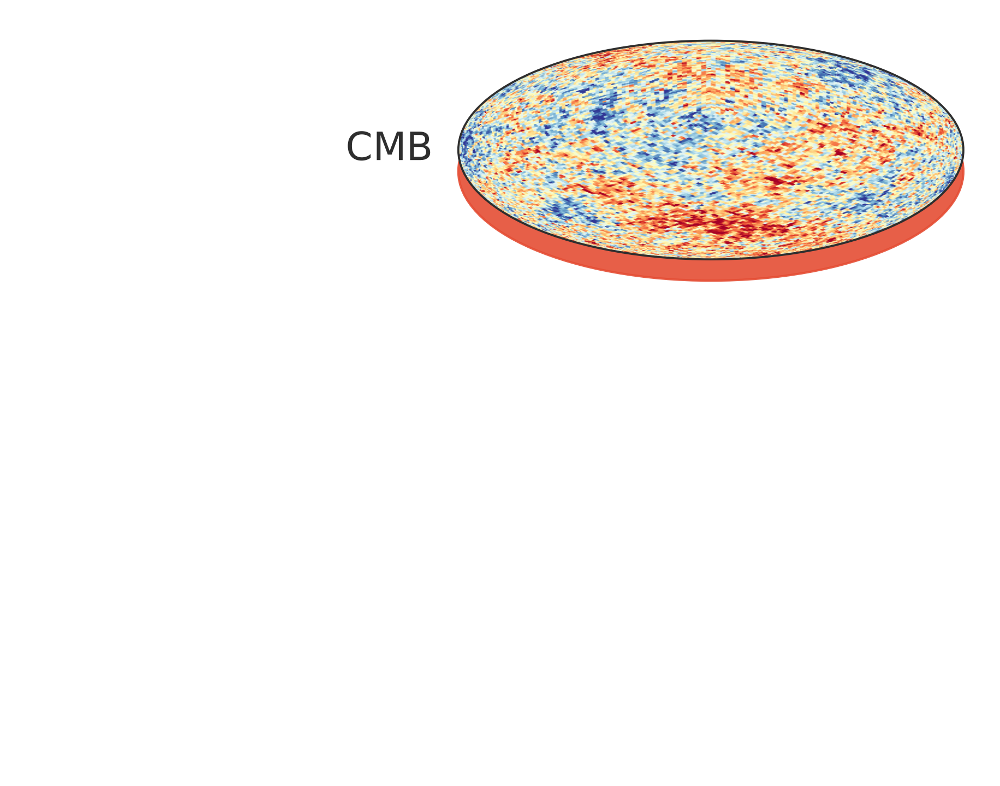{.fragment .fade-out fragment-index=1 style="height: 405px;"}

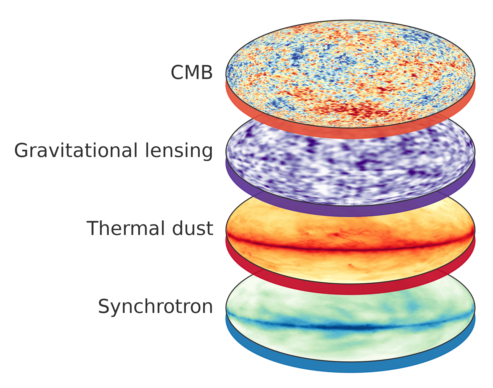{.fragment fragment-index=1 style="height: 405px;"}
:::

{.fragment fragment-index=3 style="width: 90px; height: 405px; flex: none; margin-left: -15px;"}

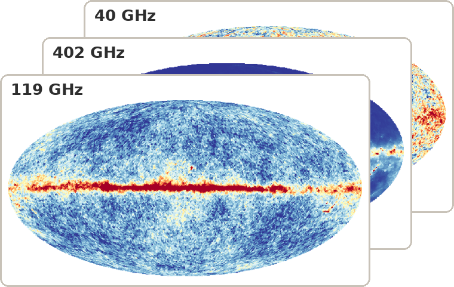{.fragment fragment-index=2 style="width: 440px; flex: none; margin: 35px 0 0 -5px;"}
::::

::::: {.fragment fragment-index=4 style="margin-top: 38px;"}
:::: {.solutionbox}
::: {.solutionbox-header}
CMB component separation
:::

::: {.solutionbox-body .row .flat style="font-size: 0.9em; --gap: 24px;"}
::: {style="flex: 1;"}
- LiteBIRD observes the sky in [15 frequency bands]{.kw}, from 40 to 402 GHz
- The CMB must be separated from the [foregrounds]{.kw} that contaminate it
- Only then can [$r$]{.kw} be estimated without bias
:::

{style="height: 80px; margin: 0;"}
:::
::::
:::::

## Parametric component separation: the spectral model

<br/>

### [Synchrotron and dust (Galactic foregrounds)]{.kw}

:::: {.columns style="text-align: center;"}
::: {.column width="50%"}
::: {.eqbox style="--eq-border: #3b6fb6; --eq-size: 1.05em; --eq-math-margin: 0.1em 0 0.2em; --eq-pad: 0.25em 0.9em 0.05em; width: fit-content; margin: 0.2em auto 0.3em;"}
[[Synchrotron]{style="color: #3b6fb6; font-weight: 700;"}: power law]{style="font-size: 0.75em;"}

$$A^{\mathrm{sync}}_\nu({\color{#3b6fb6}\beta_s}) \;\propto\; \left(\frac{\nu}{\nu_0}\right)^{\color{#3b6fb6}\beta_s}$$
:::

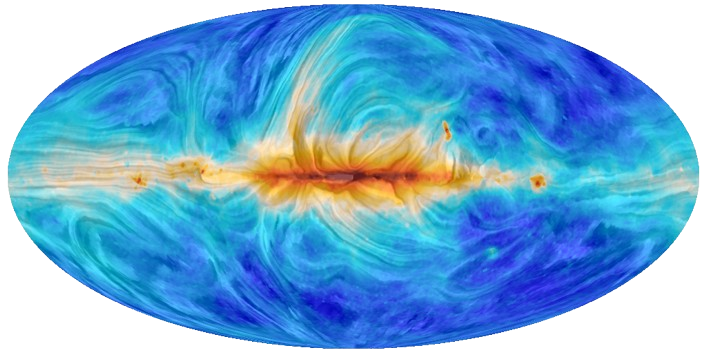{height="165px" style="margin: 0;"}

[Planck: synchrotron]{style="font-size: 0.6em; color: #6E6E6E; display: block; margin-top: -0.9em;"}
:::

::: {.column width="50%"}
::: {.eqbox style="--eq-border: #d68910; --eq-size: 1.05em; --eq-math-margin: 0.1em 0 0.2em; --eq-pad: 0.25em 0.9em 0.05em; width: fit-content; margin: 0.2em auto 0.3em;"}
[[Dust]{style="color: #d68910; font-weight: 700;"}: modified black body]{style="font-size: 0.75em;"}

$$A^{\mathrm{dust}}_\nu({\color{#d68910}\beta_d}, {\color{#d68910}T_d}) \;\propto\; \left(\frac{\nu}{\nu_0}\right)^{{\color{#d68910}\beta_d}+1}\frac{e^{h\nu_0/k{\color{#d68910}T_d}}-1}{e^{h\nu/k{\color{#d68910}T_d}}-1}$$
:::

{height="165px" style="margin: 0;"}

[Planck: thermal dust]{style="font-size: 0.6em; color: #6E6E6E; display: block; margin-top: -0.9em;"}
:::
::::

::: {.fragment}
### [The spectral likelihood]{.kw}

::: {.eqbox style="--eq-border: #521463; --eq-size: 1.1em; --eq-math-margin: 0.2em 0; width: fit-content; margin: 0.3em auto 0; text-align: center;"}
$$\mathbf{d}_\nu = A^{\mathrm{cmb}}_\nu\,\mathbf{s}_{\mathrm{cmb}} + A^{\mathrm{dust}}_\nu({\color{#d68910}\beta_d},{\color{#d68910}T_d})\,\mathbf{s}_{\mathrm{dust}} + A^{\mathrm{sync}}_\nu({\color{#3b6fb6}\beta_s})\,\mathbf{s}_{\mathrm{sync}} + \mathbf{n}_\nu$$
:::
:::

<br/>

::: {.fragment}
::: {.eqbox style="--eq-border: #521463; --eq-size: 1.1em; --eq-math-margin: 0.2em 0; width: fit-content; margin: 0.45em auto 0; text-align: center;"}
$$-2\ln\mathcal{L}(\boldsymbol\beta) = -\left(\mathbf{A}^{\top}\mathbf{N}^{-1}\mathbf{d}\right)^{\top}\left(\mathbf{A}^{\top}\mathbf{N}^{-1}\mathbf{A}\right)^{-1}\left(\mathbf{A}^{\top}\mathbf{N}^{-1}\mathbf{d}\right), \qquad \boldsymbol\beta = ({\color{#d68910}\beta_d}, {\color{#d68910}T_d}, {\color{#3b6fb6}\beta_s})$$
:::
:::

## Spatially varying foregrounds

<br/>

::: {}
### [c1d0s0]{.kw} [one spectrum for the whole sky]{style="font-size: 0.6em; font-weight: 400; color: #6E6E6E;"} {style="margin: 0 0 0.1em;"}

::: {.grid .bare style="--cols: 1fr 1fr 1fr 1.3fr; --gap: 0.6em; --row-gap: 0.2em; --align: center; text-align: center;"}
[synchrotron index $\beta_s$]{style="font-size: 0.6em;"}

[dust index $\beta_d$]{style="font-size: 0.6em;"}

[dust temperature $T_d$]{style="font-size: 0.6em;"}

[SEDs of 300 pixels]{style="font-size: 0.6em;"}

{height="128px" style="margin: 0;"}

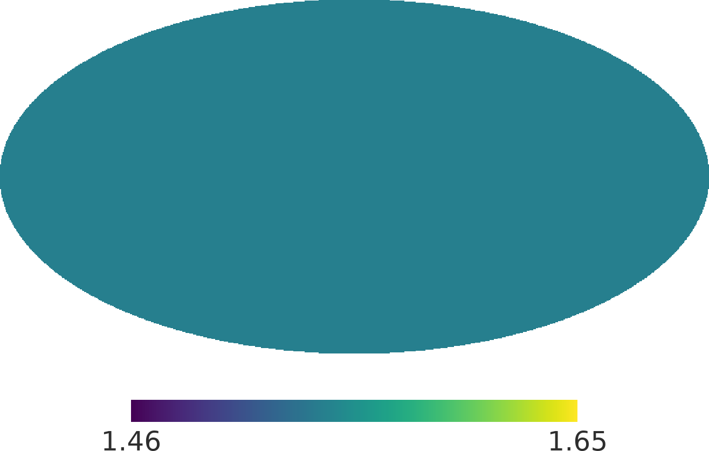{height="128px" style="margin: 0;"}

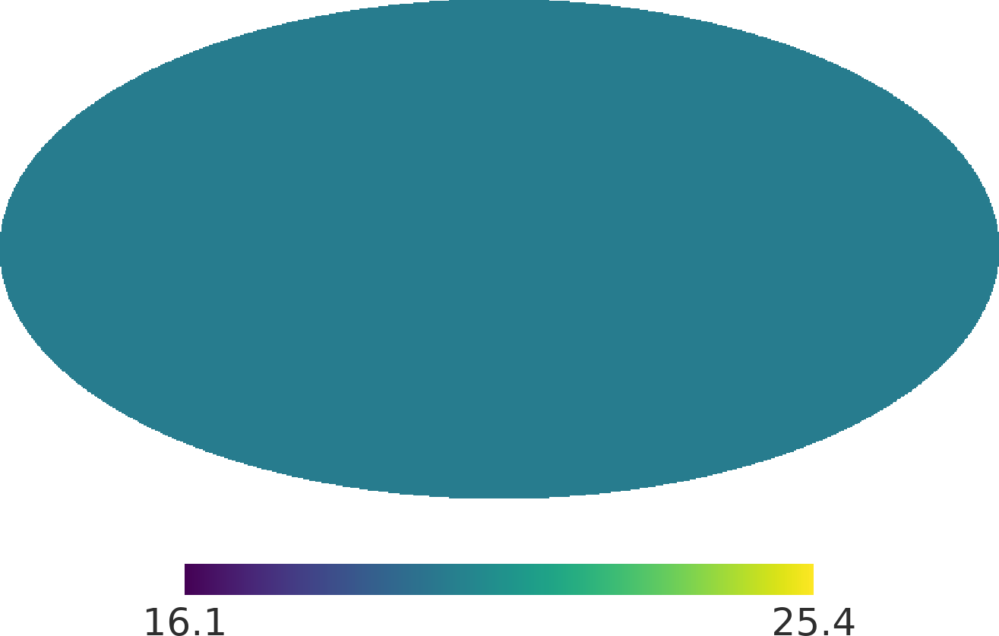{height="128px" style="margin: 0;"}

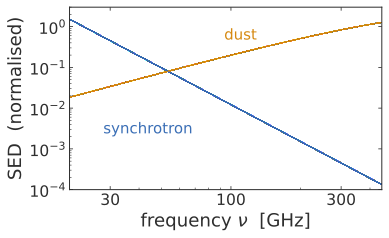{height="145px" style="margin: 0;"}
:::
:::

::: {.fragment fragment-index=1}
### [c1d1s1]{.kw} [one spectrum per pixel]{style="font-size: 0.6em; font-weight: 400; color: #6E6E6E;"} {style="margin: 0.3em 0 0.1em;"}

::: {.grid .bare style="--cols: 1fr 1fr 1fr 1.3fr; --gap: 0.6em; --align: center; text-align: center;"}
{height="128px" style="margin: 0;"}

{height="128px" style="margin: 0;"}

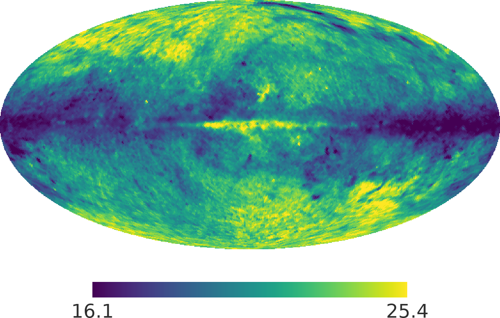{height="128px" style="margin: 0;"}

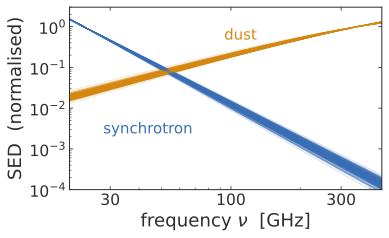{height="145px" style="margin: 0;"}
:::
:::

<br/>

::: {.fragment fragment-index=2}
:::: {.solutionbox style="margin-top: 0.4em;"}
::: {.solutionbox-body style="font-size: 0.85em;"}
- In c1d1s1 each pixel has its own spectrum. The likelihood must model this [spatial variability]{.kw}
- Both skies have $r = 0$ and serve for validation
:::
::::
:::

## Defining parameter patches on the sphere

### [Multi-resolution (HEALPix)]{.kw} [LiteBIRD Collaboration (2023)]{style="font-size: 0.55em; font-weight: 400; color: #6E6E6E;"}

:::::: {.grid .bare style="--cols: 470px 470px; --gap: 60px; --row-gap: 18px; --align: start; --img-w: 450px; --cap-size: 0.72em; --cell-margin: 0.3em 0 0; margin-top: 0.2em;"}
::::: {.r-stack}
::: {.cell .fragment .fade-out fragment-index=1}


[$N_{\rm side} = 4$ · 192 patches]{.caption}
:::

::: {.cell .fragment .fade-in-then-out fragment-index=1}


[$N_{\rm side} = 16$ · 3072 patches]{.caption}
:::

::: {.cell .fragment fragment-index=2}
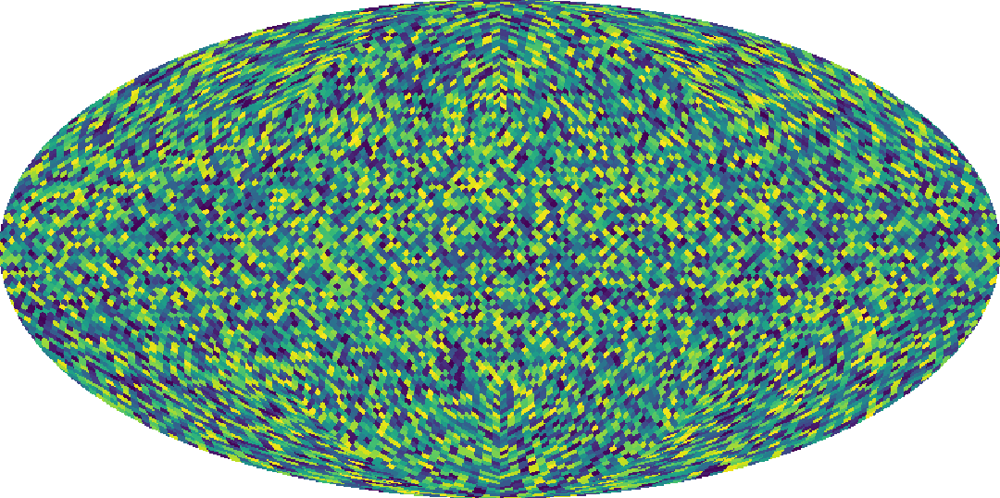

[$N_{\rm side} = 32$ · 12288 patches]{.caption}
:::
:::::

::: {.cell .fragment fragment-index=3}
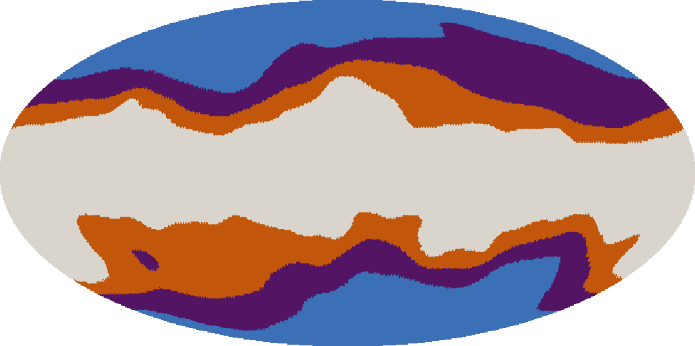

[[low]{.kw} · [mid]{.kw2} · [high]{style="color: #3B6FB6; font-weight: 700;"} Galactic latitude, 20 % of the sky each]{.caption}
:::

::: {.fragment .table-full fragment-index=4 style="padding: 0 20px 0 30px; font-size: 0.95em;"}
[$N_{\rm side}$ per parameter in the LiteBIRD analysis]{.kw style="display: block; font-size: 0.85em; margin-bottom: 0.3em; text-align: center;"}

|           | low      | mid      | high     |
|:----------|:--------:|:--------:|:--------:|
| $\beta_d$ | 64       | 64       | 64       |
| $T_d$     | [8]{.kw} | [4]{.kw} | [0]{.kw} |
| $\beta_s$ | 4        | 2        | 2        |

[per Galactic region (0: one patch)]{style="display: block; font-size: 0.8em; color: #6E6E6E; margin-top: 0.4em; text-align: center;"}
:::

::: {.cell .fragment fragment-index=5 style="--img-w: 420px;"}
[Example: the $T_d$ partition]{.kw style="display: block; font-size: 0.85em; margin-bottom: 0.3em;"}

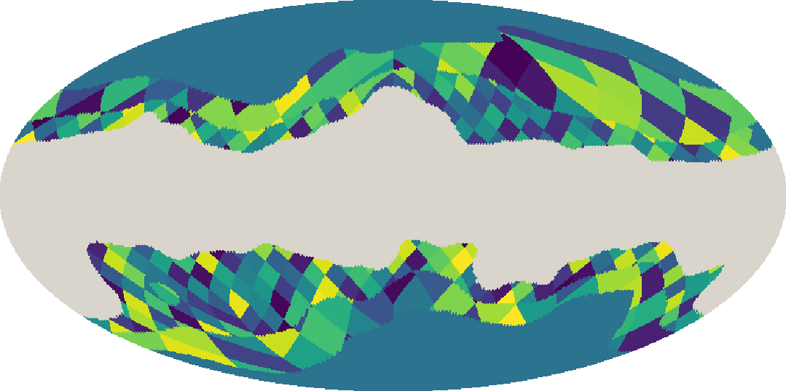

[$T_d$ at $N_{\rm side}$ 8 / 4 / 0 · 344 patches]{.caption}
:::
::::::

## Defining parameter patches on the sphere {visibility="uncounted"}

### [Equal-area patches on the sphere]{.kw} {style="margin-bottom: 0.1em;"}

:::: {.columns}
::: {.column style="width: 50%; text-align: center;"}
#### [Spherical $K$-means]{.kw} {style="margin: 0 0 0.2em;"}

::: {style="display: flex; justify-content: center; align-items: center; gap: 14px; margin-bottom: 0.2em;"}
[](https://github.com/CMBSciPol/jax-healpy)
{style="height: 34px; margin: 0;"}
:::

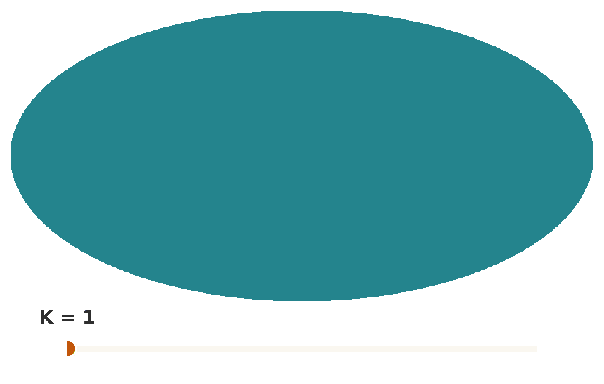{.screen-only width="380px" style="margin: 0;"}
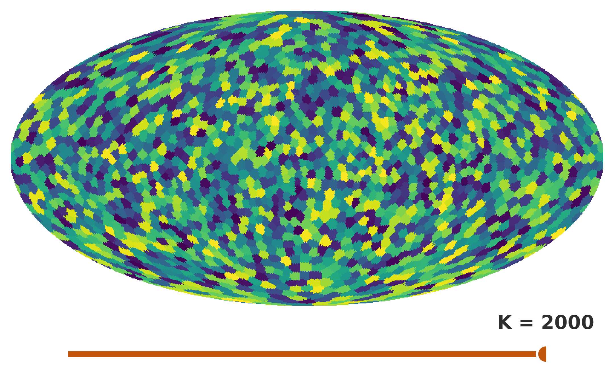{.print-only width="380px" style="margin: 0;"}
:::

::: {.column .fragment fragment-index=1 style="width: 50%; text-align: center;"}
#### [The bias–variance trade-off]{.kw} {style="margin: 0 0 0.3em;"}

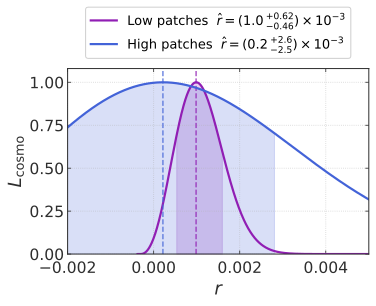{width="84%" style="margin: 0;"}
:::
::::

::: {.fragment fragment-index=2}
:::: {.solutionbox}
::: {.solutionbox-header}
Obstacle for full-sky CMB surveys: LiteBIRD
:::

::: {.solutionbox-body style="font-size: 0.76em;"}
- The number of patches must be tuned to meet the requirements of future surveys
- We want to test many configurations and keep the best one
- This needs a [fast]{.kw} optimisation method and a [selection criterion]{.kw} for patch configurations
:::
::::
:::

## Fast and robust minimisation

::::::: {.columns style="display: flex; gap: 12px; margin-top: 0.1em;"}
:::::: {.column style="width: 480px;"}
::::: {.r-stack .bare}
:::: {.fragment .fade-out fragment-index=2 style="margin: 40px 0 0 20px; align-self: start; justify-self: start;"}
{.screen-only style="width: 450px;"}
{.print-only style="width: 450px;"}
::::

:::: {.fragment fragment-index=2 style="margin: 0 0 0 40px; align-self: start; justify-self: start;"}
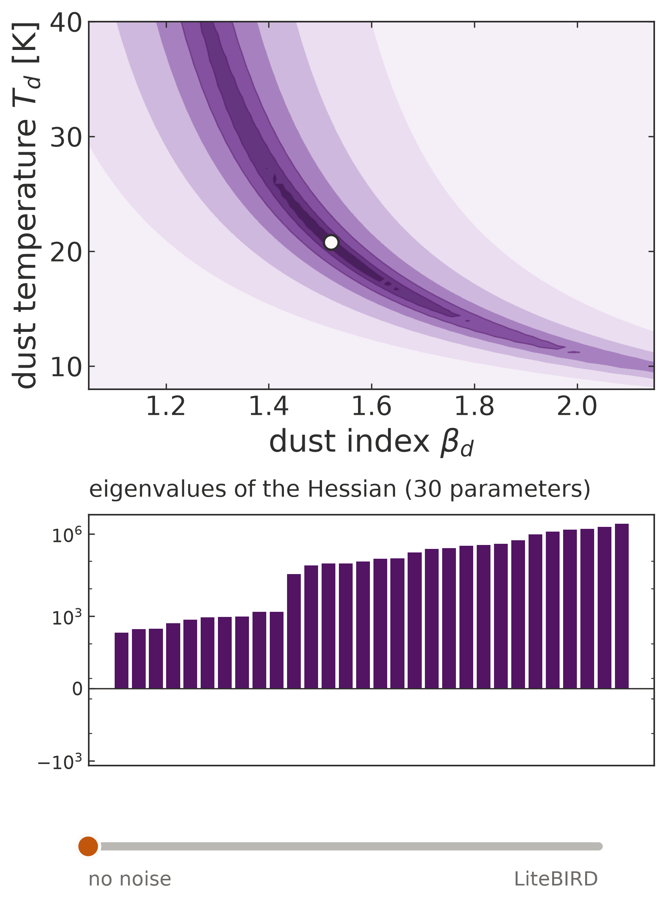{.screen-only style="width: 430px;"}
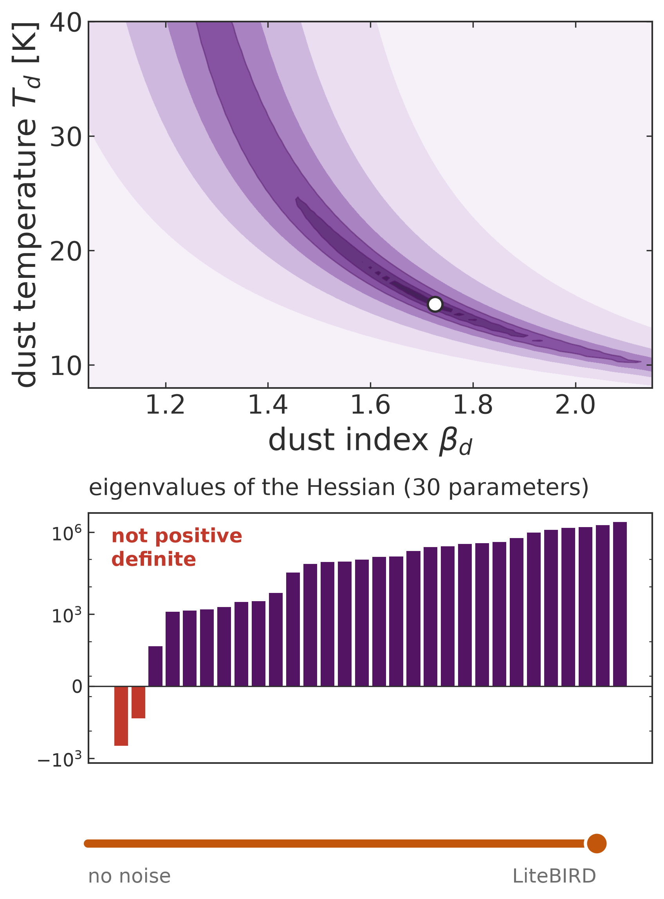{.print-only style="width: 430px;"}
::::
:::::
::::::

:::::: {.column style="width: 500px;"}
### How do we minimise? {style="margin: 0 0 0.3em;"}

::::: {.r-stack .bare style="height: 300px;"}
:::: {.fragment .fade-out fragment-index=1 style="width: 100%;"}
::: {.eqbox style="--eq-size: 1.25em; --eq-math-margin: 0.25em 0; --eq-pad: 0.3em 0.9em; width: fit-content; margin: 0.4em auto 0; text-align: center;"}
[The Newton method]{style="display: block; margin: 0.1em 0 0; font-size: 0.8em; font-weight: 700; color: #C2560A;"}

$$\boldsymbol\beta_{k+1} = \boldsymbol\beta_k - \mathbf{H}_k^{-1}\,\mathbf{g}_k$$
$$\mathbf{g} = \nabla_{\boldsymbol\beta}\left(-\ln\mathcal{L}\right), \qquad \mathbf{H} = \nabla^2_{\boldsymbol\beta}\left(-\ln\mathcal{L}\right)$$
:::
::::

:::: {.fragment fragment-index=1 style="width: 100%; text-align: center;"}
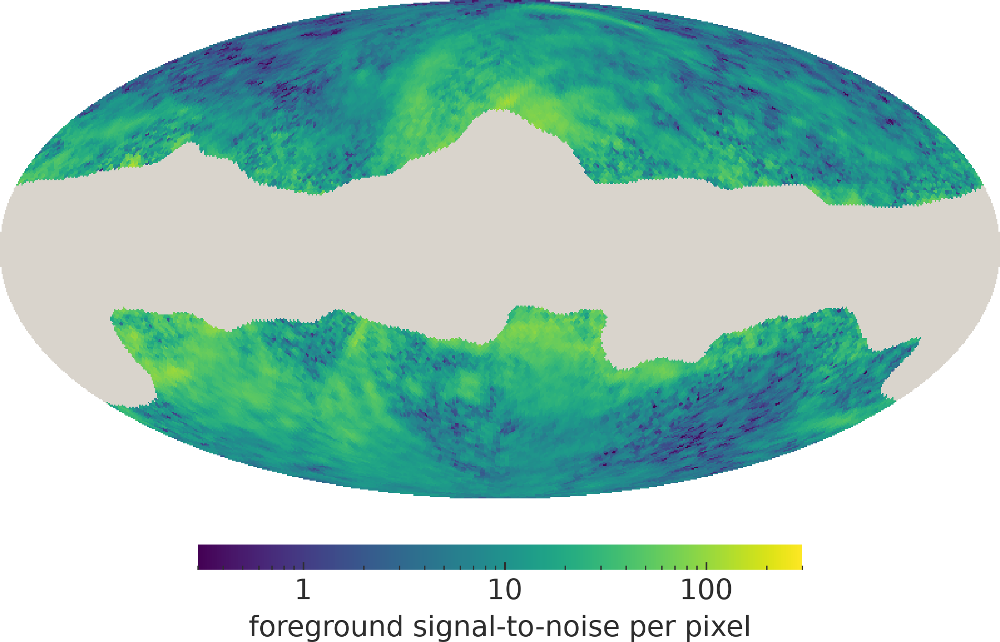{style="width: 440px; margin: 0.2em 0 0;"}

[140 GHz, LiteBIRD depth]{style="display: block; font-size: 0.6em; color: #6E6E6E; margin: 0.1em 0 0;"}
::::
:::::

::::: {.fragment fragment-index=3 style="margin-top: 0.7em;"}
:::: {.solutionbox}
::: {.solutionbox-body style="font-size: 0.85em;"}
- Noisy sky data make the Hessian [poorly conditioned]{.kw} and hard to invert
- [Quasi-Newton]{.kw} methods suffer most. They approximate the inverse Hessian as if the likelihood were a clean quadratic bowl
:::
::::
:::::
::::::
:::::::

## Adaptive moment-based methods

::: {style="display: flex; align-items: center; gap: 18px; margin-top: -0.2em;"}
{style="height: 40px; margin: 0;"}
[](https://github.com/CMBSciPol/CADRE)
:::

:::: {.columns style="display: flex; align-items: center;"}
::: {.column style="width: 54%;"}
::: {.r-stack}
::: {.fragment .fade-out fragment-index=1}
{.screen-only width="80%" style="margin: 0 auto; display: block;"}
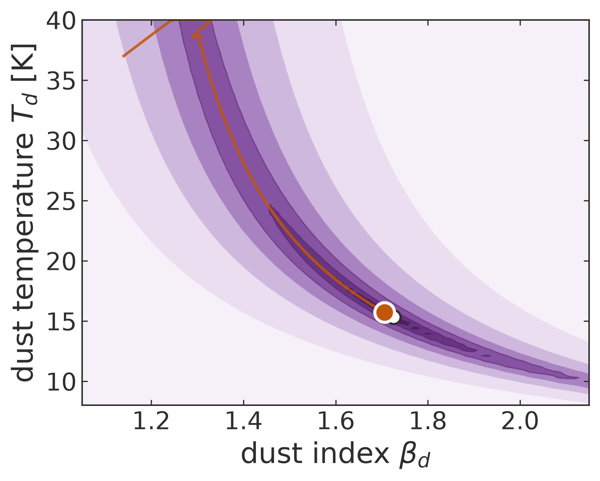{.print-only width="80%" style="margin: 0 auto; display: block;"}
:::

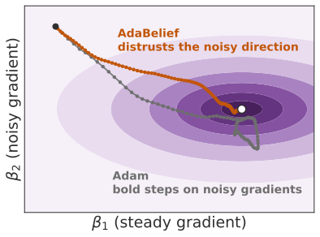{.fragment fragment-index=1 width="80%" style="margin: 0 auto; display: block;"}
:::
:::

::: {.column style="width: 46%; font-size: 1em;"}
[Adam]{.kw2} is the standard optimiser of machine learning, built for very many parameters and very noisy gradients

::: {.eqbox style="--eq-size: 0.95em; --eq-math-margin: 0.2em 0; --eq-pad: 0.15em 0.8em; width: fit-content; margin: 0.4em auto;"}
$$\boldsymbol\beta_{t+1} = \boldsymbol\beta_t - \eta\,\frac{\hat m_t}{\sqrt{\hat v_t}+\epsilon}$$
:::

[$m_t$, $v_t$: running means of $\mathbf{g}$ and $\mathbf{g}^2$]{style="font-size: 0.85em; color: #6E6E6E;"}

::: {.fragment fragment-index=1}
[AdaBelief]{.kw2} scales the step by the spread of the gradient instead

::: {.eqbox style="--eq-size: 0.95em; --eq-math-margin: 0.2em 0; --eq-pad: 0.15em 0.8em; width: fit-content; margin: 0.4em auto;"}
$$v_t \;\longrightarrow\; s_t:\ \text{running mean of }(\mathbf{g} - m_t)^2$$
:::

A noisy direction gets a [smaller step]{.kw}
:::
:::
::::

::: {.fragment fragment-index=2}
:::: {.solutionbox}
::: {.solutionbox-body style="font-size: 0.9em;"}
[AdaTopK]{.kw} builds on AdaBelief for physical parameters, with a robust handling of parameter bounds
:::
::::
:::

## Scaling of AdaTopK

{fig-align="center" width="62%" style="margin-bottom: 0.2em;"}

::: {.fragment}
:::: {.solutionbox}
::: {.solutionbox-header}
Scaling
:::

::: {.solutionbox-body style="font-size: 0.85em;"}
- AdaTopK runs on GPUs with first-order gradients only: its cost stays flat as the number of patches grows, [about 60 times faster]{.kw} than the reference solver at 10 000 patches
- Next: [scan many patch configurations]{.kw2} and select the best
:::
::::
:::

## Selection criteria for optimal patches

{style="position: absolute; top: -12px; right: 0; height: 78px; margin: 0; border-radius: 10px;"}

::: {style="display: flex; align-items: center; gap: 18px; margin-top: -0.2em;"}
{style="height: 40px; margin: 0;"}
[](https://github.com/CMBSciPol/furax)
[](https://github.com/CMBSciPol/furax-cs)
:::

<video src="PhD/5_contribution/compsep/09_selection/selection.mp4" data-autoplay muted playsinline preload="auto" style="display: block; width: 80%; margin: 0.2em auto 0;"></video>

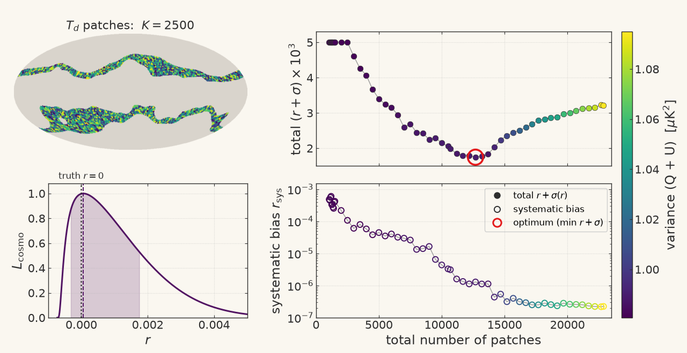{.print-only fig-align="center" width="80%"}

::: {.fragment}
:::: {.solutionbox style="margin-top: 0.3em;"}
::: {.solutionbox-body style="font-size: 0.8em;"}
- Minimising $\hat r + \sigma(r)$ cannot remove a primordial $r$. The mixing matrix $\mathbf{A}$ contains the CMB with its known spectrum, so the recovered CMB keeps [unit response]{.kw} for every partition
- The guarantee is specific to map-based parametric separation. A forward model or a non-map-based method loses it
:::
::::
:::

## Selection criteria for optimal patches {visibility="uncounted"}

::: {.absolute .bare top=-12 right=0 style="display: flex; align-items: center; gap: 10px;"}
{height="58px"}

[Jean Zay, IDRIS<br/>NVIDIA H100 GPUs]{style="font-size: 0.55em; line-height: 1.25; color: #2E2E2E;"}
:::

[We do this for each region]{.kw}

:::: {.grid .bare style="--cols: 300px 295px 1fr; grid-template-rows: repeat(3, 172px); --gap: 12px; --row-gap: 2px; --img-w: 290px; --cap-size: 0.55em; --cell-margin: 0; margin-top: 0.2em;"}
::: {.cell .fragment fragment-index=1}


[$\beta_d$ patches]{.caption}
:::

::: {.fragment fragment-index=1}
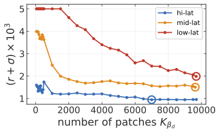{width="285px"}
:::

::: {.cell .fragment fragment-index=2}


[$T_d$ patches]{.caption}
:::

::: {.fragment fragment-index=2}
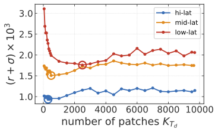{width="285px"}
:::

::: {.cell .fragment fragment-index=3}


[$\beta_s$ patches]{.caption}
:::

::: {.fragment fragment-index=3}
{width="285px"}
:::

::: {.r-stack style="grid-column: 3; grid-row: 1 / 3;"}
{.fragment .fade-in-then-out fragment-index=4 width="380px"}

{.fragment fragment-index=5 width="380px"}
:::

::: {.fragment fragment-index=5 style="grid-column: 3; grid-row: 3; align-self: end;"}
:::: {.solutionbox}
::: {.solutionbox-header style="font-size: 0.75em;"}
Run details
:::

::: {.solutionbox-body style="font-size: 0.72em;"}
Over [10 000]{.kw2} component separation runs on [H100 GPUs]{.kw}

Finishing in [4 hours]{.kw2}
:::
::::
:::
::::

## Results: comparison with multi-resolution

:::: {.columns style="display: flex; align-items: center;"}
::: {.column style="width: 46%;"}
{width="100%" style="margin: 0;"}
:::

::: {.column style="width: 54%;"}
::: {.bare style="margin: 0.5em 0 0.2em; font-size: 0.9em;"}
[multi-resolution]{.kw2} (LiteBIRD PTEP)
:::

:::: {.grid .bare style="--cols: 1fr 1fr 1fr; --gap: 8px; --row-gap: 8px; --cap-size: 0.62em; --cell-margin: 0;"}
::: {.cell}
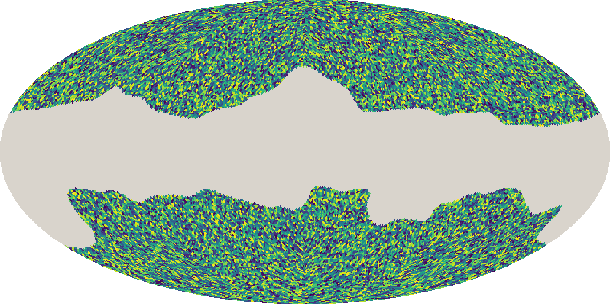

[$\beta_d$]{.caption}
:::

::: {.cell}
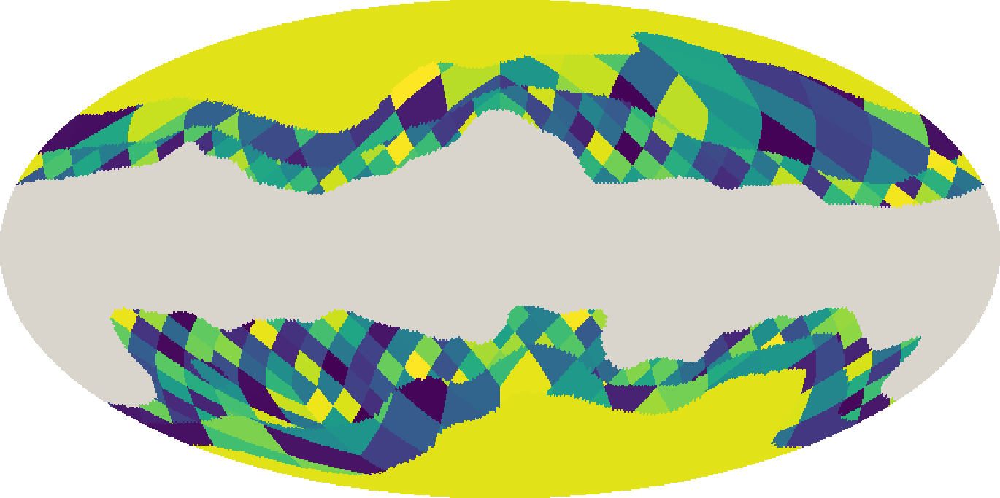

[$T_d$]{.caption}
:::

::: {.cell}


[$\beta_s$]{.caption}
:::
::::

::: {.bare style="margin: 0.5em 0 0.2em; font-size: 0.9em;"}
[spherical $K$-means]{.kw} (this work)
:::

:::: {.grid .bare style="--cols: 1fr 1fr 1fr; --gap: 8px; --row-gap: 8px; --cap-size: 0.62em; --cell-margin: 0;"}
::: {.cell}
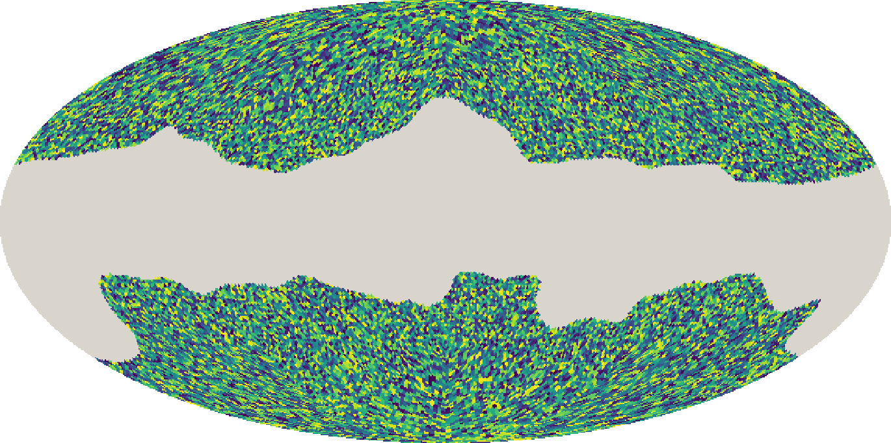

[$\beta_d$]{.caption}
:::

::: {.cell}


[$T_d$]{.caption}
:::

::: {.cell}


[$\beta_s$]{.caption}
:::
::::
:::
::::

::: {.fragment fragment-index=1}
:::: {.solutionbox}
::: {.solutionbox-body}
[30 % lower 68 % upper limit on $r$]{.kw}, with the same instrument, sky and noise: only the partition changes
:::
::::
:::

::: {.fragment fragment-index=2 style="position: absolute; top: 0; left: 0; width: 100%; height: 100%; min-height: 700px; z-index: 20; background: rgba(250, 247, 240, 0.88); display: flex; align-items: center; justify-content: center;"}
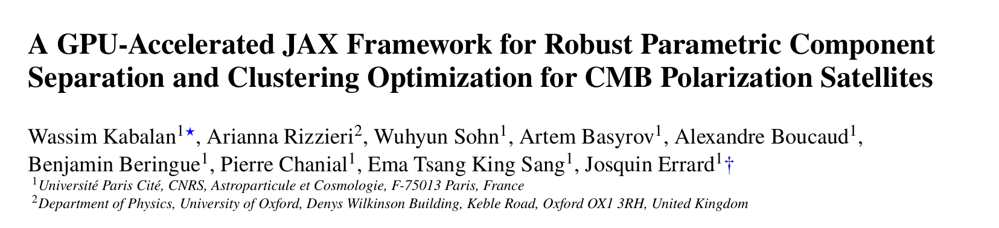{style="width: 860px; max-width: none; margin: 0; border: 1px solid #ccc; border-radius: 6px; box-shadow: 0 8px 28px rgba(0, 0, 0, 0.25);"}
:::

## Contribution 1: conclusion {.frosted background-image="PhD/0_cover/bg_cmb.jpg" background-size="cover" hide-chrome="true"}

:::: {.solutionbox style="margin-top: 1.4em;"}
::: {.solutionbox-body}
- Parametric component separation in JAX, [almost two orders of magnitude faster]{.kw}, over thousands of sky partitions
- AdaTopK: a bounded optimiser built for [noisy physical likelihoods]{.kw}
- Choosing the partition by the upper limit on $r$: [30 % lower]{.kw} than the hand-tuned configuration

[Kabalan et al. (2026), RASTI]{.credit style="text-align: right;"}
:::
::::

::::: {.fragment .frosted-panel style="margin-top: 1.4em; --panel-pad: 20px 30px;"}
:::: {.row .bare style="--gap: 32px; --align: center;"}
::: {style="flex: 1; font-size: 0.95em;"}
[Now part of the [Megatop]{.kw2} pipeline for the Simons Observatory]{style="display: block; margin-bottom: 0.6em;"}

[Next]{.kw2 style="font-weight: 700;"}

- preparing its integration into the [LiteBIRD]{.kw} component-separation pipeline
- real data from the Simons Observatory, through Megatop
- instrument systematics as [linear operators]{.kw} in FURAX
- more flexible spatial partitions of the foreground parameters
:::

::: {style="flex: none; display: flex; flex-direction: column; align-items: center; gap: 18px;"}
{style="height: 54px; margin: 0;"}
{style="height: 84px; margin: 0;"}
{style="height: 76px; margin: 0;"}
:::
::::
:::::

# Contribution 2: field-level inference for weak lensing surveys

::: {.rail-stack}
{.rail-full}

{.rail-focus}
:::

::: {style="display: flex; justify-content: center; align-items: center; gap: 36px; margin-top: 1.2em;"}
{style="height: 70px;"}
[](https://github.com/ASKabalan/jax-fli)
:::

## A weak-lensing forward model, end to end

{fig-align="center" width="74%"}

From a cosmology and an initial density field to [convergence and shear on the curved sky]{.kw}

## Reminder: forward modelling for weak lensing

::: {.r-stack .bare style="width: 960px; margin-left: 30px;"}
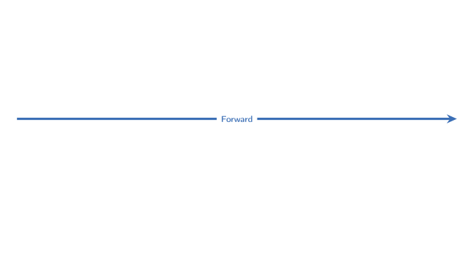{width="960px"}

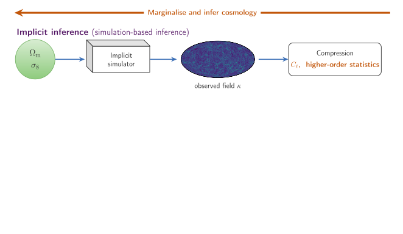{.fragment .semi-fade-out fragment-index=2 width="960px"}

{.fragment fragment-index=1 width="960px"}
:::

## Building a survey-level differentiable forward model

:::: {.hl-host .bare style="margin-top: 0.1em;"}
{width="800px" style="display: block;"}

::: {.hlbox style="--x: 22%; --y: 5%; --w: 42%; --h: 42%;"}
:::
::::

::: {.fragment}
:::: {.solutionbox}
::: {.solutionbox-body}
A [fast]{.kw} and [differentiable]{.kw} gravity solver that can simulate [Stage IV survey volumes]{.kw}
:::
::::
:::

## The gravity solver: Lagrangian perturbation theory

<br/>
<br/>

::::: {.columns style="display: flex; align-items: flex-start; margin-top: 1.2em;"}
:::: {.column style="width: 42%;"}
[Each particle moves from its initial grid position $\mathbf{q}$]{style="font-size: 0.85em;"}

::: {.eqbox style="--eq-size: 0.8em; --eq-math-margin: 0.3em 0; --eq-pad: 0.2em 0.6em; width: fit-content; margin: 0.4em auto;"}
$$\mathbf{x}(\mathbf{q}, a) = \mathbf{q} + D_1(a)\,\mathbf{\Psi}^{(1)}(\mathbf{q}) + D_2(a)\,\mathbf{\Psi}^{(2)}(\mathbf{q}) + \dots$$
$$\nabla \cdot \mathbf{\Psi}^{(1)} = -\delta_\mathrm{ini}$$
:::

[First order: the Zel'dovich approximation. Second order (2LPT) adds the tidal field.]{style="font-size: 0.8em; color: #6E6E6E;"}

::: {.fragment fragment-index=2}
:::: {.solutionbox style="margin-top: 0.9em;"}
::: {.solutionbox-body style="font-size: 0.8em;"}
- Perturbation theory does not capture the [non-linear]{.kw style="white-space: nowrap;"} growth of structure
- We need a [fast]{.kw} and [differentiable]{.kw} gravity solver that can model the [non-linear]{.kw style="white-space: nowrap;"} signal
:::
::::
:::
::::

:::: {.column .fragment fragment-index=1 style="width: 58%;"}
{width="100%" style="margin: 0;"}

[Lensing $C_\ell$ of the four DES Y3 bins, linear theory against halofit]{style="font-size: 0.6em; color: #6E6E6E;"}
::::
:::::

## The gravity solver: particle mesh

::: {style="display: flex; align-items: center; gap: 18px; margin-top: -0.2em;"}
{style="height: 40px; margin: 0;"}
[](https://github.com/DifferentiableUniverseInitiative/JaxPM)
:::

::: {.r-stack .bare style="margin-top: 0.3em;"}
{.fragment .fade-out fragment-index=1 style="width: 1000px;"}

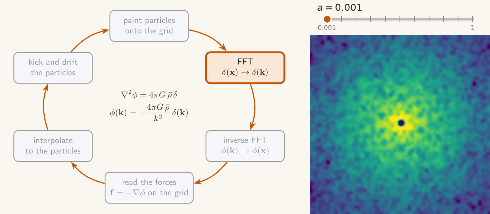{.fragment .fade-in-then-out fragment-index=1 style="width: 1000px;"}

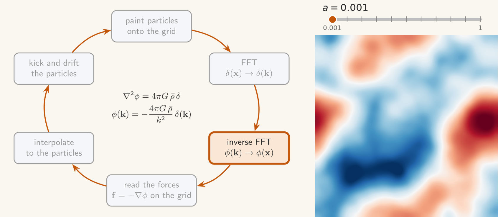{.fragment .fade-in-then-out fragment-index=2 style="width: 1000px;"}

{.fragment .fade-in-then-out fragment-index=3 style="width: 1000px;"}

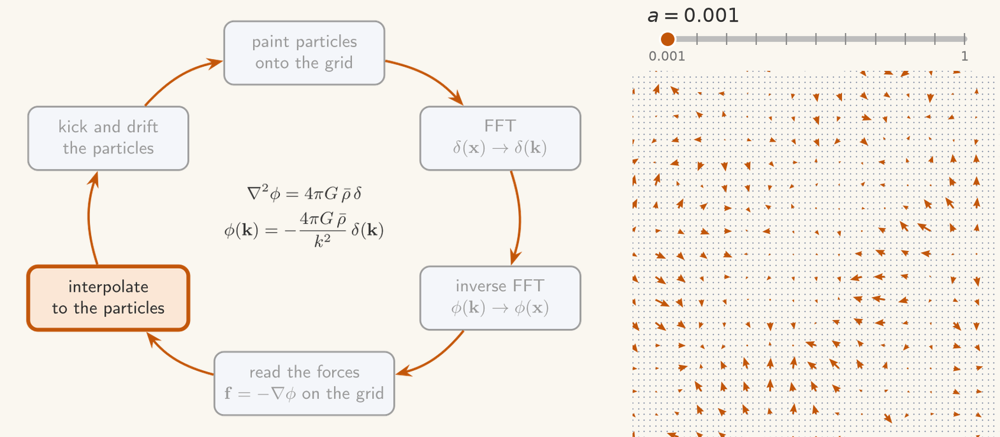{.fragment .fade-in-then-out fragment-index=4 style="width: 1000px;"}

{.fragment fragment-index=5 style="width: 1000px;"}

{.fragment .screen-only fragment-index=6 style="width: 1000px;"}

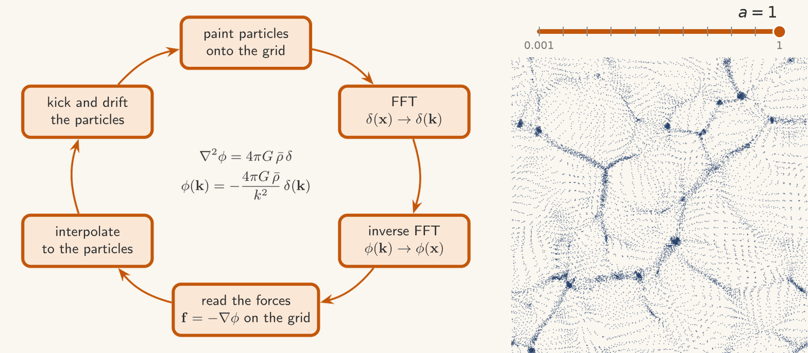{.print-only style="width: 1000px;"}
:::

Gravity through FFTs on a mesh: cheap, differentiable, and [limited by the mesh resolution]{.kw}

## Accuracy of the particle mesh

::: {.r-stack}
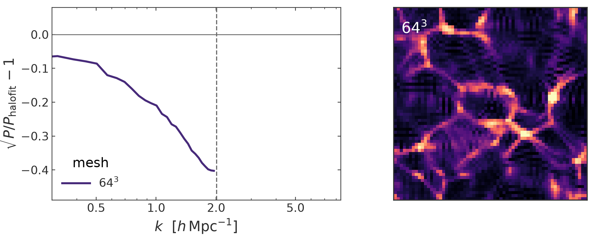{.fragment .fade-out fragment-index=1 width="1000px"}

{.fragment .fade-in-then-out fragment-index=1 width="1000px"}

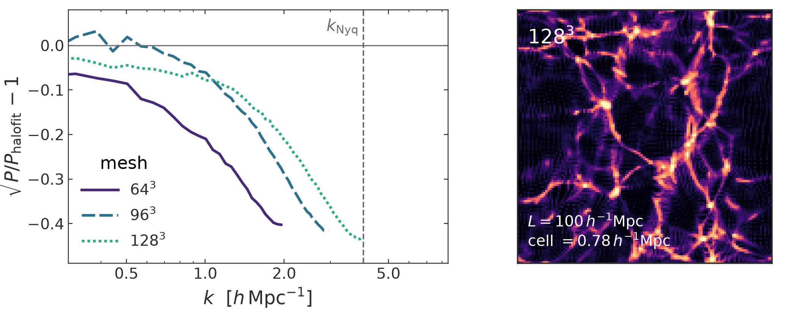{.fragment .fade-in-then-out fragment-index=2 width="1000px"}

{.fragment .fade-in-then-out fragment-index=3 width="1000px"}

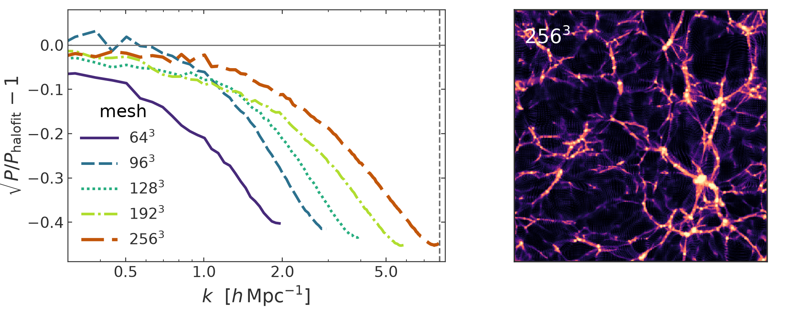{.fragment .fade-in fragment-index=4 width="1000px"}
:::

::: {.fragment}
:::: {.solutionbox}
::: {.solutionbox-body style="font-size: 0.85em;"}
- The accuracy of a particle-mesh simulation is limited by the [resolution of its mesh]{.kw}
- At survey volume, a mesh with that resolution [does not fit on one GPU]{.kw}
- We need a [scalable]{.kw} gravity solver
:::
::::
:::

## Distributing the simulation

::: {style="display: flex; align-items: center; gap: 18px; margin-top: -0.2em;"}
{style="height: 40px; margin: 0;"}
[](https://github.com/DifferentiableUniverseInitiative/jaxDecomp)
:::

### [Distributed components for particle-mesh simulation]{.kw} {style="margin: 0.2em 0 0.1em;"}


::: {.r-stack}
::: {.fragment .fade-out .bare fragment-index=1 style="text-align: center;"}
[Distributed fast Fourier transforms]{.kw2}

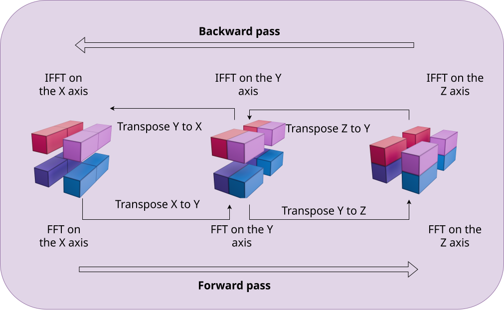{height="285px" style="margin: 0.2em 0 0;"}
:::

::: {.fragment .fade-in-then-out .bare fragment-index=1 style="text-align: center;"}
[Distributed transpositions]{.kw2}

{height="285px" style="margin: 0.2em 0 0;"}
:::

::: {.fragment .bare fragment-index=2 style="text-align: center;"}
[Distributed halo exchange]{.kw2}

<video src="PhD/5_contribution/fli/07_distributed/halo_exchange.mp4" class="screen-only" muted playsinline preload="auto" style="width: 680px; margin-top: 0.2em;"></video>

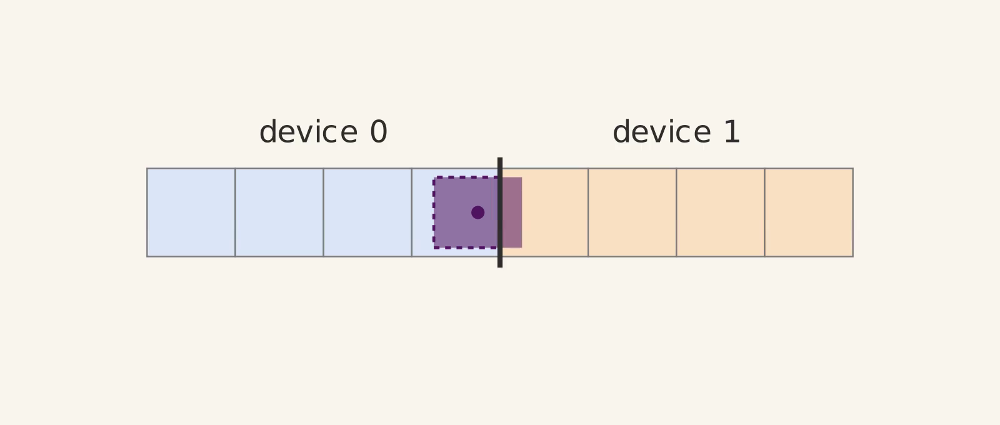{.print-only width="680px"}
:::
:::

The FFT and the halo exchange are the two operations that require communication between devices. Both are [differentiable]{.kw}, [distributed]{.kw} and written in [JAX]{.kw}

::: {.fragment fragment-index=3 style="position: absolute; top: 0; left: 0; width: 1050px; height: 700px; z-index: 20; background: rgba(250, 247, 240, 0.9); display: flex; align-items: center; justify-content: center;"}
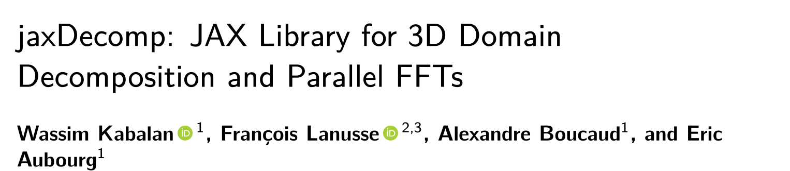{style="width: 860px; max-width: none; margin: 0; border: 1px solid #ccc; border-radius: 6px; box-shadow: 0 8px 28px rgba(0, 0, 0, 0.25); background: #ffffff;"}
:::

## Building the observable

:::: {.hl-host .bare style="margin-top: 0.1em;"}
{width="800px" style="display: block;"}

::: {.hlbox .fragment .custom .hlbox-move fragment-index=1 style="--x: 22%; --y: 5%; --w: 42%; --h: 42%; --x2: 47%; --y2: 5%; --w2: 47%; --h2: 42%;"}
:::
::::

## Building the observable: requirements

::::: {.columns style="display: flex; align-items: flex-start;"}
:::: {.column style="width: 55%;"}
::: {.figcadre style="padding: 0.9em 0.4em 0.3em;"}
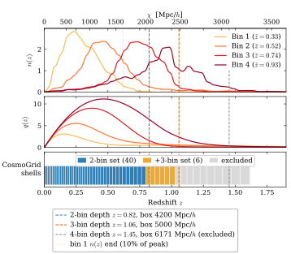{width="540px" style="display: block; margin: 0 auto;"}
:::
::::

:::: {.column style="width: 45%; padding-left: 0.6em;"}
[What volume does such an analysis need?]{.kw .fragment fragment-index=2 style="font-size: 0.85em;"}

::: {.grid .bare .fragment fragment-index=3 style="--cols: 1fr 1fr; --gap: 10px; --row-gap: 0;"}
::: {.cell}
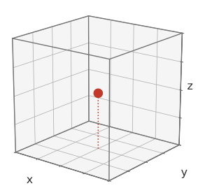

[observer at the centre]{.caption style="--cap-size: 0.55em;"}
:::

::: {.cell}
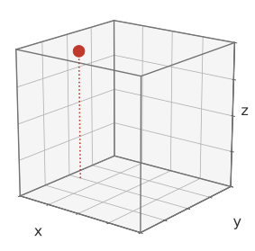

[shifted-quadrant observer (0.1, 0.5, 0.9)]{.caption style="--cap-size: 0.55em;"}
:::
:::

::: {.grid .bare .fragment fragment-index=4 style="--cols: 1fr 1fr; --gap: 10px; --row-gap: 0; margin-top: 0.6em;"}
::: {.cell}
::: {.r-stack}
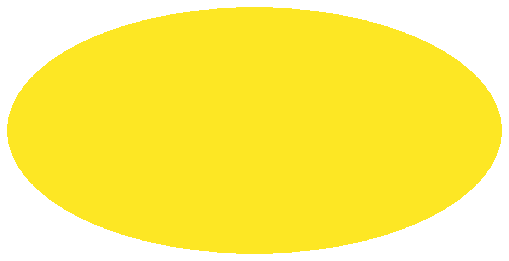{.fragment .fade-out fragment-index=5}

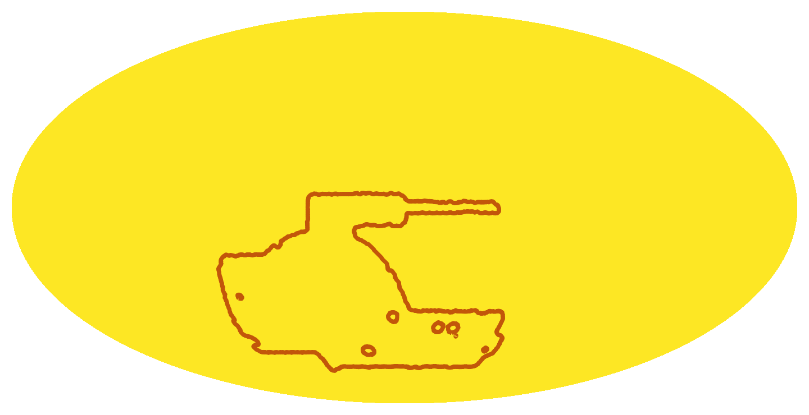{.fragment fragment-index=5}
:::

[full sky, $f_\mathrm{sky} = 1$]{.caption style="--cap-size: 0.55em;"}
:::

::: {.cell}
::: {.r-stack}
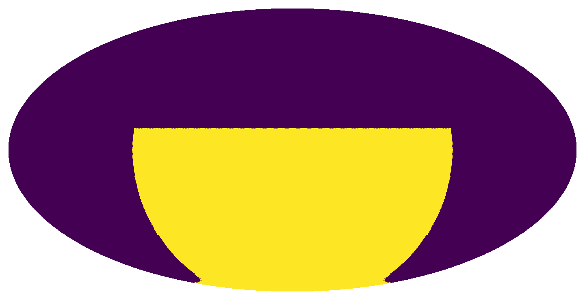{.fragment .fade-out fragment-index=5}

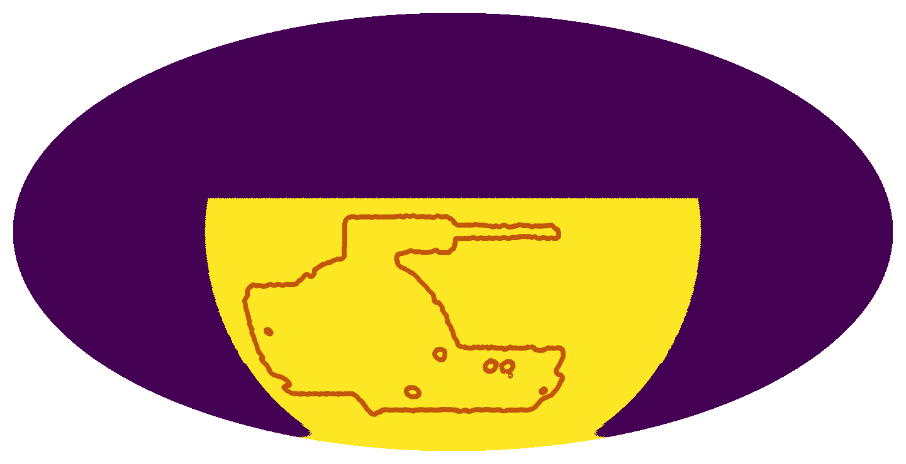{.fragment fragment-index=5}
:::

[$f_\mathrm{sky} = 0.35$[, contains [DES Y3]{.kw}]{.fragment fragment-index=5}]{.caption style="--cap-size: 0.55em;"}
:::
:::
::::
:::::

::::: {.fragment fragment-index=1}
:::: {.solutionbox style="margin-top: 0.3em;"}
::: {.solutionbox-header style="font-size: 0.8em;"}
Simulation-based inference on real survey data
:::

::: {.solutionbox-body style="font-size: 0.72em;"}
The DES Y3 simulation-based analysis of Jeffrey et al. (2024, arXiv:2403.02314) used [CosmoGridV1]{.kw} as its validation suite. The forward model must simulate the same volume.
:::
::::
:::::

## Painting on spherical shells {transition="slide-in none-out"}

```{=html}
<div style="position: relative; height: 0; margin-top: 0.1em;">
<div class="fragment custom transform" data-fragment-index="1" style="position: absolute; left: 0; top: 0; width: 960px; height: 560px; --to: translate(800px, -80px) scale(0.182); --origin: top left;">
<div class="tomo-diagram">
<span style="position: absolute; font-size: 0.55em; color: #2E2E2E; text-align: center; left: 20px; width: 135px; top: 163px;">bin 4</span>
<span style="position: absolute; font-size: 0.55em; color: #2E2E2E; text-align: center; left: 175px; width: 135px; top: 163px;">bin 3</span>
<span style="position: absolute; font-size: 0.55em; color: #2E2E2E; text-align: center; left: 330px; width: 135px; top: 163px;">bin 2</span>
<span style="position: absolute; font-size: 0.55em; color: #2E2E2E; text-align: center; left: 485px; width: 135px; top: 163px;">bin 1</span>
<svg style="position: absolute; left: 552px; top: 203px; width: 78px; height: 24px;" viewBox="0 0 78 24"><line x1="0" y1="12" x2="60" y2="12" stroke="#6E6E6E" stroke-width="5" stroke-linecap="round"/><polygon points="58,2 78,12 58,22" fill="#6E6E6E"/></svg><span style="position: absolute; font-size: 0.55em; color: #2E2E2E; left: 739px; top: 204px;">κ bin 1</span>
<svg style="position: absolute; left: 397px; top: 299px; width: 233px; height: 24px;" viewBox="0 0 233 24"><line x1="0" y1="12" x2="215" y2="12" stroke="#6E6E6E" stroke-width="5" stroke-linecap="round"/><polygon points="213,2 233,12 213,22" fill="#6E6E6E"/></svg><span style="position: absolute; font-size: 0.55em; color: #2E2E2E; left: 739px; top: 300px;">κ bin 2</span>
<svg style="position: absolute; left: 242px; top: 395px; width: 388px; height: 24px;" viewBox="0 0 388 24"><line x1="0" y1="12" x2="370" y2="12" stroke="#6E6E6E" stroke-width="5" stroke-linecap="round"/><polygon points="368,2 388,12 368,22" fill="#6E6E6E"/></svg><span style="position: absolute; font-size: 0.55em; color: #2E2E2E; left: 739px; top: 396px;">κ bin 3</span>
<svg style="position: absolute; left: 87px; top: 491px; width: 543px; height: 24px;" viewBox="0 0 543 24"><line x1="0" y1="12" x2="525" y2="12" stroke="#6E6E6E" stroke-width="5" stroke-linecap="round"/><polygon points="523,2 543,12 523,22" fill="#6E6E6E"/></svg><span style="position: absolute; font-size: 0.55em; color: #2E2E2E; left: 739px; top: 492px;">κ bin 4</span>
<svg style="position: absolute; left: 845px; top: 335px; width: 100px;" viewBox="0 0 110 60"><path d="M5 30 Q55 -12 105 30 Q55 72 5 30 Z" fill="none" stroke="#3B6FB6" stroke-width="4"/><circle cx="55" cy="30" r="15" fill="none" stroke="#3B6FB6" stroke-width="4"/><circle cx="55" cy="30" r="7" fill="#3B6FB6"/></svg><span style="position: absolute; font-size: 0.55em; color: #2E2E2E; text-align: center; left: 845px; width: 100px; top: 395px;">observer</span>
</div>
</div>
</div>
```

:::::: {.columns style="display: flex; align-items: center; margin-top: 100px;"}
::::: {.column .fragment fragment-index=2 style="width: 50%;"}
:::: {.row .bare style="--gap: 0.5em; --justify: center;"}
::: {.cell style="width: 170px;"}
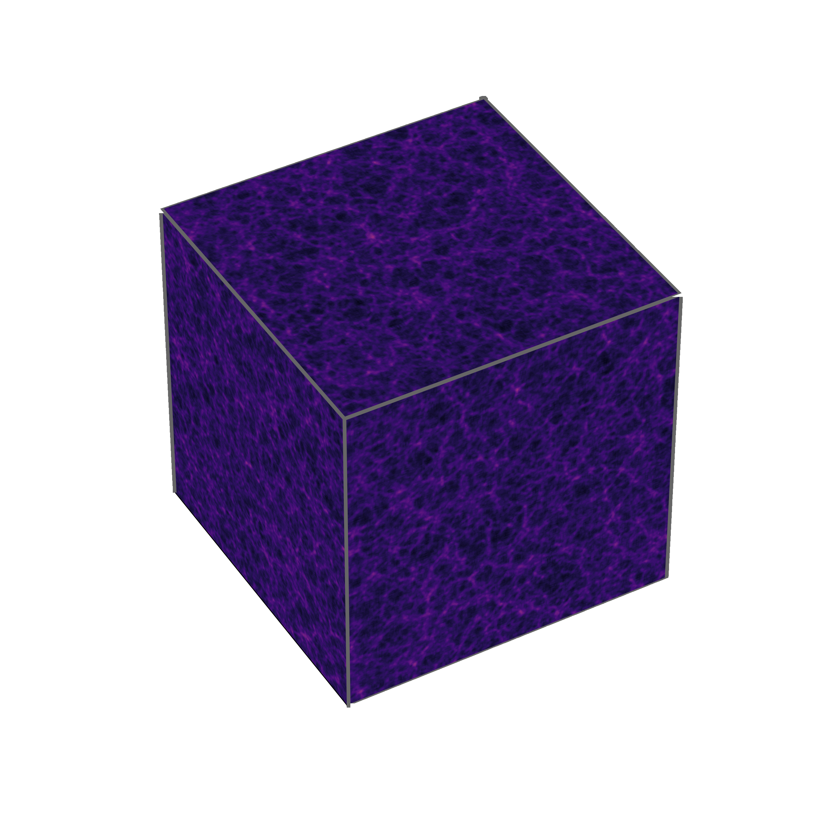

[evolved particles]{.caption style="--cap-size: 0.55em;"}
:::

[⟶]{style="font-size: 2.4em; color: #6E6E6E;"}

::: {.cell style="width: 250px;"}
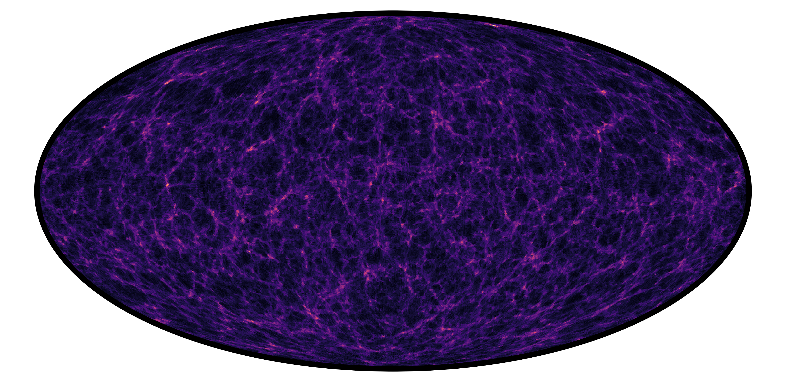

[one HEALPix shell]{.caption style="--cap-size: 0.55em;"}
:::
::::
:::::

::::: {.column style="width: 50%;"}
:::: {.eqbox .fragment fragment-index=2 style="--eq-size: 0.95em; --eq-math-margin: 0.2em 0; --eq-pad: 0.2em 0.9em; width: fit-content; margin: 0 auto; text-align: center;"}
$$r = \lVert \mathbf{x} - \mathbf{x}_o \rVert, \qquad \theta = \arccos\frac{z - z_o}{r}$$
$$\varphi = \operatorname{atan2}(y - y_o,\, x - x_o)$$
$$p = \texttt{ang2pix}(N_\mathrm{side}, \theta, \varphi)$$
::::

:::: {.fragment fragment-index=3 style="margin-top: 1.4em;"}
::: {.solutionbox}
::: {.solutionbox-header}
[ang2pix]{style="font-family: monospace;"}: jax-healpy
:::

::: {.solutionbox-body style="font-size: 0.8em;"}
Implemented in jax-healpy by Pierre Chanial. 
Works by binning each particle into one pixel but it is [not differentiable]{.kw} because the pixel index is piecewise constant in the particle position, so its gradient is zero
:::
:::
::::
:::::
::::::

## Painting on spherical shells {visibility="uncounted" transition="none-in none-out"}

```{=html}
<div style="position: relative; height: 0;">
<div style="position: absolute; left: 0; top: 0; width: 960px; height: 560px; transform: translate(800px, -80px) scale(0.182); transform-origin: top left;">
<div class="tomo-diagram">
<span style="position: absolute; font-size: 0.55em; color: #2E2E2E; text-align: center; left: 20px; width: 135px; top: 163px;">bin 4</span>
<span style="position: absolute; font-size: 0.55em; color: #2E2E2E; text-align: center; left: 175px; width: 135px; top: 163px;">bin 3</span>
<span style="position: absolute; font-size: 0.55em; color: #2E2E2E; text-align: center; left: 330px; width: 135px; top: 163px;">bin 2</span>
<span style="position: absolute; font-size: 0.55em; color: #2E2E2E; text-align: center; left: 485px; width: 135px; top: 163px;">bin 1</span>
<svg style="position: absolute; left: 552px; top: 203px; width: 78px; height: 24px;" viewBox="0 0 78 24"><line x1="0" y1="12" x2="60" y2="12" stroke="#6E6E6E" stroke-width="5" stroke-linecap="round"/><polygon points="58,2 78,12 58,22" fill="#6E6E6E"/></svg><span style="position: absolute; font-size: 0.55em; color: #2E2E2E; left: 739px; top: 204px;">κ bin 1</span>
<svg style="position: absolute; left: 397px; top: 299px; width: 233px; height: 24px;" viewBox="0 0 233 24"><line x1="0" y1="12" x2="215" y2="12" stroke="#6E6E6E" stroke-width="5" stroke-linecap="round"/><polygon points="213,2 233,12 213,22" fill="#6E6E6E"/></svg><span style="position: absolute; font-size: 0.55em; color: #2E2E2E; left: 739px; top: 300px;">κ bin 2</span>
<svg style="position: absolute; left: 242px; top: 395px; width: 388px; height: 24px;" viewBox="0 0 388 24"><line x1="0" y1="12" x2="370" y2="12" stroke="#6E6E6E" stroke-width="5" stroke-linecap="round"/><polygon points="368,2 388,12 368,22" fill="#6E6E6E"/></svg><span style="position: absolute; font-size: 0.55em; color: #2E2E2E; left: 739px; top: 396px;">κ bin 3</span>
<svg style="position: absolute; left: 87px; top: 491px; width: 543px; height: 24px;" viewBox="0 0 543 24"><line x1="0" y1="12" x2="525" y2="12" stroke="#6E6E6E" stroke-width="5" stroke-linecap="round"/><polygon points="523,2 543,12 523,22" fill="#6E6E6E"/></svg><span style="position: absolute; font-size: 0.55em; color: #2E2E2E; left: 739px; top: 492px;">κ bin 4</span>
<svg style="position: absolute; left: 845px; top: 335px; width: 100px;" viewBox="0 0 110 60"><path d="M5 30 Q55 -12 105 30 Q55 72 5 30 Z" fill="none" stroke="#3B6FB6" stroke-width="4"/><circle cx="55" cy="30" r="15" fill="none" stroke="#3B6FB6" stroke-width="4"/><circle cx="55" cy="30" r="7" fill="#3B6FB6"/></svg><span style="position: absolute; font-size: 0.55em; color: #2E2E2E; text-align: center; left: 845px; width: 100px; top: 395px;">observer</span>
</div>
</div>
</div>
```

[](https://github.com/CMBSciPol/jax-healpy)

:::: {.columns}
::: {.column style="width: 50%; text-align: center;"}
#### [Bilinear interpolation]{.kw2} {style="margin: 0.2em 0;"}

<video src="PhD/5_contribution/fli/10_painting/bilinear.mp4" class="screen-only" data-autoplay muted playsinline preload="auto" style="width: 82%;"></video>

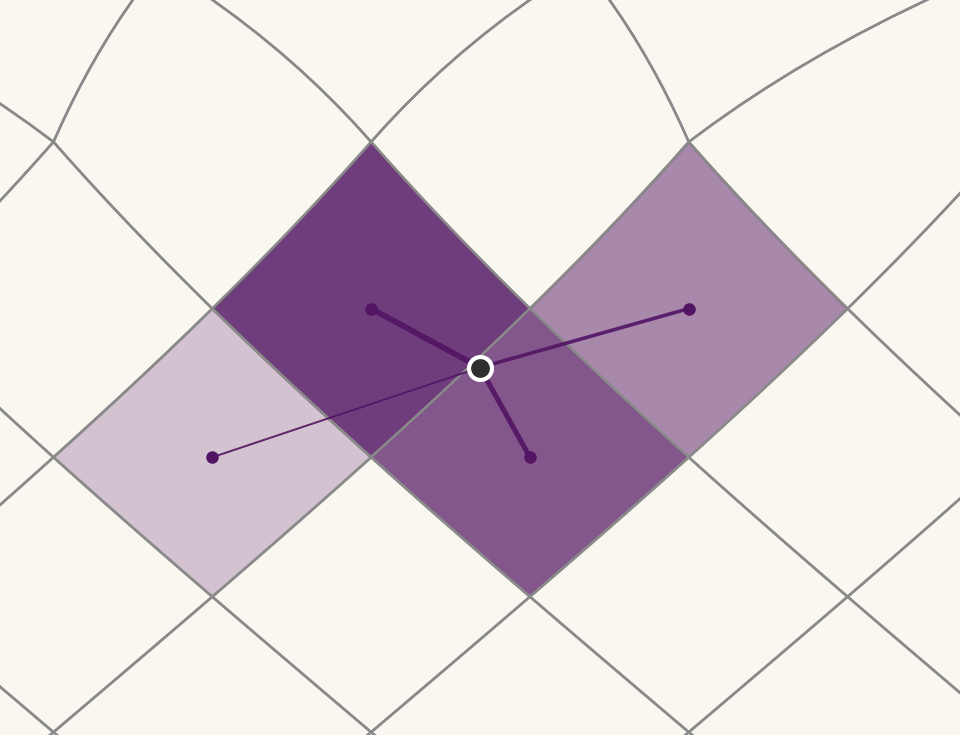{.print-only width="82%"}

:::: {.solutionbox style="text-align: left;"}
::: {.solutionbox-body style="font-size: 0.72em;"}
Four pixels, weighted by the position between their centres: `get_interp_weights`, implemented in jax-healpy
:::
::::
:::

::: {.column .fragment fragment-index=1 style="width: 50%; text-align: center;"}
#### [Radial basis function interpolation]{.kw} {style="margin: 0.2em 0;"}

::: {.r-stack}
<video src="PhD/5_contribution/fli/10_painting/rbf.mp4" class="fragment fade-out screen-only" data-fragment-index="2" muted playsinline preload="auto" style="width: 82%;"></video>

<video src="PhD/5_contribution/fli/10_painting/rbf_kernel.mp4" class="fragment screen-only" data-fragment-index="2" muted playsinline preload="auto" style="width: 82%;"></video>

{.print-only width="82%"}
:::

:::: {.solutionbox style="text-align: left;"}
::: {.solutionbox-body style="font-size: 0.72em;"}
The pixel and its eight neighbours (`get_all_neighbours`, implemented in jax-healpy), weighted by a Gaussian kernel of adjustable width
:::
::::
:::
::::

::::: {.fragment .bare fragment-index=3 style="position: absolute; top: -100px; left: 0; width: 1050px; height: 700px; padding-top: 100px; z-index: 20; background: rgba(250, 247, 240, 0.93); display: flex; flex-direction: column; align-items: center; justify-content: center;"}
:::: {.r-stack style="width: 640px;"}
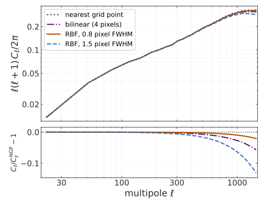{.fragment .fade-out fragment-index=4 width="640px"}

{.fragment fragment-index=4 width="640px"}
::::

:::: {.solutionbox style="width: 900px; margin-top: 0.3em;"}
::: {.solutionbox-body style="font-size: 0.85em;"}
The RBF scheme keeps the gradient and gives [control over the smoothing]{.kw}

Both methods are implemented in [jax-healpy]{.kw} and are [differentiable]{.kw}
:::
::::
:::::

## Creating the lightcone {transition="none-in slide-out"}

```{=html}
<div style="position: relative; height: 0;">
<div class="fragment fade-out" data-fragment-index="3">
<div class="fragment custom transform" data-fragment-index="1" style="position: absolute; left: 0; top: 0; width: 960px; height: 560px; --from: translate(800px, -80px) scale(0.182); --to: none; --origin: top left;">
<div class="tomo-diagram">
<span style="position: absolute; font-size: 0.55em; color: #2E2E2E; text-align: center; left: 20px; width: 135px; top: 163px;">bin 4</span>
<span style="position: absolute; font-size: 0.55em; color: #2E2E2E; text-align: center; left: 175px; width: 135px; top: 163px;">bin 3</span>
<span style="position: absolute; font-size: 0.55em; color: #2E2E2E; text-align: center; left: 330px; width: 135px; top: 163px;">bin 2</span>
<span style="position: absolute; font-size: 0.55em; color: #2E2E2E; text-align: center; left: 485px; width: 135px; top: 163px;">bin 1</span>
<div class="fragment semi-fade-out" data-fragment-index="2">
<svg style="position: absolute; left: 552px; top: 203px; width: 78px; height: 24px;" viewBox="0 0 78 24"><line x1="0" y1="12" x2="60" y2="12" stroke="#6E6E6E" stroke-width="5" stroke-linecap="round"/><polygon points="58,2 78,12 58,22" fill="#6E6E6E"/></svg><span style="position: absolute; font-size: 0.55em; color: #2E2E2E; left: 739px; top: 204px;">κ bin 1</span>
<svg style="position: absolute; left: 397px; top: 299px; width: 233px; height: 24px;" viewBox="0 0 233 24"><line x1="0" y1="12" x2="215" y2="12" stroke="#6E6E6E" stroke-width="5" stroke-linecap="round"/><polygon points="213,2 233,12 213,22" fill="#6E6E6E"/></svg><span style="position: absolute; font-size: 0.55em; color: #2E2E2E; left: 739px; top: 300px;">κ bin 2</span>
<svg style="position: absolute; left: 242px; top: 395px; width: 388px; height: 24px;" viewBox="0 0 388 24"><line x1="0" y1="12" x2="370" y2="12" stroke="#6E6E6E" stroke-width="5" stroke-linecap="round"/><polygon points="368,2 388,12 368,22" fill="#6E6E6E"/></svg><span style="position: absolute; font-size: 0.55em; color: #2E2E2E; left: 739px; top: 396px;">κ bin 3</span>
<svg style="position: absolute; left: 87px; top: 491px; width: 543px; height: 24px;" viewBox="0 0 543 24"><line x1="0" y1="12" x2="525" y2="12" stroke="#6E6E6E" stroke-width="5" stroke-linecap="round"/><polygon points="523,2 543,12 523,22" fill="#6E6E6E"/></svg><span style="position: absolute; font-size: 0.55em; color: #2E2E2E; left: 739px; top: 492px;">κ bin 4</span>
<svg style="position: absolute; left: 845px; top: 335px; width: 100px;" viewBox="0 0 110 60"><path d="M5 30 Q55 -12 105 30 Q55 72 5 30 Z" fill="none" stroke="#3B6FB6" stroke-width="4"/><circle cx="55" cy="30" r="15" fill="none" stroke="#3B6FB6" stroke-width="4"/><circle cx="55" cy="30" r="7" fill="#3B6FB6"/></svg><span style="position: absolute; font-size: 0.55em; color: #2E2E2E; text-align: center; left: 845px; width: 100px; top: 395px;">observer</span>
</div>
<div class="hlbox fragment" data-fragment-index="2" style="--x: 1%; --y: 0%; --w: 65.5%; --h: 32.5%;"></div>
</div>
</div>
</div>
</div>
```

::: {.fragment fragment-index=3 style="text-align: center; margin-top: -0.4em;"}
{style="height: 440px;"}
:::

::: {.fragment fragment-index=4}
:::: {.solutionbox style="margin-top: -0.2em;"}
::: {.solutionbox-body style="font-size: 0.85em;"}
The 3D density field is projected onto concentric spherical shells around the observer, each at its own redshift. How should these redshifts be chosen?
:::
::::
:::

## Choosing an optimal shell spacing

:::: {.grid .bare style="--cols: 225px 1fr; --gap: 10px; margin-top: 0.3em;"}
::: {style="text-align: center;"}
[Uniform in scale factor]{.kw style="font-size: 0.75em;"}

::: {.eqbox style="--eq-border: #25406b; --eq-size: 0.72em; --eq-math-margin: 0.25em 0; --eq-pad: 0.05em 0.5em; margin-top: 0.3em;"}
$$a_i = a_{\min} + \tfrac{i}{n}\,(1 - a_{\min})$$
:::
:::

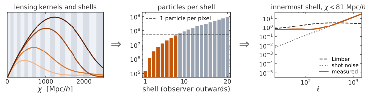{width="800px"}
::::

:::: {.grid .bare .fragment fragment-index=1 style="--cols: 225px 1fr; --gap: 10px; margin-top: 0.2em;"}
::: {style="text-align: center;"}
[Equal volume]{.kw style="font-size: 0.75em;"}

::: {.eqbox style="--eq-border: #25406b; --eq-size: 0.72em; --eq-math-margin: 0.25em 0; --eq-pad: 0.05em 0.5em; margin-top: 0.3em;"}
$$r_i^3 = r_{\min}^3 + \tfrac{i}{n}\,(r_{\max}^3 - r_{\min}^3)$$
:::

[outer shells floored at 50 Mpc/$h$]{.caption style="--cap-size: 0.55em; margin-top: 0.3em;"}
:::

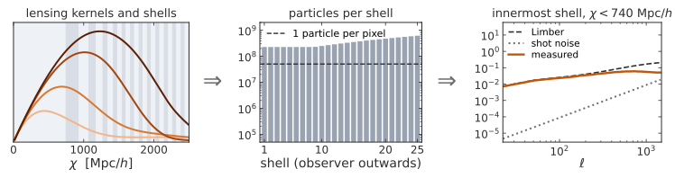{width="800px"}
::::

::::: {.fragment fragment-index=2}
:::: {.solutionbox style="margin-top: 0.2em;"}
::: {.solutionbox-header style="font-size: 0.75em;"}
Equal volume spacing vs linear in scale factor spacing
:::

::: {.solutionbox-body style="font-size: 0.7em;"}
Uniform steps in $a$: the innermost shell holds [three orders of magnitude]{.kw2} fewer particles than with equal volume, so it is [shot noise]{.kw} dominated

The downside of equal volume: [fewer shells]{.kw} cover the lensing kernel of the [first redshift bin]{.kw}

[Bin 1]{.kw2} is therefore not used for inference
:::
::::
:::::

## Impact of the number of shells on the accuracy {visibility="uncounted"}

::: {.grid .bare style="--cols: 150px 1fr; --gap: 10px; margin-top: 0.1em;"}
[uniform in $a$<br/>innermost shell]{.kw style="font-size: 0.7em; text-align: right;"}

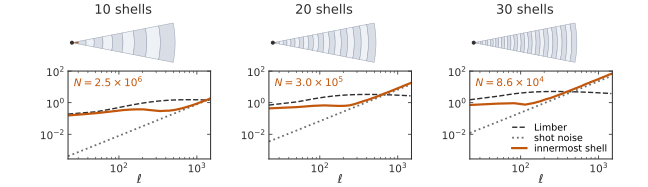{width="800px"}
:::

::: {.grid .bare .fragment fragment-index=1 style="--cols: 150px 1fr; --gap: 10px; margin-top: 0.1em;"}
[equal volume, drifted<br/>convergence vs Limber]{.kw style="font-size: 0.7em; text-align: right;"}

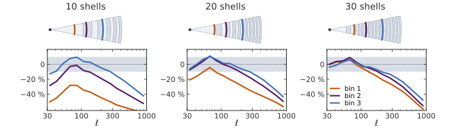{width="800px"}
:::

::: {.fragment fragment-index=2}
:::: {.solutionbox style="margin-top: 0.2em;"}
::: {.solutionbox-header style="font-size: 0.75em;"}
How many shells?
:::

::: {.solutionbox-body style="font-size: 0.7em;"}
[More shells]{.kw}: each shell is thinner, so the innermost one holds fewer particles and is [shot-noise]{.kw} dominated

[Fewer shells]{.kw}: a few wide shells sample the lensing kernel of the first bin, so its convergence is [biased]{.kw} low below $\ell =$ [100]{.kw2}

For this work we adopt [20]{.kw2} shells
:::
::::
:::

## From shells to convergence: the Born approximation

```{=html}
<div style="position: relative; height: 0;">
<div class="fragment fade-out" data-fragment-index="1">
<div class="tomo-diagram">
<div style="opacity: 0.45;">
<span style="position: absolute; font-size: 0.55em; color: #2E2E2E; text-align: center; left: 20px; width: 135px; top: 163px;">bin 4</span>
<span style="position: absolute; font-size: 0.55em; color: #2E2E2E; text-align: center; left: 175px; width: 135px; top: 163px;">bin 3</span>
<span style="position: absolute; font-size: 0.55em; color: #2E2E2E; text-align: center; left: 330px; width: 135px; top: 163px;">bin 2</span>
<span style="position: absolute; font-size: 0.55em; color: #2E2E2E; text-align: center; left: 485px; width: 135px; top: 163px;">bin 1</span>
</div>
<svg style="position: absolute; left: 552px; top: 203px; width: 78px; height: 24px;" viewBox="0 0 78 24"><line x1="0" y1="12" x2="60" y2="12" stroke="#6E6E6E" stroke-width="5" stroke-linecap="round"/><polygon points="58,2 78,12 58,22" fill="#6E6E6E"/></svg><span style="position: absolute; font-size: 0.55em; color: #2E2E2E; left: 739px; top: 204px;">κ bin 1</span>
<svg style="position: absolute; left: 397px; top: 299px; width: 233px; height: 24px;" viewBox="0 0 233 24"><line x1="0" y1="12" x2="215" y2="12" stroke="#6E6E6E" stroke-width="5" stroke-linecap="round"/><polygon points="213,2 233,12 213,22" fill="#6E6E6E"/></svg><span style="position: absolute; font-size: 0.55em; color: #2E2E2E; left: 739px; top: 300px;">κ bin 2</span>
<svg style="position: absolute; left: 242px; top: 395px; width: 388px; height: 24px;" viewBox="0 0 388 24"><line x1="0" y1="12" x2="370" y2="12" stroke="#6E6E6E" stroke-width="5" stroke-linecap="round"/><polygon points="368,2 388,12 368,22" fill="#6E6E6E"/></svg><span style="position: absolute; font-size: 0.55em; color: #2E2E2E; left: 739px; top: 396px;">κ bin 3</span>
<svg style="position: absolute; left: 87px; top: 491px; width: 543px; height: 24px;" viewBox="0 0 543 24"><line x1="0" y1="12" x2="525" y2="12" stroke="#6E6E6E" stroke-width="5" stroke-linecap="round"/><polygon points="523,2 543,12 523,22" fill="#6E6E6E"/></svg><span style="position: absolute; font-size: 0.55em; color: #2E2E2E; left: 739px; top: 492px;">κ bin 4</span>
<svg style="position: absolute; left: 845px; top: 335px; width: 100px;" viewBox="0 0 110 60"><path d="M5 30 Q55 -12 105 30 Q55 72 5 30 Z" fill="none" stroke="#3B6FB6" stroke-width="4"/><circle cx="55" cy="30" r="15" fill="none" stroke="#3B6FB6" stroke-width="4"/><circle cx="55" cy="30" r="7" fill="#3B6FB6"/></svg><span style="position: absolute; font-size: 0.55em; color: #2E2E2E; text-align: center; left: 845px; width: 100px; top: 395px;">observer</span>
<div class="hlbox" style="--x: 65%; --y: 29%; --w: 20%; --h: 70%;"></div>
</div>
</div>
</div>
```

:::: {.fragment fragment-index=1}
::: {.grid .bare style="--cols: 400px 1fr; --gap: 16px; margin-top: 0.3em;"}
::: {style="text-align: center;"}
[Born approximation: straight lines of sight]{.kw style="display: block; font-size: 0.72em; margin-bottom: 0.4em;"}

::: {.eqbox style="--eq-border: #25406b; --eq-size: 0.72em; --eq-math-margin: 0.3em 0; margin: 0 auto; width: fit-content;"}
$$\kappa(\hat{\mathbf n};\chi_s) = \frac{3}{2}\,\Omega_m\Big(\frac{H_0}{c}\Big)^2 \sum_j W_j(\chi_s)\,\delta_j(\hat{\mathbf n})$$

$$W_j(\chi_s) = \int_{\mathrm{shell}\ j} \mathrm{d}\chi\;\chi\,(1+z)\Big(1-\frac{\chi}{\chi_s}\Big)$$
:::
:::

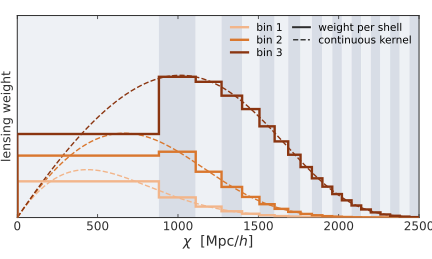{width="560px"}
:::
::::

:::: {.fragment fragment-index=2}
::: {.grid .bare style="--cols: 300px 1fr; --gap: 16px; margin-top: 0.4em;"}
::: {.eqbox style="--eq-border: #25406b; --eq-size: 0.72em; --eq-math-margin: 0.3em 0; margin: 0 auto; width: fit-content;"}
$$\kappa_i(\hat{\mathbf n}) = \int \mathrm{d}z\; n_i(z)\,\kappa\big(\hat{\mathbf n};\chi_s(z)\big)$$
:::

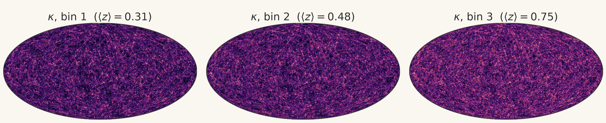{width="745px"}
:::
::::

::: {.fragment fragment-index=3}
:::: {.solutionbox style="margin-top: 0.3em;"}
::: {.solutionbox-body style="font-size: 0.72em;"}
The Born approximation computes the convergence along [undeflected light rays]{.kw}

Post-Born ray tracing deflects them by under [1 arcmin]{.kw2}, below the accuracy of our [gravity solver]{.kw}
:::
::::
:::

## Comparing against CosmoGrid

::: {.r-stack .bare style="margin-top: 0.1em;"}
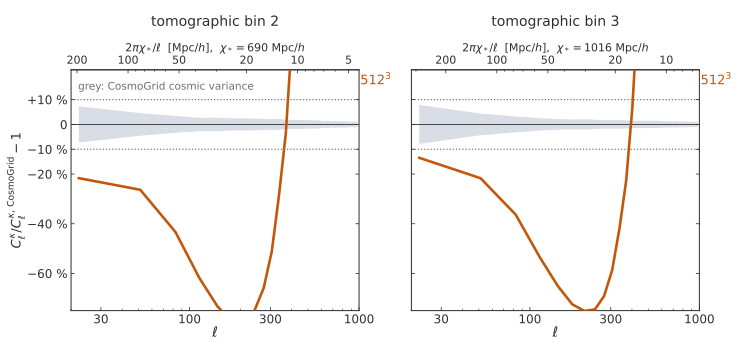{.fragment .fade-out fragment-index=1 width="1000px"}

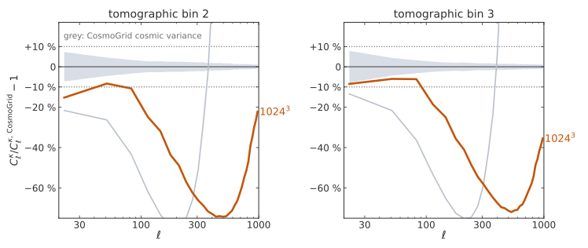{.fragment .fade-in-then-out fragment-index=1 width="1000px"}

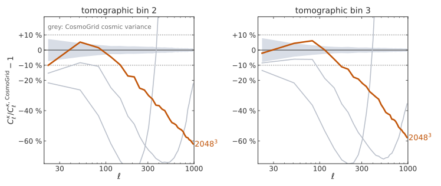{.fragment .fade-in-then-out fragment-index=2 width="1000px"}

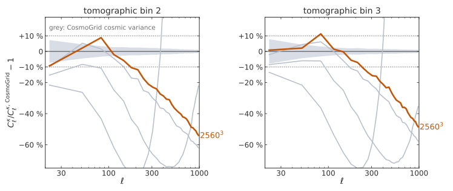{.fragment .fade-in-then-out fragment-index=3 width="1000px"}

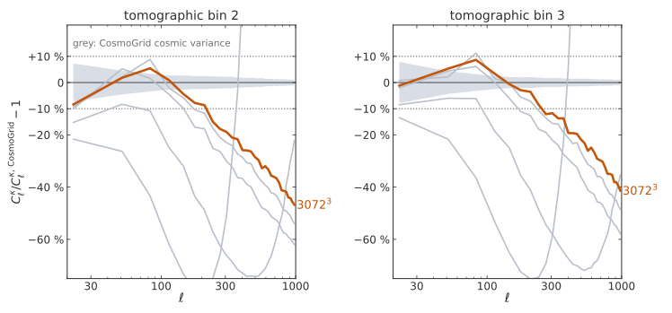{.fragment .fade-in-then-out fragment-index=4 width="1000px"}

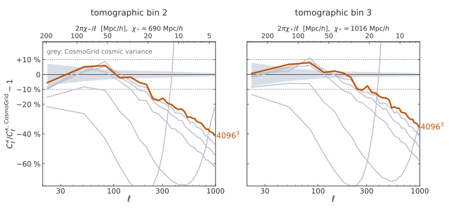{.fragment fragment-index=5 width="1000px"}
:::

::: {.fragment fragment-index=6}
:::: {.solutionbox style="margin-top: 0.2em;"}
::: {.solutionbox-header style="font-size: 0.75em;"}
Validation against an independent $N$-body code
:::

::: {.solutionbox-body style="font-size: 0.72em;"}
[CosmoGrid]{.kw}: pkdgrav3, independent initial conditions

Converges with the mesh. At [$2560^3$]{.kw2}: within [9 %]{.kw2} to $\ell =$ [250]{.kw2} (bin 3), [11 %]{.kw2} to $\ell =$ [200]{.kw2} (bin 2)
:::
::::
:::

## Higher-order statistics: the starlet $\ell_1$ norm

::::: {.r-stack .bare style="margin-top: 0.2em; align-items: start;"}
:::: {.fragment .fade-out fragment-index=1 style="width: 100%; text-align: center;"}
[A [starlet transform]{.kw} splits the convergence map into angular scales]{style="display: block; font-size: 0.8em; margin-bottom: 0.3em;"}

{width="1000px"}
::::

:::: {.fragment .fade-in-then-out fragment-index=1 style="width: 100%; text-align: center;"}
[For convergence maps, the [starlet $\ell_1$ norm]{.kw} is a [sufficient statistic]{.kw}]{style="display: block; font-size: 0.85em; margin-bottom: 0.3em;"}

::: {.row .flat .bare style="--gap: 28px; --justify: center;"}
{style="width: 450px; flex: none;"}

:::: {.solutionbox style="width: 430px; flex: none; text-align: left;"}
::: {.solutionbox-header style="font-size: 0.75em;"}
Starlet $\ell_1$ norm
:::

::: {.solutionbox-body style="font-size: 0.7em;"}
Introduced for weak lensing by [Ajani et al. (2021)]{.kw}, arXiv:2101.01542

As constraining as a CNN: [Tersenov et al. (2026)]{.kw}, in prep.
:::
::::
:::
::::

:::: {.fragment fragment-index=2 style="width: 100%; text-align: center;"}
[Tomographic bin 3, this work against CosmoGrid]{.kw style="display: block; font-size: 0.75em; text-align: left;"}

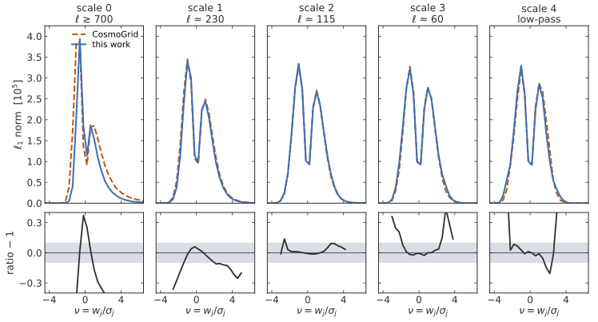{width="1000px"}

::: {.fragment fragment-index=3 style="text-align: left;"}
:::: {.solutionbox style="margin-top: 0.2em;"}
::: {.solutionbox-body style="font-size: 0.75em;"}
Finest scale ($\ell \gtrsim$ [700]{.kw2}): [25 %]{.kw2} narrower than CosmoGrid

Coarser scales: within [7 %]{.kw2}
:::
::::
:::
::::
:::::

## Scaling on supercomputers

::: {.absolute .bare top=-12 right=0 style="display: flex; align-items: center; gap: 10px;"}
{height="58px"}

[Jean Zay, IDRIS<br/>NVIDIA H100 GPUs]{style="font-size: 0.55em; line-height: 1.25; color: #2E2E2E;"}
:::

::: {.bare style="text-align: center; margin-top: 0.15em;"}
[Performance of the forward model]{.kw style="display: block; font-size: 0.75em; text-align: left;"}

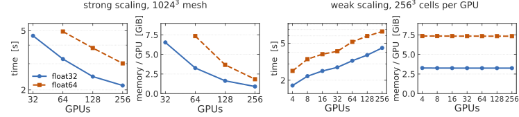{width="1000px"}
:::

::: {.bare .fragment fragment-index=1 style="text-align: center; margin-top: 0.15em;"}
[Performance of the gradient]{.kw style="display: block; font-size: 0.75em; text-align: left;"}

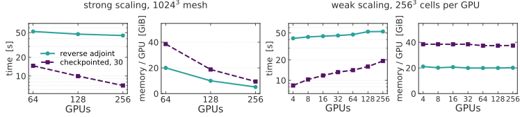{width="1000px"}
:::

::: {.fragment fragment-index=2}
:::: {.solutionbox style="margin-top: 0.3em;"}
::: {.solutionbox-header style="font-size: 0.75em;"}
Jean Zay, up to 256 H100 GPUs
:::

::: {.solutionbox-body style="font-size: 0.72em;"}
Both the forward model and its gradient [scale]{.kw} to [hundreds of GPUs]{.kw}

The simulation is [distributed end to end]{.kw}, so the memory per GPU stays [flat]{.kw} under weak scaling
:::
::::
:::

# Using the forward model for field-level inference {.stack-top}

::: {.r-stack .bare style="width: 960px; margin-left: 30px; margin-top: -170px;"}
{width="960px"}

{width="960px"}
:::

[A first step before sampling: the initial field that [maximises the posterior]{.kw}, at fixed cosmology.]{style="display: block; margin-top: 0.8em;"}

## Field-level likelihood and scale cut

::::: {.row .bare style="--gap: 40px; --align: flex-start; --justify: center; margin-top: 0.8em;"}
:::: {style="flex: none; text-align: center;"}
[Gaussian likelihood on the convergence pixels]{.kw style="display: block; font-size: 0.8em; margin-bottom: 0.3em;"}

::: {.eqbox style="--eq-border: #3b6fb6; --eq-size: 1.1em; --eq-math-margin: 0.3em 0; --eq-pad: 0.2em 0.9em; width: fit-content; margin: 0 auto;"}
$$-\ln\mathcal{L}(\boldsymbol\theta,\mathbf{s}) = \sum_i \frac{\lVert \color{#c2560a}{\hat{\mathbf{d}}_i} - \mathbf{d}_i \rVert_2^2}{2\,\color{#3b6fb6}{\sigma_i^2}}$$
:::
::::

:::: {.fragment fragment-index=1 style="flex: none; width: 470px; text-align: center;"}
[Noise per pixel]{.kw style="display: block; font-size: 0.8em; margin-bottom: 0.3em;"}

::: {.eqbox style="--eq-border: #3b6fb6; --eq-size: 1.1em; --eq-math-margin: 0.3em 0; --eq-pad: 0.2em 0.9em; width: fit-content; margin: 0 auto;"}
$$\color{#3b6fb6}{\sigma_i} = \frac{\sigma_e}{\sqrt{n_{\mathrm{gal},i}\;\Omega_\mathrm{pix}}}$$
:::

[$\sigma_e$ shape noise per component, $n_{\mathrm{gal},i}$ galaxies per arcmin² in bin $i$, $\Omega_\mathrm{pix}$ pixel area in arcmin² at $N_\mathrm{side} = 256$]{.caption style="--cap-size: 0.55em; margin-top: 0.4em;"}

::: {.table-full style="font-size: 0.68em; margin-top: 0.3em;"}
| DES Y3 | bin 1 | [bin 2]{.kw} | [bin 3]{.kw} | bin 4 |
|:--|:-:|:-:|:-:|:-:|
| $n_\mathrm{gal}$ [arcmin$^{-2}$] | 1.476 | 1.479 | 1.484 | 1.461 |
| $\sigma_e$ | 0.26 | 0.26 | 0.26 | 0.26 |
:::
::::
:::::

::::: {.fragment fragment-index=2 style="margin-top: 1.8em;"}
:::: {.row .bare style="--gap: 16px; --justify: center;"}
[A [map-level scale cut]{.kw} on the prediction]{style="font-size: 0.85em;"}

::: {.eqbox style="--eq-border: #3b6fb6; --eq-size: 0.95em; --eq-math-margin: 0.15em 0; --eq-pad: 0.05em 0.7em; width: fit-content; margin: 0;"}
$$\color{#c2560a}{\hat{\mathbf{d}}_i} = T_\ell\big[\kappa_i(\mathbf{s},\boldsymbol\theta)\big]$$
:::
::::

:::: {.grid .bare style="--cols: 275px 54px 160px 54px 160px 54px 275px; --gap: 0; --align: center; justify-content: center; margin-top: 0.4em;"}
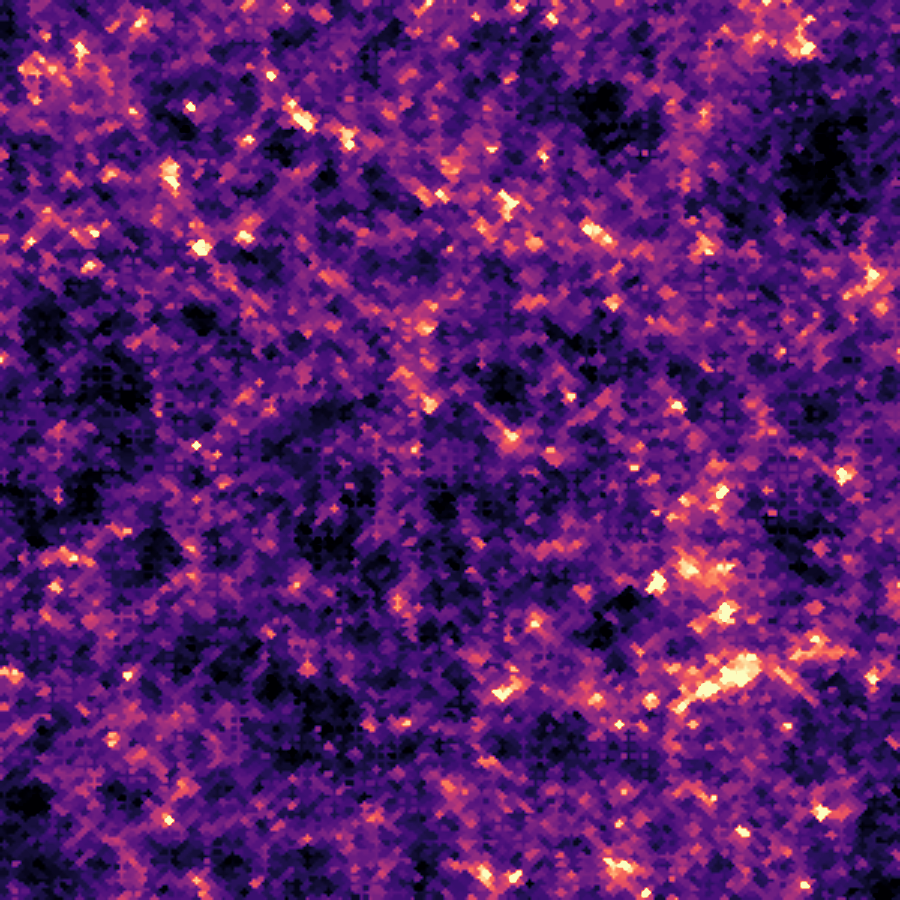{width="275px"}

::: {style="text-align: center;"}
[map2alm]{.kw style="display: block; font-size: 0.6em;"}

{width="46px" style="display: block; margin: 0 auto;"}
:::

{width="160px"}

::: {style="text-align: center;"}
[× $T_\ell$]{.kw style="display: block; font-size: 0.6em;"}

{width="46px" style="display: block; margin: 0 auto;"}
:::

{width="160px"}

::: {style="text-align: center;"}
[alm2map]{.kw style="display: block; font-size: 0.6em;"}

{width="46px" style="display: block; margin: 0 auto;"}
:::

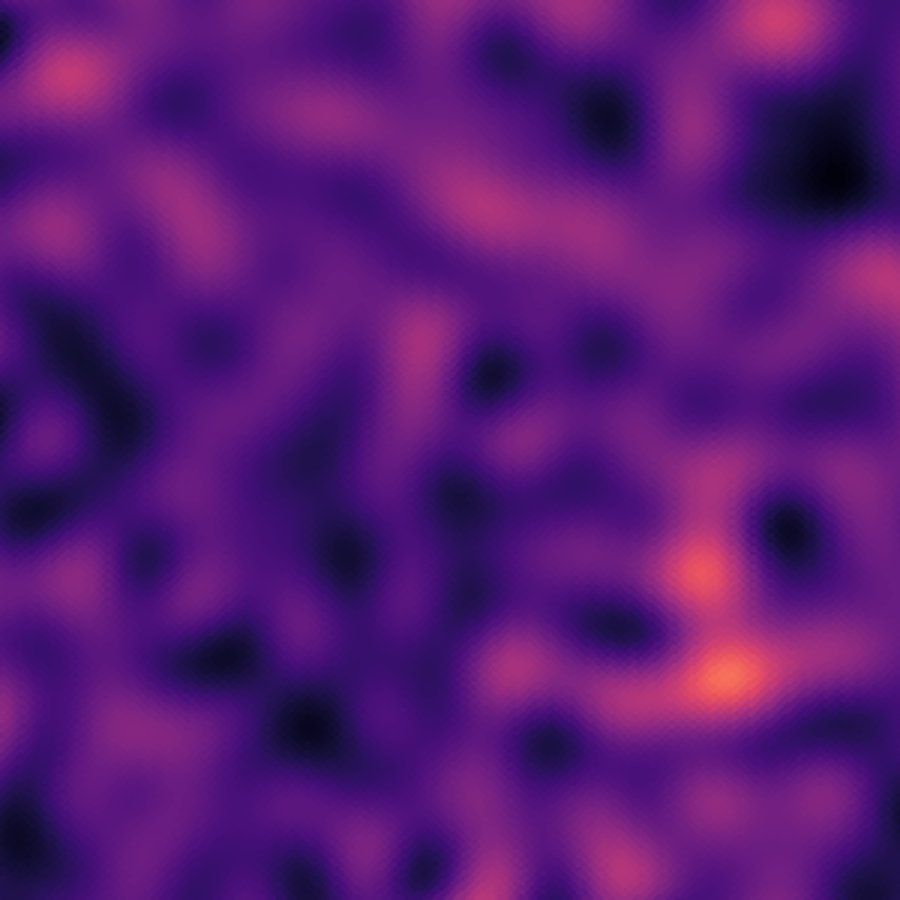{width="275px"}
::::
:::::

## Recovering the maximum a posteriori

::: {.absolute top=6 right=0 style="font-size: 0.6em; text-align: right; line-height: 1.3;"}
[Preliminary]{.kw}<br/>DES Y3 noise, $416^3$ mesh, 2LPT
:::

::::: {.r-stack .bare style="margin-top: 0.1em;"}
:::: {.fragment .fade-out fragment-index=2 style="width: 100%; text-align: center;"}
::: {.r-stack}
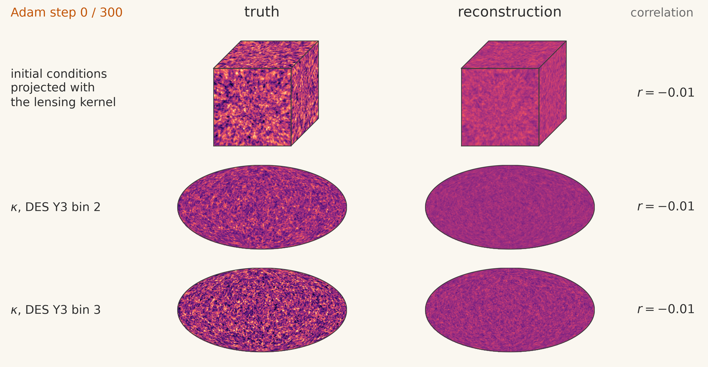{width="1000px"}

::: {.fragment fragment-index=1}
<video src="PhD/5_contribution/fli/18_map/map_run.mp4" class="screen-only" muted playsinline preload="auto" style="width: 1000px;"></video>

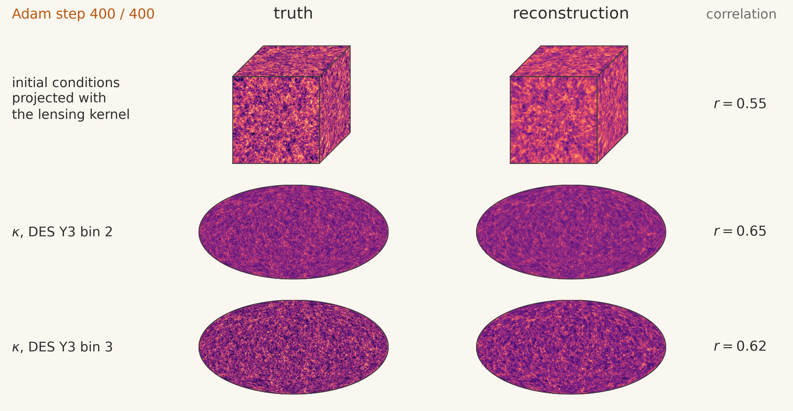{.print-only width="1000px"}
:::
:::
::::

:::: {.fragment fragment-index=2 style="width: 100%; text-align: center;"}
<video src="PhD/5_contribution/fli/18_map/compare_run.mp4" class="screen-only" muted playsinline preload="auto" style="width: 1000px;"></video>

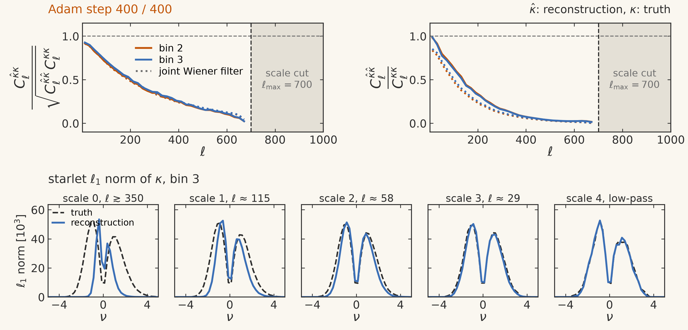{.print-only width="1000px"}
::::
:::::

::: {.fragment fragment-index=3}
:::: {.solutionbox style="margin-top: 0.2em;"}
::: {.solutionbox-body style="font-size: 0.72em;"}
The reconstruction reaches the coherence of the joint Wiener filter, the best linear reconstruction from the same maps, in both bins (0.71 and 0.73 up to $\ell = 164$). Its starlet $\ell_1$ norm recovers 86 to 95 % of the truth's at scales 2 to 5, and 73 % at the finest.
:::
::::
:::

## Contribution 2: conclusion and perspectives {.frosted background-image="PhD/0_cover/bg_cosmic_web.jpg" background-size="cover" hide-chrome="true"}

:::: {.solutionbox}
::: {.solutionbox-body}
- The first differentiable weak-lensing forward model covering [a full survey footprint on the curved sky]{.kw}
- Distributed over hundreds of GPUs, with a gradient end to end
- Validated against an independent $N$-body code: about 10 % to $\ell \approx 250$
- A first maximum a posteriori of the initial field from DES Y3-like maps, at the coherence of the Wiener filter ([preliminary]{.kw})

This work is part of a paper in preparation, to be submitted to [JCAP]{.kw}
:::
::::

::::: {.fragment .frosted-panel style="margin-top: 0.6em; --panel-pad: 14px 22px;"}
:::: {.columns style="display: flex; align-items: center;"}
::: {.column style="width: 50%; font-size: 0.9em;"}
[Next]{.kw2 style="font-weight: 700;"}

- the first survey-scale [posterior]{.kw}, with coverage tests
- a better gravity solver: a [learned force correction]{.kw} or a differentiable [moving mesh]{.kw}
- [intrinsic alignments]{.kw} and photometric-redshift errors as latent variables
- [baryonification]{.kw} inside the model
:::

::: {.column style="width: 50%;"}
:::: {.figcadre}
::: {.figcadre-header}
Moving-mesh particle mesh
:::

::: {.figcadre-body style="text-align: center;"}
<video src="PhD/5_contribution/fli/20_conclusion/moving_mesh.mp4" class="screen-only" loop muted playsinline preload="auto" style="width: 100%; margin: 0;"></video>

{.print-only width="100%"}

[Moving mesh: B. Horowitz (2026), arXiv:2607.10983]{.credit}
:::
::::
:::
::::
:::::

# Conclusion and perspectives

::: {.rail-stack}
{.rail-full}

{.rail-focus}
:::

## The software behind this thesis

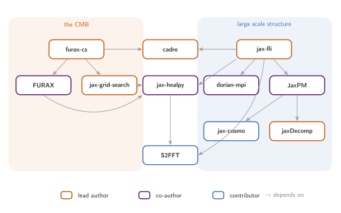{fig-align="center" width="650px" style="margin: 0 auto -40px;"}

::: {style="display: flex; justify-content: center; flex-wrap: wrap; gap: 10px; margin-top: 0.1em;"}
[](https://github.com/CMBSciPol/furax-cs)
[](https://github.com/CMBSciPol/furax)
[](https://github.com/CMBSciPol/CADRE)
[](https://github.com/CMBSciPol/jax-healpy)
[](https://github.com/ASKabalan/jax-fli)
[](https://github.com/DifferentiableUniverseInitiative/jaxDecomp)
[](https://github.com/DifferentiableUniverseInitiative/JaxPM)
:::

::::: {.fragment}
:::: {.solutionbox style="margin-top: 0.4em;"}
::: {.solutionbox-header style="font-size: 0.75em;"}
Where it is used
:::

::: {.solutionbox-body .row .flat style="font-size: 0.7em; --gap: 24px;"}
::: {style="flex: 1;"}
[furax-cs]{.kw} → the Megatop pipeline for the Simons Observatory; LiteBIRD component separation next

[jax-healpy]{.kw}, [jax-fli]{.kw} → field-level CMB lensing with DESI

[jaxDecomp]{.kw} → beyond cosmology: fuzzy dark matter, power spectra, fluid dynamics, ocean models, imaging
:::

::: {.grid .flat .bare style="--cols: repeat(3, auto); --gap: 14px; --row-gap: 10px; flex: none;"}
{style="height: 26px;"}
{style="height: 40px;"}
{style="height: 36px;"}
{style="height: 38px;"}
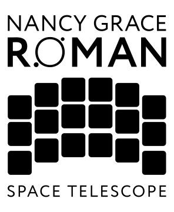{style="height: 40px;"}
{style="height: 28px;"}
:::
:::
::::
:::::

## Conclusion {.frosted .center background-image="PhD/0_cover/bg_cmb_lss.jpg" background-size="cover" hide-chrome="true"}

:::: {.solutionbox style="width: 900px; margin: 1.2em auto 0;"}
::: {.solutionbox-header}
Applying modern numerical methods and high-performance computing to bottlenecks at both ends of the Universe
:::

::: {.solutionbox-body}
- [Spatially varying]{.kw} component separation on the spherical sky
- A [distributed]{.kw} particle-mesh solver
- A first [end-to-end]{.kw} differentiable lensing code on the sphere
- [Open-source]{.kw} software already in use: Megatop for the Simons Observatory, field-level CMB lensing with DESI, jaxDecomp beyond cosmology
:::
::::

## {#thank-you background-video="PhD/0_cover/cmb_to_cosmicweb.mp4" background-video-loop="true" background-video-muted="true" background-size="cover" hide-chrome="true"}

::: {style="background: rgba(250, 247, 240, 0.86); backdrop-filter: blur(6px); -webkit-backdrop-filter: blur(6px); border-radius: 22px; padding: 30px 36px 34px; margin: 140px auto 0; width: 820px; box-shadow: 0 10px 40px rgba(0, 0, 0, 0.35); text-align: center;"}
[Thank you]{style="display: block; font-size: 2.2em; font-weight: 700; color: #2E2E2E;"}

::: {style="display: flex; justify-content: center; align-items: center; gap: 60px; margin-top: 1em;"}
{style="height: 100px; margin: 0; border-radius: 6px;"}
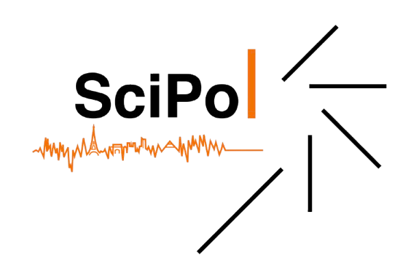{style="height: 90px; margin: 0;"}
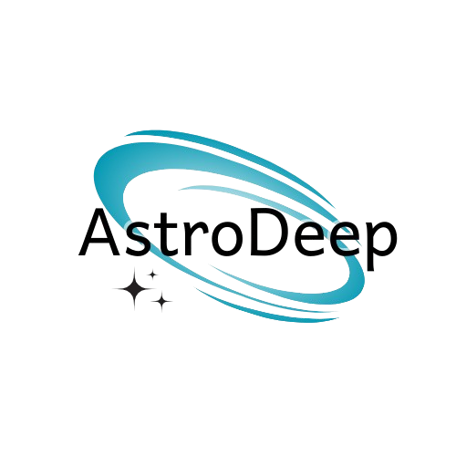{style="height: 76px; margin: 0;"}
{style="height: 54px; margin: 0;"}
:::
:::

# Backup {visibility="uncounted" background-image="PhD/6_ending/backup/backpack_dump.svg" background-size="auto 86%" background-position="76% center" background-color="#faf7f0"}

## Why not simply the maximum a posteriori? {visibility="uncounted"}

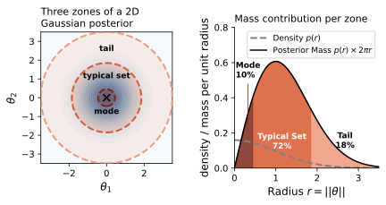{fig-align="center" width="1000px" style="margin-top: 0.4em;"}

## AdaTopK: handling parameter bounds {visibility="uncounted"}

<video src="PhD/5_contribution/compsep/backup_adatopk/adatopk.mp4" class="screen-only" data-autoplay muted playsinline preload="auto" style="display: block; width: 1000px; margin: 0.2em auto 0;"></video>

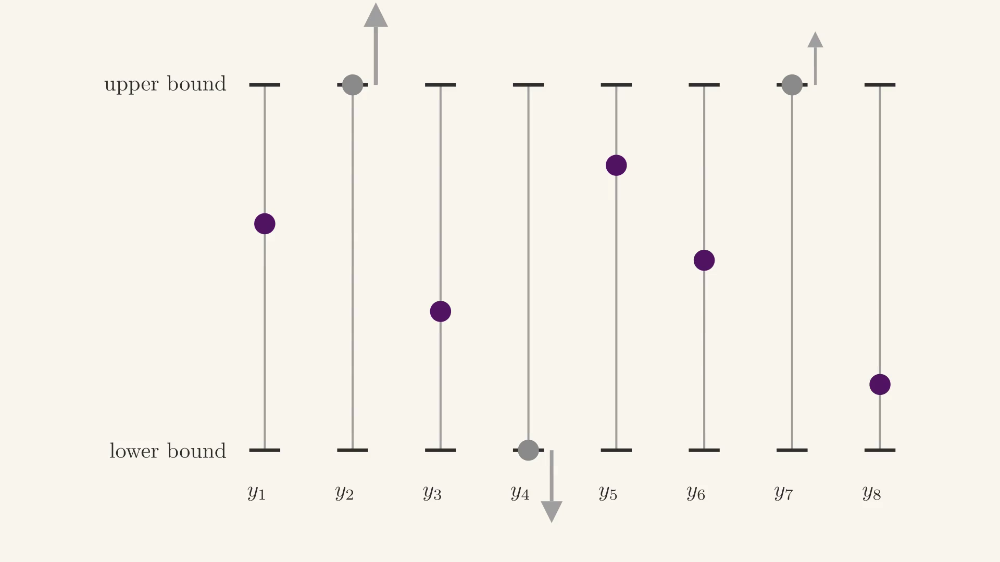{.print-only fig-align="center" width="1000px"}

## Patch selection on skies with $r \neq 0$ {visibility="uncounted"}

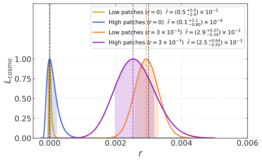{fig-align="center" height="560px"}

## Integrators and time steps {visibility="uncounted"}

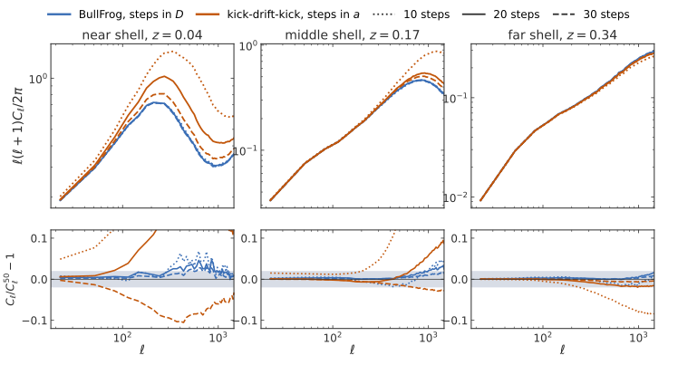{fig-align="center" width="1000px"}

## Shell spacing and the lightcone {visibility="uncounted"}

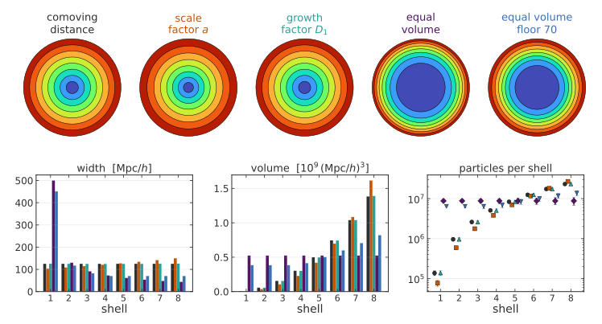{fig-align="center" width="1000px"}

## Drift on the lightcone {visibility="uncounted"}

:::: {.row .bare style="--gap: 14px; --justify: center; --align: flex-end; margin-top: 0.3em;"}
::: {style="width: 285px; flex: none; text-align: center;"}
[10 shells, one redshift per shell]{.kw style="display: block; font-size: 0.6em;"}

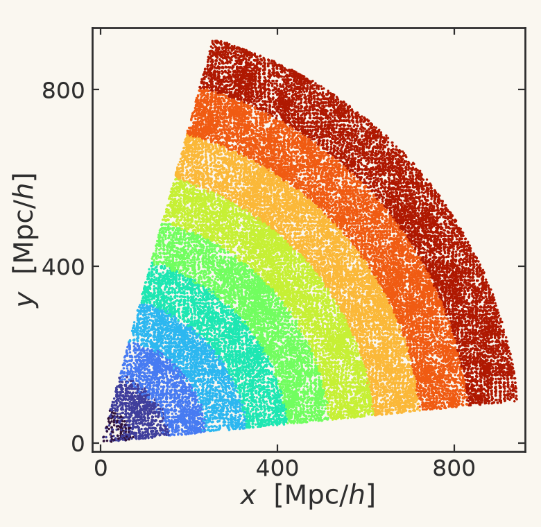{width="285px" style="margin: 0;"}
:::

::: {style="width: 285px; flex: none; text-align: center;"}
[10 shells, drifted]{.kw style="display: block; font-size: 0.6em;"}

{width="285px" style="margin: 0;"}
:::

::: {style="width: 285px; flex: none; text-align: center;"}
[40 shells, one redshift per shell]{.kw style="display: block; font-size: 0.6em;"}

{width="285px" style="margin: 0;"}
:::

{style="height: 260px; flex: none; margin: 0 0 6px;"}
::::

:::: {style="text-align: center; margin-top: 0.3em;"}
::: {.eqbox style="--eq-border: #25406b; --eq-size: 0.9em; --eq-math-margin: 0.2em 0; margin: 0 auto; width: fit-content;"}
$$a_{\mathrm{c}} = a\big(\chi = \lVert \mathbf{x} - \mathbf{x}_{\mathrm{obs}} \rVert\big), \qquad \mathbf{x}(a_{\mathrm{c}}) = \mathbf{x}(a_i) + \boldsymbol{\pi}\,\big[D(a_{\mathrm{c}}) - D(a_i)\big]$$
:::

[$a_i$: scale factor of the shell, $a_{\mathrm{c}}$: scale factor at which the particle crosses the lightcone, $\boldsymbol{\pi} = \mathrm{d}\mathbf{x}/\mathrm{d}D$: BullFrog momentum]{.caption style="--cap-size: 0.6em; margin-top: 0.3em;"}
::::

:::: {.solutionbox style="margin-top: 0.3em;"}
::: {.solutionbox-header style="font-size: 0.8em;"}
Interpolating the particles onto the observer's lightcone
:::

::: {.solutionbox-body style="font-size: 0.8em;"}
Each particle is drifted to the scale factor at which it [crosses the lightcone]{.kw}
:::
::::

## Impact of the drift on the first shell {visibility="uncounted"}

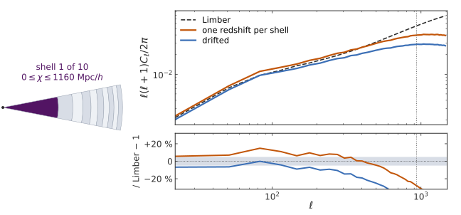{fig-align="center" width="900px" style="margin-top: 0.3em;"}

:::: {.solutionbox style="margin-top: 0.3em;"}
::: {.solutionbox-body style="font-size: 0.85em;"}
Removes the [single-redshift bias]{.kw} of wide shells: [16 %]{.kw2} on the first equal-volume shell
:::
::::

## Mesh plateau: density shells {visibility="uncounted"}

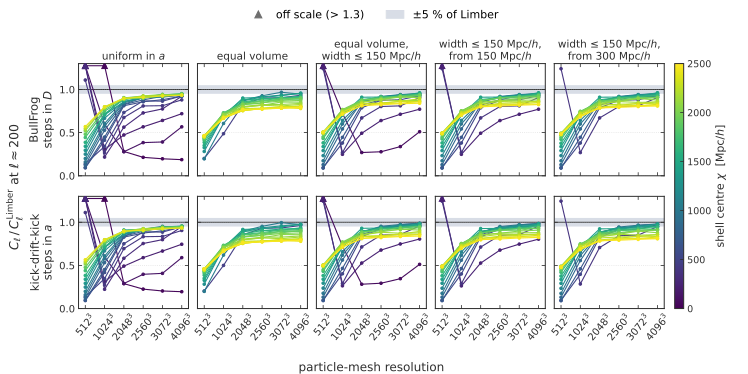{fig-align="center" width="1000px" style="margin-top: 0.6em;"}

## Mesh plateau: convergence {visibility="uncounted"}

{fig-align="center" width="1000px" style="margin-top: 0.6em;"}

## Scale cuts and baryons {visibility="uncounted"}

::: {.grid .bare style="--cols: 230px 62px 180px 62px 180px 62px 230px; --gap: 0; --align: center; margin-top: 0.3em;"}
{width="230px"}

::: {style="text-align: center;"}
[map2alm]{.kw style="display: block; font-size: 0.75em;"}

{width="64px" style="display: block; margin: 0 auto;"}
:::

{width="180px"}

::: {style="text-align: center;"}
[× $T_\ell$]{.kw style="display: block; font-size: 0.75em;"}

{width="64px" style="display: block; margin: 0 auto;"}
:::

{width="180px"}

::: {style="text-align: center;"}
[alm2map]{.kw style="display: block; font-size: 0.75em;"}

{width="64px" style="display: block; margin: 0 auto;"}
:::

{width="230px"}
:::

::: {.grid .bare style="--cols: 430px 1fr; --gap: 20px; --align: center; margin-top: 0.4em;"}
::: {.eqbox style="--eq-border: #25406b; --eq-size: 0.68em; --eq-math-margin: 0.3em 0; margin: 0 auto; width: fit-content;"}
$$T_\ell = \begin{cases} 1, & \ell \le \ell_\mathrm{cut} - \ell_\mathrm{width} \\ \tfrac12\left(1 + \cos \pi x\right), & \ell_\mathrm{cut} - \ell_\mathrm{width} < \ell < \ell_\mathrm{cut} \\ 0, & \ell \ge \ell_\mathrm{cut} \end{cases}$$

$$x = \frac{\ell - (\ell_\mathrm{cut} - \ell_\mathrm{width})}{\ell_\mathrm{width}}$$
:::

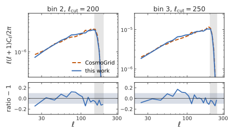{width="560px"}
:::

[Tersenov, Guerrini, Starck & Kilbinger (2026), arXiv:2609.09131]{.credit style="margin-top: 0.6em;"}

## The ghost zone {visibility="uncounted"}

{fig-align="center" width="1000px"}

## The two adjoints {visibility="uncounted"}

::: {.row .bare style="--gap: 40px; --justify: center; margin-top: 0.3em;"}
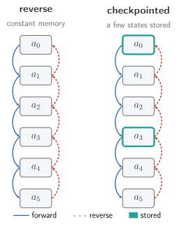{height="540px"}

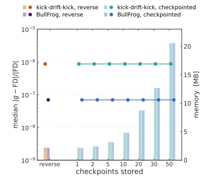{height="500px"}
:::

## MAP: DES Y3 against Euclid, coherence {visibility="uncounted"}

{fig-align="center" height="560px"}

## MAP: DES Y3 against Euclid, starlet $\ell_1$ norm {visibility="uncounted"}

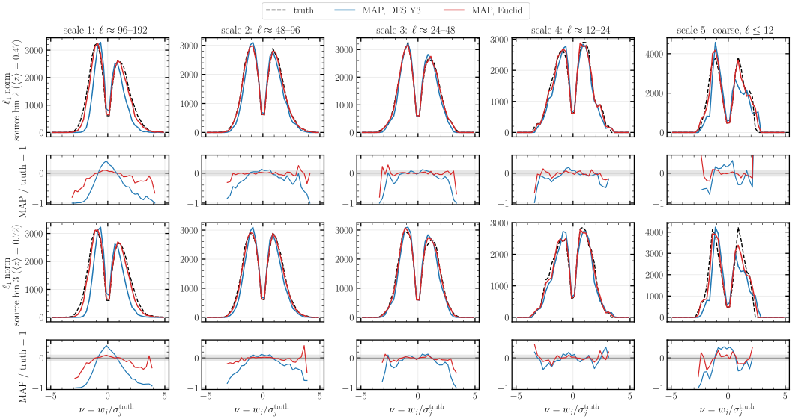{fig-align="center" width="1000px"}

## Field-level posterior: convergence {visibility="uncounted"}

::: {.grid .flat .bare style="--cols: 60px repeat(4, 1fr); --gap: 8px; --row-gap: 10px; --align: center; margin-top: 0.6em; text-align: center;"}
[]{}

[truth]{.kw style="font-size: 0.6em;"}

[posterior draws]{.kw style="font-size: 0.6em;"}

[standard deviation]{.kw style="font-size: 0.6em;"}

[truth − draw]{.kw style="font-size: 0.6em;"}

[bin 2]{.kw style="font-size: 0.6em; color: #C2560A; text-align: right;"}

{style="width: 100%; margin: 0;"}

::: {}
<video src="PhD/5_contribution/fli/backup_sampling/kappa_samples_bin2.mp4" class="screen-only" data-autoplay loop muted playsinline preload="auto" style="display: block; width: 100%; margin: 0;"></video>

{.print-only style="width: 100%; margin: 0;"}
:::

{style="width: 100%; margin: 0;"}

::: {}
<video src="PhD/5_contribution/fli/backup_sampling/kappa_diff_bin2.mp4" class="screen-only" data-autoplay loop muted playsinline preload="auto" style="display: block; width: 100%; margin: 0;"></video>

{.print-only style="width: 100%; margin: 0;"}
:::

[bin 3]{.kw style="font-size: 0.6em; color: #3B6FB6; text-align: right;"}

{style="width: 100%; margin: 0;"}

::: {}
<video src="PhD/5_contribution/fli/backup_sampling/kappa_samples_bin3.mp4" class="screen-only" data-autoplay loop muted playsinline preload="auto" style="display: block; width: 100%; margin: 0;"></video>

{.print-only style="width: 100%; margin: 0;"}
:::

{style="width: 100%; margin: 0;"}

::: {}
<video src="PhD/5_contribution/fli/backup_sampling/kappa_diff_bin3.mp4" class="screen-only" data-autoplay loop muted playsinline preload="auto" style="display: block; width: 100%; margin: 0;"></video>

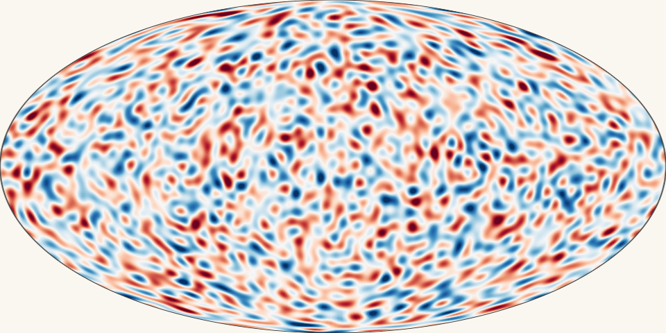{.print-only style="width: 100%; margin: 0;"}
:::

[]{}

{style="grid-column: span 2; width: 230px; margin: 0 auto;"}

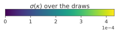{style="width: 200px; margin: 0 auto;"}

{style="width: 200px; margin: 0 auto;"}
:::

::: {.nice-table style="--table-size: 0.72em; margin-top: 0.7em;"}
| MCLMC on one A100: $128^3$ initial conditions and $(\Omega_c, \sigma_8)$ | Wall time |
|:--|--:|
| Compiling the tuning step | 12 min |
| Tuning the step size and momentum decoherence: 300 steps | 1 h 32 min |
| Compiling the sampler | 1.5 min |
| Sampling: 10 batches of 10 draws, one draw every 5 steps | 15.5 min per batch |
| **Total** | **≈ 4 h 20 min** |
:::

## Field-level posterior: starlet $\ell_1$ norm {visibility="uncounted"}

::: {.grid .bare style="--cols: 110px 600px; --gap: 10px; --row-gap: 2px; --align: center; justify-content: center; margin-top: 0.2em;"}
[bin 2<br/>ℓ₁ norm]{.kw style="font-size: 0.6em; color: #C2560A; text-align: right;"}

::: {}
<video src="PhD/5_contribution/fli/backup_sampling/starlet_l1_bin2.mp4" class="screen-only" data-autoplay loop muted playsinline preload="auto" style="display: block; width: 600px; margin: 0;"></video>

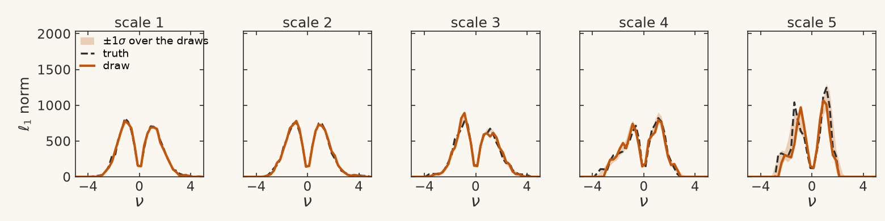{.print-only style="width: 600px; margin: 0;"}
:::

[bin 2<br/>draw − truth]{.kw style="font-size: 0.6em; color: #C2560A; text-align: right;"}

::: {}
<video src="PhD/5_contribution/fli/backup_sampling/starlet_resid_bin2.mp4" class="screen-only" data-autoplay loop muted playsinline preload="auto" style="display: block; width: 600px; margin: 0;"></video>

{.print-only style="width: 600px; margin: 0;"}
:::

[bin 3<br/>ℓ₁ norm]{.kw style="font-size: 0.6em; color: #3B6FB6; text-align: right;"}

::: {}
<video src="PhD/5_contribution/fli/backup_sampling/starlet_l1_bin3.mp4" class="screen-only" data-autoplay loop muted playsinline preload="auto" style="display: block; width: 600px; margin: 0;"></video>

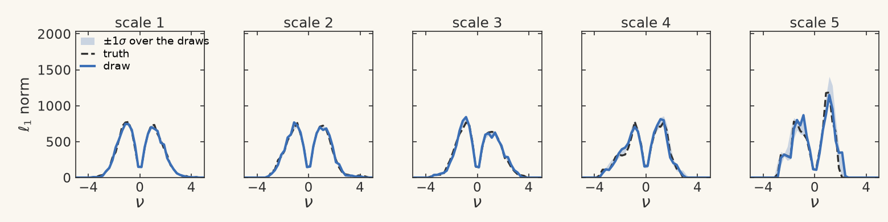{.print-only style="width: 600px; margin: 0;"}
:::

[bin 3<br/>draw − truth]{.kw style="font-size: 0.6em; color: #3B6FB6; text-align: right;"}

::: {}
<video src="PhD/5_contribution/fli/backup_sampling/starlet_resid_bin3.mp4" class="screen-only" data-autoplay loop muted playsinline preload="auto" style="display: block; width: 600px; margin: 0;"></video>

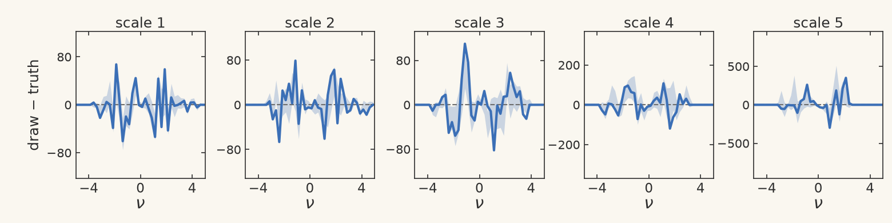{.print-only style="width: 600px; margin: 0;"}
:::
:::

## Cosmology-only inference {visibility="uncounted"}

:::: {.row .flat .bare style="--gap: 40px; --justify: center; margin-top: 0.3em;"}
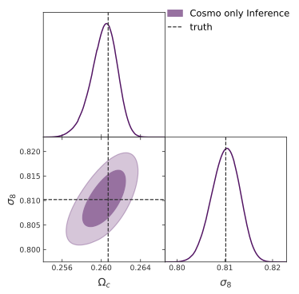{style="height: 480px; flex: none; margin: 0;"}

::: {.nice-table style="--table-size: 0.8em; flex: none;"}
| NUTS, initial conditions at the truth | |
|:--|--:|
| Warmup | 100 iterations |
| Sampling | 10 batches of 10 draws |
| $\Omega_c$ | $0.2603 \pm 0.0013$ (truth 0.2607) |
| $\sigma_8$ | $0.8102 \pm 0.0025$ (truth 0.8102) |
| **Wall time** | **4 h 56 min** |
:::
::::

## A survey mask leaks {visibility="uncounted"}

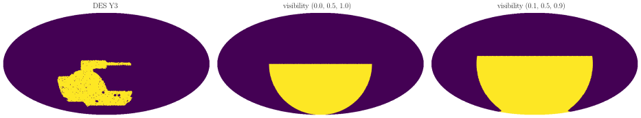{fig-align="center" width="900px"}

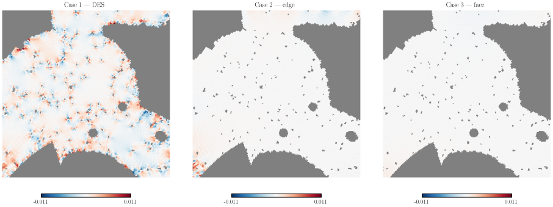{fig-align="center" width="760px"}
